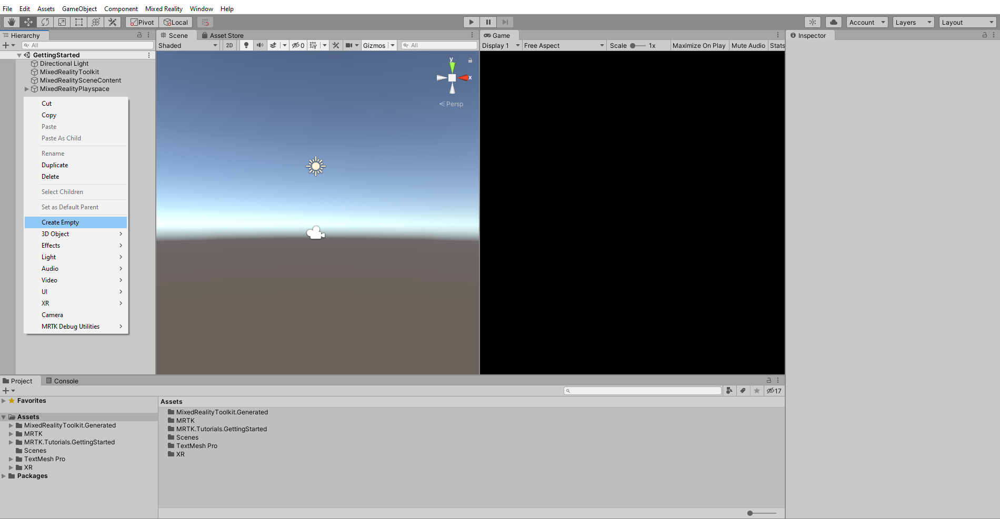
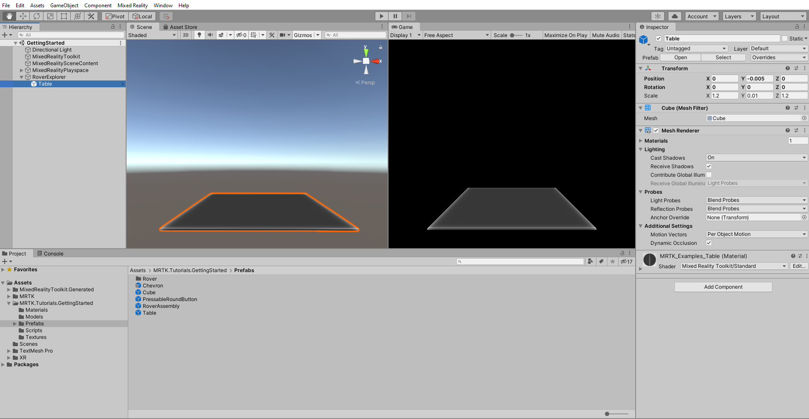
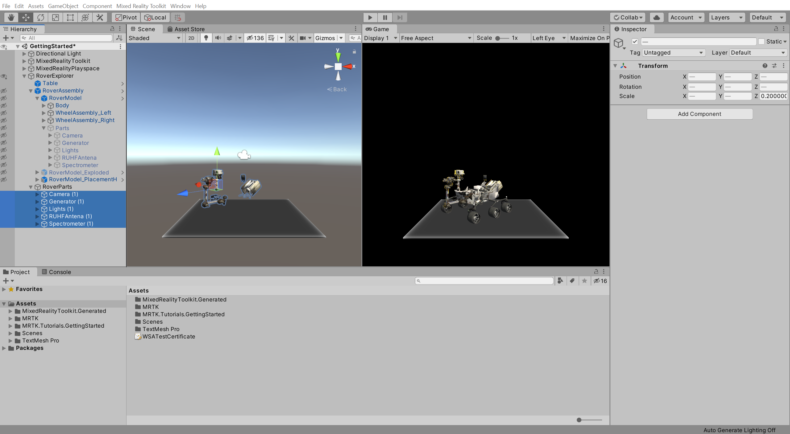
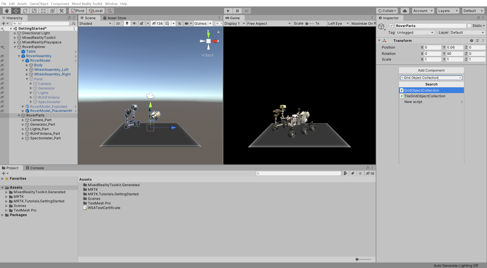

# 4. Positioning objects in the scene

## Overview

In this tutorial, you will import the tutorial assets and position the provided objects in the scene.

## Objectives

* Learn how to position objects in the scene
* Learn how to use MRTK's Grid Object Collection feature

## Importing the tutorial assets

Download and import the following Unity custom package:

* [MRTK.HoloLens2.Unity.Tutorials.Assets.GettingStarted.2.4.0.unitypackage](https://github.com/microsoft/MixedRealityLearning/releases/download/getting-started-v2.4.0/MRTK.HoloLens2.Unity.Tutorials.Assets.GettingStarted.2.4.0.unitypackage)

After you have imported the tutorial assets your Project window should look similar to this:

> [!TIP]
> For a reminder on how to import a Unity custom package, you can refer to the [Importing the MRTK](mr-learning-base-02.md#importing-the-mixed-reality-toolkit) instructions.

## Creating the parent object

In the Hierarchy window, right-click on an empty spot, and select **Create Empty** to add an empty object to your scene:

> [!TIP]
> To display your Scene and Game window side by side as shown in the image above, drag the Game window to the right side of the Scene window. To learn more about customizing your workspace, you can refer to Unity's <a href="https://docs.unity3d.com/Manual/CustomizingYourWorkspace.html" target="_blank">Customizing Your Workspace</a> documentation.

Right-click on the newly created object, select **Rename**, and change the name to **RoverExplorer**:

With the RoverExplorer object still selected, in the Inspector window, configure the **Transform** component as follows:

* **Position**: X = 0, Y = -0.6, Z = 2
* **Rotation**: X = 0, Y = 0, Z = 0
* **Scale**: X = 1, Y = 1, Z = 1

> [!NOTE]
> The camera represents the users head and is positioned at origin, X = 0, Y = 0, Z = 0. In general, 1 unit in Unity is roughly 1 meter in the physical world. However, there are exceptions to this, for example, when objects are children of scaled objects. In the scenario above, the RoverExplorer is positioned 2 meters in front of and 0.6 meters below the user's head.

## Adding the tutorial prefabs

In the Project window, navigate to the **Assets** > **MRTK.Tutorials.GettingStarted** > **Prefabs** folder:

> [!TIP]
> A <a href="https://docs.unity3d.com/Manual/Prefabs.html" target="_blank">prefab</a> is a pre-configured GameObject stored as a Unity Asset and can be reused throughout your project.

From the Project window, click-and-drag the **Table** prefab on to the **RoverExplorer** object to make it a child of the RoverExplorer object, then in the Inspector window, configure the **Transform** component as follows:

* **Position**: X = 0, Y = -0.005, Z = 0
* **Rotation**: X = 0, Y = 0, Z = 0
* **Scale**: X = 1.2, Y = 0.01, Z = 1.2

> [!TIP]
> To display your scene as shown in the image above, use the <a href="https://docs.unity3d.com/Manual/SceneViewNavigation.html" target="_blank">Scene Gizmo</a>, located in the top right corner of the Scene window, to adjust the viewing angle to be along the forward Z axis, double-click the MixedRealityPlayspace object to focus on the camera, and zoom in as needed.

From the Project window, click-and-drag the **RoverAssembly** prefab on to the **RoverExplorer** object to make it a child of the RoverExplorer object, then in the Inspector window, configure the **Transform** component as follows:

* **Position**: X = -0.1, Y = 0, Z = 0
* **Rotation**: X = 0, Y = -135, Z = 0
* **Scale**: X = 1, Y = 1, Z = 1

## Organizing objects in a collection

In the Hierarchy window, right-click on the **RoverExplorer** object and select **Create Empty** to add an empty object as a child of the RoverExplorer, name the object **RoverParts**, and configure the **Transform** component as follows:

* **Position**: X = 0, Y = 0.06, Z = 0
* **Rotation**: X = 0, Y = 90, Z = 0
* **Scale**: X = 1, Y = 1, Z = 1

In the Hierarchy window, select all the RoverExplorer > RoverAssembly > RoverModel > **Parts** child objects, right-click on them and select **Duplicate** to create a copy of each of the parts:

> [!TIP]
> To select multiple adjacent objects, press-and-hold the SHIFT key while using the mouse to select the first and last object.

With the newly duplicated Parts child objects still selected, click-and-drag them on to the **RoverParts** object to make them child objects of the RoverParts object:

To make it easier to work with your scene, in the Hierarchy window, click the **eye** icon to the left of the object to toggle the **scene visibility** for the **RoverAssembly** object off. This hides the object in the Scene window without changing its in-game visibility:

> [!TIP]
> To learn more about the Scene Visibility controls and how you can use them to optimize your scene view and workflow, you can refer to Unity's <a href="https://docs.unity3d.com/Manual/SceneVisibility.html" target="_blank">Scene Visibility</a> documentation.

In the Hierarchy window, clean up the RoverParts child objects' names by replacing the appended **(1)** with **_Part**:

In the Hierarchy window, select the **RoverParts** object, then in the Inspector window, click the **Add Component** button, and search for and select **GridObjectCollection** to add the GridObjectCollection component to the RoverParts object:

Configure the **GridObjectCollection** component values as follows:

* **Sort Type**: Alphabetic
* **Layout**: Horizontal
* **Cell Width**: 0.25
* **Distance from parent**: 0.38

Then click the **Update Collection** button to update the position of the RoverParts child objects:

## Congratulations

In this tutorial, you learned how to position objects in the scene relative to the user and use MRTK's Grid Object Collection feature to organize objects in a collection.

> [!div class="nextstepaction"]
>[Next Tutorial: 5. Creating dynamic content using Solvers](mr-learning-base-05.md)
