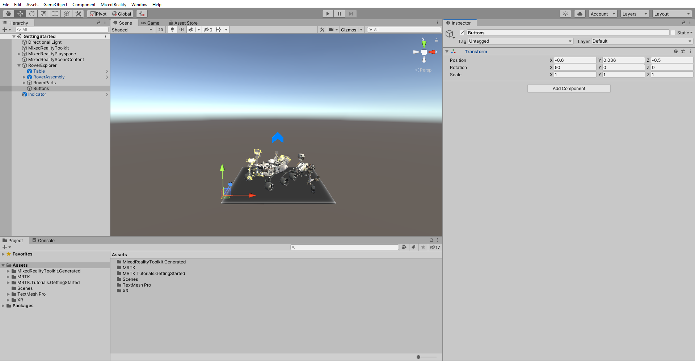
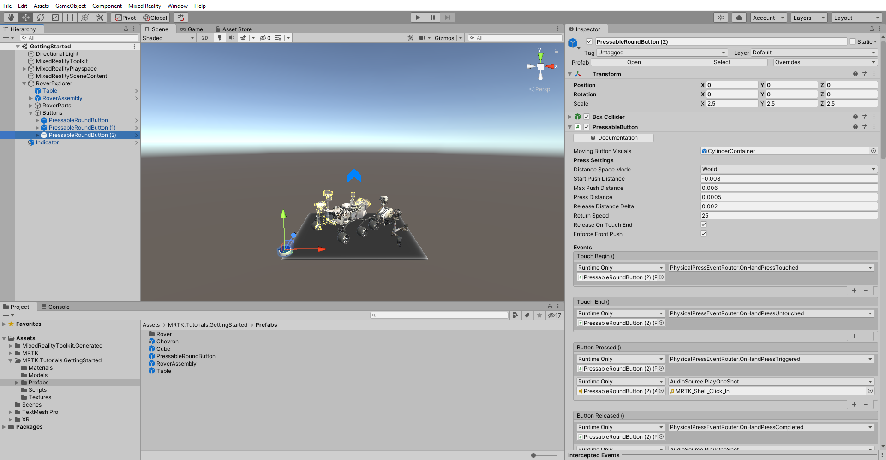
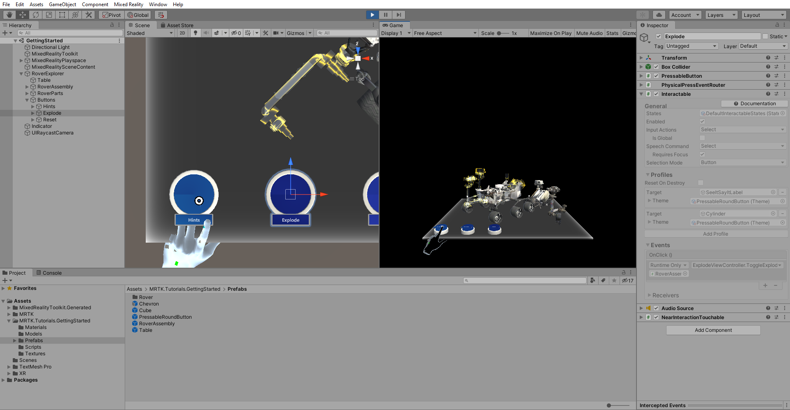
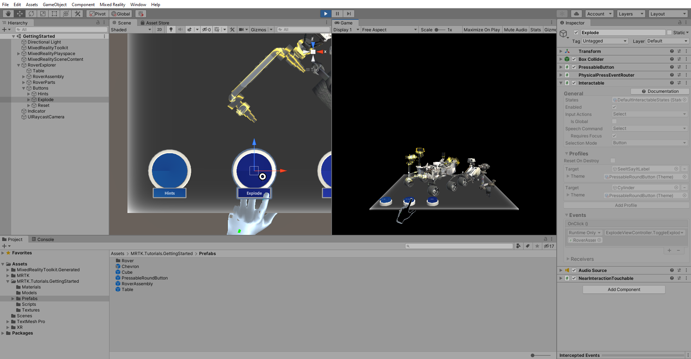
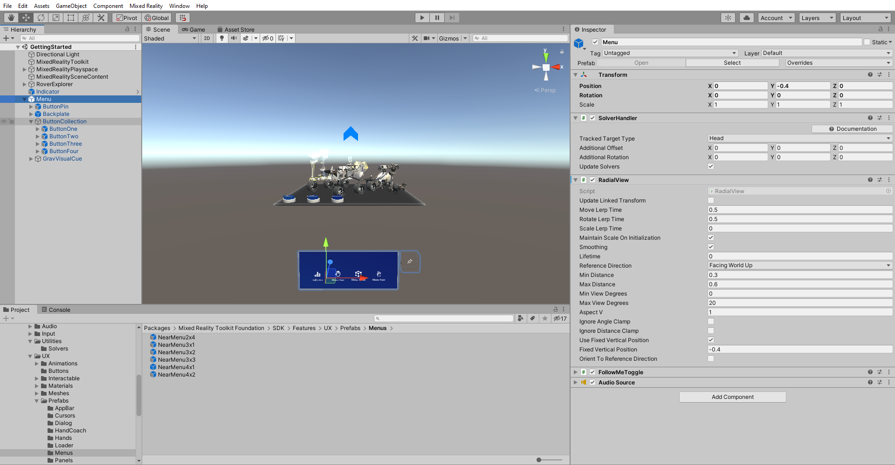
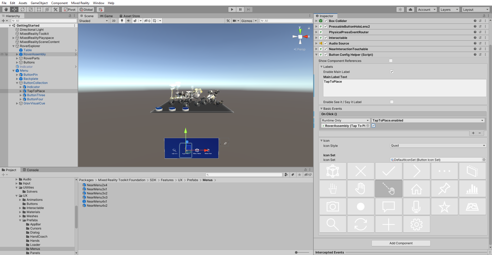
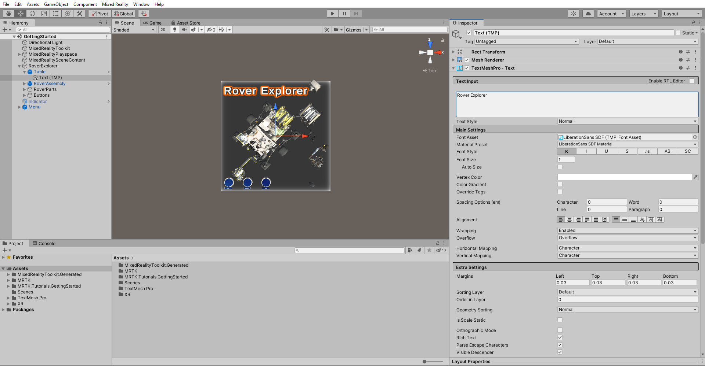

# 6. Creating user interfaces

## Overview

In this tutorial, you will learn how to create a simple user interface using MRTK's button and menu prefabs alongside Unity's TextMeshPro component. You will also learn how to configure the buttons to trigger events and add dynamic tooltip UI elements to provide the user with additional information.

## Objectives

* Learn how to organize buttons in a collection
* Learn how to use MRTK's menu prefabs
* Learn how to interact with holograms using UI menus and buttons
* Learn how to add text elements
* Learn how to spawn tooltips on objects dynamically

## Creating a static panel of buttons

In the Hierarchy window, right-click on the **RoverExplorer** object and select **Create Empty** to add an empty object as a child of the RoverExplorer, name the object **Buttons**, and configure the **Transform** component as follows:

* **Position**: X = -0.6, Y = 0.036, Z = -0.5
* **Rotation**: X = 90, Y = 0, Z = 0
* **Scale**: X = 1, Y = 1, Z = 1

In the Project window, navigate to the **Assets** > **MRTK.Tutorials.GettingStarted** > **Prefabs** folder, click-and-drag the **PressableRoundButton** prefab on to the **Buttons** object, then right-click on the PressableRoundButton and select **Duplicate** to create a copy, repeat until you have a total of three PressableRoundButton objects:

In the Hierarchy window, select the **Buttons** object, then in the Inspector window, use the **Add Component** button to add the **GridObjectCollection** component and configure it as follows:

* **Sort Type**: Child Order
* **Layout**: Horizontal
* **Cell Width**: 0.2
* **Anchor**: Middle Left

Then click the **Update Collection** button to update the position of the Buttons object's child objects:

In the Hierarchy window, name the buttons **Hints**, **Explode**, and **Reset**.

For each button, select the **SeeItSayItLabel** > **TextMeshPro** child object, then in the Inspector window, change the respective **TextMeshPro - Text** component text to match the button names:

Once done, collapse the Buttons object's child objects.

In the Hierarchy window, select the **Hints** button object, then in the Inspector window, configure the **Interactable.OnClick ()** event as follows:

* Assign the **RoverAssembly** object to the **None (Object)** field
* From the **No Function** dropdown, select **PlacementHintsController** > **TogglePlacementHints ()** to set this function as the action to be executed when the event is triggered

> [!TIP]
> The Interactable component is an all-in-one container to make any object easily interactable and responsive to input. Interactable acts as a catch-all for all types of input including touch, hand rays, speech, etc. and funnels these interactions into events and visual theme responses. To learn how to configure it for different input types and customize it's visual theme, you can refer to the [Interactable](https://microsoft.github.io/MixedRealityToolkit-Unity/Documentation/README_Interactable.html) guide in the [MRTK Documentation Portal](https://microsoft.github.io/MixedRealityToolkit-Unity/README.html).

In the Hierarchy window, select the **Explode** button object, then in the Inspector window, configure the **Interactable.OnClick ()** event as follows:

* Assign the **RoverAssembly** object to the **None (Object)** field
* From the **No Function** dropdown, select **ExplodedViewController** > **ToggleExplodedView ()** to set this function as the action to be executed when the event is triggered

Press the Play button to enter Game mode, then press-and-hold the space bar button to activate the hand and use the mouse to press the **Hints** button to toggle the visibility of the placement hint objects:

and the **Explode** button to toggle the exploded view on and off:

## Creating a dynamic menu that follows the user

In the Project window, navigate to the **Assets** > **MRTK** > **SDK** > **Features** > **UX** > **Prefabs** > **Menus** folder, click-and-drag the **NearMenu4x1** prefab into the Hierarchy window, set its Transform **Position** to X = 0, Y = -0.4, Z = 0 and configure it as follows:

* Verify that the **SolverHandler** component's **Tracked Target Type** is set to **Head**
* Check the checkbox next to the **RadialView** Solver component so it is enabled by default

In the Hierarchy window, rename the object to **Menu**, then expand its **ButtonCollection** child object to reveal the four buttons:

Rename the first button to **Indicator**, then in the Inspector window, configure the **Button Config Helper (Script)** component as follows:

* Change the **Main Label Text** to match the name of the button
* Assign the **Indicator** object to the **None (Object)** field
* From the **No Function** dropdown, select **GameObject** > **SetActive (bool)** to set this function as the action to be executed when the event is triggered
* Verify that the argument checkbox is **checked**
* Change the **Icon** to the 'search' icon

In the Hierarchy window, select the **Indicator** object, then in the Inspector window:

* Uncheck the checkbox next to its name to make it inactive by default
* Use the **Add Component** button to add the **Directional Indicator Controller (Script)** component

> [!NOTE]
> Now, when the app starts, the Indicator is disabled by default and can be enabled by pressing the Indicator button.

Rename the second button to **TapToPlace**, then in the Inspector window, configure the **Button Config Helper (Script)** component as follows:

* Change the **Main Label Text** to match the name of the button
* Assign the RoverExplorer > **RoverAssembly** object to the **None (Object)** field
* From the **No Function** dropdown, select **TapToPlace** > **bool Enabled** to update this property value when the event is triggered
* Verify that the argument checkbox is **checked**
* Change the **Icon** to the 'hand with ray' icon

In the Hierarchy window, select the **RoverAssembly** object, then in the Inspector window, configure the **Tap To Place (Script)** component as follows:

* Uncheck the checkbox next to its name to make it inactive by default
* In the **On Placing Stopped ()** event section, click the **+** icon to add a new event:
* Assign the RoverExplorer > **RoverAssembly** object to the **None (Object)** field
* From the **No Function** dropdown, select **TapToPlace** > **bool Enabled** to update this property value when the event is triggered
* Verify that the argument checkbox is **unchecked**

> [!NOTE]
> Now, when the app starts, the Tap to Place functionality is disabled by default and can be enabled by pressing the Tap to Place button. Additionally, when the tap to place is completed, it will disable itself.

## Adding text to the scene

In the Hierarchy window, right-click on the **Table** object and select **3D Object** > **Text - TextMeshPro** to add a text object as a child of the Table object, then in the Inspector window, configure the **Rect Transform** component as follows:

* Change **Pos Y** to 1
* Change **Width** to 1
* Change **Height** to 1
* Change **Rotation X** to 90

Then configure the **TextMeshPro - Text** component as follows::

* Change **Text** to Rover Explorer
* Change **Font Style** to Bold
* Change **Font Size** to 1
* Change Extra Settings > **Margins** to 0.03

## Adding tooltips

In the Project window, navigate to the **Assets** > **MRTK** > **SDK** > **Features** > **UX** > **Prefabs** > **ToolTip** folder to locate the tooltip prefabs:

In the Hierarchy window, expand the RoverExplorer > **RoverParts** object and select all its child rover part objects, then in the Inspector window, use the **Add Component** button to add the **ToolTipSpawner** component and configure it as follows:

* Ensure the **Focus Enabled** checkbox is checked to require the user to look at the part for the tooltip to appear
* Assign the **Simple Line ToolTip** prefab from the Project window to the **Tool Tip Prefab** field
* Change the ToolTip Override Settings > **Settings Mode** to **Override**
* Change the ToolTip Override Settings > **Manual Pivot Local Position Y** to **1.5**

In the Hierarchy window, select the first rover part, RoverParts > **Camera_Part**, and configure the **ToolTipSpawner** component as follows:

* Change **Tool Tip Text** to reflect the name of the part, i.e., **Camera**

**Repeat** this step for each of the rover part objects to configure the **ToolTipSpawner** component as follows:

* For the **Generator_Part**, change the **Tool Tip Text** to **Generator**
* For the **Lights_Part**, change the **Tool Tip Text** to **Lights**
* For the **UHFAntenna_Part**, change the **Tool Tip Text** to **UHF Antenna** field
* For the **Spectrometer_Part**, change the **Tool Tip Text** to **Spectrometer**

Press the Play button to enter Game mode, then press-and-hold the right mouse button while moving your mouse until the gaze hit's one of the parts and the tooltip for that part will be displayed:

## Congratulations

In this tutorial, you learned how to create a simple user interface using MRTK's provided button and menu prefabs alongside Unity's TextMeshPro component and how to configure the buttons to trigger events when they are pressed. You also learned how to add dynamic tooltip UI elements to provide the user with additional information.

[Next Tutorial: 7. Interacting with 3D objects](mr-learning-base-07.md)