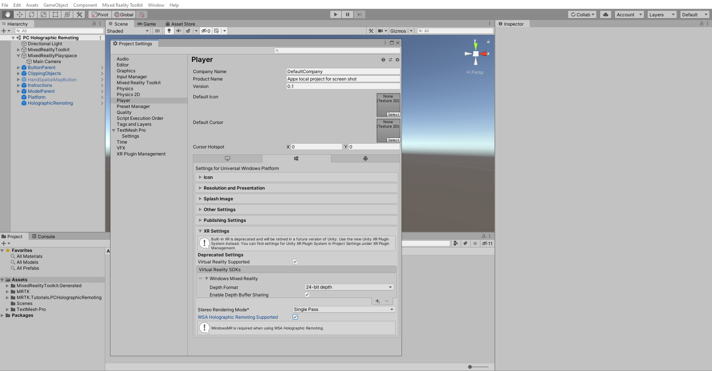
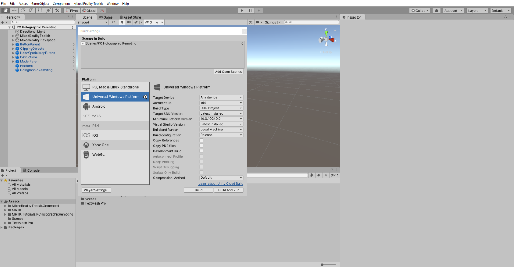
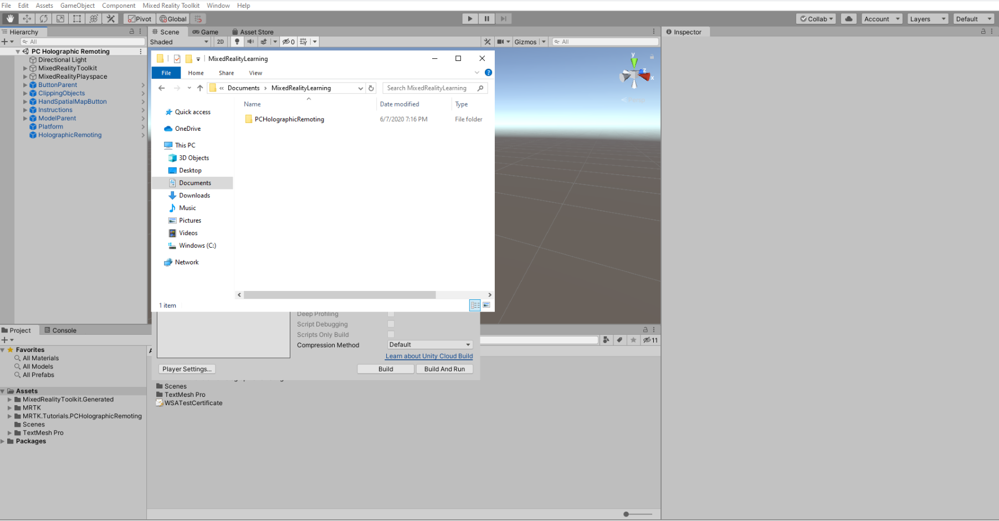

# 2. Creating a Holographic Remoting PC application

In this tutorial, you will learn how to create a PC app for Holographic Remoting and connect to HoloLens 2 at any point, providing a way to visualize 3D content in mixed reality.

## Objectives

* Configure Unity for Holographic Remoting
* Learn how to build and deploy the application with Visual Studio
* Developing Holographic Remoting application and connecting to HoloLens

## Configuring your scene for Holographic Remoting

In this section, you will configure your project to stream your Mixed Reality experience to your HoloLens 2 device from your PC in real-time over a Wi-Fi connection.

In the Project window, navigate to the **Assets** > **MRTK.Tutorials.PCHolograhicRemoting** > **Prefabs** folder, and click and drag **HolographicRemoting** prefab into your scene.

## Build your application to PC

Your Holographic Remoting app is now ready to build on your PC. Follow the below steps and make these changes to build this application on to your PC.

### 1. Set the player settings

In the Unity menu, select Edit > Project Settings to open the Player Settings window.

In the Project Settings window, expand the **Publishing Settings**, scroll down to the **Capabilities** section and select the below-shown capability checkbox in addition to the existing capabilities.

* Internet Clint server
* Private Network Client Server

In the **XR Settings** section, select the **WSA Holographic Remoting Supported** checkbox and enable the Holographic Remoting.

### 2. Build the Unity Project

In the Unity menu, select File > Build Settings to open the Build Settings window.

In the Build Settings window, click the ***Add Open Scenes*** button to add your current scene to the Scenes. In the Build list, then click the ***Build button*** to open the Build Universal Windows Platform window:

In the Build Universal Windows Platform window, choose a suitable location to store your build, for example, Documents\MixedRealityLearning. Create a new folder and give it a suitable name, for example, PCHolographicRemoting. Then click the ***Select Folder*** button to start the build process:

Wait for Unity to finish the build process.

### 3. Build and deploy the application

When the build process is completed, Unity will prompt Windows File Explorer to open the location you stored the build. Navigate inside the folder, and double-click the .sln file to open it in Visual Studio:

> [!NOTE]
> If Visual Studio asks you to install new components, take a moment to ensure that all prerequisite components are installed as specified in the Install the Tools documentation.

Configure Visual Studio for PC by selecting the Release configuration, the x64 architecture, and Local Machine as target:

Click the button that says ***Local Machine***. It starts to build and deploy the application on to your PC. The application will be installed in your PC by default.

## Testing Holographic Remoting remote application

To connect your PC application to your HoloLens 2, follow the below process:

### 1. Install the Remoting Player application on HoloLens 2 device

* On your HoloLens 2, visit the Store app and search for "**Remoting Player**."
* Select the **Remoting Player** app.
* Tap **Install** to download and install the app.

### 2. Connect the Holographic remoting PC app to the Remoting Player

* Start the **Remoting Player** on your HoloLens.
* Take note of the HoloLens **IP address**. It will be displayed as a hologram by the **Remoting Player** as soon as it launches.
* Open the Holographic Remoting PC application on your PC.
* Once the application is launched, enter the **IP address** and click on the **Connect**  button to connect.

## Congratulations

In this tutorial, you learned how to create a Holographic Remoting remote app and connect to HoloLens 2 at any point, providing a way to visualize 3D content in mixed reality. Once the HoloLens connected to the Holographic Remoting PC application, you should see the mixed reality experience streaming into your HoloLens 2 device.
