# 3. Connecting multiple users

In this tutorial, you will learn how to connect multiple users as part of a live shared experience. By the end of the tutorial, you will be able to run the app on multiple devices and have each user see the avatar of other users move in real-time.

## Objectives

* Learn how to connect multiple users in a shared experience

## Preparing the scene

In this section, you will prepare the scene by adding some of the tutorial prefabs.

In the Project window, navigate to the **Assets** > **MRTK.Tutorials.MultiUserCapabilities** > **Prefabs** folder, then click-and-drag the following prefabs into the Hierarchy window to add them to your scene:

* **NetworkLobby** prefab
* **SharedPlayground** prefab

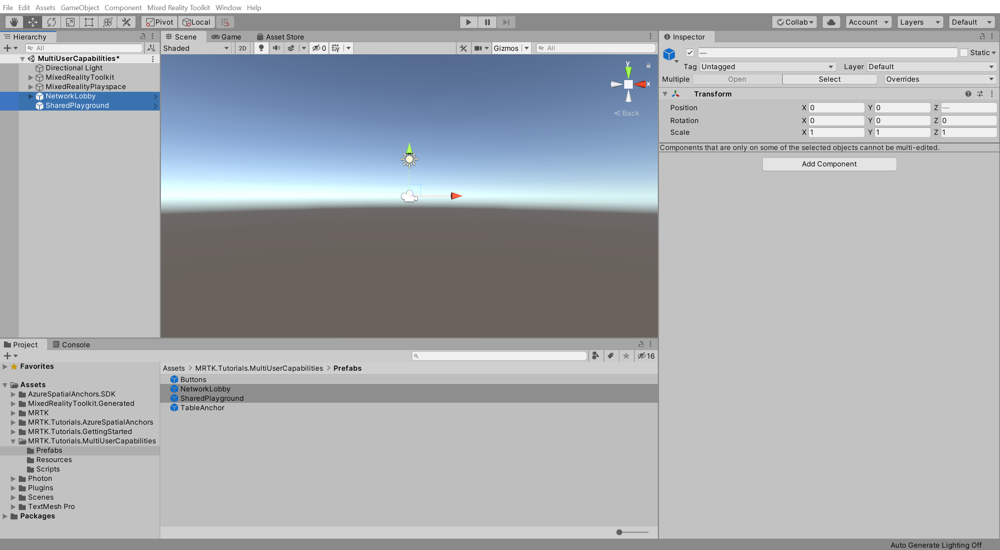

In the Project window, navigate to the **Assets** > **MRTK.Tutorials.AzureSpatialAnchors** > **Prefabs** folder, then click-and-drag the following prefab into the Hierarchy window to add it to your scene:

* **DebugWindow** prefab

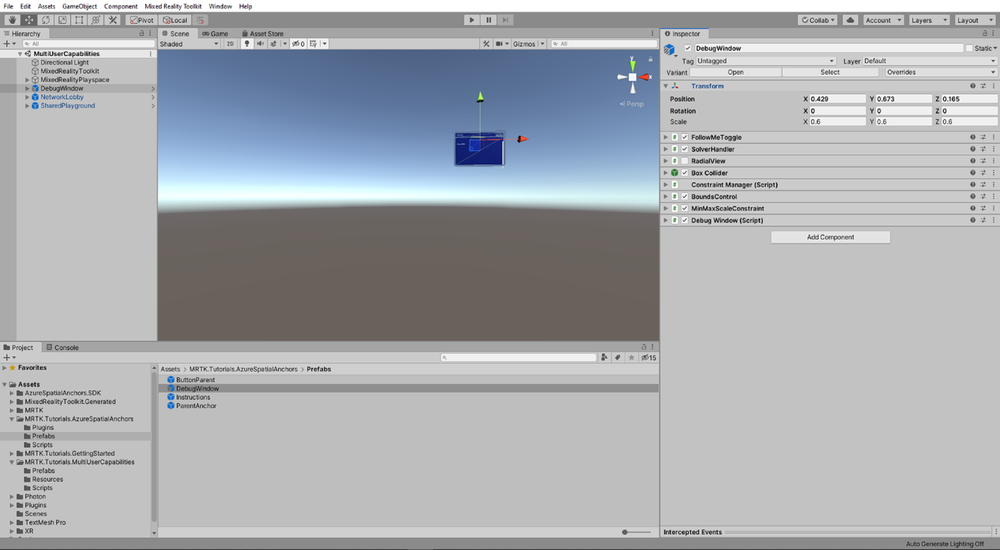

## Creating the user prefab

In this section, you will create a prefab that will be used to represent the users in the shared experience.

### 1. Create and configure the user

In the Hierarchy window, right-click on an empty area and select **Create Empty** to add an empty object to your scene, name the object **PhotonUser**, and configure it as follows:

* Ensure the Transform **Position** is set to X = 0, Y = 0, Z = 0:

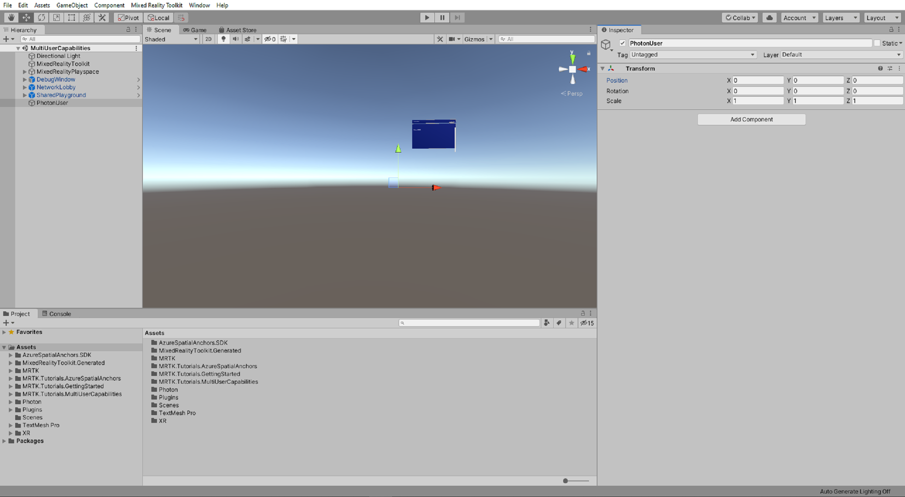

In the Hierarchy window, select the **PhotonUser** object, then in the Inspector window, use the **Add Component** button to add the **Photon User (Script)** component to the PhotonUser object:

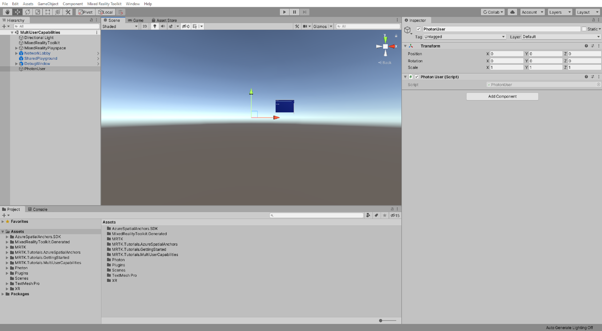

In the Inspector window, use the **Add Component** button to add the **Generic Net Sync (Script)** component to the PhotonUser object and configure it as follows:

* Check the **Is User** checkbox

In the Inspector window, use the **Add Component** button to add the **Photon View (Script)** component to the PhotonUser object and configure it as follows:

* To the **Observed Components** field, assign the **Generic Net Sync (Script)** component

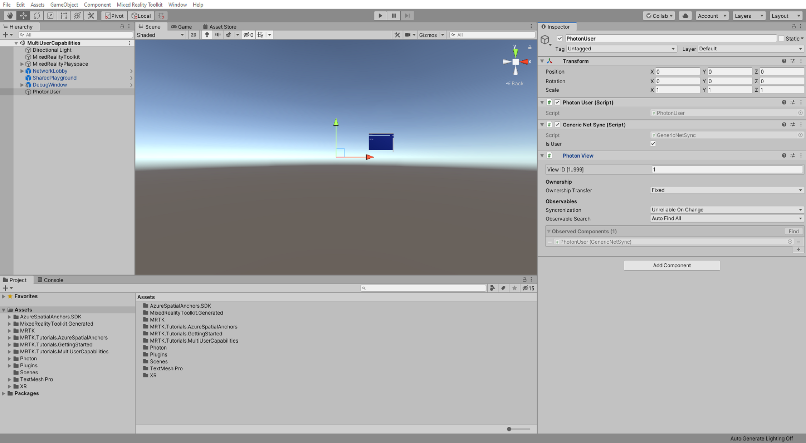

### 2. Create the avatar

In the Project window, navigate to the **Assets** > **MRTK** > **SDK** > **StandardAssets** > **Materials** folder to locate the MRTK materials.

Then, in the Hierarchy window, right-click on the **PhotonUser** object and select **3D Object** > **Sphere** to create a sphere object as a child of the PhotonUser object and configure it as follows:

* Ensure the Transform **Position** is set to X = 0, Y = 0, Z = 0
* Change the Transform **Scale** to a suitable size, for example, X = 0.15, Y = 0.15, Z = 0.15
* To the MeshRenderer > Materials > **Element 0** field, assign the **MRTK_Standard_White** material

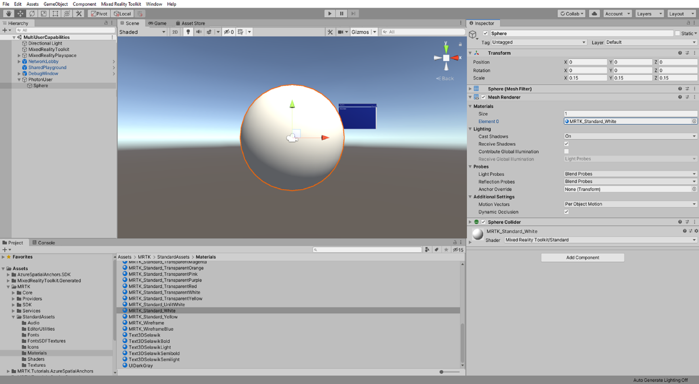

### 3. Create the prefab

In the Project window, navigate to the **Assets** > **MRTK.Tutorials.MultiUserCapabilities** > **Resources** folder:

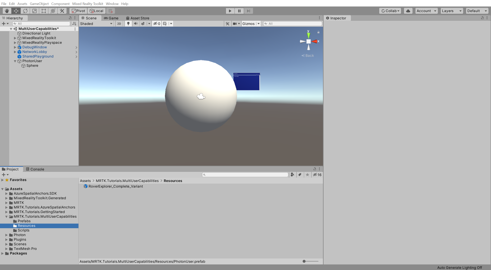

With the Resources folder still selected, **click-and-drag** the **PhotonUser** object from the Hierarchy window into the **Resources** folder to make the PhotonUser object a prefab:

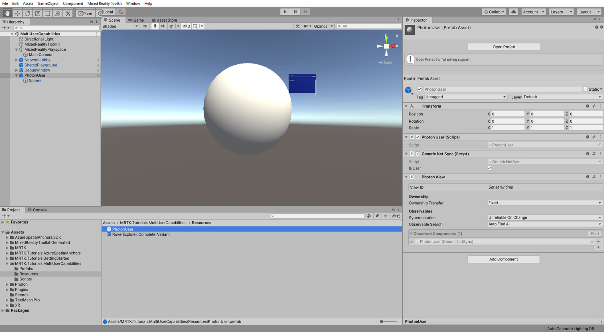

In the Hierarchy window, right-click on the **PhotonUser** object and select **Delete** to remove it from the scene:

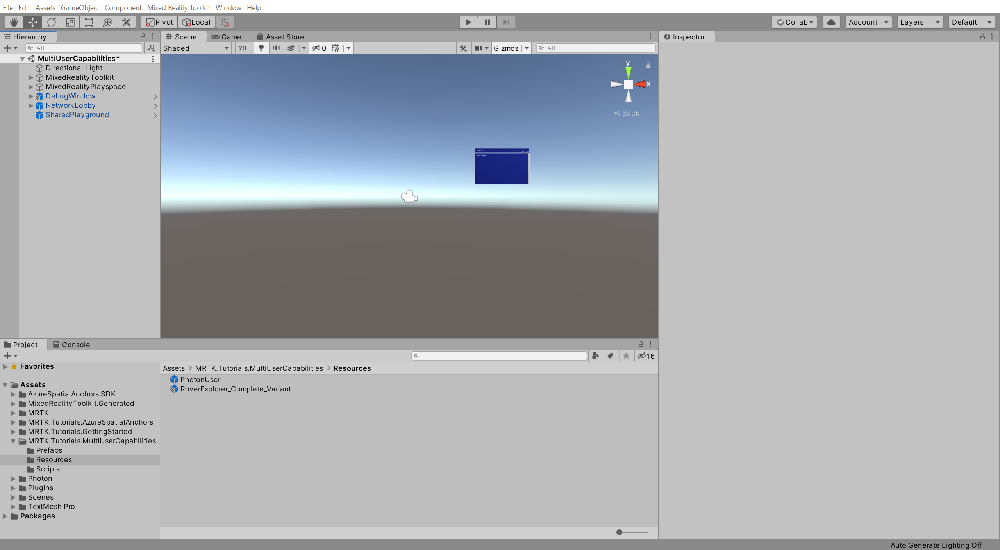

## Configuring PUN to instantiate the user prefab

In this section, you will configure the project to use the PhotonUser prefab you created in the previous section.

In the Project window, navigate to the **Assets** > **MRTK.Tutorials.MultiUserCapabilities** > **Resources** folder.

In the Hierarchy window, expand the **NetworkLobby** object and select the **NetworkRoom** child object, then in the Inspector window, locate the **Photon Room (Script)** component and configure it as follows:

* To the **Photon User Prefab** field, assign the **PhotonUser** prefab from the Resources folder

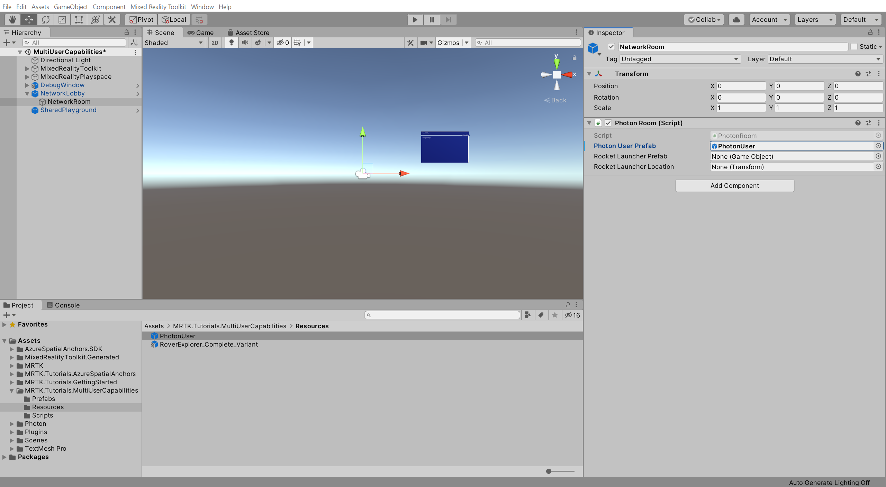

## Trying the experience with multiple users

If you now build and deploy the Unity project to your HoloLens, then, back in Unity, enter Game mode while the app is running on your HoloLens, you will see the HoloLens user avatar move when you move your head (HoloLens) around:

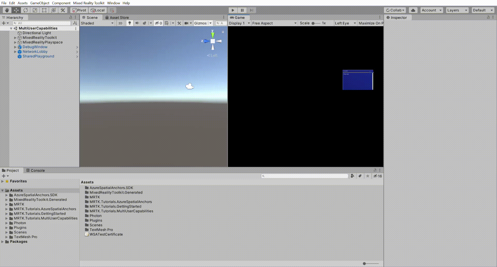

> [!TIP]
> For a reminder on how to build and deploy your Unity project to HoloLens 2, you can refer to the [Building your app to your HoloLens 2](mr-learning-base-02.md#building-your-application-to-your-hololens-2) instructions.

> [!CAUTION]
> The app needs to connect to Photon, so make sure your computer/device is connected to the internet.

## Congratulations

You have successfully configured your project to allow multiple users to connect to the same experience and see each other's movements. In the next tutorial, you will implement functionality so that the movements of objects are also shared across multiple devices.

> [!div class="nextstepaction"]
> [Next Tutorial: 4. Sharing object movements with multiple users](mr-learning-sharing-04.md)
