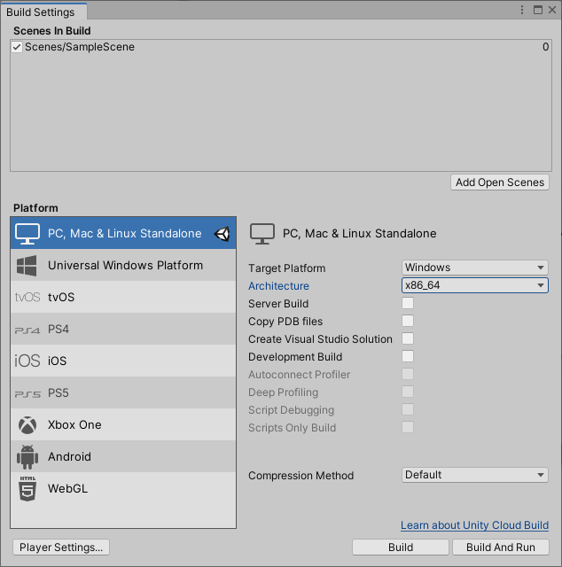
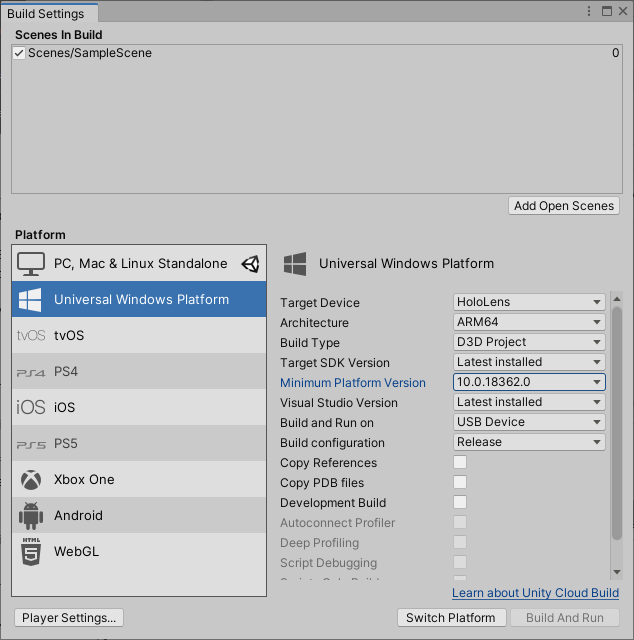
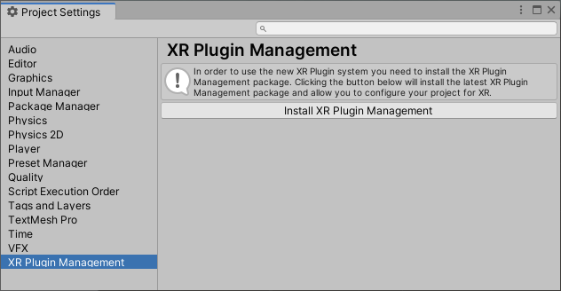
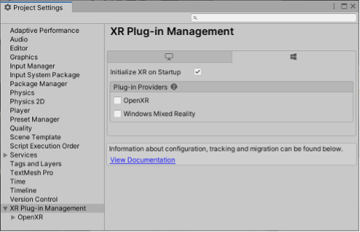

# Using Windows XR plugin

For developers targeting Unity 2020, the Windows XR plugin enables access to mixed reality features on HoloLens 2 and Windows Mixed Reality headsets.  This plugin is also supported on Unity 2019, although there are some known incompatibilities with Azure Spatial Anchors when using this plugin on that version.

While Microsoft and the community have created opensource tools such as the [Mixed Reality Toolkit (MRTK)](https://microsoft.github.io/MixedRealityToolkit-Unity/Documentation/Installation.html) that will automatically set up the WMR environment, many developers wish to build their experiences from the ground up.  The following documentation will demonstrate how to properly set up a project for Mixed Reality development whether you are using MRTK or not.  The settings you need to change are broken down into two categories: per-project settings and per-scene settings.

## Setting up your project with MRTK

MRTK for Unity provides a cross-platform input system, foundational components, and common building blocks for spatial interactions. MRTK version 2 intends to speed up application development for Microsoft HoloLens, Windows Mixed Reality immersive (VR) headsets, and OpenVR platform. The project is aimed at reducing barriers to entry, creating mixed reality applications, and contributing back to the community as we all grow.

> [!div class="nextstepaction"]
> [Try out our MRTK tutorials](tutorials/mr-learning-base-01.md)

Take a look at [MRTK's documentation](/windows/mixed-reality/mrtk-unity) for more feature details.

## Manual setup without MRTK

If you're targeting Desktop VR, we suggest using the PC Standalone Platform selected by default on a new Unity project:

If you're targeting HoloLens 2, you need to switch to the Universal Windows Platform:

1.	Select **File > Build Settings...**
2.	Select **Universal Windows Platform** in the Platform list and select **Switch Platform**
3.	Set **Architecture** to **ARM 64**
4.	Set **Target device** to **HoloLens**
5.	Set **Build Type** to **D3D**
6.	Set **UWP SDK** to **Latest installed**
7.	Set **Build configuration** to **Release** because there are known performance issues with Debug

After setting your platform, you need to let Unity know to create an [immersive view](../../design/app-views.md) instead of a 2D view when exported.

## For XRSDK 

1. In the Unity Editor, navigate to **Edit > Project settings** and select **XR Plugin Management**

2. Select **Install XR Plugin Management**

3. Select **Initialize XR on Startup** and **Windows Mixed Reality**

4. Expand the **XR Plug-in Management** section and select **Univeral Windows Platform Settings** tab
5. If you're using Unity 2020 or later, you'll see the options to check **OpenXR** or **Windows Mixed Reality**. 
    * You can choose either runtime.  If you're specifically developing for the HoloLens 2 or the HP Reverb G2 and decide to try the **OpenXR**, select the OpenXR box and review our guide to [Using the Mixed Reality OpenXR Plugin for Unity](openxr-getting-started.md) to get yourself set up correctly for these devices before returning to this tutorial

> [!NOTE]
> Starting in Unity 2020 LTS, Microsoft is embracing development with OpenXR.  As we migrate to this path, in Unity 2021.1 the Windows XR plugin will be deprecated and removed in 2021.2 making OpenXR the only supported path. You can find more information in [Using the Mixed Reality OpenXR plugin](openxr-getting-started.md).

6. If you decide to choose the **Windows Mixed Reality** plugin, check all boxes and set **Depth Submission Mode** to **Depth 16 Bit**

