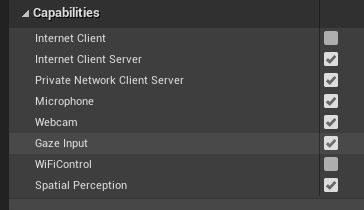
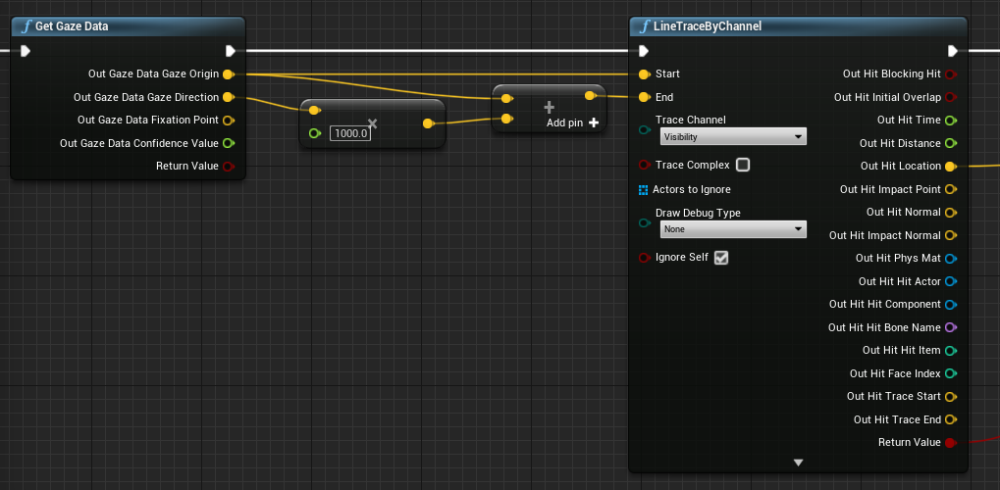
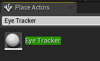

# [4.25](#tab/4.25)

The [Windows Mixed Reality plugin](https://docs.unrealengine.com/Platforms/VR/WMR/index.html) doesn’t provide any built-in functions for gaze input, but HoloLens 2 does support eye tracking. The actual tracking features are provided by Unreal's **Head Mounted Display** and **Eye Tracking** APIs and include:

- Device information
- Tracking sensors
- Orientation and position
- Clipping panes
- Gaze data and tracking information

You can find the full list of features in Unreal's [Head Mounted Display](https://docs.unrealengine.com/BlueprintAPI/Input/HeadMountedDisplay/index.html) and [Eye Tracking](https://docs.unrealengine.com/BlueprintAPI/EyeTracking/index.html) documentation.

In addition to the Unreal APIs, check out the documentation on [eye-gaze-based interaction](../../../design/eye-gaze-interaction.md) for HoloLens 2 and read up on how [eye tracking on HoloLens 2](https://docs.microsoft.com/windows/mixed-reality/eye-tracking) works.

> [!IMPORTANT]
> Eye tracking is only supported on HoloLens 2.

## Enabling eye tracking
Gaze input needs to be enabled in the HoloLens project settings before you can use any of Unreal's APIs. When the application starts you'll see a consent prompt shown in the screenshot below.

- Select **Yes** to set the permission and get access to gaze input. If you need to change this setting at any time, it can be found in the **Settings** app.


> [!NOTE] 
> HoloLens eye tracking in Unreal only has a single gaze ray for both eyes instead of the two rays needed for stereoscopic tracking, which is not supported.

That's all the setup you'll need to start adding gaze input to your HoloLens 2 apps in Unreal. More information on gaze input and how it affects users in mixed reality can be found at the links below. Be sure to think about these when building your interactive experiences.

# [4.26](#tab/4.26)

Gaze is used to indicate what the user is looking at.  This uses the eye tracking cameras on the device to find a ray in Unreal world space matching what the user is currently looking at.

## Enabling eye tracking

- In **Project Settings > HoloLens**, enable the **Gaze Input** capability:



- Create a new actor and add it to your scene

## Using eye tracking

First check that the device supports eye tracking with the IsEyeTrackerConnected function.  If this returns true, call GetGazeData to find where the user’s eyes are looking at during the current frame:


> [!NOTE]
> The fixation point and the confidence value are not available on HoloLens.

To find what the user is looking at, use the gaze origin and direction in a line trace.  The start of this vector is the gaze origin and the end is the origin plus the gaze direction multiplied by the desired distance:



## Getting head orientation

Alternatively, the HMD rotation can be used to represent the direction of the user’s head.  This does not require the Gaze Input capability but will not give eye tracking information.  A reference to the blueprint must be added as the world context to get the correct output data:


## Using C++ 

- In your game’s build.cs file, add “EyeTracker” to the PublicDependencyModuleNames list:

```cpp
PublicDependencyModuleNames.AddRange(
    new string[] {
        "Core",
        "CoreUObject",
        "Engine",
        "InputCore",
        "EyeTracker"
});
```

- In “File/ New C++ Class”, Create a new C++ actor called “EyeTracker”
    - A Visual Studio solution will open to the new EyeTracker class. Build and run to open the Unreal game with the new EyeTracker actor.  Search for “EyeTracker” in the “Place Actors” window.  Drag and drop this class into the game window to add it to the project:



- In EyeTracker.cpp, add includes for EyeTrackerFunctionLibrary, and DrawDebugHelpers:

```cpp
#include "EyeTrackerFunctionLibrary.h"
#include "DrawDebugHelpers.h"
```

In Tick, check that the device supports eye tracking with UEyeTrackerFunctionLibrary::IsEyeTrackerConnected.  Then find the start and end of a ray for a line trace from UEyeTrackerFunctionLibrary::GetGazeData:

```cpp
void AEyeTracker::Tick(float DeltaTime)
{
    Super::Tick(DeltaTime);

    if(UEyeTrackerFunctionLibrary::IsEyeTrackerConnected())
    {
        FEyeTrackerGazeData GazeData;
        if(UEyeTrackerFunctionLibrary::GetGazeData(GazeData))
        {
            FVector Start = GazeData.GazeOrigin;
            FVector End = GazeData.GazeOrigin + GazeData.GazeDirection * 100;

            FHitResult Hit Result;
            if (GWorld->LineTraceSingleByChannel(HitResult, Start, End, ECollisionChannel::ECC_Visiblity))
            {
                DrawDebugCoordinateSystem(GWrodl, HitResult.Location, FQuat::Identity.Rotator(), 10);
            }
        }
    }
}
```
