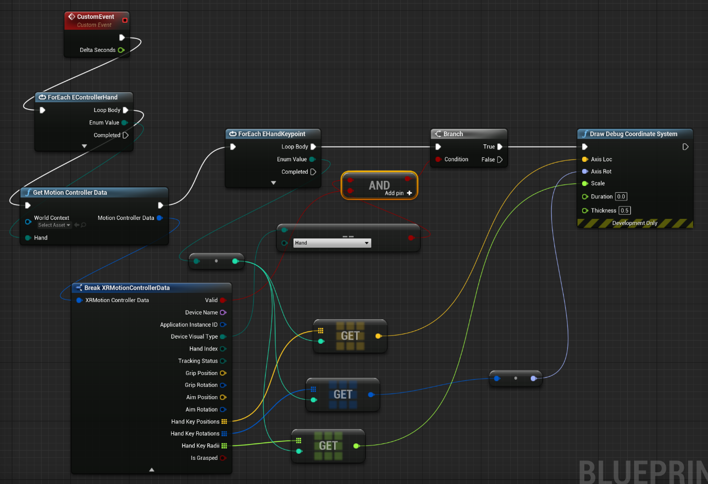
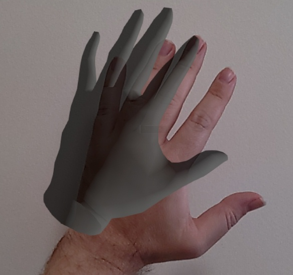

# [4.25](#tab/425)

## Hand Pose

Hand pose lets you track and use the hands and fingers of your users as input. You can access tracking data both in Blueprints and C++. You can find more technical details in Unreal's [Windows.Perception.People.HandPose](https://docs.microsoft.com/uwp/api/windows.perception.people.handpose) API. The Unreal API sends the data as a coordinate system, with ticks synchronized with the Unreal Engine.

### Understanding the bone hierarchy

The `EWMRHandKeypoint` enum describes the Hand’s bone hierarchy. You can find each hand keypoint listed in your Blueprints:


The full C++ enum is listed below:
```cpp
enum class EWMRHandKeypoint : uint8
{
	Palm,
	Wrist,
	ThumbMetacarpal,
	ThumbProximal,
	ThumbDistal,
	ThumbTip,
	IndexMetacarpal,
	IndexProximal,
	IndexIntermediate,
	IndexDistal,
	IndexTip,
	MiddleMetacarpal,
	MiddleProximal,
	MiddleIntermediate,
	MiddleDistal,
	MiddleTip,
	RingMetacarpal,
	RingProximal,
	RingIntermediate,
	RingDistal,
	RingTip,
	LittleMetacarpal,
	LittleProximal,
	LittleIntermediate,
	LittleDistal,
	LittleTip
};
```

You can find the numerical values for each enum case in the [Windows.Perception.People.HandJointKind](https://docs.microsoft.com/uwp/api/windows.perception.people.handjointkind) table. The entire hand pose layout with matching enum cases is shown in the image below:


### Supporting Hand Tracking

You can use hand tracking in Blueprints by adding **Supports Hand Tracking** from **Hand Tracking > Windows Mixed Reality**:


This function returns `true` if hand tracking is supported on the device and `false` if hand tracking isn't available.


C++:

Include `WindowsMixedRealityHandTrackingFunctionLibrary.h`.

```cpp
static bool UWindowsMixedRealityHandTrackingFunctionLibrary::SupportsHandTracking()
```

### Getting Hand Tracking

You can use **GetHandJointTransform** to return spatial data from the hand. The data updates every frame, but if you're inside a frame the returned values are cached. It's not recommended to have heavy logic in this function for performance reasons.


C++:
```cpp
static bool UWindowsMixedRealityHandTrackingFunctionLibrary::GetHandJointTransform(EControllerHand Hand, EWMRHandKeypoint Keypoint, FTransform& OutTransform, float& OutRadius)
```

Here's a breakdown of GetHandJointTransform's function parameters:

* **Hand** – can be the users left or right hand.
* **Keypoint** – the bone of the hand.
* **Transform** – coordinates and orientation of bone’s base. You can request the base of the next bone to get the transform data for the end of a bone. A special Tip bone gives end of distal.
* **Radius** — radius of the base of the bone.
* **Return Value** — true if the bone is tracked this frame, false if the bone isn't tracked.

## Hand Live Link Animation

Hand poses are exposed to Animation using the [Live Link plugin](https://docs.unrealengine.com/Engine/Animation/LiveLinkPlugin/index.html).

If the Windows Mixed Reality and Live Link plugins are enabled:
1. Select **Window > Live Link** to open the Live Link editor window.
2. Select **Source** and enable **Windows Mixed Reality Hand Tracking Source**


After you enable the source and open an animation asset, expand the **Animation** section in the **Preview Scene** tab too see additional options.


The hand animation hierarchy is the same as in `EWMRHandKeypoint`. Animation can be retargeted using **WindowsMixedRealityHandTrackingLiveLinkRemapAsset**:


It can also be subclassed in the editor:


## Hand Rays

You can use a hand ray as a pointing device in both C++ and Blueprints, which exposes the [Windows.UI.Input.Spatial.SpatialPointerInteractionSourcePose](https://docs.microsoft.com/uwp/api/windows.ui.input.spatial.spatialpointerinteractionsourcepose) API.

> [!IMPORTANT]
> Since all function results change every frame, they're all made callable. For more information about pure and impure or callable functions, see the Blueprint user guid on [functions](https://docs.unrealengine.com/en-US/Engine/Blueprints/UserGuide/Functions/index.html#purevs.impure).

To use Hand Rays in Blueprints, search for any of the actions under **Windows Mixed Reality HMD**:


To access them in C++, include `WindowsMixedRealityFunctionLibrary.h` to the top of your calling code file.

### Enum

You also have access to input cases under **EHMDInputControllerButtons**, which can be used in Blueprints:


For access in C++, use the `EHMDInputControllerButtons` enum class:
```cpp
enum class EHMDInputControllerButtons : uint8
{
	Select,
	Grasp,
//......
};
```

Below is a breakdown of the two applicable enum cases:

* **Select** - User triggered Select event.
    * Triggered in HoloLens 2 by air-tap, gaze, and commit, or by saying “Select” with [voice input](unreal-voice-input.md) enabled.
* **Grasp** - User triggered Grasp event.
    * Triggered in HoloLens 2 by closing the user’s fingers on a hologram.

You can access the tracking status of your hand mesh in C++ through the `EHMDTrackingStatus` enum shown below:

```cpp
enum class EHMDTrackingStatus : uint8
{
	NotTracked,
	//......
	Tracked
};
```

Below is a breakdown of the two applicable enum cases:

* **NotTracked** –- the hand isn’t visible
* **Tracked** –- the hand is fully tracked

### Struct

The PointerPoseInfo struct can give you information on the following hand data:

* **Origin** – origin of the hand
* **Direction** – direction of the hand
* **Up** – up vector of the hand
* **Orientation** – orientation quaternion
* **Tracking Status** – current tracking status

You can access the PointerPoseInfo struct through Blueprints, as shown below:


Or with C++:

```cpp
struct FPointerPoseInfo
{
	FVector Origin;
	FVector Direction;
	FVector Up;
	FQuat Orientation;
	EHMDTrackingStatus TrackingStatus;
};
```

### Functions

All of the functions listed below can be called on every frame, which allows continuous monitoring.

1. **Get Pointer Pose Info** returns complete information about the hand ray direction in the current frame.

Blueprint:


C++:
```cpp
static FPointerPoseInfo UWindowsMixedRealityFunctionLibrary::GetPointerPoseInfo(EControllerHand hand);
```

2. **Is Grasped** returns true if the hand is grasped in the current frame.

Blueprint:


C++:
```cpp
static bool UWindowsMixedRealityFunctionLibrary::IsGrasped(EControllerHand hand);
```

3. **Is Select Pressed** returns true if the user triggered Select in the current frame.

Blueprint:


C++:
```cpp
static bool UWindowsMixedRealityFunctionLibrary::IsSelectPressed(EControllerHand hand);
```

4. **Is Button Clicked** returns true if the event or button is triggered in the current frame.

Blueprint:


C++:
```cpp
static bool UWindowsMixedRealityFunctionLibrary::IsButtonClicked(EControllerHand hand, EHMDInputControllerButtons button);
```

5. **Get Controller Tracking Status** returns the tracking status in the current frame.

Blueprint:


C++:
```cpp
static EHMDTrackingStatus UWindowsMixedRealityFunctionLibrary::GetControllerTrackingStatus(EControllerHand hand);
```

# [4.26](#tab/426)

## Hand Pose

The HoloLens 2 hand tracking system uses a person’s palms and fingers as input. You can get the position and rotation of every finger or the entire palm to use in your code. Hand pose consists of the hierarchy of the bones together with the bones’ positions, the same as in our hands. HoloLens tracks your hands and provides all this information to Unreal’s API. The entire hand pose layout with matching enum cases is shown in the image below:


The hierarchy is described by EHandKeypoint enum:


You can get all this data from a user’s hands using the “Get Motion Controller Data” function. That function returns an XRMotionControllerData structure. Below is a sample Blueprint script which parses the XRMotionControllerData structure to get the locations of the hand joints and draw a small debug coordinate system at each joint’s location.

You can get all this data from a user’s hands using the “Get Motion Controller Data” function. That function returns an XRMotionControllerData structure. Below is a sample Blueprint script which parses the XRMotionControllerData structure to get the locations of the hand joints and draw a small debug coordinate system at each joint’s location.



It is important to mention that you must check that the structure is valid and that it is a hand. Otherwise, you may get undefined behaviour amid access to positions, rotations and radii arrays.

## Hand Ray

Getting hand pose works for close interactions like grabbing objects or pressing buttons. However, sometimes you must work with holograms that are far away from you. This can be accomplished with hand rays. You can draw a ray from your hand to a far point and, with some help from Unreal ray tracing, select a hologram that would otherwise be out of reach. £

To get the data for the hand rays, you should use the “Get Motion Controller Data” function from the previous section. The returned structure contains two parameters you can use to create a hand ray – “Aim Position” and “Aim Rotation”. These parameters form a ray directed by your elbow. You should take them and find a hologram being pointed by.

Below is an example of determining whether a hand ray hits a Widget and setting a custom hit result accordingly:

 

## Hand Mesh Debug Visualization

> [!IMPORTANT]
> Hand meshes are supported in OpenXR only, not in Windows Mixed Reality. 

The hand meshes can be used for various reasons, primarily in debug purposes. The recommended way to visualise hand mesh is to use Epic’s XRVisualization plugin together with Microsoft-OpenXR-Unreal. 

Then in the blueprint editor, you should use “Set Use Hand Mesh” function from Microsoft-OpenXR-Unreal with “Enabled XRVisualization” as a parameter just like the following:


To manage the rendering process, you should use “Render Motion Controller” from XRVisualization:


The result:



## Hand Mesh as a Tracked Geometry

The previous section describes a simple but not configurable way to show hand meshes. If you need anything more complicated such as drawing a hand mesh with a custom shader, you need to get the meshes as a tracked geometry. 

To enable that mode you should call “Set Use Hand Mesh” with “Enabled Tracking Geometry":


Please note that it’s not possible for both modes to be enabled at the same time. If you enable one, the another is automatically disabled. 


