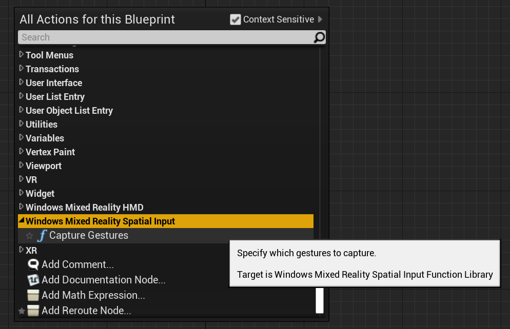
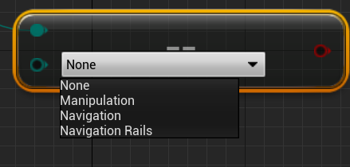
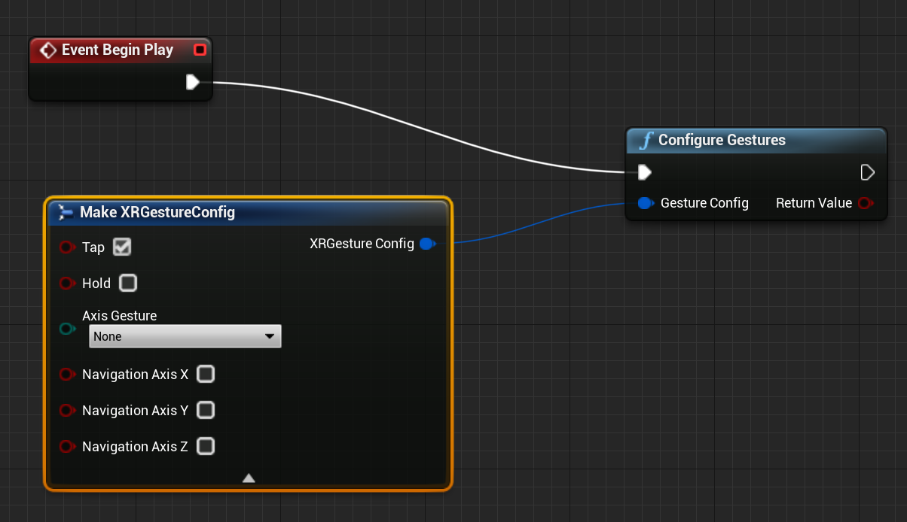
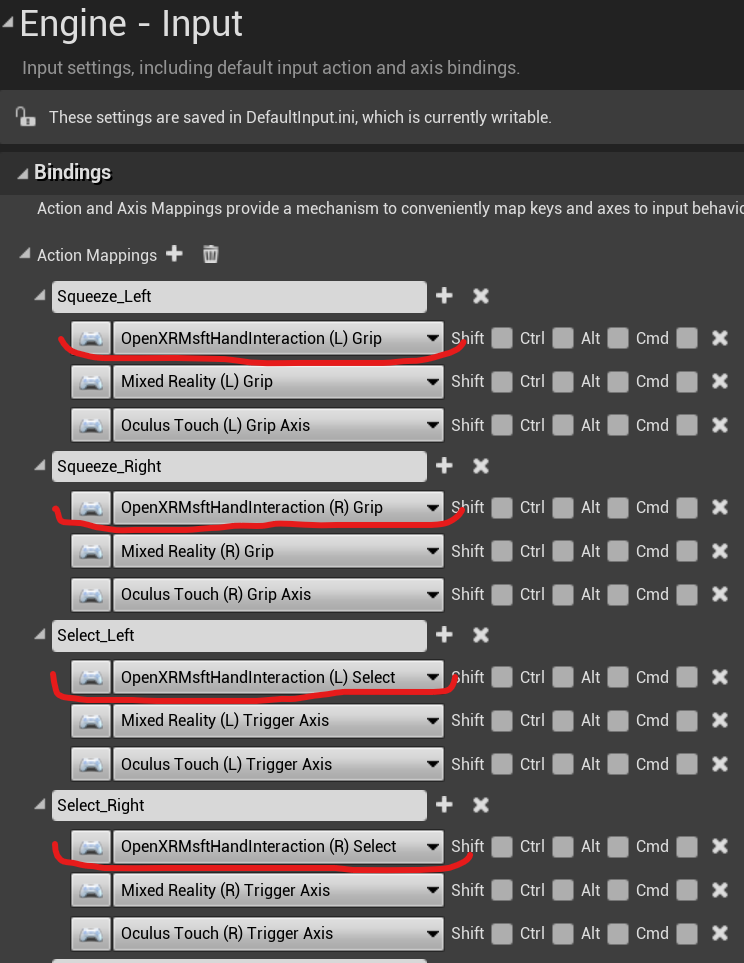

# [4.25](#tab/425)

The HoloLens 2 tracks spatial gestures, which means you can capture those gestures as input. You can find more details about gestures are the [HoloLens 2 Basic Usage](https://docs.microsoft.com/hololens/hololens2-basic-usage) document.

You can find the Blueprint function in under **Windows Mixed Reality Spatial Input**, and the C++ function by adding `WindowsMixedRealitySpatialInputFunctionLibrary.h` in your calling code file.



### Enum
<!-- Deprecated
The `ESPatialInputAxisGestureType` enum describes spatial axis gestures and are [fully documented](../../out-of-scope/deprecated/holograms-211.md).
-->
Blueprint:



C++:
```cpp
enum class ESpatialInputAxisGestureType : uint8
{
	None = 0,
	Manipulation = 1,
	Navigation = 2,
	NavigationRails = 3
};
```

### Function
You can enable and disable gesture capture with the `CaptureGestures` function. When an enabled gesture fires input events, the function returns `true` if gesture capture succeeded, and `false` if there's an error.

Blueprint:


C++:
```cpp
static bool UWindowsMixedRealitySpatialInputFunctionLibrary::CaptureGestures(
	bool Tap = false,
	bool Hold = false,
	ESpatialInputAxisGestureType AxisGesture = ESpatialInputAxisGestureType::None,
	bool NavigationAxisX = true,
	bool NavigationAxisY = true,
	bool NavigationAxisZ = true);
```

The following are key events, which you can find in Blueprints and C++:


```cpp
const FKey FSpatialInputKeys::TapGesture(TapGestureName);
const FKey FSpatialInputKeys::DoubleTapGesture(DoubleTapGestureName);
const FKey FSpatialInputKeys::HoldGesture(HoldGestureName);

const FKey FSpatialInputKeys::LeftTapGesture(LeftTapGestureName);
const FKey FSpatialInputKeys::LeftDoubleTapGesture(LeftDoubleTapGestureName);
const FKey FSpatialInputKeys::LeftHoldGesture(LeftHoldGestureName);

const FKey FSpatialInputKeys::RightTapGesture(RightTapGestureName);
const FKey FSpatialInputKeys::RightDoubleTapGesture(RightDoubleTapGestureName);
const FKey FSpatialInputKeys::RightHoldGesture(RightHoldGestureName);

const FKey FSpatialInputKeys::LeftManipulationGesture(LeftManipulationGestureName);
const FKey FSpatialInputKeys::LeftManipulationXGesture(LeftManipulationXGestureName);
const FKey FSpatialInputKeys::LeftManipulationYGesture(LeftManipulationYGestureName);
const FKey FSpatialInputKeys::LeftManipulationZGesture(LeftManipulationZGestureName);

const FKey FSpatialInputKeys::LeftNavigationGesture(LeftNavigationGestureName);
const FKey FSpatialInputKeys::LeftNavigationXGesture(LeftNavigationXGestureName);
const FKey FSpatialInputKeys::LeftNavigationYGesture(LeftNavigationYGestureName);
const FKey FSpatialInputKeys::LeftNavigationZGesture(LeftNavigationZGestureName);


const FKey FSpatialInputKeys::RightManipulationGesture(RightManipulationGestureName);
const FKey FSpatialInputKeys::RightManipulationXGesture(RightManipulationXGestureName);
const FKey FSpatialInputKeys::RightManipulationYGesture(RightManipulationYGestureName);
const FKey FSpatialInputKeys::RightManipulationZGesture(RightManipulationZGestureName);

const FKey FSpatialInputKeys::RightNavigationGesture(RightNavigationGestureName);
const FKey FSpatialInputKeys::RightNavigationXGesture(RightNavigationXGestureName);
const FKey FSpatialInputKeys::RightNavigationYGesture(RightNavigationYGestureName);
const FKey FSpatialInputKeys::RightNavigationZGesture(RightNavigationZGestureName);
```

# [4.26](#tab/426)

HoloLens can not only track a hand itself, but also identify the hand’s gestures. Gesture tracking is based on a subscription model. You should use the “Configure Gestures” function to tell the device which gestures you want to track. 

## Windows Mixed Reality



Then you should add code to subscribe to the following events:


## OpenXR

In OpenXR, gesture events are tracked through the input pipeline. Using hand interaction, the device can automatically recognize Tap and Hold gestures, but not the others. They are named as OpenXRMsftHandInteraction Select and Grip mappings. You don’t need to enable subscription, you should declare the events in Project Settings/Engine/Input, just like this:


