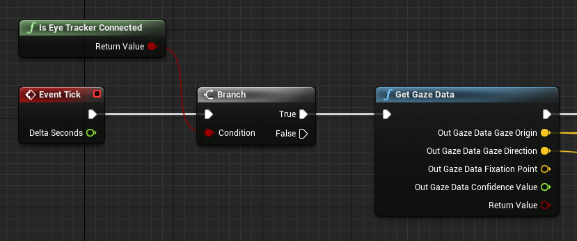
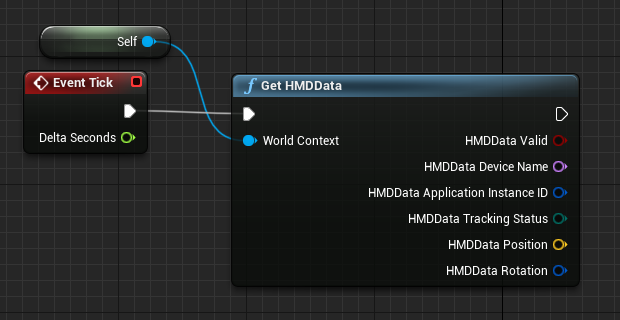

# Gaze Input

Gaze input in mixed reality apps is all about finding out what your users are looking at. When the eye tracking cameras on your device match up with rays in Unreal's world space, your user's line of sight data becomes available. Gaze can be used in both blueprints and C++, and is a core feature for mechanics like object interaction, way finding, and camera controls.

## Enabling eye tracking

- In **Project Settings > HoloLens**, enable the **Gaze Input** capability:


- Create a new actor and add it to your scene

> [!NOTE] 
> HoloLens eye tracking in Unreal only has a single gaze ray for both eyes. Stereoscopic tracking, which requires two rays, isn't supported.

## Using eye tracking

First, check that your device supports eye tracking with the **IsEyeTrackerConnected** function.  If the function returns true, call **GetGazeData** to find where the user’s eyes are looking at in the current frame:



> [!NOTE]
> The fixation point and the confidence value are not available on HoloLens.

Use the gaze origin and direction in a line trace to find out exactly where your users are looking.  The gaze value is a vector, starting at the gaze origin and ending at the origin plus the gaze direction multiplied by the line trace distance:


## Getting head orientation

You can also use the rotation of the Head Mounted Display (HMD) to represent the direction of the user’s head. You can get the users head direction without enabling the Gaze Input capability, but you won't get you any eye tracking information.  Add a reference to the blueprint as the world context to get the correct output data:

> [!NOTE]
> Getting HMD Data is only available in Unreal 4.26 and onwards.



## Using C++ 

- In your game’s **build.cs** file, add **EyeTracker** to the **PublicDependencyModuleNames** list:

```cpp
PublicDependencyModuleNames.AddRange(
    new string[] {
        "Core",
        "CoreUObject",
        "Engine",
        "InputCore",
        "EyeTracker"
});
```

- In **File/ New C++ Class**, create a new C++ actor called **EyeTracker**
    - A Visual Studio solution will open up the new EyeTracker class. Build and run to open the Unreal game with the new EyeTracker actor.  Search for “EyeTracker” in the **Place Actors** window and drag and drop the class into the game window to add it to the project:


- In **EyeTracker.cpp**, add includes for **EyeTrackerFunctionLibrary**, and **DrawDebugHelpers**:

```cpp
#include "EyeTrackerFunctionLibrary.h"
#include "DrawDebugHelpers.h"
```

Check that your device supports eye tracking with **UEyeTrackerFunctionLibrary::IsEyeTrackerConnected** before trying to get any gaze data.  If eye tracking is supported, find the start and end of a ray for a line trace from **UEyeTrackerFunctionLibrary::GetGazeData**. From there, you can construct a gaze vector and pass its contents to **LineTraceSingleByChannel** to debug any ray hit results:

```cpp
void AEyeTracker::Tick(float DeltaTime)
{
    Super::Tick(DeltaTime);

    if(UEyeTrackerFunctionLibrary::IsEyeTrackerConnected())
    {
        FEyeTrackerGazeData GazeData;
        if(UEyeTrackerFunctionLibrary::GetGazeData(GazeData))
        {
            FVector Start = GazeData.GazeOrigin;
            FVector End = GazeData.GazeOrigin + GazeData.GazeDirection * 100;

            FHitResult Hit Result;
            if (GWorld->LineTraceSingleByChannel(HitResult, Start, End, ECollisionChannel::ECC_Visiblity))
            {
                DrawDebugCoordinateSystem(GWorld, HitResult.Location, FQuat::Identity.Rotator(), 10);
            }
        }
    }
}
```

## Next Development Checkpoint

If you're following the Unreal development journey we've laid out, you're in the midst of exploring the MRTK core building blocks. From here, you can continue to the next building block: 

> [!div class="nextstepaction"]
> [Hand tracking](unreal-hand-tracking.md)

Or jump to Mixed Reality platform capabilities and APIs:

> [!div class="nextstepaction"]
> [HoloLens camera](unreal-hololens-camera.md)

You can always go back to the [Unreal development checkpoints](unreal-development-overview.md#2-core-building-blocks) at any time.

## See also
* [Calibration](../../calibration.md)
* [Comfort](../../design/comfort.md)
* [Gaze and commit](../../design/gaze-and-commit.md)
* [Voice input](../../out-of-scope/voice-design.md)
