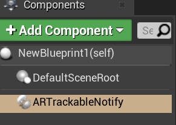
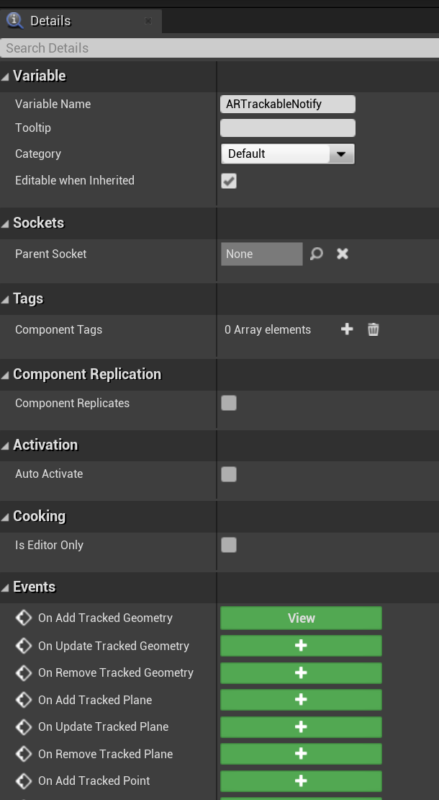
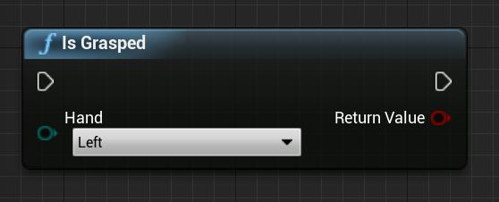

# Hand tracking in Unreal

## Overview

The hand tracking system uses a person’s palms and fingers as input. You can get the position and rotation of every finger, the entire palm, and even hand gestures to use in your code. 

## Hand Pose

Hand pose lets you track the hands and fingers of the active user and use it as input, which you can access through Blueprints and C++. You can find more technical details in Unreal's [Windows.Perception.People.HandPose](https://docs.microsoft.com/uwp/api/windows.perception.people.handpose) API. The Unreal API sends the data as a coordinate system, with ticks synchronized with the Unreal Engine.

### Understanding the bone hierarchy

The `EWMRHandKeypoint` enum describes the Hand’s bone hierarchy. You can find each hand keypoint listed in your Blueprints:


The full C++ enum is listed below:
```cpp
enum class EWMRHandKeypoint : uint8
{
	Palm,
	Wrist,
	ThumbMetacarpal,
	ThumbProximal,
	ThumbDistal,
	ThumbTip,
	IndexMetacarpal,
	IndexProximal,
	IndexIntermediate,
	IndexDistal,
	IndexTip,
	MiddleMetacarpal,
	MiddleProximal,
	MiddleIntermediate,
	MiddleDistal,
	MiddleTip,
	RingMetacarpal,
	RingProximal,
	RingIntermediate,
	RingDistal,
	RingTip,
	LittleMetacarpal,
	LittleProximal,
	LittleIntermediate,
	LittleDistal,
	LittleTip
};
```

You can find the numerical values for each enum case in the [Windows.Perception.People.HandJointKind](https://docs.microsoft.com/uwp/api/windows.perception.people.handjointkind) table. The entire hand pose layout with matching enum cases is shown in the image below:


 
### Supporting Hand Tracking

You can use hand tracking in Blueprints by adding **Supports Hand Tracking** from **Hand Tracking > Windows Mixed Reality**:


This function returns `true` if hand tracking is supported on the device and `false` if hand tracking is not available.


C++: 

Include `WindowsMixedRealityHandTrackingFunctionLibrary.h`.

```cpp
static bool UWindowsMixedRealityHandTrackingFunctionLibrary::SupportsHandTracking()
```

### Getting Hand Tracking
You can use **GetHandJointTransform** to return spatial data from the hand. The data updates every frame, but if you're inside a frame the returned values are cached. It's not recommended to have heavy logic in this function for performance reasons. 


 
C++:
```cpp
static bool UWindowsMixedRealityHandTrackingFunctionLibrary::GetHandJointTransform(EControllerHand Hand, EWMRHandKeypoint Keypoint, FTransform& OutTransform, float& OutRadius)
```

Function parameter breakdown:

* **Hand** – an be the left or right hand of the user
* **Keypoint** – the bone of the hand. 
* **Transform** – coordinates and orientation of bone’s base. You can request the base of the next bone to get the transform data for the end of a bone. A special Tip bone gives end of distal. 
* **Radius** — radius of the base of the bone.
* **Return Value** — true if the bone is tracked this frame, false if the bone is not tracked.

## Hand Live Link Animation
Hand poses are exposed to Animation using the [Live Link plugin](https://docs.unrealengine.com/Engine/Animation/LiveLinkPlugin/index.html).

If the Windows Mixed Reality and Live Link plugins are enabled: 
1. Select **Window > Live Link** to open the Live Link editor window. 
2. Click **Source** and enable **Windows Mixed Reality Hand Tracking Source**


 
After you enable the source and open an animation asset, expand the **Animation** section in the **Preview Scene** tab too see additional options (the details are in Unreal’s Live Link documentation - as the plugin is in beta, the process may change later).


 
The hand animation hierarchy is the same as in `EWMRHandKeypoint`. Animation can be retargeted using **WindowsMixedRealityHandTrackingLiveLinkRemapAsset**:


 
It can also be subclassed in the editor:


 
## Accessing Hand Mesh Data


Before you can access hand mesh data, you'll need to:
- Select your **ARSessionConfig** asset, expand the **AR Settings -> World Mapping** settings, and check **Generate Mesh Data from Tracked Geometry**. 

Below are the default mesh parameters:

1.	Use Mesh Data for Occlusion
2.	Generate Collision for Mesh Data
3.	Generate Nav Mesh for Mesh Data
4.	Render Mesh Data in Wireframe – debug parameter that shows generated mesh

These parameter values are used as the spatial mapping mesh and hand mesh defaults. You can change them at any time in Blueprints or code for any mesh.

### C++ API Reference 
Use `EEARObjectClassification` to find hand mesh values in all trackable objects.
```cpp
enum class EARObjectClassification : uint8
{
    // Other types 
	HandMesh,
};
```

The following delegates are called when the system detects any trackable object, including a hand mesh. 

```cpp
class FARSupportInterface 
{
    public:
    // Other params 
	DECLARE_AR_SI_DELEGATE_FUNCS(OnTrackableAdded)
	DECLARE_AR_SI_DELEGATE_FUNCS(OnTrackableUpdated)
	DECLARE_AR_SI_DELEGATE_FUNCS(OnTrackableRemoved)
};
```

Make sure your delegate handlers follow the function signature below:

```cpp
void UARHandMeshComponent::OnTrackableAdded(UARTrackedGeometry* Added)
```

You can access mesh data through the  `UARTrackedGeometry::GetUnderlyingMesh`:

```cpp
UMRMeshComponent* UARTrackedGeometry::GetUnderlyingMesh()
```


### Blueprint API Reference

In order to work with Hand Meshes in Blueprints:
1. Add an **ARTrackableNotify** Component to a Blueprint actor


 
2. Go to the **Details** panel and expand the **Events** section. 


 
3. Overwrite On Add/Update/Remove Tracked Geometry with the following nodes in your Event Graph:


 
## Hand Rays

You can use a hand ray as a pointing device in both C++ and Blueprints, which exposes the [Windows.UI.Input.Spatial.SpatialPointerInteractionSourcePose](https://docs.microsoft.com/uwp/api/windows.ui.input.spatial.spatialpointerinteractionsourcepose) API.

It’s important to mention that since the results of all the functions change every frame, they're all made callable. For more information about pure and impure or callable functions, see the Blueprint user guid on [functions](https://docs.unrealengine.com/en-US/Engine/Blueprints/UserGuide/Functions/index.html#purevs.impure)

To use Hand Rays in Blueprints, search for any of the actions under **Windows Mixed Reality HMD**:


 
To access them in C++, include `WindowsMixedRealityFunctionLibrary.h` to the top of your calling code file.

### Enum
You also have access to input cases under **EHMDInputControllerButtons**, which can be used in Blueprints:


For access in C++, use the `EHMDInputControllerButtons` enum class:
```cpp
enum class EHMDInputControllerButtons : uint8
{
	Select,
	Grasp,
//......
};
```

Below is a breakdown of the two applicable enum cases:
* **Select** - User triggered Select event. 
    * The event can be triggered in HoloLens 2 by air-tap, gaze and commit, or by saying “Select” with [voice input](unreal-voice-input.md) enabled. 
* **Grasp** - User triggered Grasp event. 
    * This event can be triggered in HoloLens 2 by closing the user’s fingers on a hologram. 

You can access the tracking status of your hand mesh in C++ through the `EHMDTrackingStatus` enum shown below:

```cpp
enum class EHMDTrackingStatus : uint8
{
	NotTracked,
	//......
	Tracked
};
```

Below is a breakdown of the two applicable enum cases:
* **NotTracked** –- the hand isn’t visible
* **Tracked** –- the hand is fully tracked

### Struct
The PointerPoseInfo struct can give you information on the following hand data:
* **Origin** – origin of the hand
* **Direction** – direction of the hand
* **Up** – up vector of the hand
* **Orientation** – orientation quaternion 
* **Tracking Status** – current tracking status

You can access this through Blueprints, as shown below:


Or with C++:

```cpp
struct FPointerPoseInfo
{
	FVector Origin;
	FVector Direction;
	FVector Up;
	FQuat Orientation;
	EHMDTrackingStatus TrackingStatus;
};
```

### Functions

All of the functions listed below can be called on every frame, which allows continuous monitoring. 

1. **Get Pointer Pose Info** returns complete information about the hand ray direction in the current frame. 

Blueprint:


C++: 
```cpp
static FPointerPoseInfo UWindowsMixedRealityFunctionLibrary::GetPointerPoseInfo(EControllerHand hand);
```

2. **Is Grasped** returns true if the hand is grasped in the current frame.

Blueprint:



C++:
```cpp
static bool UWindowsMixedRealityFunctionLibrary::IsGrasped(EControllerHand hand);
```
 
3. **Is Select Pressed** returns true if the user triggered Select in the current frame.

Blueprint:


C++:
```cpp
static bool UWindowsMixedRealityFunctionLibrary::IsSelectPressed(EControllerHand hand);
```

4. **Is Button Clicked** returns true if the event or button is triggered in the current frame.

Blueprint:


C++:
```cpp
static bool UWindowsMixedRealityFunctionLibrary::IsButtonClicked(EControllerHand hand, EHMDInputControllerButtons button);
```

5. **Get Controller Tracking Status** returns the tracking status in the current frame.

Blueprint:


C++:
```cpp
static EHMDTrackingStatus UWindowsMixedRealityFunctionLibrary::GetControllerTrackingStatus(EControllerHand hand);
```

## Gestures

The Hololens 2 can track spatial gestures, which means you can capture those gestures as input. You can find more details about gestures are the [HoloLens 2 Basic Usage](https://docs.microsoft.com/hololens/hololens2-basic-usage) document.

You can find the Blueprint function in under **Windows Mixed Reality Spatial Input**, and the C++ function by adding `WindowsMixedRealitySpatialInputFunctionLibrary.h` in your calling code file.


### Enum
<!-- Deprecated
The `ESPatialInputAxisGestureType` enum describes spatial axis gestures and are [fully documented](../../out-of-scope/deprecated/holograms-211.md).
-->
Blueprint: 


C++:
```cpp
enum class ESpatialInputAxisGestureType : uint8
{
	None = 0,
	Manipulation = 1,
	Navigation = 2,
	NavigationRails = 3
};
```

### Function
You can enable and disable gesture capture with the `CaptureGestures` function. When an enabled gesture fires input events, the function returns `true` if gesture capture succeeded, and `false` if there's an error.

Blueprint:


C++:
```cpp
static bool UWindowsMixedRealitySpatialInputFunctionLibrary::CaptureGestures(
	bool Tap = false, 
	bool Hold = false, 
	ESpatialInputAxisGestureType AxisGesture = ESpatialInputAxisGestureType::None, 
	bool NavigationAxisX = true, 
	bool NavigationAxisY = true, 
	bool NavigationAxisZ = true);
```

The following are key events, which you can find in Blueprints and C++:


```cpp
const FKey FSpatialInputKeys::TapGesture(TapGestureName);
const FKey FSpatialInputKeys::DoubleTapGesture(DoubleTapGestureName);
const FKey FSpatialInputKeys::HoldGesture(HoldGestureName);

const FKey FSpatialInputKeys::LeftTapGesture(LeftTapGestureName);
const FKey FSpatialInputKeys::LeftDoubleTapGesture(LeftDoubleTapGestureName);
const FKey FSpatialInputKeys::LeftHoldGesture(LeftHoldGestureName);

const FKey FSpatialInputKeys::RightTapGesture(RightTapGestureName);
const FKey FSpatialInputKeys::RightDoubleTapGesture(RightDoubleTapGestureName);
const FKey FSpatialInputKeys::RightHoldGesture(RightHoldGestureName);

const FKey FSpatialInputKeys::LeftManipulationGesture(LeftManipulationGestureName);
const FKey FSpatialInputKeys::LeftManipulationXGesture(LeftManipulationXGestureName);
const FKey FSpatialInputKeys::LeftManipulationYGesture(LeftManipulationYGestureName);
const FKey FSpatialInputKeys::LeftManipulationZGesture(LeftManipulationZGestureName);

const FKey FSpatialInputKeys::LeftNavigationGesture(LeftNavigationGestureName);
const FKey FSpatialInputKeys::LeftNavigationXGesture(LeftNavigationXGestureName);
const FKey FSpatialInputKeys::LeftNavigationYGesture(LeftNavigationYGestureName);
const FKey FSpatialInputKeys::LeftNavigationZGesture(LeftNavigationZGestureName);


const FKey FSpatialInputKeys::RightManipulationGesture(RightManipulationGestureName);
const FKey FSpatialInputKeys::RightManipulationXGesture(RightManipulationXGestureName);
const FKey FSpatialInputKeys::RightManipulationYGesture(RightManipulationYGestureName);
const FKey FSpatialInputKeys::RightManipulationZGesture(RightManipulationZGestureName);

const FKey FSpatialInputKeys::RightNavigationGesture(RightNavigationGestureName);
const FKey FSpatialInputKeys::RightNavigationXGesture(RightNavigationXGestureName);
const FKey FSpatialInputKeys::RightNavigationYGesture(RightNavigationYGestureName);
const FKey FSpatialInputKeys::RightNavigationZGesture(RightNavigationZGestureName);
```

## Next Development Checkpoint

If you're following the Unreal development checkpoint journey we've laid out, you're in the midst of exploring the MRTK core building blocks. From here, you can proceed to the next building block: 

> [!div class="nextstepaction"]
> [Local Spatial Anchors](unreal-spatial-anchors.md)

Or jump to Mixed Reality platform capabilities and APIs:

> [!div class="nextstepaction"]
> [HoloLens camera](unreal-hololens-camera.md)

You can always go back to the [Unreal development checkpoints](unreal-development-overview.md#2-core-building-blocks) at any time.