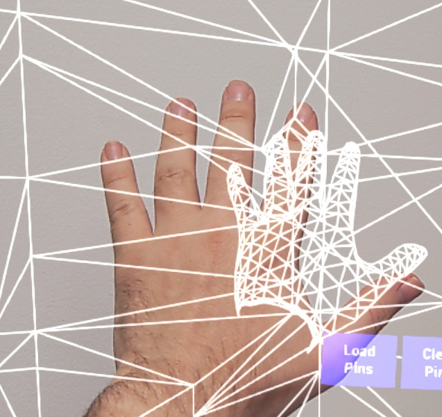

# Hand tracking in Unreal

The hand tracking system uses a person’s palms and fingers as input. Data on position and rotation of every finger, the entire palm, and hand gestures is available. Starting in Unreal 4.26, hand tracking is based on the Unreal HeadMountedDisplay plugin and uses a common API across all XR platforms and devices. Functionality is the same for both Windows Mixed Reality and OpenXR systems.

[!INCLUDE[](includes/tabs-hand-tracking-1.md)]

## Accessing Hand Mesh Data



Before you can access hand mesh data, you'll need to:
- Select your **ARSessionConfig** asset, expand the **AR Settings -> World Mapping** settings, and check **Generate Mesh Data from Tracked Geometry**.

Below are the default mesh parameters:

1.	Use Mesh Data for Occlusion
2.	Generate Collision for Mesh Data
3.	Generate Nav Mesh for Mesh Data
4.	Render Mesh Data in Wireframe – debug parameter that shows generated mesh

These parameter values are used as the spatial mapping mesh and hand mesh defaults. You can change them at any time in Blueprints or code for any mesh.

### C++ API Reference
Use `EEARObjectClassification` to find hand mesh values in all trackable objects.
```cpp
enum class EARObjectClassification : uint8
{
    // Other types
	HandMesh,
};
```

The following delegates are called when the system detects any trackable object, including a hand mesh.

```cpp
class FARSupportInterface
{
    public:
    // Other params
	DECLARE_AR_SI_DELEGATE_FUNCS(OnTrackableAdded)
	DECLARE_AR_SI_DELEGATE_FUNCS(OnTrackableUpdated)
	DECLARE_AR_SI_DELEGATE_FUNCS(OnTrackableRemoved)
};
```

Make sure your delegate handlers follow the function signature below:

```cpp
void UARHandMeshComponent::OnTrackableAdded(UARTrackedGeometry* Added)
```

You can access mesh data through the  `UARTrackedGeometry::GetUnderlyingMesh`:

```cpp
UMRMeshComponent* UARTrackedGeometry::GetUnderlyingMesh()
```

### Blueprint API Reference

To work with Hand Meshes in Blueprints:
1. Add an **ARTrackableNotify** Component to a Blueprint actor


2. Go to the **Details** panel and expand the **Events** section.


3. Overwrite On Add/Update/Remove Tracked Geometry with the following nodes in your Event Graph:


## Gestures

The HoloLens 2 tracks spatial gestures, which means you can capture those gestures as input. You can find more details about gestures are the [HoloLens 2 Basic Usage](https://docs.microsoft.com/hololens/hololens2-basic-usage) document.

[!INCLUDE[](includes/tabs-hand-tracking-2.md)]

## Next Development Checkpoint

If you're following the Unreal development journey we've laid out, you're in the midst of exploring the MRTK core building blocks. From here, you can continue to the next building block:

> [!div class="nextstepaction"]
> [Local Spatial Anchors](unreal-spatial-anchors.md)

Or jump to Mixed Reality platform capabilities and APIs:

> [!div class="nextstepaction"]
> [HoloLens camera](unreal-hololens-camera.md)

You can always go back to the [Unreal development checkpoints](unreal-development-overview.md#2-core-building-blocks) at any time.
