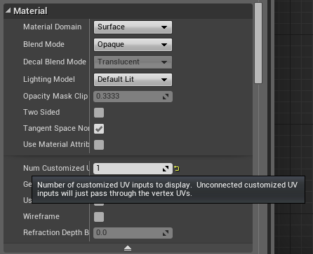
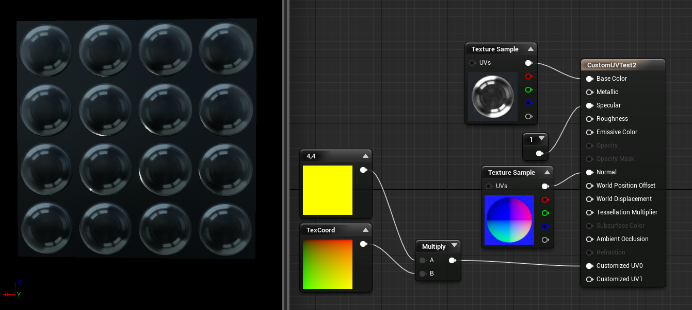
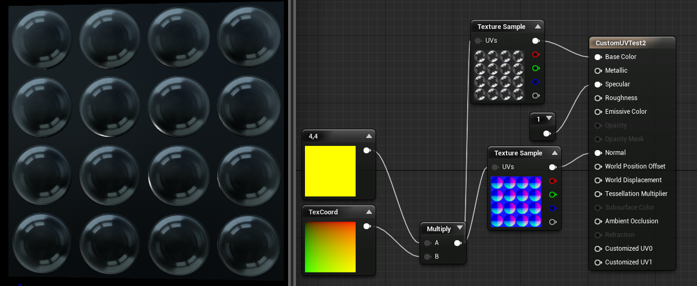
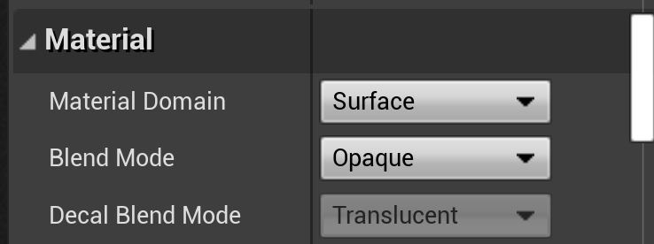
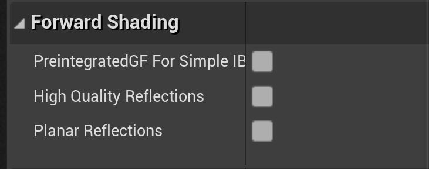
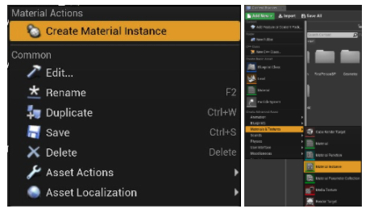
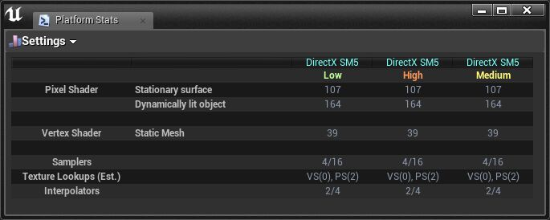
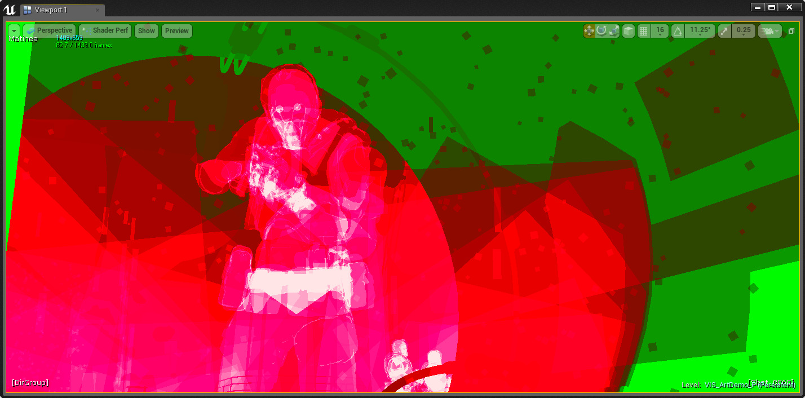

# Material recommendations in Unreal

Materials can make or break performance in Unreal Engine. This page acts as a quick-start on the basic settings you should be using in order to get the best performance.

## Using CustomizedUVs

If you need to provide tiling of UVs on your material, you should use CustomizedUVs rather than modifying the UV of the texture node directly. CustomizedUVs allow UV manipulation to happen in the Vertex shaders rather than Pixel shader. 

You can find more details on materials in the [Unreal Engine documentation](https://docs.unrealengine.com/Platforms/Mobile/Materials/index.html) and best practice examples in the screenshots below:

*Recommended material setup*

*Non-recommended material setup*

## Changing Blend Mode

You should set blend mode to opaque unless there is a strong reason to do otherwise. Masked and Translucent materials are slow. You can find more details on materials in the [Unreal Engine documentation](https://docs.unrealengine.com/Platforms/Mobile/Materials/index.html).

## Updating lighting for mobile

Full precision should be turned off. Lightmap lighting can be dialed down by turning of directional information. When disabled, lighting from lightmaps will be flat but cheaper.

## Adjusting Forward Shading

These options improve visual fidelity at the cost of performance. They should be turned off for maximum performance.

## Setting material translucency

Indicates that the translucent material should not be affected by bloom or DOF. Since both those effects are rare in MR, this setting should be on by default.

## Optional settings

The following settings may improve performance, but note that they disable certain features. Only use these settings if you are sure you don't need the features in question.

If your material doesn't require reflections or shine, then setting this option can provide a tremendous performance boost. In internal testing, it is as fast as "unlit" while providing lighting information.

## Best practices

The following are not "settings" as much as they are best practices related to Materials.

When creating parameters, prefer to use "Static Parameters" wherever possible. Static Switches can be used to remove an entire branch of a material with no runtime cost. Instances can have different values, making it possible to have a templated shader setup with no performance loss. The downside, however, is that this creates many permutations that will cause a lot of shader recompilation. Try to minimize the number of static parameters in the material and the number of permutations of those static parameters that are actually used. You can find more details on rendering material parameters in the [Unreal Engine documentation](https://docs.unrealengine.com/Engine/Rendering/Materials/ExpressionReference/Parameters/index.html#staticswitchparameter).

When creating Material Instances, preference should be given to **Material Instance Constant** over Material Instance Dynamic. **Material Instance Constant** is an instanced Material that calculates only once, prior to runtime.

The material instance created via the Content Browser (**right-click > Create Material Instance**) is a Material Instance Constant. Material Instance Dynamic are created via code. You can find more details on material instances in the [Unreal Engine documentation](https://docs.unrealengine.com/Engine/Rendering/Materials/MaterialInstances/index.html).

Keep an eye on the complexity of your materials/shaders. You can view the cost of your Material on various platforms by clicking on the Platform Stats icon. You can also find more details on materials in the [Unreal Engine documentation](https://docs.unrealengine.com/Platforms/Mobile/Materials/index.html).

You can get a quick idea of the relative complexity of your shader via the Shader Complexity [View mode](https://docs.unrealengine.com/Engine/UI/LevelEditor/Viewports/ViewModes/index.html).

* View Mode Hotkey: Alt + 8
* Console command: viewmode shadercomplexity

## See also
* [Mobile materials](https://docs.unrealengine.com/Platforms/Mobile/Materials/index.html)
* [View modes](https://docs.unrealengine.com/Engine/UI/LevelEditor/Viewports/ViewModes/index.html)
* [Material instances](https://docs.unrealengine.com/Engine/Rendering/Materials/MaterialInstances/index.html)
