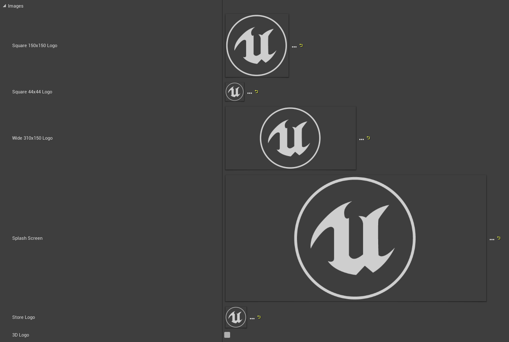
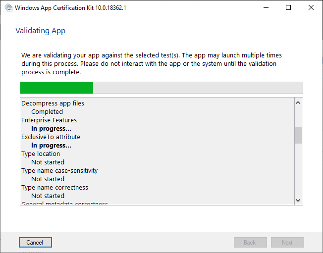
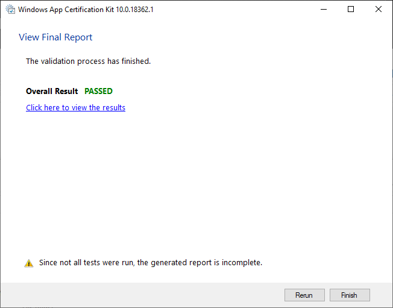
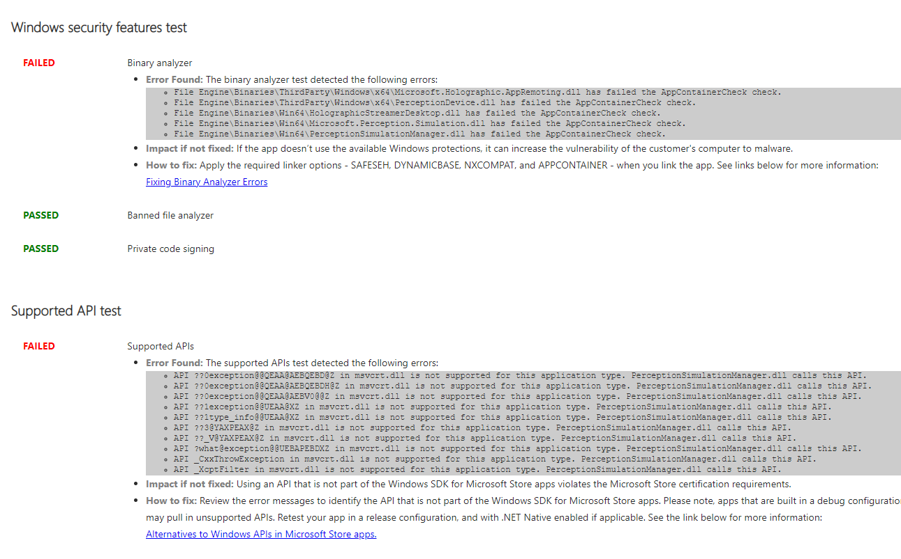

# Publishing to the Microsoft Store

When you're ready to get your Unreal app out to the world, there are a few project settings that need updating before you submit to the Microsoft Store. All of these settings have default values, but should be changed for production to best represent the application.

## Project settings for the store packaging

1. First, select **Project Settings > Description** and update the game and publisher information: 
    * The **Game Name** will appear in the app tile on the HoloLens
    * The **Company Distinguished Name** is used when generating the project certificate and should be in the format: 
        * **CN=CommonName, O=OrganizationName, L=LocalityName, S=StateOrProvinceName, C=CountryName**:


2. Expand the **HoloLens** section of the project settings and update the packaging resources.  These resource names will be shown on the application’s store page:


3. Expand the **Images** section and update the default store images with textures that represent the store app.  Optionally, select the **3D Logo** checkbox to upload a glb file to use as a 3D live cube when launching the application:



4. Lastly, select **Generate New** to generate a signing certificate from the project name and company distinguished name  
    * Set a **Tile Background Color**, which will appear in place of any transparent pixels in the store images.
    * Expand the dropdown and enable **Use Retail Windows Store Environment** to run on retail-locked, not dev-unlocked, devices.


## Optional App Installer

An App Installer file can be created from **Project Settings > HoloLens**, which can be used to distribute the application outside of the store.  Enable the **Should Create App Installer** checkbox and set a URL or network path where you'd like the game’s appxbundle to be stored.  


When the app is being packaged, both the appxbundle and appinstaller will be generated.  Upload the appxbundle to the installation URL, then launch the appinstaller to install the app from the network location.

## Windows App Certification Kit

The Windows 10 SDK ships with the Windows App Certification Kit (WACK) to validate common issues that could affect uploading a package to the store.  You can find the WACK in the Windows Kits directory, usually under the following path: 

```
C:\Program Files (x86)\Windows Kits\10\App Certification Kit.
```

1. After your appx file is packaged for publication, run **appcertui.exe** and follow the prompts to scan the appx:


2. Select **Validate Store App**:


3. Browse for the appx in the top section and select **Next**:


4. Select **Next** to run the tests and create a report:
    * All available tests that can be run on the host PC will be enabled by default



5. Wait for the tests to finish. Once complete, the final window will show a pass or fail result, which can be viewed in the saved report.



## Known WACK failure with 4.25

The Windows Mixed Reality plugin in Unreal 4.25 will fail WACK because some x64 binaries are included while packaging for HoloLens. The failure will look like this:



To fix the issue:
1. Browse to the Unreal installation or source directory root by opening an Unreal project and right-click on the Unreal icon in the taskbar.
2. Right-click on UE4Editor, select properties, and browse to the path in the **Location** entry:

```
Open Engine\Plugins\Runtime\WindowsMixedReality\Source\WindowsMixedRealityHMD\WindowsMixedRealityHMD.Build.cs.
```

3. In **WindowsMixedRealityHMD.Build.cs**, modify **line 32** from:

```cpp
if(Target.Platform != UnrealTargetPlatform.Win32)
```

to:

```cpp
if(Target.Platform == UnrealTargetPlatform.Win64)

```

4. Close Unreal, reopen the project, and repackage for HoloLens.  Rerun WACK and the error will be gone. 

## See also
* [Submitting an app to the Microsoft Store](../../distribute/submitting-an-app-to-the-microsoft-store.md)
* [Windows App Certification Kit](https://developer.microsoft.com/windows/downloads/app-certification-kit)
* [Create an App Installer file manually](https://docs.microsoft.com/windows/msix/app-installer/how-to-create-appinstaller-file)