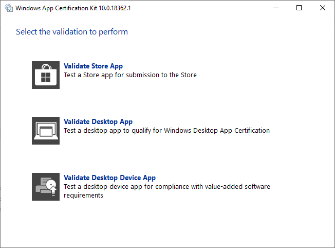
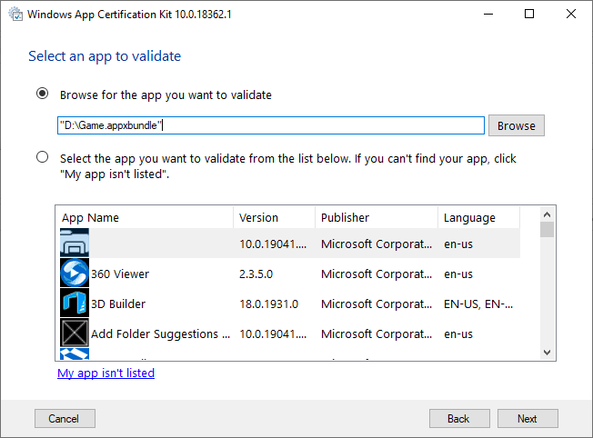
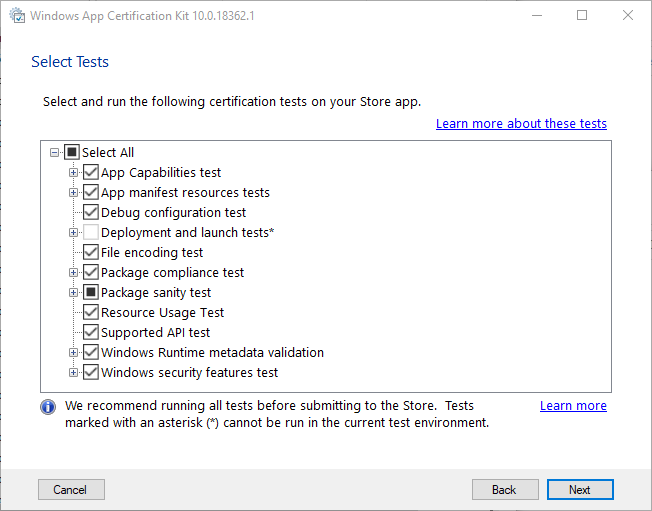

# Publishing to the Microsoft Store

When ready to distribute your application to the world, there are a few Unreal project settings that need to be updated to prepare for submitting to the store.  These settings all have default values, but should be changed to best represent the application.

## Project settings for the store packaging

In Project Settings / Description, update the game and publisher information.  The Game Name here will appear in the app tile on the HoloLens, the Company Distinguished Name is used when generating the project certificate.  The distinguished name should be in the format “CN=CommonName, O=OrganizationName, L=LocalityName, S=StateOrProvinceName, C=CountryName”:


In Project Settings / HoloLens, update the packaging resources.  These resource names will be shown on the application’s store page:


Update the default store images with textures that represent the store app.  Optionally click the “3D Logo” checkbox to upload a glb file to use as a 3D live cube when launching the application:


Generate a signing certificate from the project name and company distinguished name.  

Set a background color, which will appear in place of any transparent pixels in the store images.

Expand the dropdown and enable the “Use Retail Windows Store Environment” checkbox.  This checkbox is needed to run on retail-locked (not dev-unlocked) devices.


## Optional App Installer

In Project Settings / HoloLens, an app installer file can be created, which can be used to distribute the application outside of the store.  If this is needed, enable the “Should Create App Installer” checkbox and set a URL or network path that the game’s appxbundle will be stored.  When packaging, the appxbundle and appinstaller will both be generated.  Upload the appxbundle to the installation URL, then launching the appinstaller will install the app from the network location.


## Windows App Certification Kit

The Windows 10 SDK ships with the Windows App Certification Kit (WACK) to validate common issues that could affect uploading a package to the store.  This can be found in the Windows Kits directory, usually C:\Program Files (x86)\Windows Kits\10\App Certification Kit.

After packaging the appx that will be deployed to the store, run appcertui.exe and follow the prompts to scan the appx.



Select “Validate Store App”:



Browse for the appx in the top section and click “Next”:



By default, all the test that can be run on the host PC will be enabled.  Click “Next” to run the tests and create a report:


Wait for the tests to finish:


Once complete, the final window will show a pass or fail result.  Fail results can be viewed in the saved report.

## Known WACK failure with 4.25

The Windows Mixed Reality plugin in Unreal 4.25 will fail WACK because some x64 binaries are included while packaging for HoloLens. The failure will look like this:


To fix this, browse to the Unreal installation or source directory root.  If you don’t know where this is, open an Unreal project, right click on the Unreal icon in the taskbar, right click on UE4Editor, select properties, and browse to the path in the “Location” entry:

```
Open Engine\Plugins\Runtime\WindowsMixedReality\Source\WindowsMixedRealityHMD\WindowsMixedRealityHMD.Build.cs.
```

In WindowsMixedRealityHMD.Build.cs, modify line 32 from:

```cpp
if(Target.Platform != UnrealTargetPlatform.Win32)
```

to:

```cpp
if(Target.Platform == UnrealTargetPlatform.Win64)

```

Close Unreal, reopen the project and repackage for HoloLens.  Rerun WACK and this error will be gone. 

## See also
* [Submitting an app to the Microsoft Store](../../distribute/submitting-an-app-to-the-microsoft-store.md)
* [Windows App Certification Kit](https://developer.microsoft.com/windows/downloads/app-certification-kit)
* [Create an App Installer file manually](https://docs.microsoft.com/windows/msix/app-installer/how-to-create-appinstaller-file)