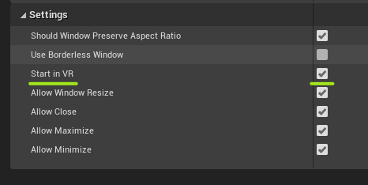
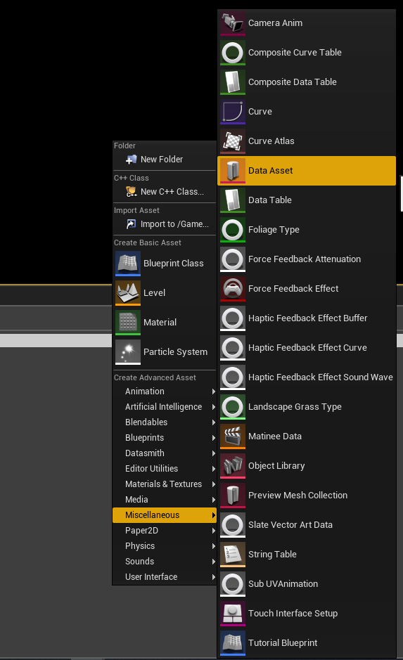
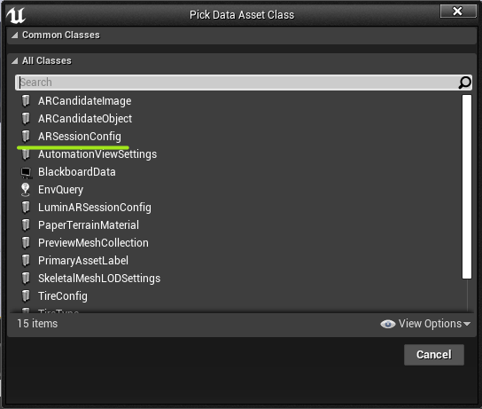
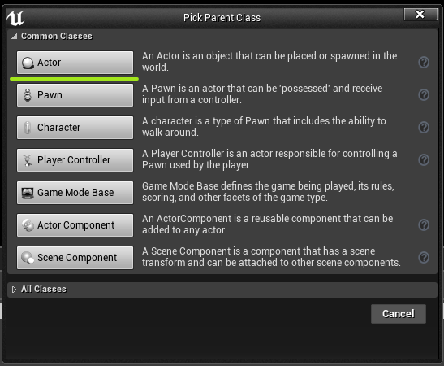
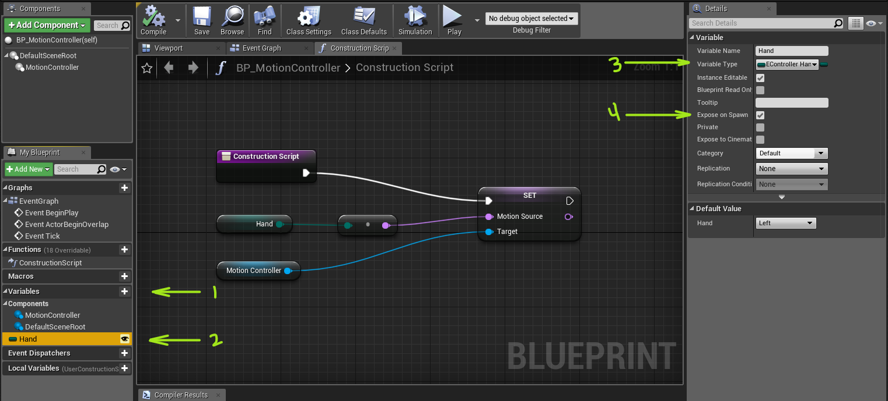
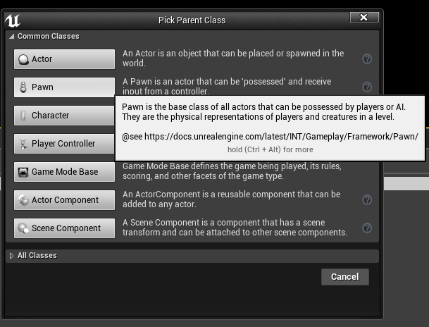
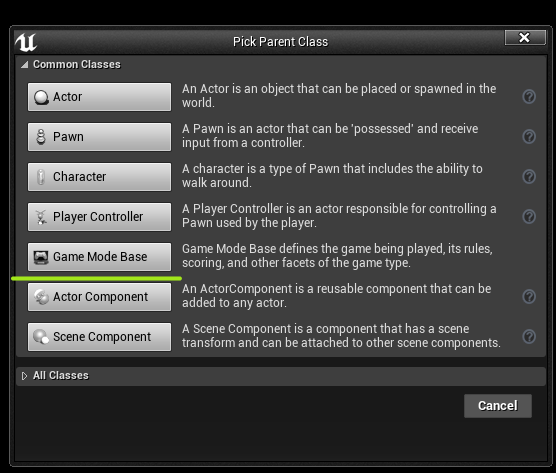

# Setting up a Mixed Reality scene in Unreal

## Setting up AR Config

First thing, make sure the correct plugins are enabled. Under **Edit > Plugins**, enable the HoloLens and Windows Mixed Reality plugins:

Next, under **Edit > Project Settings**, click on "Description" in the left menu window and check the "Start in VR" box:

> [!IMPORTANT]
> Skipping this step results in a blank app slate.

## Creating the main level

In the Content Browser, right-click and create a Level:

* This will be the default level for the project

Double-click on the newly created level in the Content Browser to load it.

In the Content Browser, right-click to create a Data Asset and name it **ARSessionConfig**:

Double-Click to edit and check the Generate Mesh Data and Generate Collision for Mesh Data boxes:

* This generates collision for the SR mesh. May or may not be needed depending on the project.

Next, a "Start AR Session" node needs to be created and pointed to the Data Asset created earlier ("ARSessionConfig"). This can be put in the Level Blueprint (open from the Blueprints dropdown located above the scene view):

or a Blueprint Class that will be loaded in the level (potentially in the player pawn which will be created shortly. For this step, it's suggested to put it in the Level Blueprint for convenience):

*Nodes are easily created by R-Clicking in the graph and searching by name.

Once created, click on the the text window under Session Config and search for the data node created in the previous step.

## Setting up motion controllers

In the Content Browser, R-Click to create a Blueprint Class type Actor and name it something like BP_MotionController: 

then Double-Click to edit and create a new variable of type "EController Hand" (follow green arrows here):

and add a MotionController component (from the "+ Add Component dropdown) and construction setup:

The "Motion Source" variable is available by R-Clicking in the grid to bring up the Actions menu and searching for Set Motion Source. This may require the "Context Sensitive" box to be un-checked:

*Construction Scripts come default with the Blueprint, but differ from the Event Graph in that they only run 'On Begin Play' essentially. This is mainly for asset setup, not for running during the game.

*The blue "Motion Controller" and green "Hand" nodes are created by drag & dropping them from their respective columns on the left. The "Hand" enum will give an option to 'Get' or 'Set', choose 'Get'.

## Adding a player pawn

Create Blueprint Class type Pawn:

Double-click to edit and add a Scene Component (rename it "Origin"), and a Camera Component parented to it:

In its Event Graph, set up to the SpawnActor BP_MotionController nodes and AttachtoComponent to the Origin node:

Start by creating a "Spawn Actor from Class" node. In its Class param, search and select the MotionController Blueprint created in the previous steps. Pull from the Return Value pin and search/create an "Attach to Component" node (should be the first in the list if there are more than one after searching). Duplicate those nodes and set up as shown here:

*The "Self" node can be created by R-Click hold and drag from the "Owner" parameter and searching for "Self" in the menu pop-up. There will be an option to choose the "Self" variable.

*The "Owner" input of the SpawnActor node is available when the drop-down arrow on the bottom of the node is clicked.

*The "Origin" getter can be created by click/dragging the Origin scene component into the graph from the component list.

Setting one to Left and one to Right:

## Using Game Mode

Create another Blueprint Class, this time of type Game Mode Base:

Double-Click and point the Default Pawn Class parameter to the player pawn created above (in this case it was named "MRPawn"):

Open the Project Settings (under Edit>Project Settings) and point the Default GameMode to the one just created, and set the StartUp and Default Maps to the main level created earlier.

*This is important when building the app, but also sets the level to startup when the project is opened, versus the default UE4 temp level.

## Accessing hand joints

Create a Blueprint Class type Actor to get set up with hand positions and drop two "Hand Joint Transform" nodes in:

*This is where the hand data can drive whatever the prototype or game needs. In this case, it is being used to have two spheres (named LeftIndex and RightIndex and added as components in the Blueprint) follow their respective index tips.

