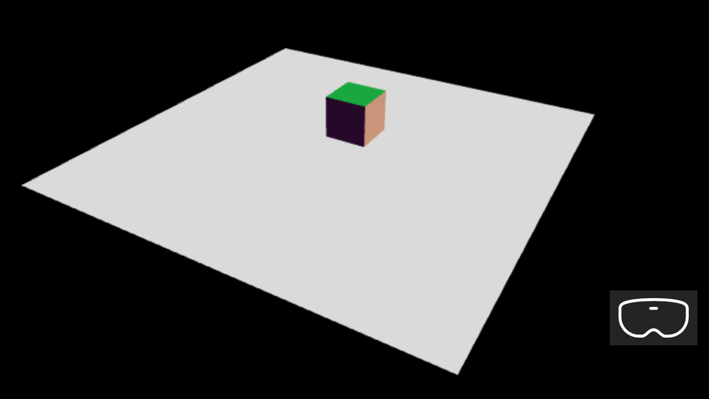

# Tutorial: Interact with 3D object

Learn how to add some interaction, such as painting the faces of a cube with different color upon clicking on the cube.

In this tutorial, learn how to:

> [!div class="checklist"]
> * How to add interactions
> * Enable WebXR immersive mode
> * Run the app on HoloLens2 emulator

## Add interaction

1. Let's update our code, so that the cube faces are painted with distinct colors. Update the code as follows:

    ```javascript
    const createScene = function() {
        //code skipped for simplicity
        ...

        const faceColors = new Array(6);
        for (let i = 0; i < 6; i++) {
            var red = Math.floor(Math.random() * 256)/255;
            var green = Math.floor(Math.random() * 256)/255;
            var blue = Math.floor(Math.random() * 256)/255;
            faceColors[i] = new BABYLON.Color4(red, blue, green, 1);
            }
            
        const options = {
            faceColors: faceColors,
            wrap: true
        };
        const box = BABYLON.MeshBuilder.CreateBox("box", options);
        
        //code skipped for simplicity
        ...
    }
    ```

1. Now you will see the cube faces painted with different colors. Let's add a simple interaction, so that the face color is changing upon clicking the cube and the cube changes its position. Replace the creation of a cube with the following code:

    ```javascript
    const createScene = function() {
        //code skipped for simplicity
        ...

        //upon clicking on the box, it will change the color and move upright
        box.actionManager = new BABYLON.ActionManager(scene);
        box.actionManager.registerAction(new BABYLON.ExecuteCodeAction(BABYLON.ActionManager.OnPickTrigger, function (evt) {
            var sourceBox = evt.meshUnderPointer;
            
            //generate random colors
            var red = Math.floor(Math.random() * 256)/255;
            var green = Math.floor(Math.random() * 256)/255;
            var blue = Math.floor(Math.random() * 256)/255;

            //apply new material
            var boxMaterial = new BABYLON.StandardMaterial("material", scene);
            boxMaterial.emissiveColor = new BABYLON.Color3(red, green, blue);
            sourceBox.material = boxMaterial;

            //move the box upright
            sourceBox.position.x += 0.1;
            sourceBox.position.y += 0.1;
        }));

        //code skipped for simplicity
        ...
    }
    ```

## Enable WebXR immersive experience

1. We are ready to try the immersive experience. Let's update the stylesheet so that a canvas occupies the entire web page. Add the style tag into the page header as follows:

    ```html
    <head>
        <script src="https://preview.babylonjs.com/babylon.js"></script>    
        <style>
            body,#renderCanvas { width: 100%; height: 100%;}
        </style>
    </head>
    ```

1. In this step we are going to introduce the ground, so the cube will be hanging in the air and we will see a floor at the bottom. Add the ground as follows:

    ```javascript
    const createScene = function() {
        //code skipped for simplicity
        ...

        var ground = BABYLON.MeshBuilder.CreateGround("ground", {width: 10, height: 10}, scene);

        //code skipped for simplicity
        ...
    }
    ```

1. In order to add the WebXR support, we need to call the method *createDefaultXRExperienceAsync* of a scene. The result is Promise. For simplicity, we keep using the Promise. Though for real-world application you would convert this code to use async/await pattern. Here is the updated version:

    ```javascript
     const createScene = function() {
        //code skipped for simplicity
        ...

        var ground = BABYLON.MeshBuilder.CreateGround("ground", {width: 10, height: 10}, scene);

        var xrPromise = scene.createDefaultXRExperienceAsync({
            floorMeshes: [ground]
        });
        xrPromise.then((xrExperience) => {
            console.log("Done, WebXR is enabled.");
        });

        //code skipped for simplicity
        ...
    }
    ```

1. The above code generates the following output:


## Run on HoloLens2 emulator

TBD

TBD: research how??

## Takeaways

TBD

Next steps
You have completed this series of BabylonJS tutorials. You learned how to:
> [!div class="checklist"]
> * Set up a development environment
> * Create a new web page to display results
> * The API to create and interact with basic 3D elements
> * Deploy and test the application in a HoloLens2 emulator

For more information on Mixed Reality javascript development see [JavaScript development overview](/javascript-development-overview.md).