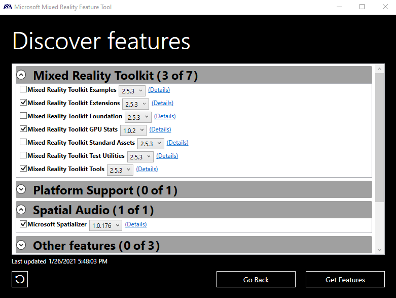
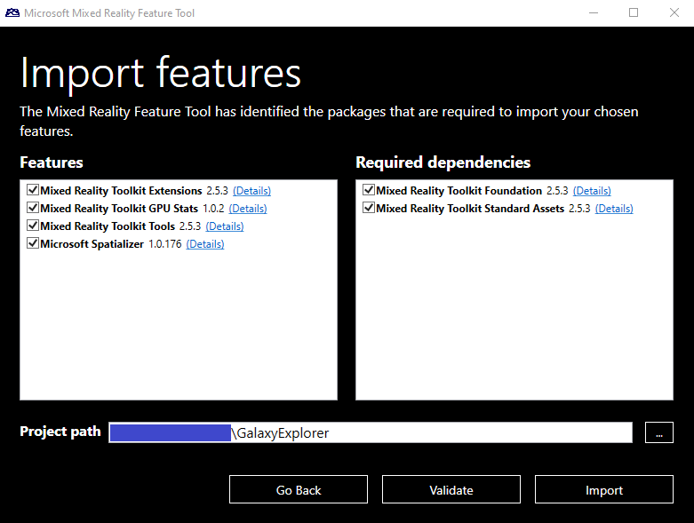
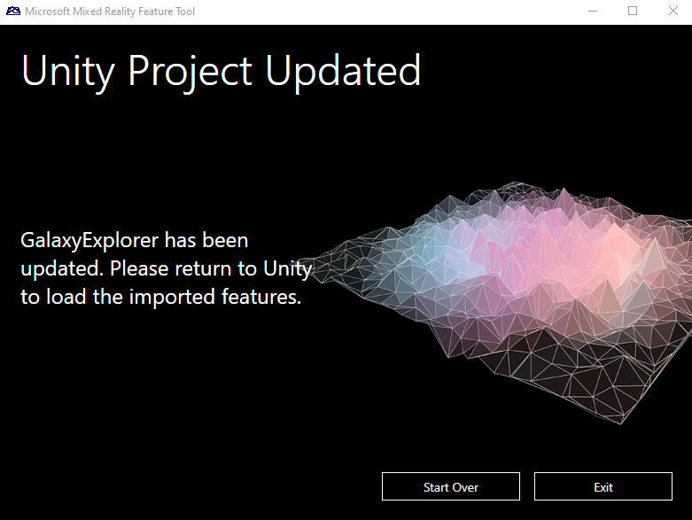

# Welcome to the Mixed Reality Feature Tool

The Mixed Reality Feature Tool is a new tool that enables easy discovery and acquisition of Mixed Reality features for your Unity projects.

## System requirements

The Mixed Reality Feature Tool requires the [.net 5.0 runtime](https://dotnet.microsoft.com/download/dotnet/5.0) and currently runs on Windows 10 (macOS coming soon).

## Getting the Mixed Reality Feature Tool

The latest Mixed Reality Feature Tool release can be downloaded from GitHub at https://aka.ms/MRFeatureTool, using the Releases link. Once downloaded, unzip the file to a well known location. It is recommended to create a shortcut to the executable file.

## Required software

- [.NET 5 runtime](https://dotnet.microsoft.com/download/dotnet/5.0)

## 1. Getting started

When the Mixed Reality Feature Tool first launches, the start page will be displayed.

Here, the application's settings can be customized, help can be viewed and feature discovery is started.

### Settings

The  button allows for configuring the behavior of the Mixed Reality Feature Tool

For more information, please see [configuring the Mixed Reality Feature Tool](configuring-feature-tool.md).

### Help

The  button launches the default web browser and displays the documentation for the Mixed Reality Feature Tool.

### Start

Clicking the `Start` button begins feature discovery.

## 2. Discovering and acquiring feature packages

Once discovery has begun, the feature package catalog is retrieved. For ease of finding the desired functionality, features are grouped by category, for example "Mixed Reality Toolkit".

Once the desired features are selected, clicking the `Get features` button acquires all required packages from the catalog and are ready to import into the project.

For more information, please see [discovering and acquiring features](discovering-features.md).

## 3. Importing feature packages

Following acquisition, the complete set of packages is presented; those directly selected and any required dependencies. This is where final selection of features to be imported is made.

It is highly recommended to use the `Validate` button to ensure that the Unity project is able to successfully import and utilize the selected features. Explicitly validation will describe any identified issues.

Prior to importing, the location of the Unity project needs to be specified. Please use the elipsis  button to browse to the folder.

When navigating the file system, please open the folder containing the Unity project.

> [!NOTE]
> The dialog that is displayed when browsing for the Unity project folder contains '_' as the file name. There must be a value for the file name to enable the folder to be selected.

Click the `Import` button to continue.

> [!NOTE]
> After clicking the `Import` button, if any issues remain a simple message will be displayed. The recommendation is to click No and to use the `Validate` button to view and resolve the issues.

For more information, please see [importing features](importing-features.md).

## 4. Reviewing and approving project changes

The final step before the project is modified is to review and approve the proposed changes.

The proposed changes to the manifest are displayed on the left and the files to be added to the project are listed to the right.

The Compare button allows for side-by-side viewing of the current manifest and the proposed changes.

For more information, please see [reviewing and approving project modifications](reviewing-changes.md).

## 5. Project updated

When the proposed changes are approved, the Unity project is updated to reference the selected Mixed Reality features.

The Unity project's `Packages` folder now contains a `MixedReality` subfolder containing the feature package file(s) and the manifest will contain the appropriate reference(s).

Returning to Unity will load the new selected features into the specified project.

## See also

- [Configuring the feature tool](configuring-feature-tool.md)
- [Discovery and acquisition](discovering-features.md)
- [Viewing feature package details](viewing-package-details.md)
- [Importing selected packages](importing-features.md)
- [Reviewing and approving project modifications](reviewing-changes.md)
