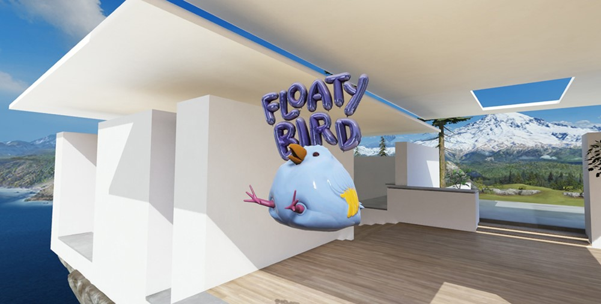

# Distributing your apps

Getting your apps into the hands of your users or out into the world is the most important, and sometimes painstaking, part of any development effort. We've simplified process into a set of resources listed below, all of which depend on the distribution and deployment scenario that's best suited for you or your team.

## Distribution options

> [!IMPORTANT]
> * There are no restrictions for installing on a local device.
> 
> * If you're sharing your app with another party, you need to build and supply the appx file. No extra permissions are required.
> 
> * If you're sharing with an organization, you need a work or school account and access to the organizations [MDM (Mobile Device Management)](https://docs.microsoft.com/hololens/hololens-enroll-mdm) infrastructure. 

> [!NOTE]
> If you're app target is a Windows Mixed Reality headset, you can either build straight from Unity or Unreal and choose one of the options below, or create a .exe file and distribute however you like. 

<table>
<colgroup>
    <col width="33%" />
    <col width="22%" />
    <col width="22%" />
    <col width="22%" />
</colgroup>
<tr>
    <td><strong>Scenario</strong></td>
    <td><strong>Local device install</strong></td>
    <td><strong>Share with anyone</strong></td>
    <td><strong>Share with an organization</strong></td>
</tr>
<!-- <tr>
    <td><a href="https://docs.microsoft.com/hololens/app-deploy-app-installer"><strong>App Installer</strong></a></td>
    <td>✔️</td>
    <td>✔️</td>
    <td>❌</td>
</tr> -->
<!-- <tr>
    <td><a href="https://docs.microsoft.com/hololens/app-deploy-app-installer"><strong>Company Portal</strong></a></td>
    <td>❌</td>
    <td>❌</td>
    <td>✔️</td>
</tr> -->
<tr>
    <td><a href="https://docs.microsoft.com/hololens/holographic-custom-apps#installing-an-application-package-with-the-device-portal"><strong>Device Portal</strong></a></td>
    <td>✔️</td>
    <td>✔️</td>
    <td>❌</td>
</tr>
<tr>
    <td><a href="https://docs.microsoft.com/hololens/app-deploy-intune"><strong>MDM - Required App Install</strong></a></td>
    <td>❌</td>
    <td>❌</td>
    <td>✔️</td>
</tr>
<tr>
    <td><a href="submitting-an-app-to-the-microsoft-store.md"><strong>Microsoft Store</strong></a></td>
    <td>❌</td>
    <td>✔️</td>
    <td>✔️</td>
</tr>
<tr>
    <td><a href="https://docs.microsoft.com/hololens/app-deploy-store-business"><strong>Microsoft Store for Business</strong></a></td>
    <td>❌</td>
    <td>❌</td>
    <td>✔️</td>
</tr>
<tr>
    <td><a href="https://docs.microsoft.com/hololens/app-deploy-provisioning-package"><strong>Provisioning Package</strong></a></td>
    <td>✔️</td>
    <td>✔️</td>
    <td>✔️</td>
</tr>
<tr>
    <td><a href="https://docs.microsoft.com/hololens/holographic-custom-apps#deploying-from-microsoft-visual-studio-2015"><strong>Visual Studio</strong></a></td>
    <td>✔️</td>
    <td>❌</td>
    <td>❌</td>
</tr>
</table>

If you need to lock down your HoloLens 2 application for distribution or deployment in secure environments, refer to the [offline secure HoloLens 2](https://docs.microsoft.com/hololens/hololens-common-scenarios-offline-secure) instructions, which include the following restrictions:

* Disable WiFi.
* Disable BlueTooth.
* Disable Microphones.
* Prevents adding or removing provisioning packages.
* No user can enable any of the above restricted components.

## Designing 3D app launchers for VR 

3D app launchers appear as objects in the Windows Mixed Reality home environment that appears whenever a user puts on an immersive headset. These objects are yours to create and customize however you like, but it's recommended that you start with our [design guidance](../3d-app-launcher-design-guidance.md) article to get the hang of good design practices, including scaling, type, color choice, texturing, and above all making it stand out in a virtual environment.

### Modeling and exporting 3D app launchers

Once you're set on the idea for your 3D app launcher, you need to make sure it meets the Microsoft Store requirements, including asset file format, triangle count, texture sizes, animation length, and asset optimization. This process can be highly technical, so we recommend using our [3D model creation](../creating-3d-models-for-use-in-the-windows-mixed-reality-home.md) article to check all the boxes. Assets that don't to meet this authoring specification won't be rendered in the Windows Mixed Reality home.

### Adding 3D app launchers in your apps

After you've ensured that your 3D app launcher meets the Windows Mixed Reality authoring guidelines, it can be used to override the default 2D launcher for your application in the Windows Mixed Reality home environment. The process for integrating a 3D app launcher into your application depends on the type of application you're developing:

* [UWP apps](../implementing-3d-app-launchers.md)
* [Win32 apps](../implementing-3d-app-launchers-win32.md)

### [Optional] Placing 3D models in the Windows Mixed Reality home

As an added bonus, some 2D applications let you place 3D models directly into the Windows Mixed Reality home as decorations or for further inspection in full 3D. The add model protocol lets you to send a 3D model from your website or application to the Windows Mixed Reality home, where it'll persist like 3D app launchers, 2D apps, and holograms. Check out [how to place 3D models in the Windows Mixed Reality home](../enable-placement-of-3d-models-in-the-home.md) to find more details and instructions on how to liven up your own apps.

## Integrating In-app purchases

If you're looking to monetize your Mixed Reality experiences, check out our [In-app purchases](in-app-purchases.md) article.

## See also
* [Finding, installing, and uninstalling applications from the Microsoft Store](https://docs.microsoft.com/hololens/holographic-store-apps)

<!-- ## Submitting to the Microsoft Store

You've finally made it to the last step on your distribution journey, actually getting your app into the Microsoft Store! Our [submission guidelines](submitting-an-app-to-the-microsoft-store.md) article will take you through: 

* Partner Center registration 
* Asset preparation
* App packaging
* Testing
* Final submission process

You can even give out free trials to get future consumers excited about your new immersive experience. Once your app is listed on the Microsoft Store you can sit back, engage with your expanding user community, and think about all the new features you want to add! -->