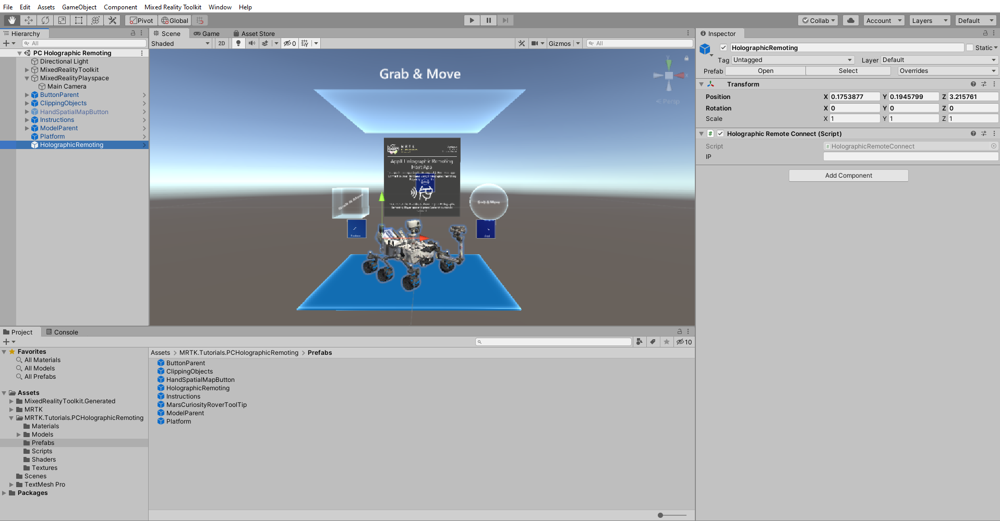

# 2. Creating a PC app for Holographic Remoting application

In this tutorial, you will learn how to create a PC app for holographic remoting and connect to HoloLens 2 at any point, providing a way to visualize 3D content in mixed reality.

## Objectives

* Configure Unity for Holographic Remoting
* Learn how to build and deploy the application with Visual Studio
* To develop an app using the Holographic Remoting application and connecting to HoloLens

## Configuring your scene for Holographic Remoting

In this section, you will configure your project to stream your Mixed Reality experience to your HoloLens 2 device from your PC in real-time over a Wi-Fi connection.

In the Project window, navigate to the **Assets** > **MRTK.Tutorials.AppXHolograhicRemoting**> **Prefabs** folder, and click-and-drag **HolographicRemoting** prefab into your scene.

With the HolographicRemoting object still selected in the Hierarchy window, locate the **Holographic Remote Connect (Script)** component. The script uses HolographicRemoting API to connect, disconnect, and check the connection status.

Now your Holographic Remoting app is ready, follow these instructions to [build it to your PC][Import the Mixed Reality Toolkit instructions](https://docs.microsoft.com/windows/mixed-reality/mrlearning-base-ch1#build-your-application-to-your-device).

![Note]: Apart from the **Player Settings** mentioned in the instructions, make the following changes that are specific for the Holographic Remoting application.

### 1. Check the Windows Mixed Reality **WSA Holographic Remoting Supported** checkbox

### 2. Deploying Visual Studio for PC with the below settings

* Select the  **Release** configuration instead of debugging
* Select **X64** 
* Select **Local Machine** as the target instead of Device

## How to test the Holographic Remoting remote application

To connect your Holographic Remoting PC application to your HoloLens 2, follow the below procedure:

### 1. Install the Remoting Player application on HoloLens 2 device

* On your HoloLens, visit the Store app and search for "**Remoting Player**".
* Select the **Remoting Player** app.
* Tap **Install** to download and install the app.

### 2. Connect the Holographic remoting PC app to the Remoting Player

* Start the **Remoting Player** on your HoloLens.
* Take note of the HoloLens **IP address**, it will be displayed as a hologram by the **Remoting Player** as soon as it launches.
* Open the Holographic Remoting PC application on your PC.
* Once the application is launched, enter the **IP address** and click on the **Connect** button to connect.

## Congratulations

In this tutorial, you learned how to create a Holographic Remoting remote app and connect to HoloLens 2 at any point, providing a way to visualize 3D content in Mixed Reality. Once the HoloLens connected to the Holographic Remoting PC application, you should see the Mixed Reality experience that has been streaming into your HoloLens 2 device.
