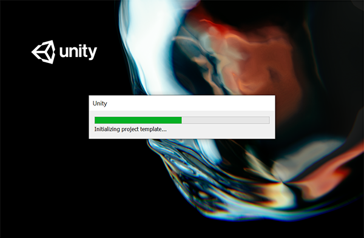
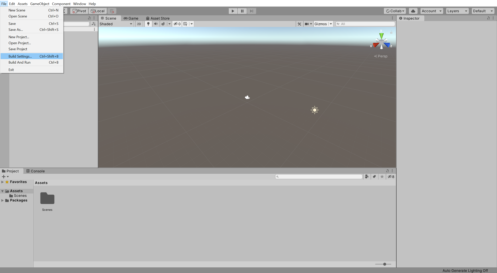
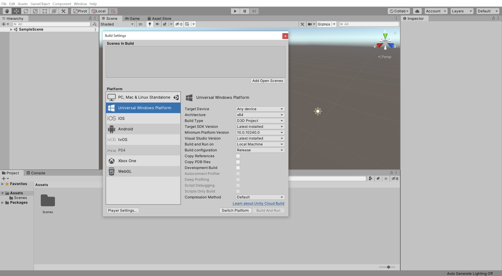
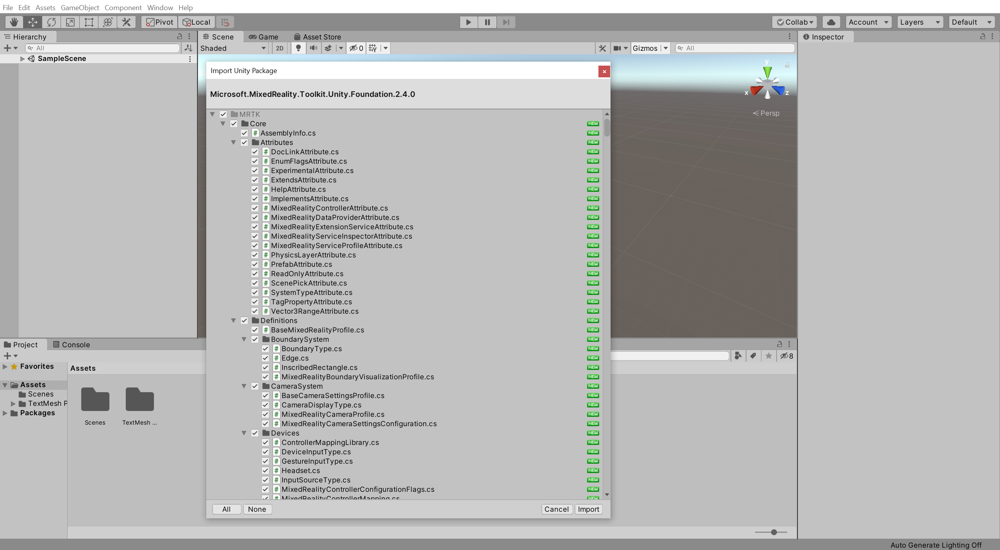
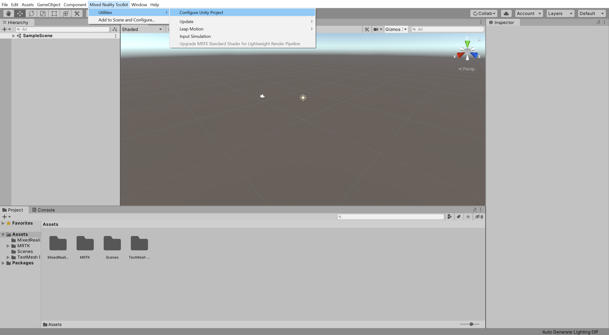
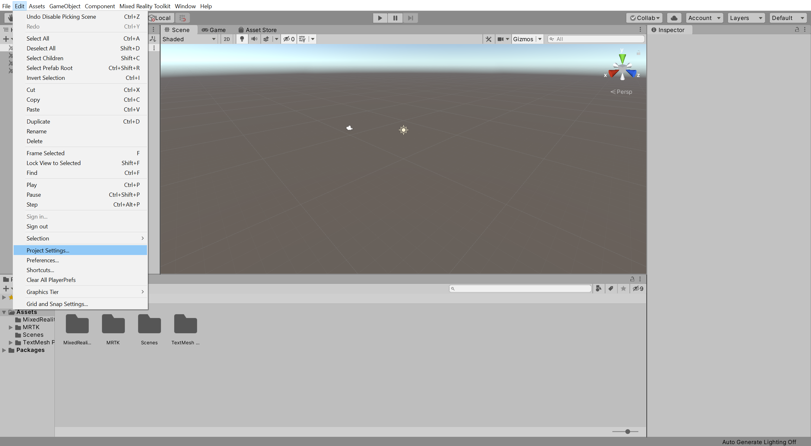
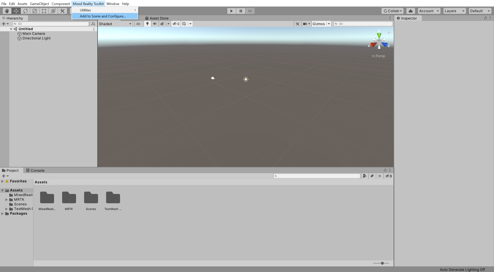
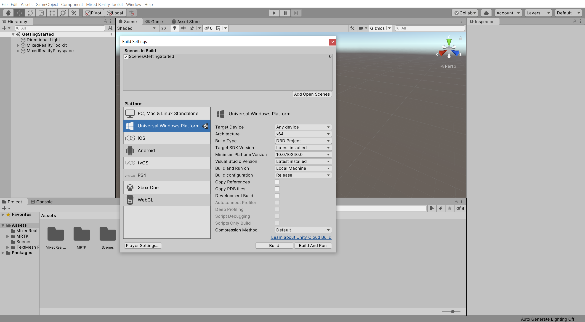
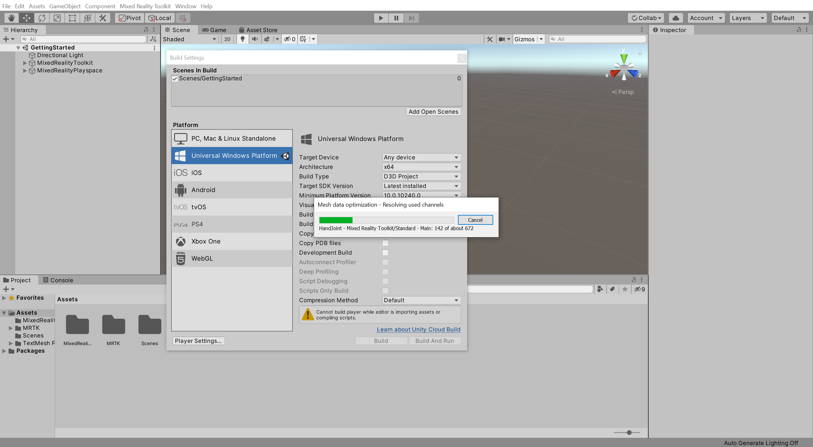

# 2. Initializing your project and first application

## Overview

In this tutorial, you will learn how to create and configure your Unity project and scene for <a href="https://github.com/microsoft/MixedRealityToolkit-Unity" target="_blank">Mixed Reality Toolkit (MRTK)</a> development.

## Objectives

* Configure Unity for HoloLens development
* Import assets and set up the scene
* Visualization of the spatial mapping mesh, hand meshes, and the framerate counter

## Creating the Unity project

Launch **Unity Hub**, select the **Projects** tab, and click the **down arrow** next to the **New** button:

In the dropdown, select the Unity **version** specified in the [Prerequisites](mr-learning-base-01.md#prerequisites):

In the Create a new project window:

* Ensure **Templates** is set to **3D**
* Enter a suitable **Project Name**, for example, _MRTK Tutorials_
* Choose a suitable **Location** to store your project, for example, _D:\MixedRealityLearning_
* Click the **Create** button to create and launch your new Unity project

> [!CAUTION]
> When working on Windows, there is a MAX_PATH limit of 255 characters. Unity is affected by these limits and may fail to compile if any file path is longer than 255 characters. Consequently, it is strongly recommended to store your Unity project as close to the root of the drive as possible.

Wait for Unity to create the project:

## Switching the build platform

In the Unity menu, select **File** > **Build Settings...** to open the Build Settings window:

In the Build Settings window, select **Universal Windows Platform** and click the **Switch Platform** button:

Wait for Unity to finish switching the platform:

When Unity has finished switching the platform, click the red **x** icon to close the Build Settings window:

## Importing the TextMeshPro Essential Resources

In the Unity menu, select **Window** > **TextMeshPro** > **Import TMP Essential Resources**:

In the Import Unity Package window, click the **All** button to ensure all the assets are selected, then click the **Import** button to import the assets:

> [!TIP]
> The TextMeshPro Essential Resources are required by MRTK's UI elements. You can skip this step if you are not planning to use MRTK's UI elements in your project.

## Importing the Mixed Reality Toolkit

Download the Unity custom package:

* [Microsoft.MixedReality.Toolkit.Unity.Foundation.2.4.0.unitypackage](https://github.com/microsoft/MixedRealityToolkit-Unity/releases/download/v2.4.0/Microsoft.MixedReality.Toolkit.Unity.Foundation.2.4.0.unitypackage)

In the Unity menu, select **Assets** > **Import Package** > **Custom Package...** to open the Import package... window:

In the Import package... window, select the **Microsoft.MixedReality.Toolkit.Unity.Foundation.2.4.0.unitypackage** you downloaded and click the **Open** button:

In the Import Unity Package window, click the **All** button to ensure all the assets are selected, then click the **Import** button to import the assets:

## Configuring the Unity project

### 1. Apply the MRTK Project Configurator settings

After Unity has finished importing the package from the previous section, the MRTK Project Configurator window should appear. If it does not, open it by going to the Unity menu and selecting **Mixed Reality Toolkit** > **Utilities** > **Configure Unity Project**:

In the MRTK Project Configurator window, expand the **Modify Configurations** section, ensure all options are checked, and click the **Apply** button to apply the settings:

### 2. Configure additional project settings

In the Unity menu, select **Edit** > **Project Settings...** to open the Project Settings window:

In the Project Settings window, select **Player** > **XR Settings**, then click the **+** icon and select Windows Mixed Reality to add the Windows Mixed Reality SDK:

After Unity has finished importing the SDK from the previous step, the MRTK Project Configurator window should appear again. If it does not, use the Unity menu to open it.

In the MRTK Project Configurator window, click the **Audio spatializer** dropdown, select **MS HRTF Spatializer**, then click the **Apply** button to apply the setting:

In the Project Settings window, select **Player** > **XR Settings**, then click the **Depth Format** icon and select Windows Mixed Reality to add the Windows Mixed Reality SDK:

In the Project Settings window, select **Player** > **Publishing Settings**, then in the **Package name** field, enter a suitable name, for example, _MRTKTutorials-GettingStarted_:

Close the Project Settings window.

> [!NOTE]
> The 'Package name' is the unique identifier for the application. Consequently, it is recommended to change this identifier before deploying the application to avoid accidentally overwriting previously installed applications.

> [!TIP]
> The 'Product Name' is the name that will displayed in the HoloLens Start menu. To make the application easier to locate during development, you may add an underscore in front of the name so the application is displayed at the top of the HoloLens Start menu.

## Creating and configuring the scene

In the Unity menu, select **File** > **New Scene** to create a new scene:

In the Unity menu, select **Mixed Reality Toolkit** > **Add to Scene and Configure...** to add the Mixed Reality Toolkit to your current scene:

With the **MixedRealityToolkit** object selected in the Hierarchy window, in the Inspector window, verify that the **MixedRealityToolkit** configuration profile is set to **DefaultMixedRealityToolkitConfigurationProfile**:

> [!IMPORTANT]
> Typically, you will use the DefaultHoloLens2ConfigurationProfile when developing for HoloLens 2. However, for the purpose of this tutorial, you will use the DefaultMixedRealityToolkitConfigurationProfile, then in the next tutorial, [Configuring the Mixed Reality Toolkit profiles](mr-learning-base-03.md), you will change to the DefaultHoloLens2ConfigurationProfile.

In the Unity menu, select **File** > **Save As...** to open the Save Scene window:

In the Save Scene window, navigate to your project's **Scenes** folder, give your scene a suitable name, for example, _GettingStarted_, and click the **Save** button to save the scene:

## Building your application to your HoloLens 2

In this section, you will learn how to build and deploy to a Hololens 2.

### 1. Build the Unity project

In the Unity menu, select **File** > **Build Settings...** to open the Build Settings window.

In the Build Settings window, click the **Add Open Scenes** button to add your current scene to the **Scenes In Build** list, then click the **Build** button to open the Build Universal Windows Platform window:

In the Build Universal Windows Platform window, choose a suitable location to store your build, for example, _D:\MixedRealityLearning\Builds_, create a new folder and give it a suitable name, for example, _GettingStarted_, and then click the **Select Folder** button to start the build process:

Wait for Unity to finish the build process:

### 2. Build and deploy the application

When the build process is completed, Unity will prompt Windows File Explorer to open the location you stored the build. Navigate inside the folder, and double-click the solution file to open it in Visual Studio:

> [!NOTE]
> If Visual Studio asks you to install new components, take a moment to ensure that all prerequisite components are installed as specified in the [Install the Tools](install-the-tools.md) documentation.

Configure Visual Studio for HoloLens 2 by selecting the **Master** or **Release** configuration, the **ARM** architecture, and **Device** as target:

> [!NOTE]
> If you don't see Device as an option you may need to change the default start up project from the IC2Lpp project to your UWP Project. In the **Solution Explorer**, right click on **yourprojectname (Universal Windows)** and select **Set as StartUp Project**.

Connect your HoloLens 2 to your computer.

> [!IMPORTANT]
> Before building to your device, the device must be in Developer Mode and paired with your development computer. Both of these steps can be completed by following [these instructions](using-visual-studio.md).

The final step is to build and deploy to your device by selecting **Debug** > **Start Without Debugging**:

While these instructions assume you will be deploying to a HoloLens 2 device, you can also deploy to the [HoloLens 2 emulator](using-the-hololens-emulator.md) or create an [app package for sideloading](<https://docs.microsoft.com//windows/uwp/packaging/packaging-uwp-apps>).

Selecting Start without Debugging causes the application to immediately start on your device upon a successful build, but without the debugger attached and information appearing in Visual Studio. This also means that you can disconnect your USB cable while your application is running on your HoloLens 2 without stopping the application.

To deploy to your device without having the application start automatically, you can select Build > Deploy Solution.

## Congratulations

<!-- TODO: Consider cleanup and adding in app screenshots -->
You have now deployed your first HoloLens 2 application. As you walk around, you should see a spatial mapping mesh covering all the surfaces that have been perceived by the HoloLens 2. Additionally, you should see indicators on your hands and fingers for hand tracking and a frame rate counter for keeping an eye on application performance. These are just a few of the foundational pieces, included out of the box, with the Mixed Reality Toolkit. In the tutorials to come, you will start adding more content and interactivity to your scene so that you can fully explore the capabilities of HoloLens 2 and the Mixed Reality Toolkit.

> [!NOTE]
> In the app, you may notice the Diagnostics profiler, you can toggle it's visibility using the speech command **Toggle Diagnostics**. However, it is generally recommended to keep the profiler visible at all times during development to understand when changes to the app may have impacted performance, for example, HoloLens 2 application should [continuously run at 60 FPS](understanding-performance-for-mixed-reality.md).

[Next Tutorial: 3. Configuring the Mixed Reality Toolkit](mr-learning-base-03.md)
