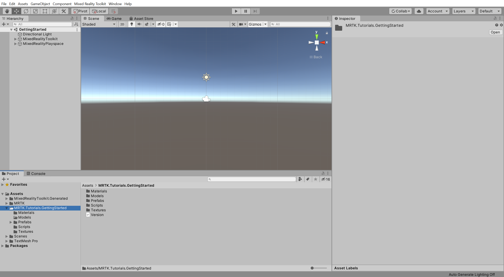
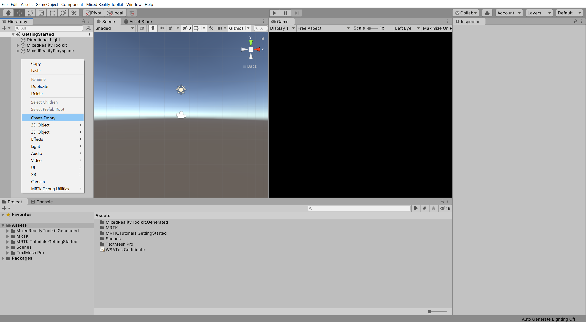
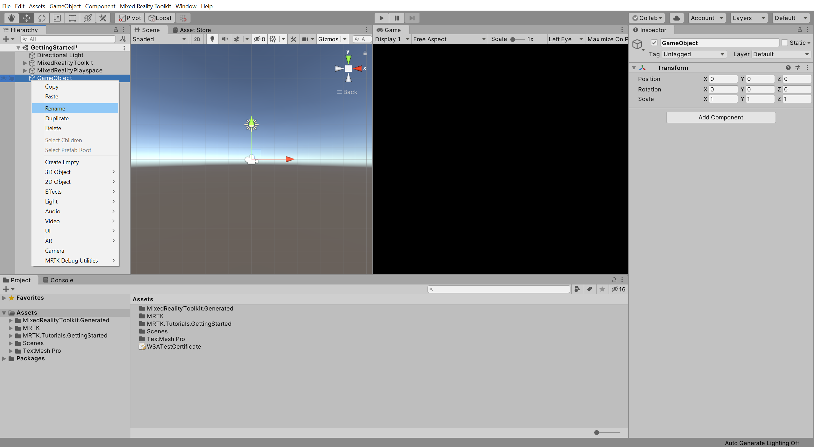
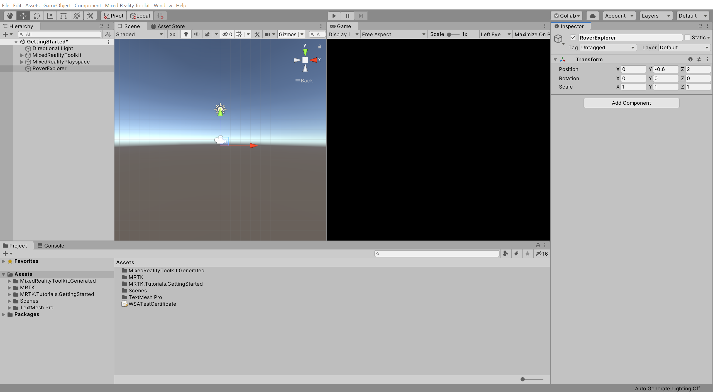
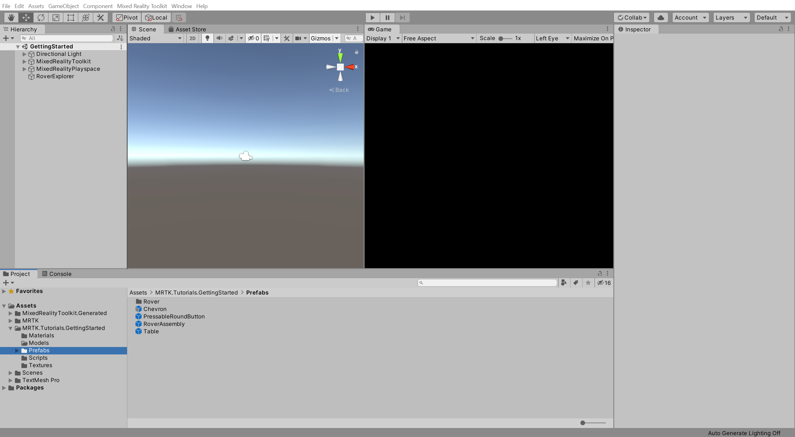
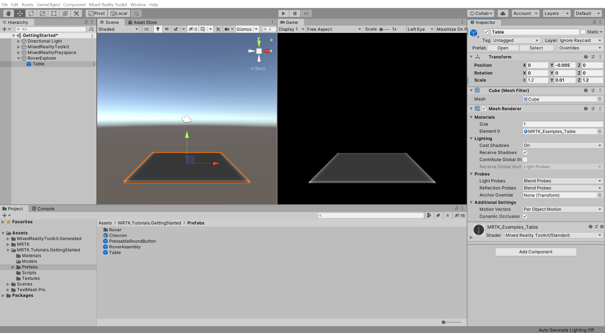
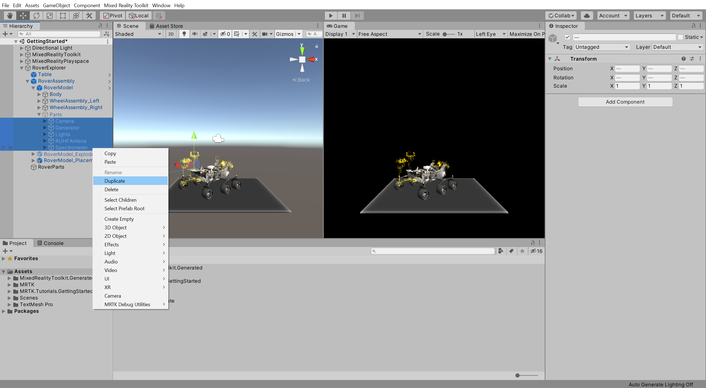
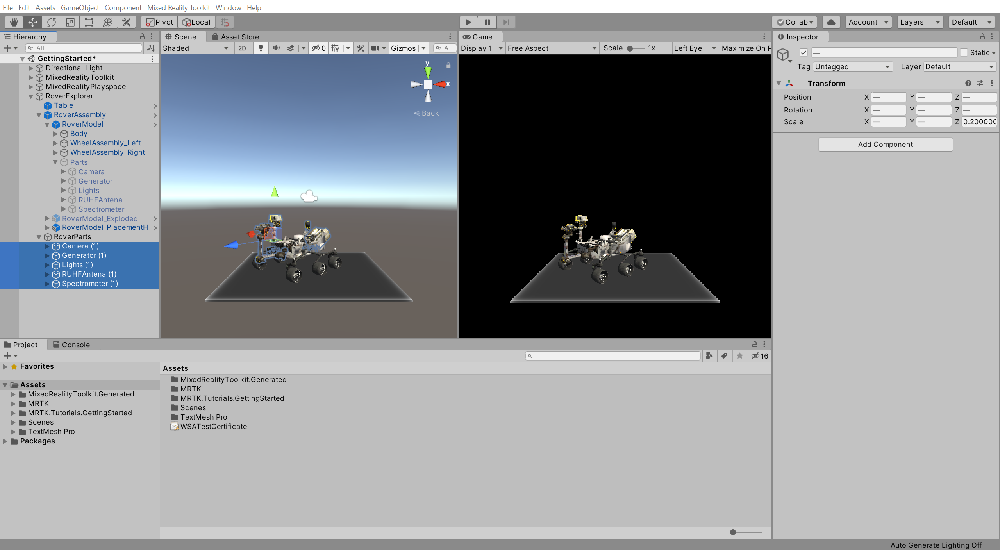
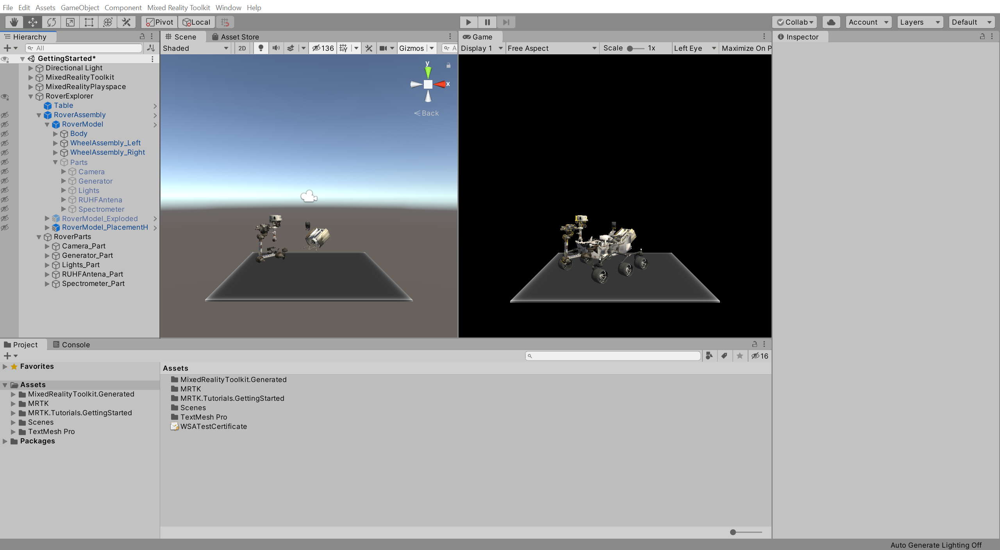

# 4. Positioning objects in the scene

## Overview

In this tutorial, you will import the tutorial assets and position the provided objects in the scene.

## Objectives

* Learn how to position objects in the scene
* Learn how to use MRTK's Grid Object Collection feature

## Importing the tutorial assets

Download and import the following Unity custom package:

* [MRTK.HoloLens2.Unity.Tutorials.Assets.GettingStarted.2.4.0.0.unitypackage](https://github.com/microsoft/MixedRealityLearning/releases/download/getting-started-v2.4.0.0/MRTK.HoloLens2.Unity.Tutorials.Assets.GettingStarted.2.4.0.0.unitypackage)

After you have imported the tutorial assets your Project window should look similar to this:

> [!TIP]
> For a reminder on how to import a Unity custom package, you can refer to the [Importing the Mixed Reality Toolkit](mr-learning-base-02.md#importing-the-mixed-reality-toolkit) instructions.

## Creating the parent object

In the Hierarchy window, right-click on an empty spot and select **3D Object** > **Create Empty** to add an empty object to your scene:

> [!TIP]
> To display your Scene and Game window side by side as shown in the image above, simply drag the Game window to the right side of the Scene window. To learn more about customizing your workspace, you can refer to Unity's <a href="https://docs.unity3d.com/Manual/CustomizingYourWorkspace.html" target="_blank">Customizing Your Workspace</a> documentation.

Right-click on the newly created object, select **Rename**, and change the name to **RoverExplorer**:

With the RoverExplorer object still selected, in the Inspector window, configure the **Transform** component as follows:

* **Position**: X = 0, Y = -0.6, Z = 2
* **Rotation**: X = 0, Y = 0, Z = 0
* **Scale**: X = 1, Y = 1, Z = 1

> [!NOTE]
> The camera represents the users head and is positioned at origin, X = 0, Y = 0, Z = 0. In general, 1 position unit in Unity is roughly equivalent to 1 meter in the physical world. However, there are exceptions to this, for example, when objects are children of scaled objects. In the scenario above, the RoverExplorer is positioned approximately 2 meters in front of the users and 0.6 meters below the users head.

## Adding the tutorial prefabs

> [!TIP]
> A <a href="https://docs.unity3d.com/Manual/Prefabs.html" target="_blank">prefab</a> is a pre-configured GameObject stored as a Unity Asset and can be reused throughout your project.

In the Project window, navigate to the **Assets** > **MRTK.Tutorials.GettingStarted** > **Prefabs** folder:

From the Project window, click-and-drag the **Table** prefab on to the **RoverExplorer** object to make it a child of the RoverExplorer object, then in the Inspector window, configure the **Transform** component as follows:

* **Position**: X = 0, Y = -0.005, Z = 0
* **Rotation**: X = 0, Y = 0, Z = 0
* **Scale**: X = 1.2, Y = 0.01, Z = 1.2

> [!TIP]
> To display your scene as shown in the image above, use the <a href="https://docs.unity3d.com/Manual/SceneViewNavigation.html" target="_blank">Scene Gizmo</a>, located in the top right corner of the Scene window, to adjust the viewing angle to be along the forward Z axis, double-click the MixedRealityPlayspace object to focus on the camera, and zoom in as needed.

From the Project window, click-and-drag the **RoverAssembly** prefab on to the **RoverExplorer** object to make it a child of the RoverExplorer object, then in the Inspector window, configure the **Transform** component as follows:

* **Position**: X = -0.1, Y = 0, Z = 0
* **Rotation**: X = 0, Y = -135, Z = 0
* **Scale**: X = 1, Y = 1, Z = 1

## Organizing objects in a collection

In the Hierarchy window, right-click on the **RoverExplorer** object and select **3D Object** > **Create Empty** to add an empty object as a child of the RoverExplorer, name the object **RoverParts**, and configure the **Transform** component as follows:

* **Position**: X = 0, Y = 0.06, Z = 0
* **Rotation**: X = 0, Y = 90, Z = 0
* **Scale**: X = 1, Y = 1, Z = 1

In the Hierarchy window, select all the RoverExplorer > RoverAssembly > RoverModel > **Parts** child objects, right click on them and select **Duplicate** to create a copy of each of the parts:

With the newly duplicated Parts child objects still selected, click-and-drag them on to the **RoverParts** object to make them child objects of the RoverParts object:

To make it easier to work with your scene, set the **scene visibility** for the **RoverExplorer** object to off by clicking the **eye** icon to the left of the object in the Hierarchy window. This hide the object in the Scene window without changing it's in-game visibility:

> [!TIP]
> To learn more about the Scene Visibility controls and how you can use them to optimize your scene view and workflow, you can refer to Unity's <a href="https://docs.unity3d.com/Manual/SceneVisibility.html" target="_blank">Scene Visibility</a> documentation.

In the Hierarchy window, clean up the names of the RoverParts child objects by replacing the appended **(1)** with **_Part**:

In the Hierarchy window, select the **RoverParts** object, then in the Inspector window, click the **Add Component** button, and search for and select **GridObjectCollection** to add a GridObjectCollection component to the RoverParts object:

Change the **GridObjectCollection** component values as follows:

* **Sort Type**: Alphabetic
* **Layout**: Horizontal
* **Cell Width**: 0.25
* **Distance from parent**: 0.38

Then click the **Update Collection** button to update the position of the RoverParts child objects:

## Congratulations

In this tutorial, you learned how to position objects in the scene relative to the user and how to use MRTK's Grid Object Collection feature to organize object in a collection.

[Next Tutorial: 5. Creating dynamic content using Solvers](mr-learning-base-05.md)
