# 1. Getting started with PC Holographic Remoting

## Overview

  Welcome to the HoloLens 2 tutorials. In this two-part tutorial series, you will learn how to create a Mixed Reality experience demonstration and how to create a PC app for Holographic Remoting.

  In this tutorial, [Create Mixed Reality experience](mr-learning-pc-holographic-remoting-01.md), you will learn how to create a Mixed Reality experience demonstrating UI elements, 3D model manipulation, model clipping, and eye tracking features.

  In the second tutorial, [Create Holographic Remoting application](mr-learning-pc-holographic-remoting-02.md), you will learn how to create a PC app for Holographic Remoting and connect to HoloLens 2 at any point, providing a way to visualize 3D content in Mixed Reality.

## Objectives

* Import assets and set up the scene
* Interact with holograms using UI elements and buttons
* Configure 3D objects for the clipping feature
* Learn about eye tracking target select and highlight tooltips

## Prerequisites

* A Windows 10 PC configured with the correct [tools installed](install-the-tools.md)
* Some essential C# programming ability
* A HoloLens 2 device [configured for development](using-visual-studio.md#enabling-developer-mode)
* <a href="https://docs.unity3d.com/Manual/GettingStartedInstallingHub.html" target="_blank">Unity Hub</a> with Unity 2019.3.X installed and the Universal Windows Platform Build Support module added
* Completed the Getting started tutorials series or some basic prior experience with Unity and MRTK

> [!IMPORTANT]
> The recommended Unity version for this tutorial series is Unity 2019.3.X. It supersedes any Unity version requirements or recommendations stated in the prerequisites linked above.

## Creating the Unity project

In this section, you will create a new Unity project and get it ready for MRTK development.

For this, first follow the [Initializing your project and first application](mrlearning-base-ch1.md), excluding the [Build your application to your device](mrlearning-base-ch1.md#build-your-application-to-your-device) instructions, which includes the following steps:

1. [Create a new Unity project](mrlearning-base-ch1.md#create-new-unity-project) and give it a suitable name, for example, *MRTK Tutorials*

2. [Configuring the Unity project for Windows Mixed Reality](mrlearning-base-ch1.md#Configuring-the-unity-project-for-windows-mixed-reality)

3. [Import TextMesh Pro Essential Resources](mrlearning-base-ch1.md#import-textmesh-pro-essential-resources)

4. [Import the Mixed Reality Toolkit](mrlearning-base-ch1.md#import-the-mixed-reality-toolkit)

5. [Configuring the Unity project for the Mixed Reality Toolkit](mrlearning-base-ch1.md#Configuring-the-unity-project-for-the-mixed-reality-toolkit)

6. [Add the Mixed Reality Toolkit to the Unity scene](mrlearning-base-ch1.md#configuring-the-mixed-reality-toolkit) and give the scene a suitable name, for example, **PC Holographic Remoting**

Then follow the [How to Configuring the Mixed Reality Toolkit Profiles (Change Spatial Awareness Display Option)](mrlearning-base-ch2.md#how-to-Configuring-the-mixed-reality-toolkit-profiles-change-spatial-awareness-display-option) instructions to change the MRTK Configuration profile for your scene to the **DefaultHoloLens2ConfigurationProfile** and change the display options for the spatial awareness mesh to **Occlusion**.

## Importing the tutorial assets

Download and **import** the [MRTK.Tutorials.PCHolographicRemoting.unitypackage](https://github.com/onginnovations/MixedRealityLearning/releases/download/pc-holographic-remoting-v2.4.0.0/MRTK.Tutorials.PCHolographicRemoting.unitypackage).

>[!TIP]
> For a reminder on how to import a Unity custom package, you can refer to the [Import the Mixed Reality Toolkit](mrlearning-base-ch1.md#import-the-mixed-reality-toolkit) instructions.

After importing the tutorial assets, your Project window should look similar to this:

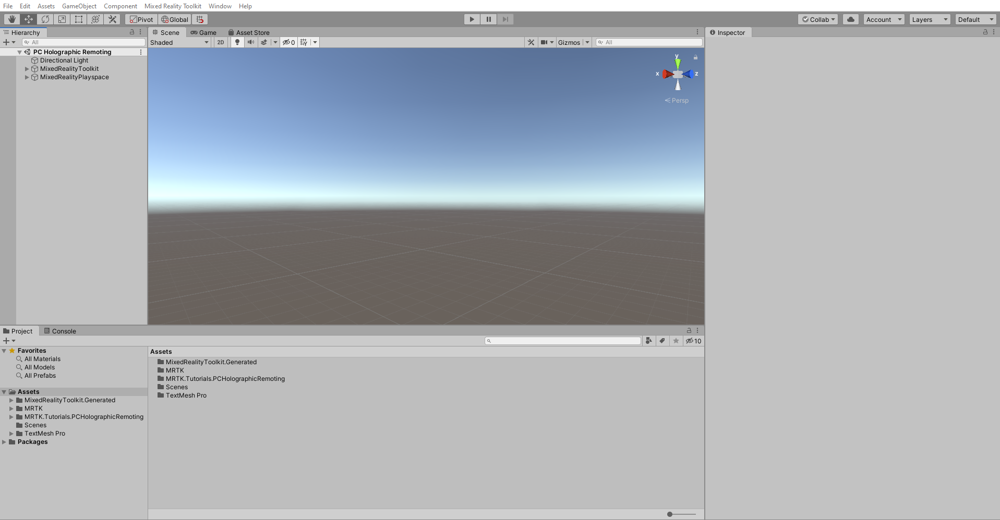

## Configuring and preparing the scene

In this section, you will prepare the scene by adding some of the tutorial prefabs.

In the Project window, navigate to **Assets** > **MRTK.Tutorials.PCHolograhicRemoting** > **Prefabs** folder. While holding down the CTRL button. Click on the below six prefabs.

* ButtonParent
* ClippingObjects
* HandSpatialMapButton
* Instructions
* ModelParent
* Platform

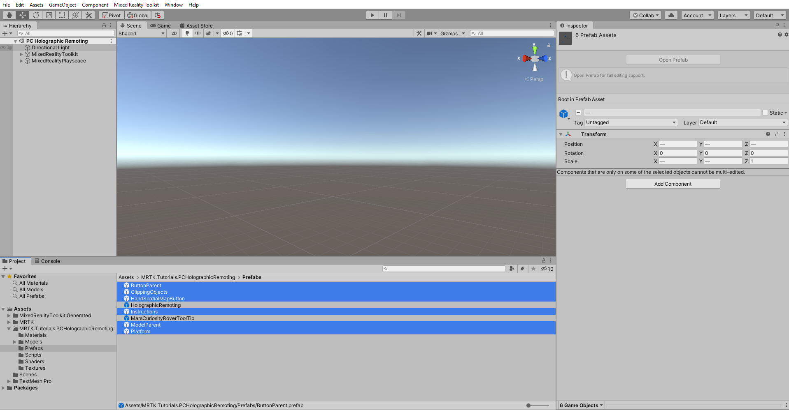

Drag-and-drop these models from prefabs folder into the **Hierarchy window**.

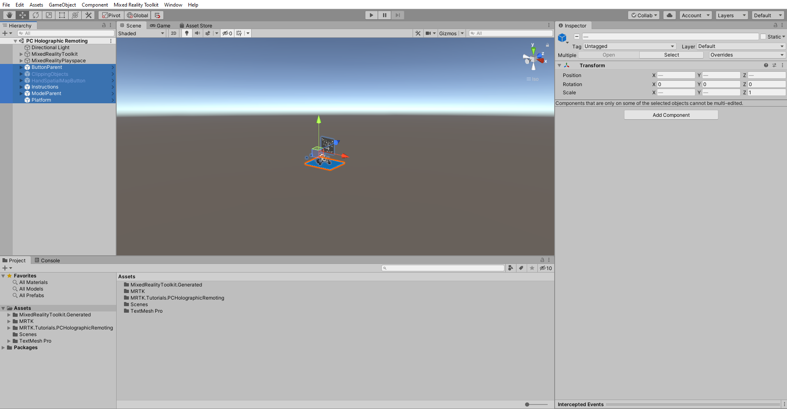

To focus in on the objects in the scene, you can double-click on the **ModelParent** object, and then zoom slightly in again:

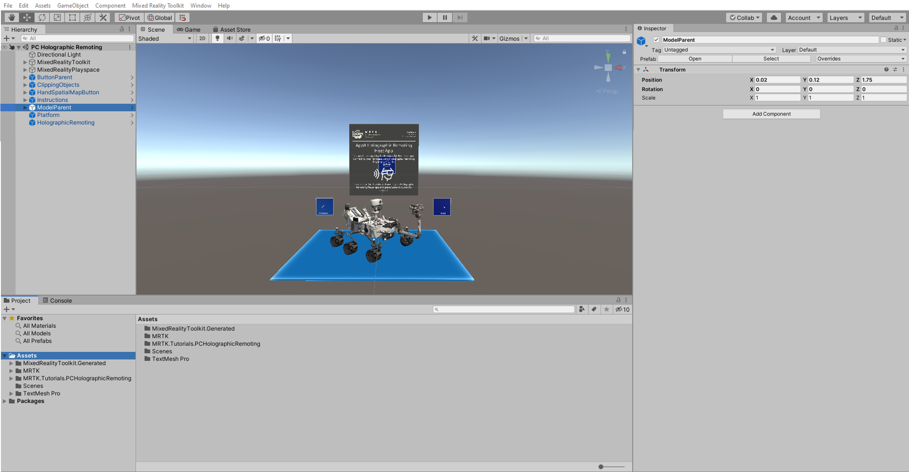

> [!TIP]
> If you find the large icons in your scene, for example, the large framed 'T' icons distracting, you can hide these by <a href="https://docs.unity3d.com/2019.1/Documentation/Manual/GizmosMenu.html" target="_blank">toggling the Gizmos</a> to the off position.

## Configuring the buttons to operate the scene

In this section, you will add scripts into the scene to create button events that demonstrate the fundamentals of model switching and clipping functionality.

### 1. Configuring the Interactable (Script) component

In the Hierarchy window, expand the **ButtonParent** object and select the **NextButton**. In the Inspector window, locate the **Interactable (Script)** component and click on **+** icon under **OnClick ()** event.

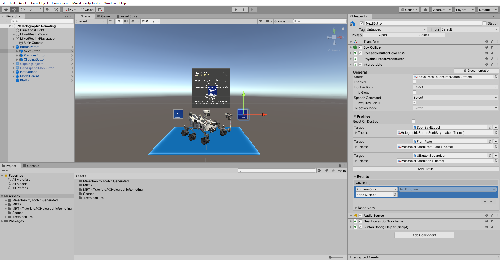

With the **NextButton** object still selected in the Hierarchy window, click-and-drag the **ButtonParent** object from the Hierarchy window into the empty **None (Object)** field of the event you just added to make the ButtonParent object listen for button click events from this button:

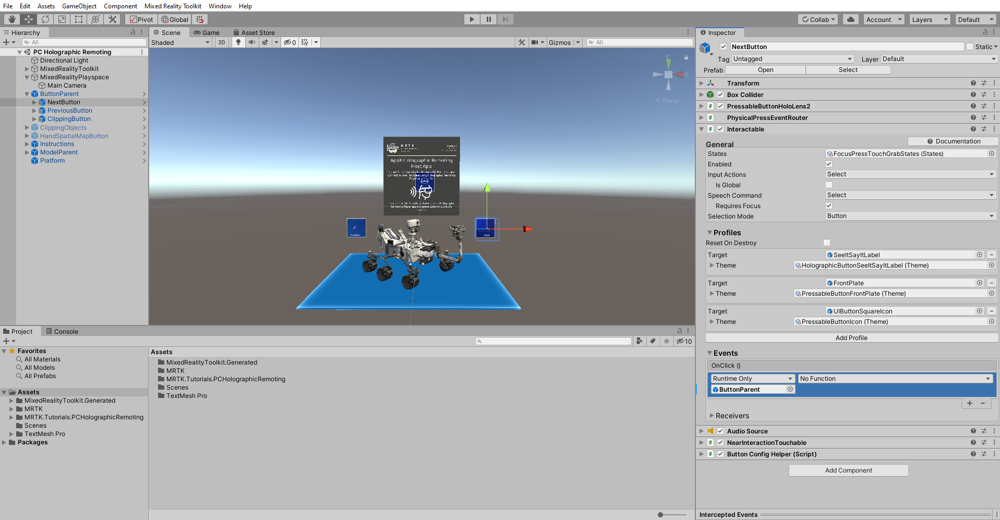

Click the **No Function** dropdown of the same event, then select **ViewButtonControl** > **NextModel ()** to set the **NextModel ()** function as the action that is triggered when the button pressed events is fired from this button:

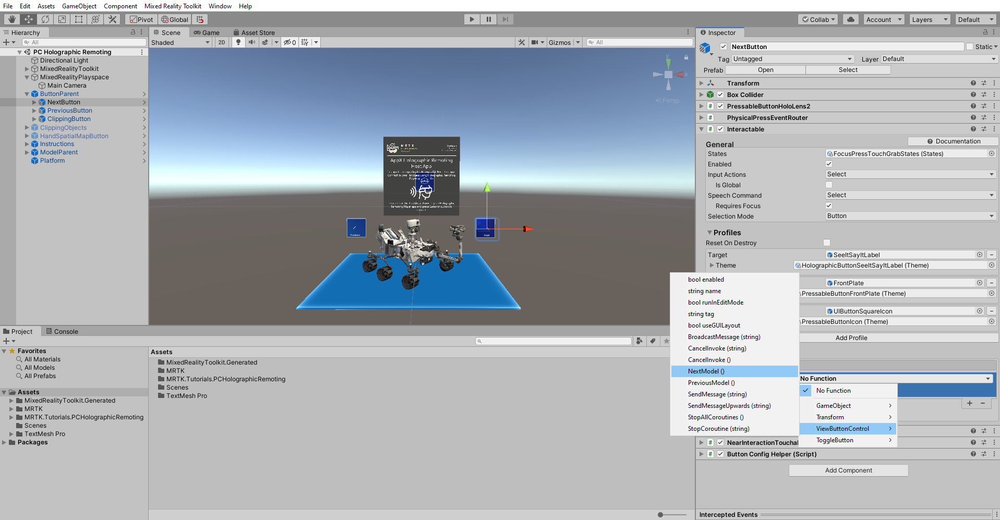

### 2. Configuring the remaining buttons

For each of the remaining buttons, complete the process outlined above to assign functions to the **OnClick ()** events:

* For PreviousButton object, assign the **ViewButtonContro**l > **PreviousModel ()** function.

* For ClippingButton select **ToggleButton** > **ToggleClipping ()** function.

### 3. Configuring the View Button Control (Script)  and Toggle Button (Script) components

Now your buttons are configured to demonstrate the model switching and clipping functionality, and it is time to add 3D models and the clipping objects to the script.

For demonstration, we have provided six different 3D models, expand the **ModelParent** object to expose these 3D models.

With the ButtonParent object still selected in the Hierarchy window, in the Inspector window, locate the **View Button Control (Script)** component and expand the **Models** variable.

In the **Size** field, enter the number of 3D models you would like to have in your scene. In this case, it would be six. It will create fields for adding new 3D models.

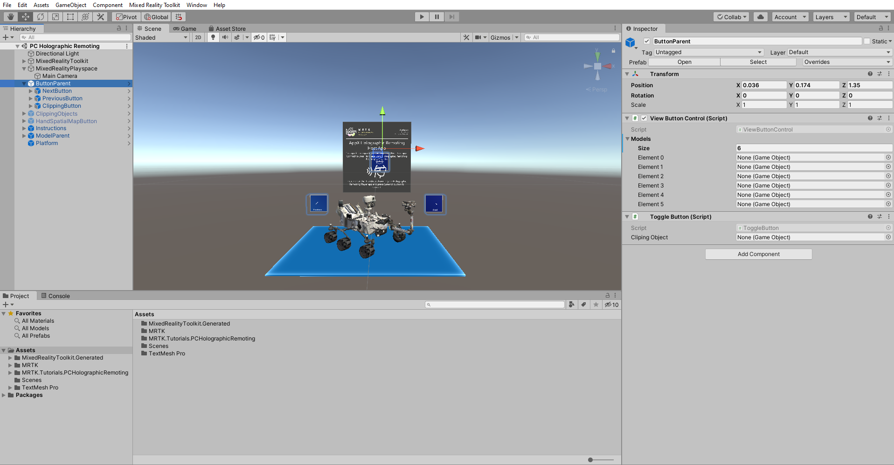

Drag-and-drop the ModelParent object's child model objects into these fields.

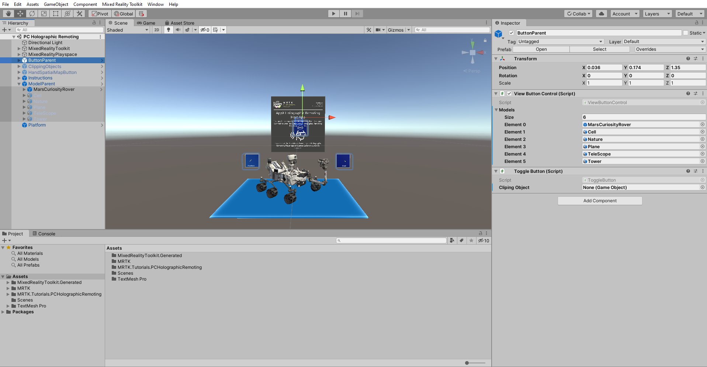

Drag-and-drop the  **ClippingObjects** object from the Hierarchy window to the  **Toggle Button (Script)** component **Clipping Object** field.

In the Hierarchy window, select the **ClippingObjects** prefab and enable it in the Inspector window to turn on the Clipping objects.

## Configuring the clipping objects to enable clipping feature

In this section, you will add MarsCuriosityRover object's child objects renderer into an individual clipping object to demonstrate the clipping of MarsCuriosityRover model.

In the Hierarchy window, expand the **ClippingObjects** object to expose the three different clipping objects that you will be using in this project.

To configuring the **ClippingSphere** object, click on it, and in the Inspector window, locate the **Clipping Sphere (Script)** component. Enter the number of renderers in size field that you need to add for your 3D model. In this case, add 10 for MarsCuriosityRover child objects. It will create fields for adding renderers, drag-and-drop MarsCuriosityRover Object's child model objects into these fields.

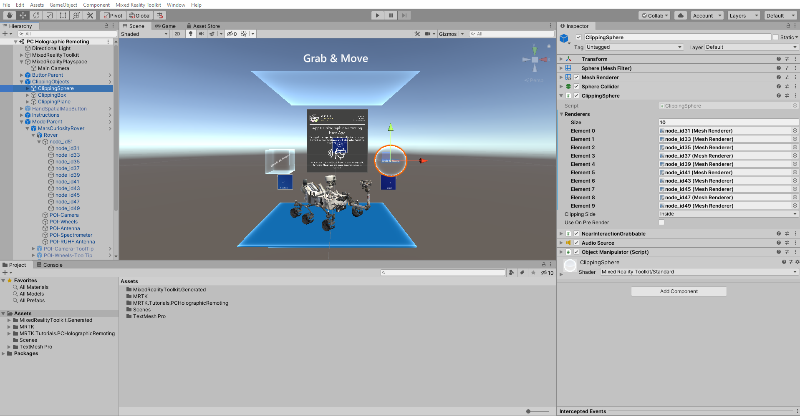

Follow the same process and add MarsCuriosityRover's child objects renderers to the **ClippingBox** and **ClippingPlane** objects.

In this tutorial, only the MarsCuriosityRover model will be used for demonstrating the clipping feature. For adding clipping features to more models, increase the size of the renderer, and add their individual mesh renderers.

## Configuring eye tracking to highlight tooltips

In this section, you will explore how to enable eye tracking in your project. For example, you will implement the functionality to highlight tooltips that are attached to MarsCuriosityRover's parts, while looking at them and hiding them, while you are looking away from them.

### 1. Identify target objects and associated tooltips

In the Hierarchy window, select the ModelParent object and expand the MarsCuriosityRover to find five main parts of the MarsCuriosityRover: **POI-Camera**, **POI-Wheels**, **POI-Antena**, **POI-Spectrometer**, **POI-RUHF Antenna**.

Observe five corresponding tooltip objects associated with MarsCuriosityRover parts in the Hierarchy window. You will be configuring these objects to highlight the experience when you look at the MarsCuriosityRover parts.

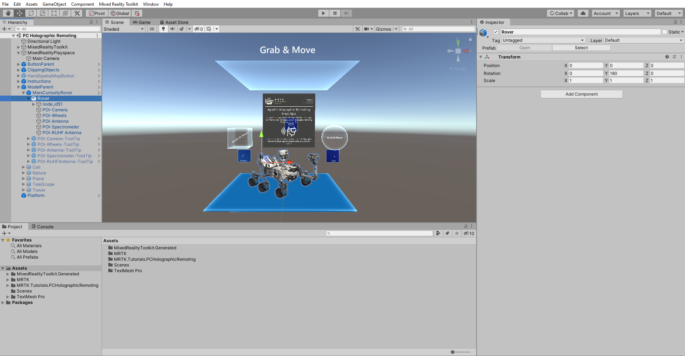

### 2. Implement While Looking At Target ()  &  On Look Away () events

In the Hierarchy window, select the POI-Camera object. In the Inspector window, locate the **Eye Tracking Target (Script)** component and configure the **While Looking At Target ()** & **On Look Away ()** events as follows:

* To **None (Object)** field, assign the **POI-Camera ToolTip** object
* From **No Function** dropdown of **While Looking At Target ()** event, select **GameObject** > **SetActive (bool),** select the **Checkbox** under it to highlight the tooltip as the action that is triggered when you look at the target object.

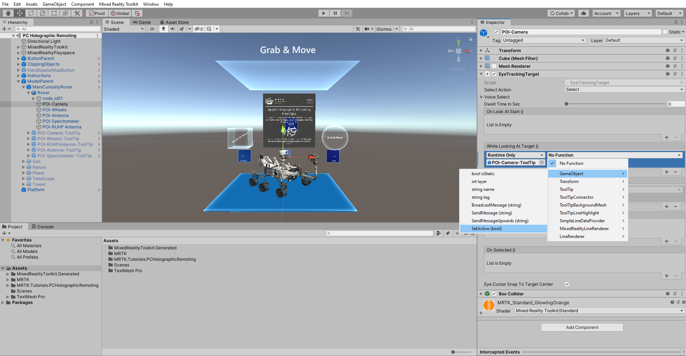

* Follow the same process and click on the **No Function** dropdown of the **On Look Away ()** event listener, then select **GameObject** > **SetActive (bool**) and leave the **Checkbox** empty to hide the tooltip as the action, that is triggered when you look away from the target object.

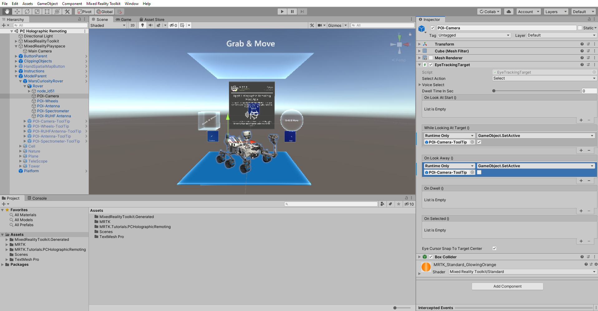

Follow the same process and assign respective tooltip objects to their same **MarsCuriosityRover** parts
**While Looking At Target ()** & **On Look Away ()** events.

To enable simulated eye tracking for in-editor simulations, please follow these [guidelines](https://docs.microsoft.com/windows/mixed-reality/mrlearning-base-ch5#5-enable-simulated-eye-tracking-for-in-editor-simulations).

## Congratulations

In this tutorial, you learned to build a mixed reality experience demonstrating UI elements, 3D model manipulation, model clipping, and eye tracking features. The tutorial provided you with NextButton and PreviousButton that let you explore the 3D model viewer experience. The ClippingObjectButton made you turn on clipping objects and experience clipping feature. The tutorial also provided you with an eye tracking element to enable highlighting the tooltips in the experience.

In the next lesson, you will learn how to create a Holographic Remoting application for PC to connect HoloLens 2 at any point, providing a way to Visualize 3D content in Mixed reality.

[Next Lesson: 2. Create Holographic Remoting application](mr-learning-pc-holographic-remoting-02.md)
