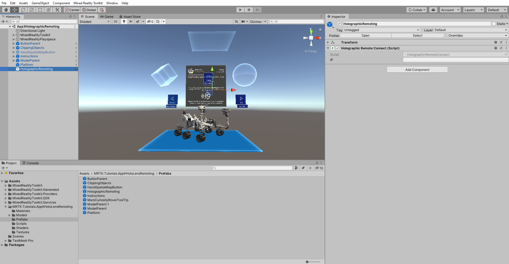
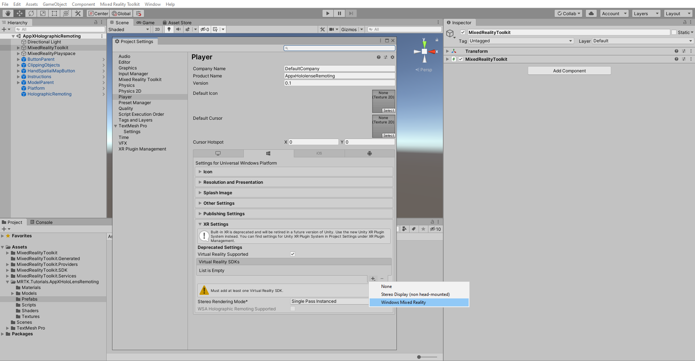
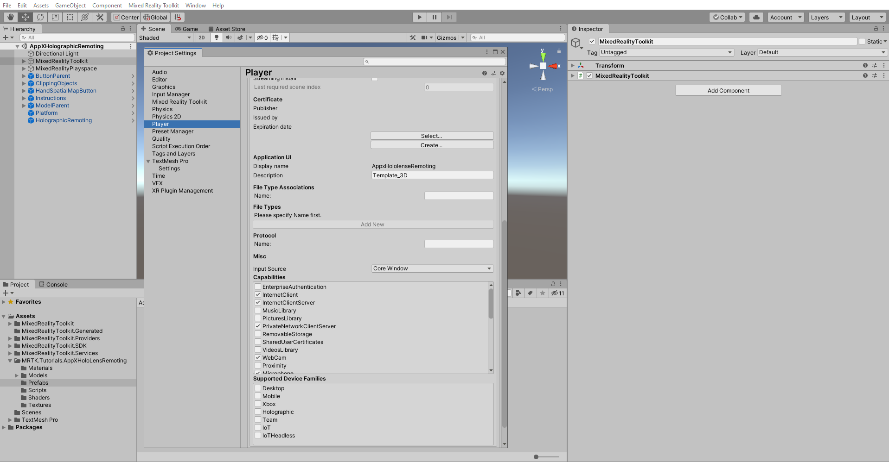
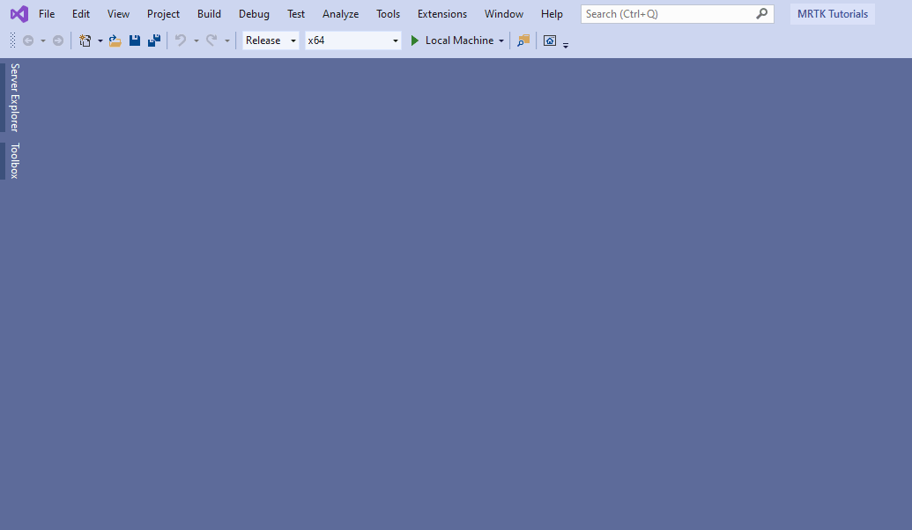

# 2. Create Holographic Remoting remote Application

In this tutorial you will learn how to create Holographic Remoting remote app and connect to HoloLens 2 at any point providing a way to visualize 3D content in Mixed Reality.

## Objectives

* Configure Unity for HoloLens Remoting
* Learn how to build and deploy the application with Visual Studio
* Installing the Holographic Remoting remote application and connecting to HoloLens

## Configure your scene for Holographic Remoting.

In this section, you will configure your project to stream your Mixed Reality experience on to your HoloLens 2 device from your PC in real-time over a WIFI connection.

In the Project window, navigate to **Assets** > **MRTK.Tutorials.AppXHolograhicRemoting**> **Prefabs** folder, and select and drag **HolographicRemoting** prefab into your scene.

With the HolographicRemoting object still selected in the Hierarchy window, locate the **Holographic Remote Connect (Script)** component. The script uses HolographicRemoting API to connect, disconnect, and check the connection status.

## Build your Holographic Remoting application to PC

In this section, you will configure the project's player settings to support Holographic Remoting and build the application to PC.

In the Unity menu, select **Edit** > **Project Settings...** to open the Project Settings window. In the Project Settings window select the **Player** tab, expand the **XR Settings** section.

In the XR Settings, select  the **Virtual Reality Supported** checkbox to enable Mixed Reality. Click on **+** option to add Virtual Reality SDK's. In our scenario,  select **Windows Mixed Reality** SDK.

When Unity has finished adding the SDK, optimize the XR Settings as follows:

* Set Windows Mixed Reality **Depth Format** to **16-bit depth**
* Check the Windows Mixed Reality **Enable Depth Sharing** checkbox
* Set **Stereo Rendering Mode** to **Single Pass Instanced**
* Select the Windows Mixed Reality **WSA Holographic Remoting Supported** checkbox

In the  **Publishing Settings**, scroll down to the **Capabilities** section and double-check that the **InternetClient**, **Microphone**, and **SpatialPerception** capabilities, which you enabled when you created the project at the beginning of the tutorial, are enabled. Then, enable the **InternetClientServer**, **PrivateNetworkClientServer**, **Webcam** and **Gaze Input** capabilities:

For a reminder on how to Build the application, you can refer to the [Build your application to your device](https://docs.microsoft.com/windows/mixed-reality/mrlearning-base-ch1#build-your-application-to-your-device) instructions.

Configure Visual Studio for PC with the below settings:

* Select the  **Release** configuration instead of debug, 
* Select **X64** architecture instead of ARM, 
* Select **Local Machine** as target instead of Device:

## How to test the Holographic Remoting remote application:

### Install the Remoting Player application in HoloLens 2 device

1. On your Microsoft HoloLens, visit the Store app and search for "**Remoting Player**".
2. Select the **Remoting Player app**.
3. Tap **Install** to start downloading and install the Remoting Player app.

### Connect the remoting host sample to the Remoting Player

1. Start the **Remoting Player** on your Microsoft HoloLens.
2. Take note of the HoloLens **IP address**. It will be displayed as a hologram by the **Remoting Player** as soon as it launches.
3. Open the installed application in your PC.
4. Once application is launched, enter the **IP address** and click on **Connect** button to connect.

## Congratulations

In this tutorial, you learned how to create Holographic Remoting remote app and connect to HoloLens 2 at any point providing a way to visualize 3D content in Mixed Reality. Once the HoloLens is connected to the Holographic Remoting PC application, you should see the Mixed Reality experience that is been streaming into your HoloLens 2 device. 

