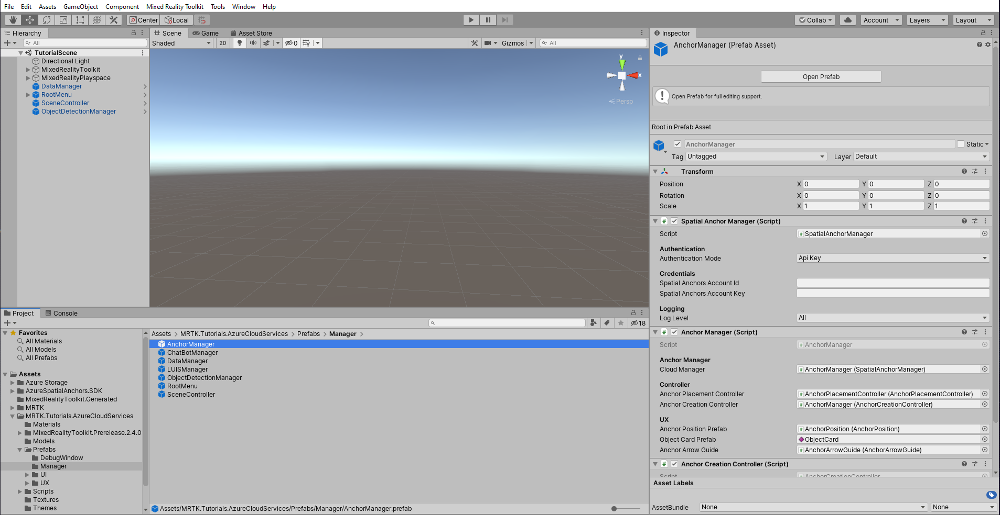
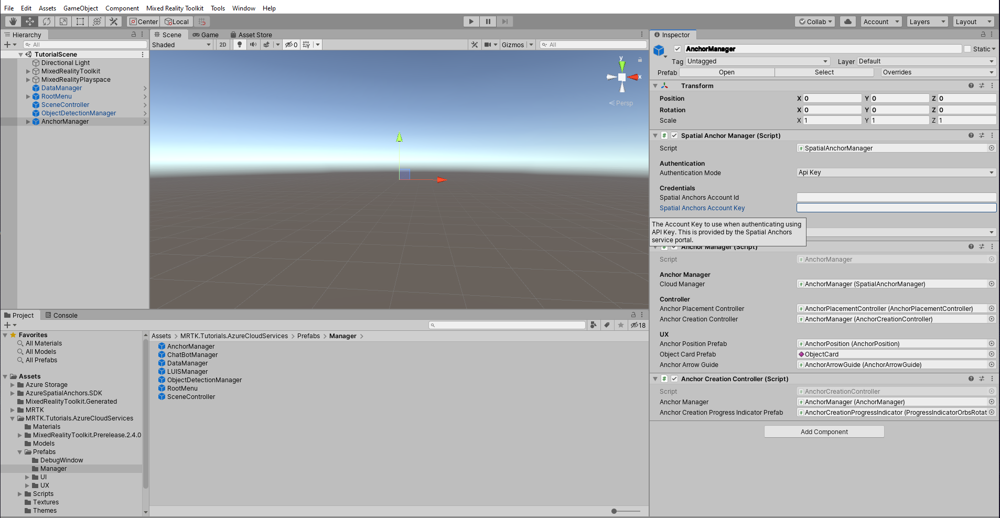

# 4. Integrating Azure Spatial Anchors

In this tutorial, you will learn how to use **Azure Spatial Anchors** for storing a location to a **Tracked Object** and query for the location and present the user with a guiding arrow.

## Objectives

* Learn the basics about Azure Spatial Anchors
* Learn how to setup the scene to use Azure Spatial Anchors in this project
* Learn how to integrate storing and querying locations

## Understanding Azure Spatial Anchors

**Azure Spatial Anchors** is part of the **Cognitive Services** family and is used to train image classifiers. The image classifier is a AI service that uses the trained model to apply matching tags. This classification feature will be used by our application to detect *Tracked Objects*.

Learn more about [Azure Spatial Anchors](https://docs.microsoft.com/en-us/azure/spatial-anchors/overview).

## Preparing Azure Custom Vision

Before we can start, you have to create a spatial anchor resource in your azure portal.
Learn how to make a [spatial anchor resource](https://docs.microsoft.com/en-us/azure/spatial-anchors/quickstarts/get-started-hololens#create-a-spatial-anchors-resource).

> [!HINT]
> When deploying the application to HoloLens 2 make sure you have Spatial Perception capability enabled.

## Preparing the scene

In this tutorial, you will learn how to configure the scene and make necessary changes.

In the Project window, navigate to **Assets > MRTK.Tutorials.AzureCloudServices > Prefabs > Manager > Anchor Manager**

From there move the prefab **Anchor Manager** into the scene hierarchy.

Once you add the AnchorManager to the scene,

Click on **Anchor Manager** component. In the inspector you will find **Spatial Anchor Manager** account ID and key which you would have created in the prerequisite in the earlier stage, copy and paste it.

Now find the **Scene Controller** object in your scene hierarchy and select it. You will see the **Scene Controller** inspector.

You will observe that **Anchor Manager** field in the **Scene Controller** component is empty, drag and drop the **Anchor Manager** from the hierarchy in the scene into that field and save the scene.

## Create an Anchor to store a location

In this section you will see how to save the object location.

After configuring the scene and making necessary changes to the **Anchor Manager**, Run the application and click on **Set Object** in the main menu of the experience.

Give the **name** of the object you want to save and click on **Set Object** to continue. To add more information about the object, select the **image** and give the **description** of the object.

To save the Location, click on **Save Location**

You will see an **anchor pointer** which you can move and place on the location where you want to save. After which you will get a confirmation popup, if you want to confirm and save the location click on **Yes** else you can change the location by clicking on **No** and selecting the location again.

Once you confirm the location by clicking on **Yes**, the location and the Anchor ID will be saved in the Azure cloud storage. Once it is saved, you will see the **Object tag** in the anchor with the name of the object.

Now the object location is saved successfully.

## Query for an Anchor to find a location

Once after you successfully saved the anchor location, now you can find the anchor location by selecting **Search Object** in the main menu.

After clicking on **Search Object**, a new window will pop up in which you should give the name of the object you want to search.

Enter the name of the object and click on **Search Object**. If the object is saved previously and is found in the database, you will get the object card with all the details of the object which you would have saved earlier.

Now you can click on **Show Location** to find the object. Once you click on **Show Location**, the system will query the object address from the cloud storage.

After successfully retrieving the location, an **arrow** will direct you towards the location of the object. Follow the arrow mark until you find the location of the object.

Once you find the object, the object name will appear at the top and the arrow mark will disappear and now you can click on **object tag** to see the details of the object.

## Congratulations

In this tutorial you learned how Azure Spatial Anchors can be used to save and retrieve object location on Hololense 2.

In the final tutorial you will learn how to use the **Azure Bot Service** to add natural language as a new interaction method for our application.

[Next Lesson: 5. Integrating Azure Bot Service with LUIS](mrlearning-azure-05.md)
