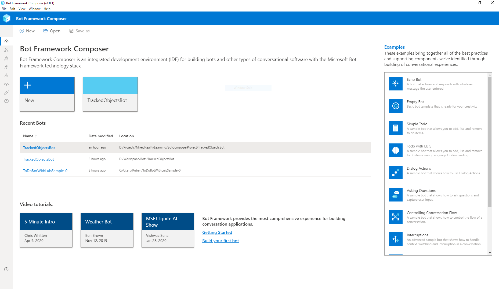
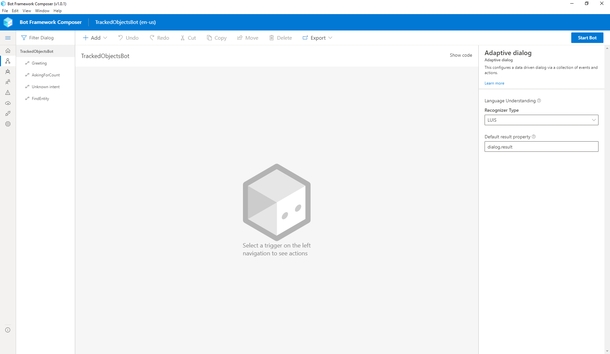
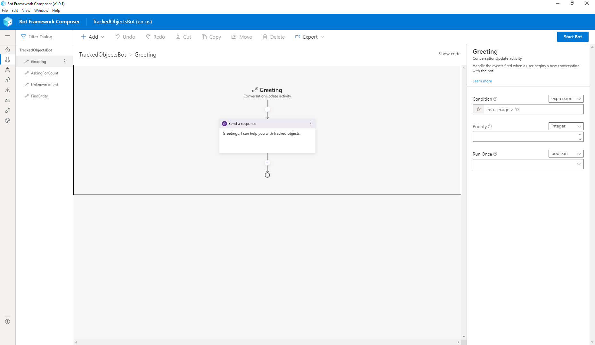
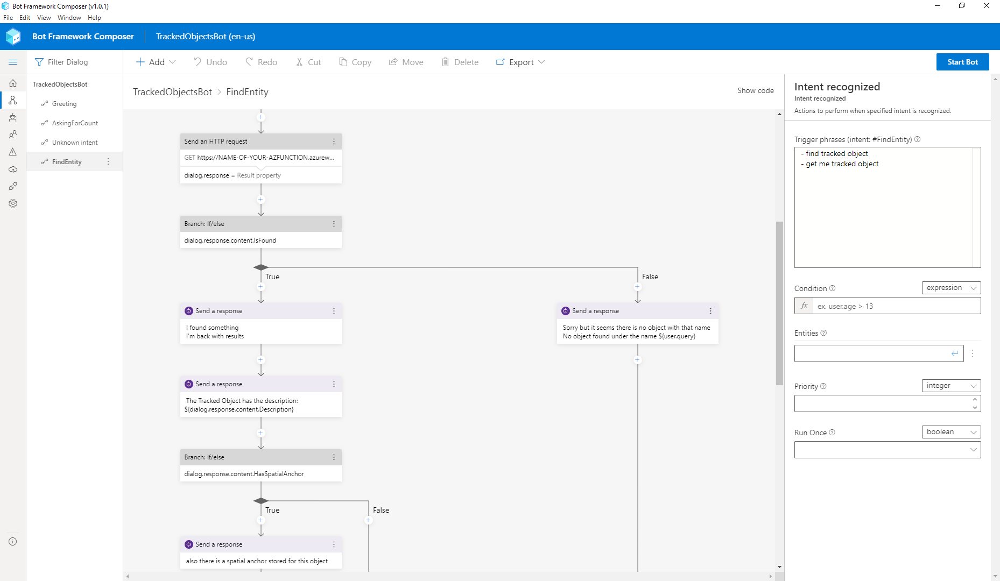
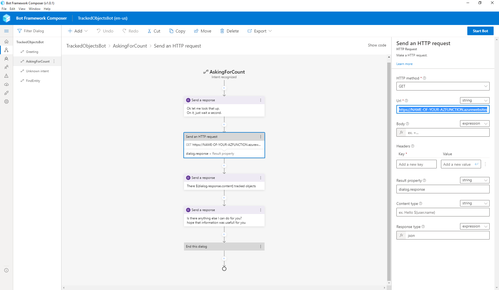
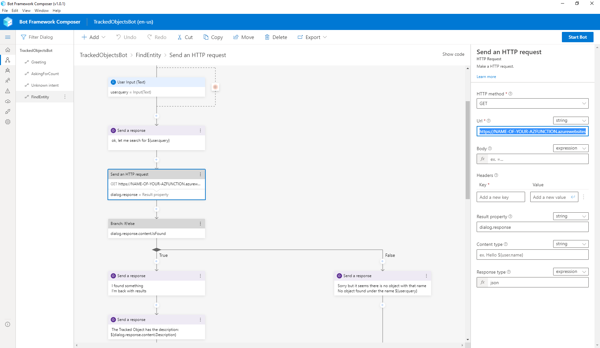
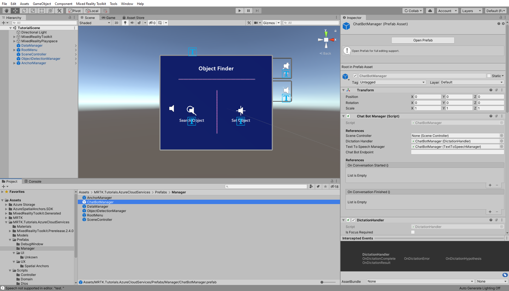
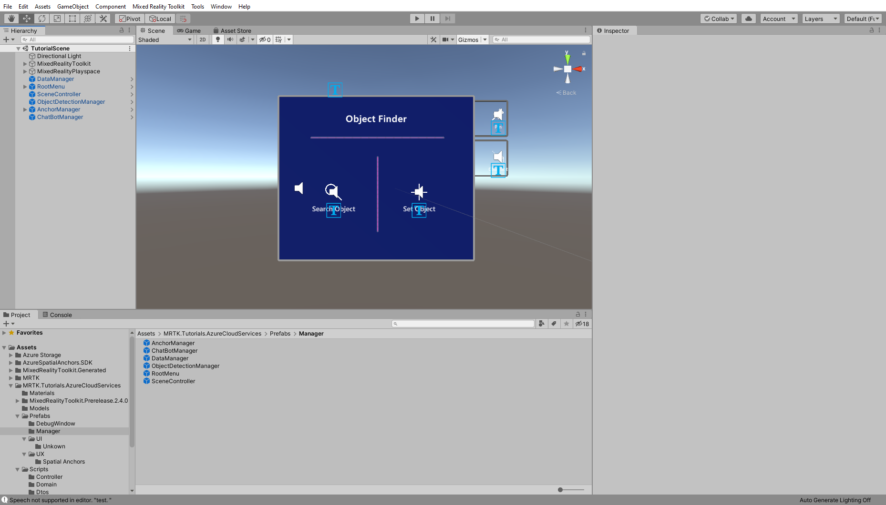
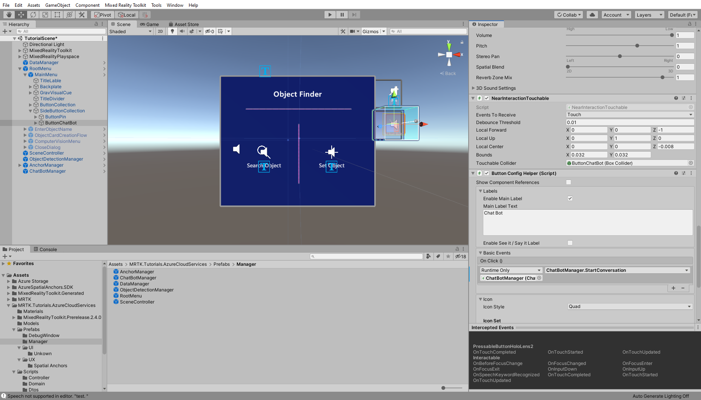
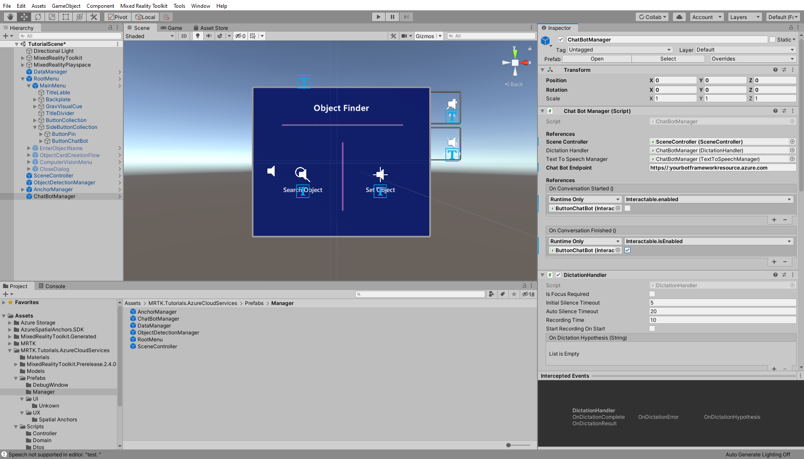

# 5. Integrating Azure Bot Service

In this tutorial, you will learn how to use **Azure Bot Service** inside your **HoloLens 2** application for adding natural language **LUIS** understanding and letting the Bot assist the user when searching for an **Tracked Objects**. This is a two part tutorial where in the first part we create the Bot with the [Bot Composer](https://docs.microsoft.com/en-us/composer/introduction) as a code free solution and take a quick look in the Azure Function that feeds the Bot with the needed data. In the second part we use the **BotManager (script)** in the Unity project to consume the hosted Bot Service.

## Objectives

## Part 1
* Learn the basics about Azure Bot Service
* Learn how to use the Bot Composer to create a Bot
* Learn how to use an Azure Function to provide data from the Azure Storage
## Part 2
* Learn how to setup the scene to use Azure Bot Service in this project
* Learn how to set and find objects via conversing with the Bot

## Understanding Azure Bot Service

The **Azure Bot Service** empowers developers to create intelligent bots that can maintain natural conversation with users thanks to natural language understanding **LUIS**. A conversational Bot is a great way to expand the ways a user can interact with your application. A Bot can act as a knowledge base with [QnA Marker](https://docs.microsoft.com/en-us/azure/bot-service/bot-builder-howto-qna?view=azure-bot-service-4.0&tabs=cs) to maintaining sophisticated conversation with the power of [Language Understanding (LUIS)](https://docs.microsoft.com/en-us/azure/bot-service/bot-builder-howto-v4-luis?view=azure-bot-service-4.0&tabs=csharp).

Learn more about [Azure Bot Service](https://docs.microsoft.com/en-us/azure/bot-service/bot-service-overview-introduction?view=azure-bot-service-4.0).

## Part 1 - Creating the Bot

Before we can use the bot in the Unity application, we need to develope it, provide it with data and host it on **Azure**.
The goal of the bot is to have the abilities to tell how many *Tracked Objects* are stored in the database and find a *Tracked Object* by its name and tell the user some basic information about it.

### A quick look into Tracked Objects Azure Function

We are about to start creating the Bot, but to make it useful we need to give it a resource from which it can pull data. Since the *Bot* will be able to count the amount of **Tracked Objects** and find specific ones by name and tell details, we will use a simple Azure Function that has access to the **Azure Table storage**.

Download the Azure Function Project: [Tracked Objects Azure Function](https://github.com/onginnovations/MixedRealityLearning/releases/download/azure-cloud/AzureFunction_TrackedObjectsService.zip)

This Azure Function has two actions, **Count** and **Find** which can be invoked via basic *HTTP* *GET* calls. You can inspect the code in **Visual Studio** and **Visual Studio Code**.

Learn more about [Azure Functions](https://docs.microsoft.com/en-us/azure/azure-functions/functions-overview).

The **Count** function queries from the **Table storage** all **TrackedObjects** from the table, very simple. On the other hand the **Find** function takes a *name* query parameter from the *GET* request and queries the **Table storage** for a matching **TrackedObject** and returns a Dto as JSON.

You can deploy this **Azure Function** directly from **Visual Studio** or **Visual Studio Code**.
Find here all information regarding [Azure Function deployment](https://docs.microsoft.com/en-us/azure/devops/pipelines/targets/azure-functions?view=azure-devops&tabs=dotnet-core%2Cyaml).

Once you have completed the deployment, open from the **Azure Portal** the corresponding resource and click on **Configuration** which is under the *Settings* section. There on **Application Settings** you need to provide the *Connection string* to the **Azure Storage** und which the **Tracked Objects** are stored. Click on **New Application setting** and use for name: **AzureStorageConnectionString** and for value provide the correct *Connection string*. After that click on **Save** and the **Azure Function** is ready to server the *bot* which we will create next.

### Creating a conversation Bot

There are several ways on how to develope a Bot Framework based conversational bot. In this lesson we will use the [Bot Framework Composer](https://docs.microsoft.com/en-us/composer/) desktop application which is a visual designer that is perfect for rapid development.

You can download the latest releases from the [Github repository](https://github.com/microsoft/BotFramework-Composer/releases) and is available for Windows, Mac and Linux.

Once the **Bot Framework Composer** is installed, start the application and you should see this interface:

We have prepared a bot composer project which provides the needed dialogues and triggers for this tutorial.
Download the project: [Bot Framework Composer Project](https://github.com/onginnovations/MixedRealityLearning/releases/download/azure-cloud/BotComposerProject_TrackedObjectsBot.zip)

On the top bar click on **Open** and select the Bot Framework Project you have downloaded which is named **TrackedObjectsBot**. After a short loading you should see the project ready.

Let's focus on the left side where you can see the **Dialogs Panel**. There we have one dialog named **TrackedObjectsBot** und which you can see several **Triggers**.

Learn more about [Bot Framework concepts](https://docs.microsoft.com/en-us/composer/concept-dialog).

These triggers do the following:

#### Greeting

This is the entry point of the chat *bot* when ever a *user* initiates a conversation.

#### AskingForCount

This dialog is triggered when the *user* asks for counting all **Tracked Objects**.
These are the trigger phrases:
>- count me all
>- how many are stored

Thanks to [LUIS](https://docs.microsoft.com/en-us/composer/how-to-use-luis) the *user* does not have to ask the phrases in that exact way which allows a natural conversation for the *user*.

In this dialog the *bot* will also talk to the **Count** Azure Function, more about that later.

#### Unknown Intent

This dialogue is triggered when ever the input from the *user* does not fit any other trigger condition and responses the user with trying his question again.

#### FindEntity

The last dialogue is more complex with branching and storing data in the *bots* memory.
It asks the user for the *name* of the **Tracked Object** it want's to know more information about, performs a query to the **Find** Azure Function and uses the response to proceed with the conversation.

If the **Tracked Object** is not found, the user is informed and the conversation ends. When the **Tracked Object** in question is found, the boot will check what properties are available and report on them.

### Adapting the Bot

The **AskingForCount** and **FindEntity** trigger need to talk to the backend, this means we have to add the correct URL of the **Azure Function** we deployed previously.

On the dialog panel click at **AskingForCount** and locate the *Send an HTTP request* action, here you can see the field **Url** in which you change to the correct url for the **Count** function endpoint.

Finally look for the **FindEntity** trigger and locate the *Send an HTTP request* action, in the **Url** field change the url to the **Find** function endpoint.

With everything set you are now ready to deploy the Bot. Since you have Bot Framework composer installed, you can publish it directly from there.

Learn more about [Publish a bot from Bot Composer](https://docs.microsoft.com/en-us/composer/how-to-publish-bot).

> [!TIP]
> Feel free playing around with Bot by adding more trigger phrases, new responses or conversation branching.

## Part 2 - Putting everything together in Unity

### Preparing the scene

In the Project window, navigate to **Assets** > **MRTK.Tutorials.AzureCloudServices** > **Prefabs** > **Manager** folder.

From there move the prefab **ChatBotManager** into the scene hierarchy.

Once you add the ChatBotManager to the scene, click on the **Chat Bot Manager** component.
In the Inspector you will find the **SceneController** field, locate the **SceneController** object from the hierarchy and drag it to the empty field. You will see that there is also the empty **Chat Bot Endpoint** field. The ChatBotManager will use the Rest API to talk with ChatBotManager, so in this field you have to provide the endpoint where the *bot* is hosted.

Now we need a method to invoke the chatbot, the main menu has a *Chat Bot button* we will use for this.

In the hierarchy locate **RootMenu** > **MainMenu** > **SideButtonCollection** > **ButtonChatBot** and locate in the inspector the *ButtonConfigHelper* script. There you will find the **OnClick()** event callback. Drag and drop the **ChatBotManager** and select from the dropdown select *ChatBotManager.StartConversation*.

This way we can now invoke the chat bot but we must prevent that the button can be pressed again while a conversation is running.

Select from the hierarchy the **ChatBotManager** object and you will find on the *Chat Bot Manager* that it has two event callbacks. For both events click on the **+** icon and drop the **ButtonChatBot** object on each. For *On Conversation Started* select from the dropdown menu *Interactable.IsEnabled*, do the same for *On Conversation Finished* but enabled the checkbox.

This will make now sure that the **ButtonChatBot** button stays disabled while a conversation is active.
Now everything is setup we can test the bot in out application.

### Putting the bot to a test

#### Asking about the quantity of tracked objects
First we test asking the bot how many **Tracked Objects** are stored in the database.

> [!NOTE]
> This time you must run the application from the HoloLens 2 because services like text to speech may not be available on your system.

Run the application and click on the *Chat Bot* button.
The bot will be greeting you, now ask **how many objects do we have?**
It should tell you the quantity and end the conversation.

#### Asking about a tracked object

Now run the application again and ask this time **find me a specific object**, the bot will be asking you the name and respond with the name of one where you know it exists. The bot will tell you details like description or if it has a spatial anchor assigned.

Try out what happens if you look up for an **Tracked Objects** that does not exist.

## Congratulations

In this tutorial you learned how Azure Bot Framework can be used to interact with the application via conversation with natural langue. You learned how to develope your own bot and what all the moving pieces are to get it running,

## Conclusion

Through the course of this tutorial series you experienced how **Azure Cloud services** brought new and exciting features to your application.
You can now store data and images on the cloud with **Azure Storage**, use **Azure Custom Vision** to associate images and train a model, bring objects to a local context with **Azure Spatial Anchors** and add with **Azure Bot Framework powered by LUIS** a conversational bot for a new and natural interaction pattern.

