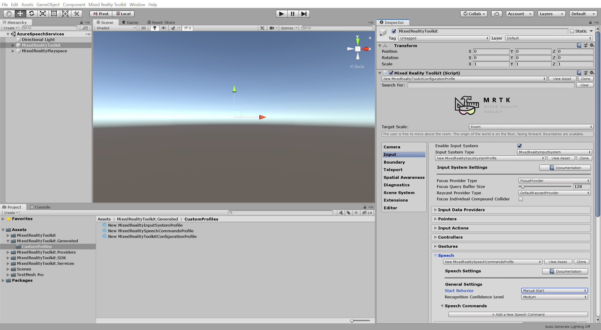
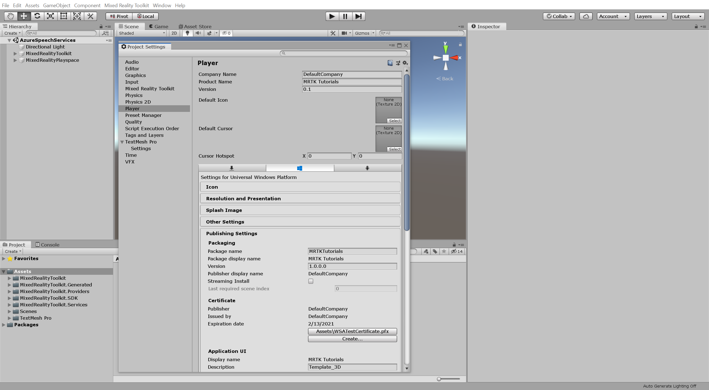
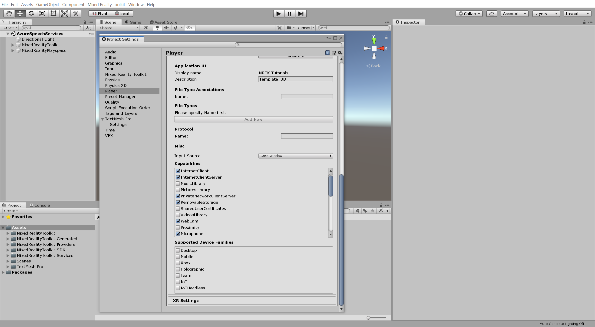
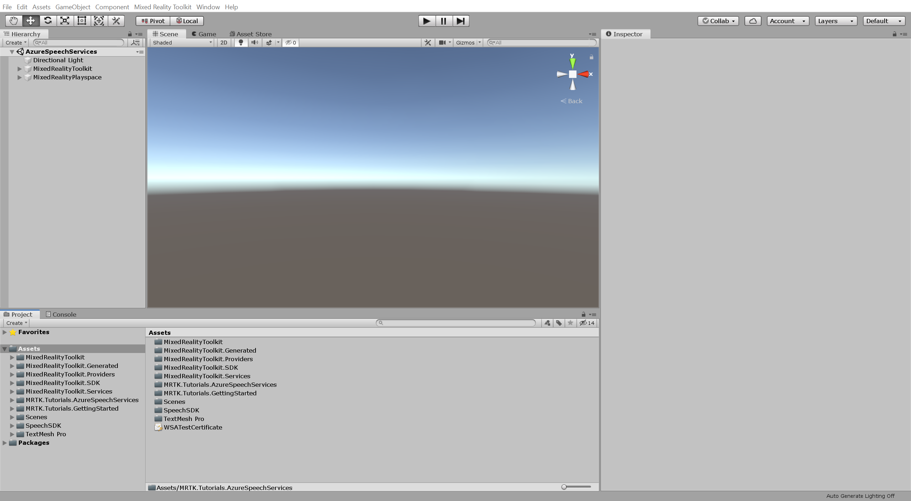
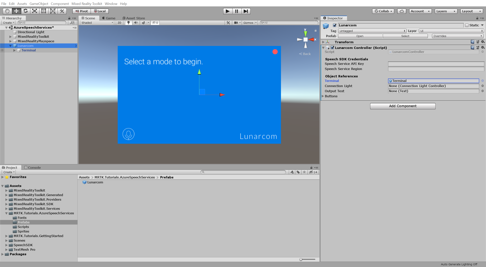
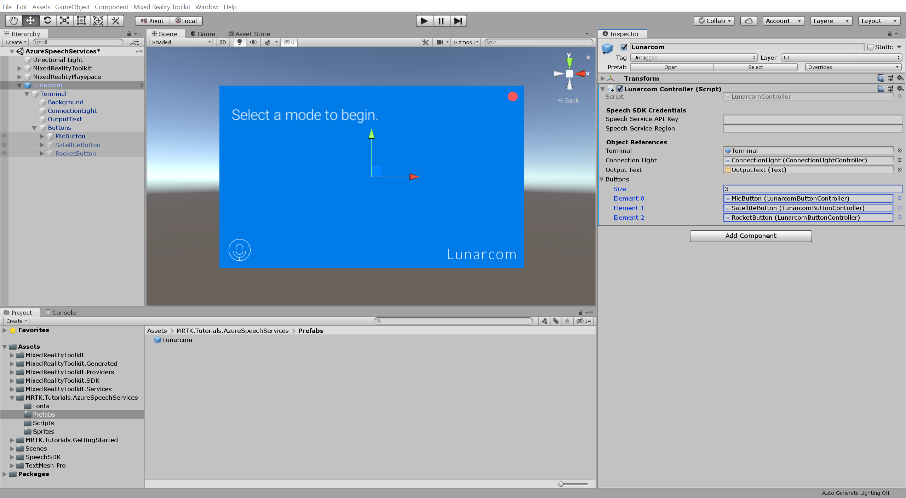
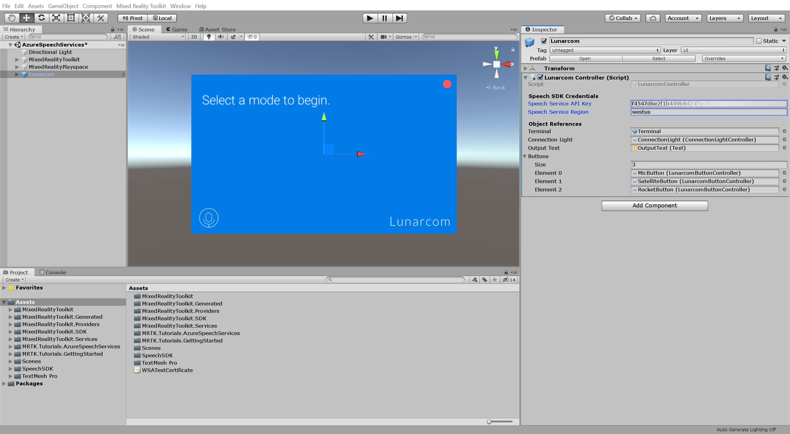
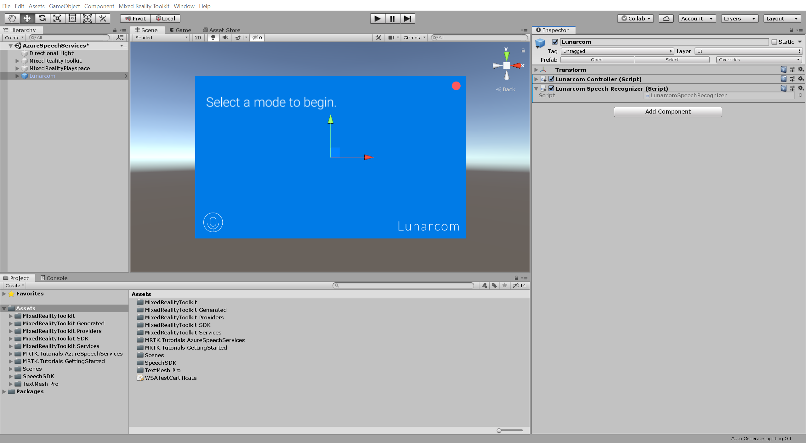
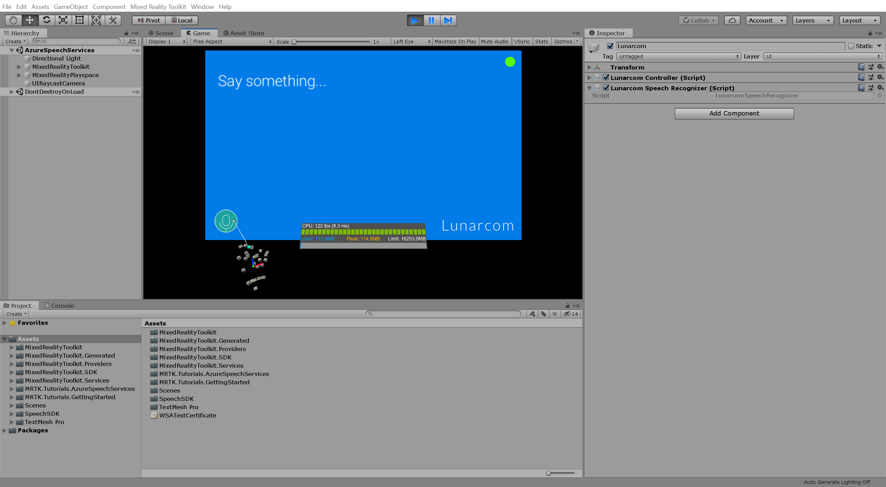

# 1. Integrating and using speech recognition and transcription

## Overview

In this tutorial series, you will create a Mixed Reality application that explores the use of Azure Speech Services with the HoloLens 2. When you complete this tutorial series, you will be able to use your device's microphone to transcribe speech to text in real time, translate your speech into other languages, and leverage the Intent recognition feature to understand voice commands using artificial intelligence.

## Objectives

* Learn how to integrate Azure Speech Services with a HoloLens 2 application
* Learn how to use speech recognition to transcribe text

## Prerequisites

>[!TIP]
>If you have not completed the [Getting started tutorials](mrlearning-base.md) series yet, it's recommended that you complete those tutorials first.

* A Windows 10 PC configured with the correct [tools installed](install-the-tools.md)
* Windows 10 SDK 10.0.18362.0 or later
* Some basic C# programming ability
* A HoloLens 2 device [configured for development](using-visual-studio.md#enabling-developer-mode)
* <a href="https://docs.unity3d.com/Manual/GettingStartedInstallingHub.html" target="_blank">Unity Hub</a> with Unity 2019.2.X installed and the Universal Windows Platform Build Support module added

> [!IMPORTANT]
> The recommended Unity version for this tutorial series is Unity 2019.2.X. This supersedes any Unity version requirements or recommendations stated in the prerequisites linked above.

## Creating and preparing the Unity project

In this section, you will create a new Unity project and get it ready for MRTK development.

For this, first follow the [Initializing your project and first application](mrlearning-base-ch1.md), excluding the [Build your application to your device](mrlearning-base-ch1.md#build-your-application-to-your-device) instructions, which includes the following steps:

1. [Create new Unity project](mrlearning-base-ch1.md#create-new-unity-project) and give it a suitable name, for example, *MRTK Tutorials*

2. [Configure the Unity project for Windows Mixed Reality](mrlearning-base-ch1.md#configure-the-unity-project-for-windows-mixed-reality)

3. [Import TextMesh Pro Essential Resources](mrlearning-base-ch1.md#import-textmesh-pro-essential-resources)

4. [Import the Mixed Reality Toolkit](mrlearning-base-ch1.md#import-the-mixed-reality-toolkit)

5. [Configure the Unity project for the Mixed Reality Toolkit](mrlearning-base-ch1.md#configure-the-unity-project-for-the-mixed-reality-toolkit)

6. [Add the Mixed Reality Toolkit to the Unity scene](mrlearning-base-ch1.md#configure-the-mixed-reality-toolkit) and give the scene a suitable name, for example, *AzureSpeechServices*

Then follow the [How to configure the Mixed Reality Toolkit Profiles (Change Spatial Awareness Display Option)](mrlearning-base-ch2.md#how-to-configure-the-mixed-reality-toolkit-profiles-change-spatial-awareness-display-option) instructions to change the MRTK configuration profile for your scene to the **DefaultHoloLens2ConfigurationProfile** and change the display options for the spatial awareness mesh to **Occlusion**.

> [!CAUTION]
> As mentioned in the [Configure the Unity project for the Mixed Reality Toolkit](mrlearning-base-ch1.md#configure-the-unity-project-for-the-mixed-reality-toolkit) instructions linked above, it is strongly recommended to not enable MSBuild for Unity.

## Configuring the speech commands start behavior

Because you will use the Speech SDK for speech recognition and transcription you need to configure the MRTK Speech Commands so they do not interfere with the Speech SDK functionality. To achieve this you can change the speech commands start behavior from Auto Start to Manual Start.

With the **MixedRealityToolkit** object selected in the Hierarchy window, in the Inspector window, select the **Input** tab, clone the **DefaultHoloLens2InputSystemProfile** and the **DefaultMixedRealitySpeechCommandsProfile**, and then change the speech commands **Start Behavior** to **Manual Start**:

> [!TIP]
> For a reminder on how to clone and configure MRTK profiles, you can refer to the [How to configure the Mixed Reality Toolkit Profiles (Change Spatial Awareness Display Option)](mrlearning-base-ch2.md#how-to-configure-the-mixed-reality-toolkit-profiles-change-spatial-awareness-display-option) instructions.

## Configuring the capabilities

In the Unity menu, select **Edit** > **Project Settings...** to open the Player Settings window, then locate the **Player** >  **Publishing Settings** section:

In the  **Publishing Settings**, scroll down to the **Capabilities** section and double-check that the **InternetClient**, **Microphone**, and **SpatialPerception** capabilities, which you enabled when you created the project at the beginning of the tutorial, are enabled. Then, enable the **InternetClientServer** and **PrivateNetworkClientServer** capabilities:

## Importing the tutorial assets

Download and **import** the following Unity custom packages **in the order they are listed**:

* [Microsoft.CognitiveServices.Speech.N.N.N.unitypackage](https://aka.ms/csspeech/unitypackage) (latest version)
* [MRTK.HoloLens2.Unity.Tutorials.Assets.GettingStarted.2.3.0.2.unitypackage](https://github.com/microsoft/MixedRealityLearning/releases/download/getting-started-v2.3.0.2/MRTK.HoloLens2.Unity.Tutorials.Assets.GettingStarted.2.3.0.2.unitypackage)
* [MRTK.HoloLens2.Unity.Tutorials.Assets.AzureSpeechServices.2.3.0.0.unitypackage](https://github.com/microsoft/MixedRealityLearning/releases/download/azure-speech-services-v2.3.0.0/MRTK.HoloLens2.Unity.Tutorials.Assets.AzureSpeechServices.2.3.0.0.unitypackage)

> [!TIP]
> For a reminder on how to import a Unity custom package, you can refer to the [Import the Mixed Reality Toolkit](mrlearning-base-ch1.md#import-the-mixed-reality-toolkit) instructions.

After you have imported the tutorial assets your Project window should look similar to this:

## Preparing the scene

In this section, you will prepare the scene by adding the tutorial prefab and configure the Lunarcom Controller (Script) component to control your scene.

In the Project window, navigate to **Assets** > **MRTK.Tutorials.AzureSpeechServices** > **Prefabs** folder and drag the **Lunarcom** prefab into the Hierarchy window to add it to your scene:

With the **Lunarcom** object still selected in the Hierarchy window, in the Inspector window, use the **Add Component** button to add the **Lunarcom Controller (Script)** component to the Lunarcom object:

> [!NOTE]
> The Lunarcom Controller (Script) component is not part of MRTK. It was provided with this tutorial's assets.

With the **Lunarcom** object still selected, expand it to reveal its child objects, then drag the **Terminal** object into the Lunarcom Controller (Script) component's **Terminal** field:

With the **Lunarcom** object still selected, expand the Terminal object to reveal its child objects, then drag the **ConnectionLight** object into the Lunarcom Controller (Script) component's **Connection Light** field and the **OutputText** object into the **Output Text** field:

With the **Lunarcom** object still selected, expand the Buttons object to reveal its child objects, and then in the Inspector window, expand the **Buttons** list, set its **Size** to 3, and drag the **MicButton**, **SatelliteButton**, and **RocketButton** objects into the **Element** 0, 1, and 2 fields respectively:

## Connecting the Unity project to the Azure resource

To use Azure Speech Services, you need to create an Azure resource and obtain an API key for the Speech Service. Follow the [Try the Speech service for free](https://docs.microsoft.com/azure/cognitive-services/speech-service/get-started) instructions and make a note of your service region (also known as Location) and API key (also known as Key1 or Key2).

In the Hierarchy window, select the **Lunarcom** object, then in the Inspector window, locate the **Lunarcom Controller (Script)** component's **Speech SDK Credentials** section and configure it as follows:

* In the **Speech Service API Key** field, enter your API key (Key1 or Key2)
* In the **Speech Service Region** field, enter your service region (Location) using lowercase letters and spaces removed

## Using speech recognition to transcribe speech

In the Hierarchy window, select the **Lunarcom** object, then in the Inspector window, use the **Add Component** button to add the **Lunarcom Speech Recognizer (Script)** component to the Lunarcom object:

> [!NOTE]
> The Lunarcom Speech Recognizer (Script) component is not part of MRTK. It was provided with this tutorial's assets.

If you now enter Game mode, you can test the speech recognition by first pressing the microphone button:

Then, assuming your computer has a microphone, when you say something, your speech will be transcribed on the terminal panel:

> [!CAUTION]
> The application needs to connect to Azure, so make sure your computer/device is connected to the internet.

## Congratulations

You have implemented speech recognition powered by Azure. Run the application on your device to ensure the feature is working properly.

In the next tutorial, you will learn how to execute commands using Azure speech recognition.

[Next tutorial: 2. Using speech recognition to execute commands](mrlearning-speechSDK-ch2.md)
