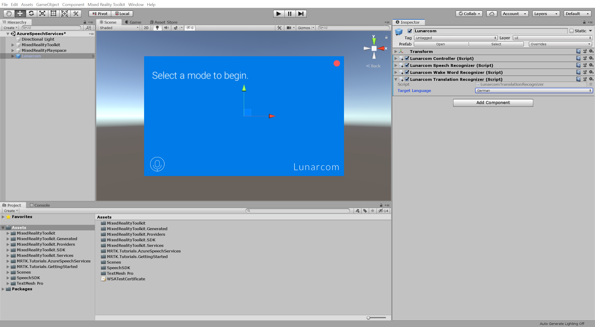

# 3. Adding the Azure Cognitive Services speech translation component

In this tutorial, you will add speech translation to your project which will allow you to translate and transcribed your speech into three different languages.

## Objectives

* Learn how to integrate Azure speech translation

## Instructions

In the Hierarchy window, select the **Lunarcom** object, then in the Inspector window, use the **Add Component** button to add the **Lunarcom Translation Recognizer (Script)** component to the Lunarcom object and configure it as follows:

* Change the **Target Language** to a language of your choosing, for example, _German_

> [!NOTE]
> The Lunarcom Translation Recognizer (Script) component is not part of MRTK. It was provided with this tutorial's assets.

If you now enter Game mode, you can test the speech translation by first pressing the satellite button. Then, assuming your computer has a microphone, when you say something, your speech will be translated into the chosen language and transcribed on the terminal panel:

> [!CAUTION]
> The application needs to connect to Azure, so make sure your computer/device is connected to the internet.

## Congratulations

Your project can now successfully translate the words you speak into several different languages. Run the application on your device to ensure the feature is working properly.

[Next tutorial: 4. Setting up intent and natural language understanding](mrlearning-speechSDK-ch4.md)
