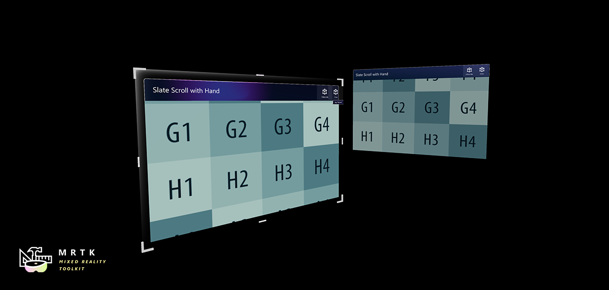
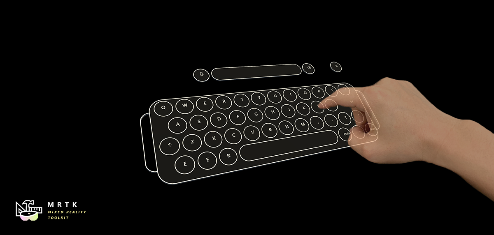

# Getting started with MRTK v2

## MRTK Getting Started Guide
See the [MRTK getting started guide](https://microsoft.github.io/MixedRealityToolkit-Unity/Documentation/GettingStartedWithTheMRTK.html) for information on getting started with MRTK V2.

## What is MRTK?
The MRTK is an amazing open source toolkit that has been around since the HoloLens was first released, and would not be where it is today without the hard work of our developer community who have contributed to it. Over the past 3 years, we have listened to the feedback of our developer community, and built MRTK v2 to take the biggest concerns into account.  

The MRTK v2 with Unity is an open source cross-platform development kit for mixed reality applications.  MRTK version 2 is intended to accelerate development of applications targeting Microsoft HoloLens, Windows Mixed Reality immersive (VR) headsets and OpenVR platform. The project is aimed at reducing barriers to entry to create mixed reality applications and contribute back to the community as we all grow. 

See the [MRTK documentation portal](https://microsoft.github.io/MixedRealityToolkit-Unity/README.html) to learn more.

## Feature Areas
|  Input System &nbsp;  |  Hand Tracking (HoloLens 2) |  Eye Tracking (HoloLens 2) |  Voice Commanding |  Gaze + Select (HoloLens) |  Teleportation &nbsp; |
| :--- | :--- | :--- | :--- | :--- | :--- |
|  UI Controls &nbsp; |  Solver and Interactions |  Controller Visualization |  Spatial Understanding |  Diagnostic Tool &nbsp; |  MRTK Standard Shader |

## UI and Interaction Building blocks
|   [Button](https://github.com/Microsoft/MixedRealityToolkit-Unity/blob/mrtk_release/Documentation/README_Button.md) |  [Bounding Box](https://github.com/Microsoft/MixedRealityToolkit-Unity/blob/mrtk_release/Documentation/README_BoundingBox.md) |  [Manipulation Handler](https://github.com/Microsoft/MixedRealityToolkit-Unity/blob/mrtk_release/Documentation/README_ManipulationHandler.md) |
|:--- | :--- | :--- |
| A button control which supports various input methods including HoloLens 2's articulated hand | Standard UI for manipulating objects in 3D space | Script for manipulating objects with one or two hands |
|   [Slate](https://github.com/Microsoft/MixedRealityToolkit-Unity/blob/mrtk_release/Documentation/README_Slate.md) |  [System Keyboard](https://github.com/Microsoft/MixedRealityToolkit-Unity/blob/mrtk_release/Documentation/README_SystemKeyboard.md) |  [Interactable](https://github.com/Microsoft/MixedRealityToolkit-Unity/blob/mrtk_release/Documentation/README_Interactable.md) |
| 2D style plane which supports scrolling with articulated hand input | Example script of using the system keyboard in Unity  | A script for making objects interactable with visual states and theme support |
|   [Solver](https://github.com/Microsoft/MixedRealityToolkit-Unity/blob/mrtk_release/Documentation/README_Solver.md) |  [Object Collection](https://github.com/Microsoft/MixedRealityToolkit-Unity/blob/mrtk_release/Documentation/README_ObjectCollection.md) |  [Tooltip](https://github.com/Microsoft/MixedRealityToolkit-Unity/blob/mrtk_release/Documentation/README_Tooltip.md) |
| Various object positioning behaviors such as tag-along, body-lock, constant view size and surface magnetism | Script for lay out an array of objects in a three-dimensional shape | Annotation UI with flexible anchor/pivot system which can be used for labeling motion controllers and object. |
|   [App Bar](https://github.com/Microsoft/MixedRealityToolkit-Unity/blob/mrtk_release/Documentation/README_AppBar.md) |  [Pointers](https://github.com/Microsoft/MixedRealityToolkit-Unity/blob/mrtk_release/Documentation/README_Pointers.md) |  [Fingertip Visualization](https://github.com/Microsoft/MixedRealityToolkit-Unity/blob/mrtk_release/Documentation/README_FingertipVisualization.md) |
| UI for Bounding Box's manual activation | Learn about various types of pointers | Visual affordance on the fingertip which improves the confidence for the direct interaction |
|   [Eye Tracking: Target Selection](https://github.com/Microsoft/MixedRealityToolkit-Unity/blob/mrtk_release/Documentation/EyeTracking/EyeTracking_TargetSelection.md) |  [Eye Tracking: Navigation](https://github.com/Microsoft/MixedRealityToolkit-Unity/blob/mrtk_release/Documentation/EyeTracking/EyeTracking_Navigation.md) |  [Eye Tracking: Heat Map](https://github.com/Microsoft/MixedRealityToolkit-Unity/blob/mrtk_release/Documentation/EyeTracking/EyeTracking_Visualization.md) |
| Combine eyes, voice and hand input to quickly and effortlessly select holograms across your scene | Learn how to auto scroll text or fluently zoom into focused content based on what you are looking at| Examples for logging, loading and visualizing what users have been looking at in your app |

## Minimum Requirement for MRTK v2
* Unity 2018.3.x
* Microsoft Visual Studio 2017 or later
* Windows SDK 18362+ 
* Windows 10 1803 or later

## New with MRTK v2
We want to stress our commitment to these platform tools.  In fact, we leveraged MRTK version 2 to develop our inbox experiences, such as the setup experience (OOBE) and our Mixed Reality Learning application.  You can also expect to see new HoloLens 2 capabilities first exposed through MRTK because we believe it’s the best way to develop on our platform. 

### Modular
We have built it in a modular way, so that you do not need to take every bit of the toolkit into your project.  There are actually a few benefits to this.  It keeps your project size smaller, as well as makes it easier to manage.  On top of that, because it’s built with scriptable objects and is interface driven, it’s also possible for you to replace the components that are included with your own, to support other services, systems, and platforms.

### Cross-platform
Speaking of other platforms, it has cross-platform support.  And while this doesn’t mean every single platform is supported out of the box, we have made sure none of the toolkit code will break when you switch your build target to other platforms.  The robustness and extensibility with the modular design sets you up on a good path to be able to support multiple platforms, such as ARCore, ARKit, and OpenVR.

### Performant
Working with mobile platforms, we constructed it with performance in mind.  This is super important, and we wanted to ensure that the tools are not going to work against you.

## See also
* [MRTK getting started guide](https://microsoft.github.io/MixedRealityToolkit-Unity/Documentation/GettingStartedWithTheMRTK.html)
* [MRTK documentation home](https://microsoft.github.io/MixedRealityToolkit-Unity/README.html)
* [Install the tools](install-the-tools.md)
* [Porting from HTK/MRTK to MRTK version 2](mrtk-porting-guide.md)
