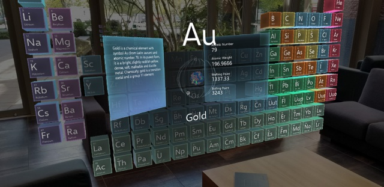
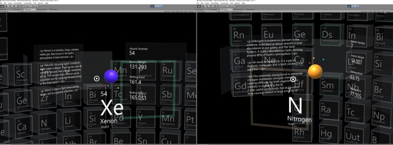
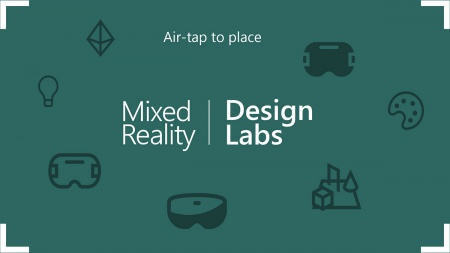
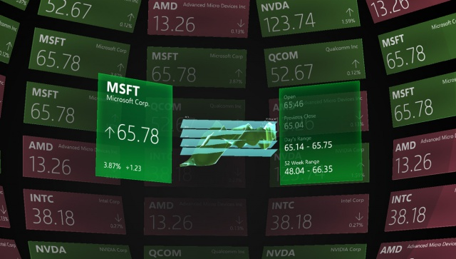
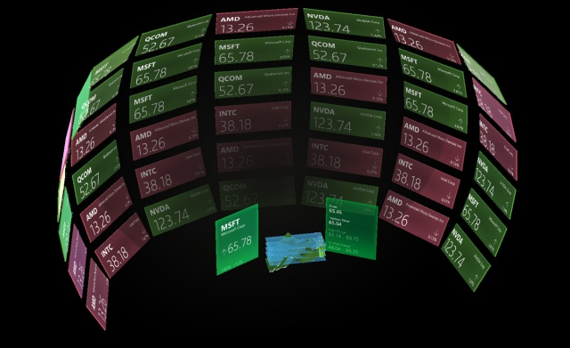
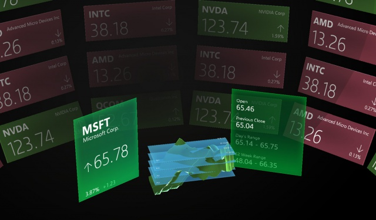
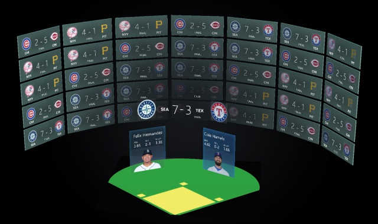
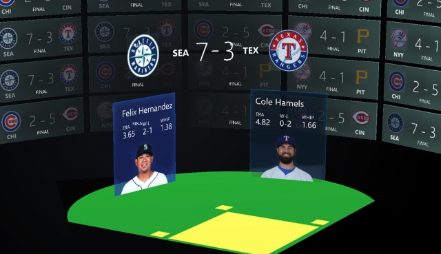
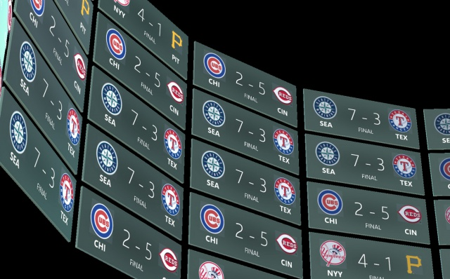

# Periodic Table of the Elements

*This article discusses an exploratory sample we’ve created in the [Mixed Reality Design Labs](https://github.com/Microsoft/MRDesignLabs_Unity), a place where we share our learnings about and suggestions for mixed reality app development. Our design-related articles and code will evolve as we make new discoveries.*

[Periodic Table of the Elements](https://github.com/Microsoft/MRDesignLabs_Unity_PeriodicTable) is a open-source sample app from Microsoft's Mixed Reality Design Labs. With this project, you can learn how to lay out an array of objects in 3D space with various surface types using an **[Object collection](object-collection.md)**. Also learn how to create interactable objects that respond to standard inputs from HoloLens. You can use this project's components to create your own mixed reality app experience.

## About the app

Periodic Table of the Elements visualizes the chemical elements and each of their properties in a 3D space. It incorporates the basic interactions of HoloLens such as gaze and air tap. Users can learn about the elements with animated 3D models. They can visually understand an element's electron shell and its nucleus - which is composed of protons and neutrons.

## Background

After I first experienced HoloLens, a periodic table app was an idea I knew that I wanted to experiment with in mixed reality. Since each element has many data points that are displayed with text, I thought it would be great subject matter for exploring typographic composition in a 3D space. Being able to visualize the element's electron model was another interesting part of this project.

## Design

For the default view of the periodic table, I imagined three-dimensional boxes that would contain the electron model of each element. The surface of each box would be translucent so that the user could get a rough idea of the element's volume. With gaze and air tap, the user could open up a detailed view of each element. To make the transition between table view and detail view smooth and natural, I made it similar to the physical interaction of a box opening in real life.

In detail view, I wanted to visualize the information of each element with beautifully rendered text in 3D space. The animated 3D electron model is displayed in the center area and can be viewed from different angles.

The user can change the surface type by air tapping the buttons on the bottom of the table - they can switch between plane, cylinder, sphere and scatter.

## Common controls and patterns used in this app

**Interactable object (Button)**

[Interactable object](interactable-object.md) is an object which can respond to basic HoloLens inputs. It is provided as a prefab/script which you can easily apply to any object. For example, you can make a coffee cup in your scene interactable and respond to inputs such as gaze, air tap, navigation and manipulation gestures. [Learn more](interactable-object.md)

 
**Object collection**

[Object collection](object-collection.md) is an object which helps you lay out multiple objects in various shapes. It supports plane, cylinder, sphere and scatter. You can configure additional properties such as radius, number of rows and the spacing. [Learn more](object-collection.md)

 
**Fitbox**

By default, holograms will be placed in the location where the user is gazing at the moment the application is launched. This sometimes leads to unwanted result such as holograms being placed behind a wall or in the middle of a table. A fitbox allows a user to use gaze to determine the location where the hologram will be placed. It is made with a simple PNG image texture which can be easily customized with your own images or 3D objects.

## Technical details

You can find scripts and prefabs for the Periodic Table of the Elements app on the [Mixed Reality Design Labs GitHub](https://github.com/Microsoft/MRDesignLabs_Unity_PeriodicTable).

## Application examples

Here are some ideas for what you could create by leveraging the components in this project.

**Stock data visualization app**

Using the same controls and interaction model as the Periodic Table of the Elements sample, you could build an app which visualizes stock market data. This example uses the Object collection control to lay out stock data in a spherical shape. You can imagine a detail view where additional information about each stock could be displayed in an interesting way.

 
**Sports app**

This is an example of visualizing sports data using Object collection and other components from the Periodic Table of the Elements sample app.

## About the author

<table style="border-collapse:collapse" padding-left="0px">
<tr>
<td style="border-style: none" width="60px"></td>
<td style="border-style: none"><b>Dong Yoon Park</b> UX Designer @Microsoft</td>
</tr>
</table>

## See also

[Interactable object](interactable-object.md)

[Object collection](object-collection.md)
