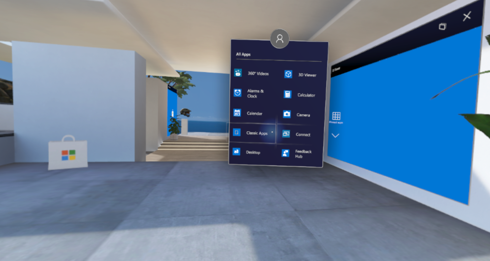

# Release notes - May 2019

The **Windows 10 May 2019 Update** (also known as 19H1) includes new features for Windows Mixed Reality (VR) headsets, such as the ability to launch Win32 applications in the mixed reality home. HoloLens (1st gen) is in Long Term Servicing (LTS), with servicing updates to be released monthly.

To update to the latest release on PC for Windows Mixed Reality immersive (VR) headsets, open the **Settings** app, go to **Update & Security**, then select the **Check for updates** button. On a Windows 10 PC, you can also manually install the Windows 10 May 2019 Update using the [Windows media creation tool](https://www.microsoft.com/software-download/windows10).

**Latest release for Desktop:** Windows 10 May 2019 Update (**10.0.18362.116**) 

## New features for Windows Mixed Reality immersive headsets

### Win32 Slates

#### What does it do? 
With the Windows 10 May 2019 update, we have introduced the ability to launch classic Win32 applications such as web browsers, communication applications and media streaming applications while inside Windows Mixed Reality. 

#### How to launch
To launch a Win32 application in Windows Mixed Reality, bring up the Pins Panel via the windows button on your controller and select “All Apps” on the right side of the panel.  You will find a folder called "Classic Apps", navigate into it and you will be able to select and launch most of the Win32 applications installed on your computer.

#### Please help us improve!
We continually look to improve compatibility.  If you find your favorite classic Win32 application not behaving correctly while in Windows Mixed Reality, please submit feedback via our [Feedback Hub](https://support.microsoft.com//help/4021566/windows-10-send-feedback-to-microsoft-with-feedback-hub).

## HoloLens (1st gen) Long Term Servicing

HoloLens (1st gen) is entering Long Term Servicing (LTS) state. Future updates will focus on issue and security fixes, while maintaining feature parity with the [Windows 10 October 2018 release](release-notes-october-2018.md) for HoloLens (also known as RS5). 

## Provide feedback and report issues

Please use the [Feedback Hub app on your Windows 10 PC](give-us-feedback.md) or your HoloLens device to provide feedback and report issues. Using Feedback Hub ensures that all necessary diagnostics information is included to help our engineers quickly debug and resolve the problem.

>[!NOTE]
>Be sure to accept the prompt that asks whether you’d like Feedback Hub to access your Documents folder (select **Yes** when prompted).

## Prior release notes

* [Release notes - May 2019](release-notes-may-2019.md)
* [Release notes - October 2018](release-notes-october-2018.md)
* [Release notes - April 2018](release-notes-april-2018.md)
* [Release notes - October 2017](release-notes-october-2017.md)
* [Release notes - August 2016](release-notes-august-2016.md)
* [Release notes - May 2016](release-notes-may-2016.md)
* [Release notes - March 2016](release-notes-march-2016.md)

## See also
* [Immersive headset support (external link)](https://docs.microsoft.com/windows/mixed-reality/enthusiast-guide/troubleshooting-windows-mixed-reality)
* [HoloLens support (external link)](https://support.microsoft.com/products/hololens)
* [Install the tools](install-the-tools.md)
* [Give us feedback](give-us-feedback.md)

