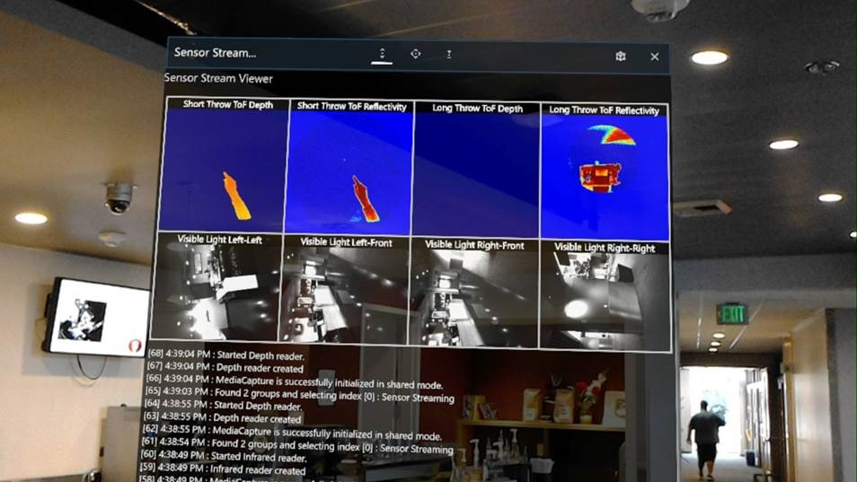

# HoloLens Research mode

Research mode was introduced in the 1st Generation HoloLens to give access to key sensors on the device, specifically for research applications that are not intended for deployment.  Research mode for HoloLens 2 retains the capabilities of HoloLens 1, adding access to additional streams:

* **Visible Light Environment Tracking Cameras** - Gray-scale cameras used by the system for head tracking and map building.
* **Depth Camera** – Operates in two modes:  
    + AHAT, high-frequency (45 FPS) near-depth sensing used for hand tracking. Differently from the 1st version short-throw mode, AHAT gives pseudo-depth with phase wrap beyond 1 meter. 
    + Long-throw, low-frequency (1-5 FPS) far-depth sensing used by [Spatial Mapping](spatial-mapping.md)

* **Two versions of the IR-reflectivity stream** - Used by the HoloLens to compute depth. These images are illuminated by infrared and unaffected by ambient visible light.

If you're using a HoloLens 2 you also have access to the additional inputs below:

* **Accelerometer** – Used by the system to determine linear acceleration along the X, Y and Z axes and gravity.
* **Gyro** – Used by the system to determine rotations.
* **Magnetometer** – Used by the system to estimate absolute orientation.

> [!IMPORTANT]
> Research Mode is currently in Public Preview. Samples, tutorials, and full API documentation will be available at EECV 2020 in the Research Mode Git repository.

 
*A mixed reality capture of a test application that displays the eight sensor streams available in Research mode*

## Usage

Research mode is designed for academic and industrial researchers exploring new ideas in the fields of Computer Vision and Robotics.  It's not intended for applications deployed in enterprise environments or available through the Microsoft Store or other distribution channels.

Additionally, Microsoft doesn't provide assurances that research mode or equivalent functionality is going to be supported in future hardware or OS updates. However, this shouldn't stop you from using it to develop and test new ideas!

## Security and performance

Be aware that enabling research mode uses more battery power than using the HoloLens 2 under normal conditions. This is true even if the application using the research mode features is not running.  Enabling this mode can also lower the overall security of your device because applications may misuse sensor data.  You can find more information on device security in the [HoloLens security FAQ](https://docs.microsoft.com/hololens/hololens-faq-security).  

## Device support
<table>
    <colgroup>
    <col width="33%" />
    <col width="33%" />
    <col width="33%" /> 
    </colgroup>
    <tr>
        <td><strong>Feature</strong></td>
        <td><a href="https://docs.microsoft.com/hololens/hololens1-hardware"><strong>HoloLens 1st Gen</strong></a></td>
        <td><a href="https://docs.microsoft.com/hololens/hololens2-hardware"><strong>HoloLens 2</strong></a></td>
    </tr>
     <tr>
        <td>Head Tracking Cameras</td>
        <td>✔️</td>
        <td>✔️</td>
    </tr>
    <tr>
        <td>Depth & IR Camera</td>
        <td>✔️</td>
        <td>✔️</td>
    </tr>
    <tr>
        <td>Accelerometer</td>
        <td>❌</td>
        <td>✔️</td>
    </tr>
    <tr>
        <td>Gyroscope</td>
        <td>❌</td>
        <td>✔️</td>
    </tr>
    <tr>
        <td>Magnetometer</td>
        <td>❌</td>
        <td>✔️</td>
    </tr>
</table>

## Enabling Research Mode (HoloLens 1st Gen and HoloLens 2)

Research mode is an extension of Developer Mode. Before starting, the developer features of the device need to be enabled to access the research mode settings: 

* Open **Start Menu > Settings** and select **Updates**.
* Select **For Developers** and enable **Developer Mode**.
* Scroll down and enable **Device Portal**.

After the developer features  are enabled, [connect to the device portal](https://docs.microsoft.com/windows/uwp/debug-test-perf/device-portal-hololens) to enable the research mode features:

* Go to **System > Research mode** in the **Device Portal**.
* Select **Allow access to sensor stream**.
* Restart the device from the **Power** menu item at the top of the page.

Once you've restarted the device, the applications loaded through the **Device Portal** can access Research mode streams.

 
*Research mode window in the HoloLens Device Portal*

> [!IMPORTANT]
> Research Mode for HoloLens 2 is available beginning with build 19041.1356. If you need access in an earlier build, sign up for our [Insider Preview](https://docs.microsoft.com/hololens/hololens-insider) program.

### Using sensor data in your apps

Applications can access the sensor stream data in the same way that photo and video camera streams are accessed through [Media Foundation](https://msdn.microsoft.com/library/windows/desktop/ms694197). 

All APIs that work for HoloLens development are also available in Research mode. In particular, the application  knows precisely where HoloLens is in 6DoF space at each sensor frame capture time.

You can find sample applications on how to access the various Research mode streams, how to use the [intrinsics and extrinsics](https://docs.microsoft.com/windows/mixed-reality/locatable-camera#locating-the-device-camera-in-the-world), and how to record streams in the [HoloLensForCV GitHub repo](https://github.com/Microsoft/HoloLensForCV) repo.

 > [!NOTE]
 > At this time, the HoloLensForCV sample doesn't work on HoloLens 2.

## Support

Please use the [issue tracker](https://github.com/Microsoft/HololensForCV/issues) in the HoloLensForCV repository to post feedback and track known issues.

## See also

* [Microsoft Media Foundation](https://msdn.microsoft.com/library/windows/desktop/ms694197)
* [HoloLensForCV GitHub repo](https://github.com/Microsoft/HoloLensForCV)
* [Using the Windows Device Portal](using-the-windows-device-portal.md)
