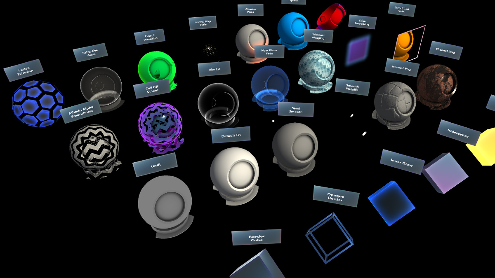
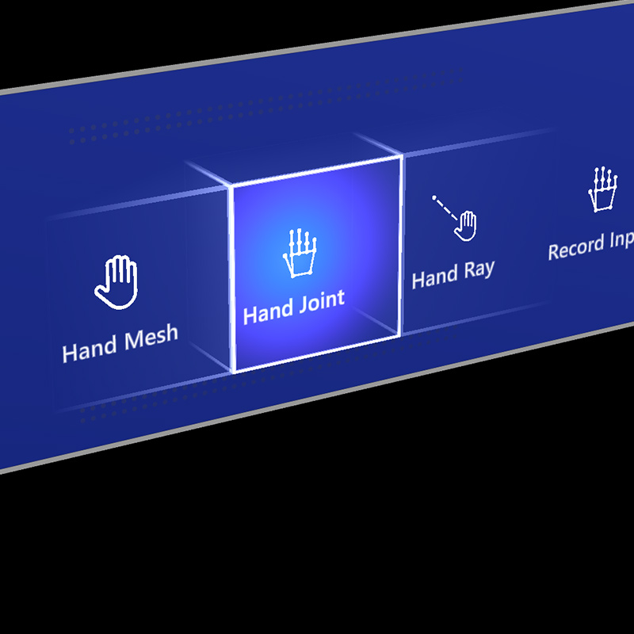

# Shader

Since holographic objects are mixed with the physical ones in the environment, it's important to provide visual cues in mixed reality. The MRTK Standard shader provides various types of visual effects that can be used with holograms. The MRTK Standard shading system utilizes a single, flexible shader that can achieve visuals similar to Unity's Standard Shader, implements [Fluent Design System principles](https://www.microsoft.com/design/fluent/#/), and remain performant on mixed reality devices.
 

## Examples of visual effects using MRTK Standard shader 
:::row:::
    :::column:::
        
       **Proximity light** 
    :::column-end:::
    :::column:::
        
        **Border light** 
    :::column-end:::
:::row-end:::

 

---

## MRTK Standard shader in MRTK (Mixed Reality Toolkit) for Unity

* [MRTK - Standard shader](https://microsoft.github.io/MixedRealityToolkit-Unity/Documentation/README_MRTKStandardShader.html)

 

---

## See also

* [Cursors](cursors.md)
* [Hand ray](point-and-commit.md)
* [Button](button.md)
* [Interactable object](interactable-object.md)
* [Bounding box and App bar](app-bar-and-bounding-box.md)
* [Manipulation](direct-manipulation.md)
* [Hand menu](hand-menu.md)
* [Near menu](near-menu.md)
* [Object collection](object-collection.md)
* [Voice command](voice-input.md)
* [Keyboard](keyboard.md)
* [Tooltip](tooltip.md)
* [Slate](slate.md)
* [Slider](slider.md)
* [Billboarding and tag-along](billboarding-and-tag-along.md)
* [Displaying progress](progress.md)
* [Surface magnetism](surface-magnetism.md)
