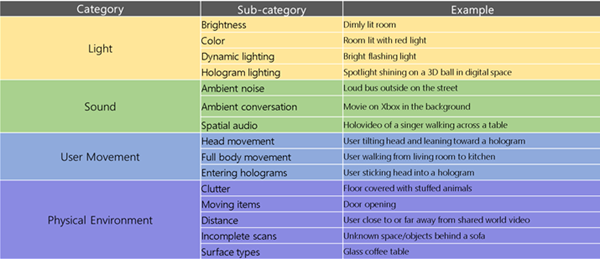
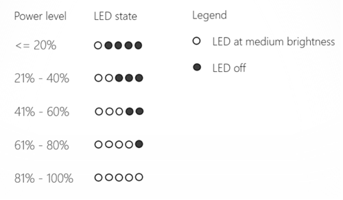

# Testing your app on HoloLens

Testing HoloLens applications are very similar to testing Windows applications. All the usual areas should be considered (functionality, interoperability, performance, security, reliability, etc.). There are, however, some areas that require special handling or attention to details that are not usually observed in PC or phone apps. Holographic apps need to run smoothly in a diverse set of environments. They also need to maintain performance and user comfort at all times. Guidance for testing these areas is detailed in this topic.

## Performance

Holographic apps need to run smoothly in a diverse set of environments. They also need to maintain performance and user comfort at all times. Performance is so important to the user's experience with a Holographic app that we have an entire topic devoted to it. Please make sure you read and follow the [Understanding Performance for Mixed Reality](understanding-performance-for-mixed-reality.md)

## Testing 3D in 3D
1. **Test your app in as many different spaces as possible.** Try in big rooms, small rooms, bathrooms, kitchens, bedrooms, offices, etc. Also take into consideration rooms with non standard features such as non vertical walls, curved walls, non-horizontal ceilings. Does it work well when transitioning between rooms, floors, going through hallways or stairs?
2. **Test your app in different lighting conditions.** Does it respond properly to different environmental conditions such as lighting, black surfaces, transparent/reflective surfaces such as mirrors, glass walls, etc.
3. **Test your app in different motion conditions.** Put on device and try your scenarios in various states of motion. Does it respond properly to different movement or steady state?
4. **Test how your app works from different angles.** If you have a world locked hologram, what happens if your user walks behind it? What happens if something comes between the user and the hologram? What if the user looks at the hologram from above or below?
5. **Use spatial and audio cues.** Make sure your app uses these to prevent the user from getting lost.
6. **Test your app at different levels of ambient noise.** If you've implemented voice commands, try invoking them with varying levels of ambient noise.
7. **Test your app seated and standing**. Make sure to test from both seating and standing positions.
8. **Test your app from different distances**. Can UI elements be read and interacted with from far away? Does your app react to users getting too close to your holograms?
9. **Test your app against common app bar interactions**. All app tiles and 2D universal apps have a [app bar](navigating-the-windows-mixed-reality-home.md#moving-and-adjusting-apps) that allows you to control how the app is positioned in the Mixed World. Make sure clicking Remove terminates your app process gracefully and that the Back button is supported within the context of your 2D universal app. Try scaling and moving your app in [Adjust mode](navigating-the-windows-mixed-reality-home.md#moving-and-adjusting-apps) both while it is active, and while it is a suspended app tile.

### Environmental test matrix

## Comfort
1. **Clip planes.** Be attentive to where [holograms are rendered](hologram-stability.md#hologram-render-distances).
2. **Avoid virtual movement inconsistent with actual head movement.** Avoid moving the camera in a way that is not representative of the user's actual motion. If your app requires moving the user through a scene, make the motion predictable, minimize acceleration, and let the user control the movement.
3. **Follow the hologram quality guidelines.** Performant apps that implement the [hologram quality guidance](hologram-stability.md) are less likely to result in user discomfort.
4. **Distribute holograms horizontally rather than vertically.** Forcing the user to spend extended periods of time looking up or down can lead to fatigue in the neck.

## Input

### Interaction models

Make sure the hologram interactions work with your chosen [interaction model](interaction-fundamentals.md).
It's also a good idea to validate with different accessories, like mouse and keyboard, if these accessories are needed to support accessibility.

**Validate when your app has a different behavior with mouse and touch.** This will identify inconsistencies and help with design decisions to make the experience more natural for users. For example, triggering an action based on hover.

### Custom voice commands

[Voice input](voice-input.md) is a natural form of interaction. The user experience can be magical or confusing depending on your choice of commands and how you expose them. As a rule, you should not use system voice commands such as "Select" or "Hey Cortana" as custom commands. Here are a few points to consider:
1. **Avoid using commands that sound similar.** This can potentially trigger the incorrect command.
2. **Choose phonetically rich words when possible.** This will minimize and/or avoid false activations.

### Peripherals

Users can interact with your App through [peripherals](hardware-accessories.md). Apps don't need to do anything special to take advantage of that capability, however there are a couple things worth checking.
1. **Validate custom interactions.** Things like custom keyboard shortcuts for your app.
2. **Validate switching input types.** Attempting to use multiple input methods to complete a task, such as voice, gesture, mouse, and keyboard all in the same scenario.

## System integration

### Battery

Test your application without a power source connected to understand how quickly it drains the battery. One can easily understand the battery state by looking at Power LED readings. 

 

*LED states that indicate battery power*

### Power state transitions

Validate key scenarios work as expected when transitioning between power states. For example, does the application remain at its original position? Does it correctly persist its state? Does it continue to function as expected?
1. **Stand-by / Resume.** To enter standby, one can press and release the power button immediately. The device also will enter standby automatically after 3 minutes of inactivity. To resume from standby, one can press and release the power button immediately. The device will also resume if you connect or disconnect it from a power source.
2. **Shutdown / Restart.** To shutdown, press and hold the power button continuously for 6 seconds. To restart, press the power button.

### Multi-app scenarios

Validate core app functionality when switching between apps, especially if you've implemented a background task. Copy/Paste and Cortana integration are also worth checking where applicable.

## Telemetry

Use telemetry and analytics to guide you. Integrating analytics into your app will help you get insights about your app from your Beta testers and end-users. This data can be used to help optimize your app before submission to the Store and for future updates. There are many analytics options out there. If you're not sure where to start, check out [App Insights](https://www.visualstudio.com/products/application-insights-vs.aspx).

Questions to consider:
1. How are users using the space?
2. How is the app placing objects in the world - can you detect problems?
3. How much time do they spend on different stages of the application?
4. How much time do they spend in the app?
5. What are the most common usage paths the users are trying?
6. Are users hitting unexpected states and/or errors?

## Emulator and simulated input

The [HoloLens emulator](using-the-hololens-emulator.md) is a great way to efficiently test your Holographic app with a variety of simulated user characteristics and spaces. Here are some suggestions for effectively using the emulator to test your app:
1. **Use the emulator's virtual rooms to expand your testing.** The emulator comes with a set of virtual rooms that you can use to test your app in even more environments.
2. **Use the emulator to look at your app from all angles.** The PageUp/PageDn keys will make your simulated user taller or shorter.
3. **Test your app with a real HoloLens.** The HoloLens Emulator is a great tool to help you quickly iterate on an app and catch new bugs, but make sure you also test on a physical HoloLens before submitting to the Windows Store. This is important to ensure that the performance and experience are great on real hardware.

## Automated testing with Perception Simulation

Some app developers might want to automate testing of their apps. Beyond simple unit tests, you can use the [perception simulation](perception-simulation.md) stack in HoloLens to automate human and world input to your app. The perception simulation API can send simulated input to either the HoloLens emulator or a physical HoloLens.

## Windows App Certification Kit

To give your app the best chance of being [published on the Windows Store](submitting-an-app-to-the-microsoft-store.md), validate and test it locally before you submit it for certification. If your app targets the Windows.Holographic device family, the [Windows App Certification Kit](https://msdn.microsoft.com/library/windows/apps/xaml/mt186449.aspx) will only run local static analysis tests on your PC. No tests will be run on your HoloLens.

## See also
* [Submitting an app to the Windows Store](submitting-an-app-to-the-microsoft-store.md)
