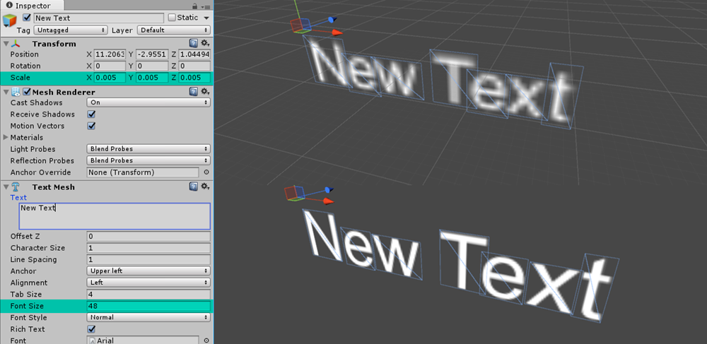
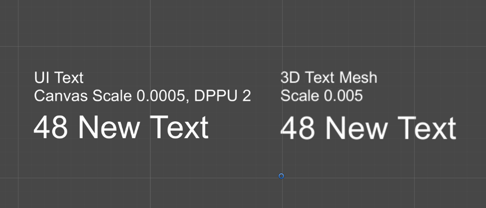
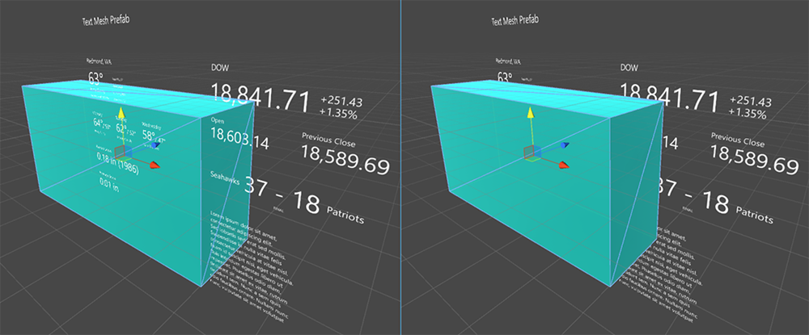

# Text in Unity

Text is one of the most important components in holographic apps. To display text in Unity, there are three types of text components you can use — UI Text, 3D Text Mesh, and Text Mesh Pro. By default UI Text and 3D Text Mesh appear blurry and are too big. You need to tweak a few variables to get sharp, high-quality text that has a manageable size in HoloLens. By applying scaling factor to get proper dimensions when using the UI Text and 3D Text Mesh components, you can achieve better rendering quality.

 
*Blurry default text in Unity*

## Working with Unity's 3D Text(Text Mesh) and UI Text

Unity assumes all new elements added to a scene are 1 Unity Unit in size, or 100% transform scale, which translates to about 1 meter on HoloLens. In the case of fonts, the bounding box for a 3D TextMesh comes in by default at about 1 meter in height.

 
*Default Unity 3D Text (Text Mesh) occupies 1 Unity Unit which is 1 meter*

 
Most visual designers use points to define font sizes in the real world. There are about 2835 (2,834.645666399962) points in 1 meter. Based on the point system conversion to 1 meter and Unity's default Text Mesh font size of 13, the simple math of 13 divided by 2835 equals 0.0046 (0.004586111116 to be exact) provides a good standard scale to start with (some may wish to round to 0.005). Scaling the text object or container to these values will not only allow for the 1:1 conversion of font sizes in a design program, but also provides a standard so you can maintain consistency throughout your application or game.

 
*Scaling values for the Unity 3D Text and UI Text*

 
*Unity 3D Text Mesh with optimized values*

 
When adding a UI or canvas based text element to a scene, the size disparity is greater still. The differences in the two sizes is about 1000%, which would bring the scale factor for UI based text components to 0.00046 (0.0004586111116 to be exact) or 0.0005 for the rounded value.

 
*Unity UI Text with optimized values*

 

>[!NOTE]
>The default value of any font may be affected by the texture size of that font or how the font was imported into Unity. These tests were performed based on the default Arial font in Unity, as well as one other imported font.

## Working with Text Mesh Pro

With Unity's Text Mesh Pro, you can secure the text rendering quality. It supports crisp text outline regardless of the distance using the [SDF(Signed Distance Field)](https://steamcdn-a.akamaihd.net/apps/valve/2007/SIGGRAPH2007_AlphaTestedMagnification.pdf) technique. Using the same calculation method that we used above for the 3D Text Mesh and UI Text, we can find proper scaling values to use conventional typographic Point. Since the default 3D Text Mesh Pro font with the size 36 shows the bounding of 2.5 Unity Unit(2.5m), we can use scaling value 0.005 to use the Point size.

 
*Scaling values for the Unity 3D Text and UI Text*

## Recommended text size

As you can expect, type sizes that we use on a PC or a tablet device (typically between 12–32pt) look quite small at a distance of 2 meters. It depends on the characteristics of each font, but in general the recommended minimum viewing angle and the font height for legibility are around 0.35°-0.4°/12.21-13.97mm based on our user research studies. It is about 35-40pt with the scaling factor introduced above. 

For the near interaction at 0.45m(45cm), the minimum legible font's viewing angle and the height are 0.4°-0.5° / 3.14–3.9mm. It is about 9-12pt with the scaling factor introduced above.

The minimum legible font size at 45cm (direct manipulation distance)
- 0.4°-0.5° = 3.14–3.9mm = 8.9–11.13pt

The minimum legible font size at 2m
- 0.35°-0.4° = 12.21–13.97mm = 34.63-39.58pt

The comfortably legible font size at 45cm (direct manipulation distance)
- 0.65°-0.8° = 5.1-6.3mm = 14.47-17.8pt

The comfortably legible font size at 2m
- 0.6°-0.75° at 2.0m = 20.9-26.2mm = 59.4-74.2pt

Segoe UI (the default font for Windows) works well in most cases. However, avoid using light or semi light font families in small size since thin vertical strokes will vibrate and it will degrade the legibility. Modern fonts with enough stroke thickness work well. For example, Helvetica and Arial look gorgeous and are very legible in HoloLens with regular or bold weights.

## Sharp text rendering quality with proper dimension

Based on these scaling factors, we have created [two prefabs - UI Text and 3D Text Mesh](https://github.com/Microsoft/MixedRealityToolkit-Unity/tree/htk_release/Assets/HoloToolkit/UX/Prefabs). Developers can use these prefabs to get sharp text and consistent font size.

 
*Sharp text rendering quality with proper dimension*

## Shader with occlusion support

Unity's default font material does not support occlusion. Because of this, you will see the text behind the objects by default. We have included a simple [shader that supports the occlusion](https://github.com/Microsoft/MixedRealityToolkit-Unity/tree/htk_release/Assets/HoloToolkit/UX/Shaders). The image below shows the text with default font material (left) and the text with proper occlusion (right).

 
*Shader with occlusion support*

## See also
* [Text Prefab in the MixedRealityToolkit](https://github.com/Microsoft/MixedRealityToolkit-Unity/tree/htk_release/Assets/HoloToolkit/UX/Prefabs)
* [Sample text layout prefab and scene](https://github.com/Microsoft/MixedRealityToolkit-Unity/tree/htk_release/Assets/HoloToolkit-Examples/UX/Scenes)
* [Typography](typography.md)

 
