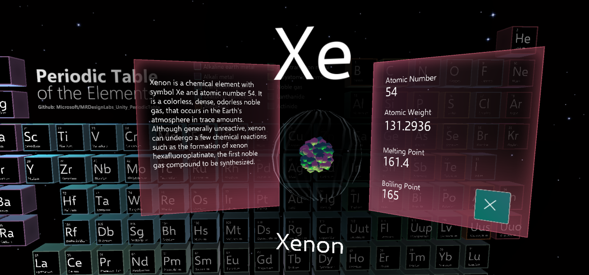
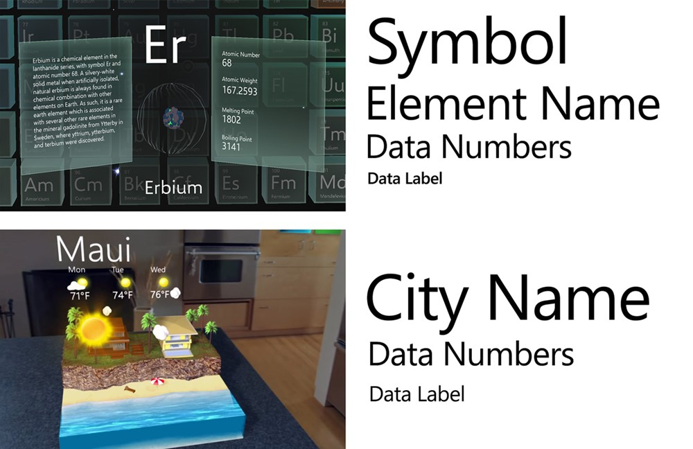
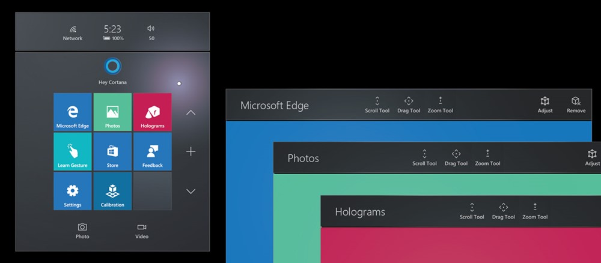
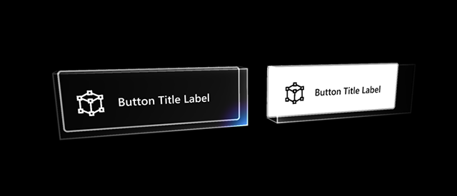
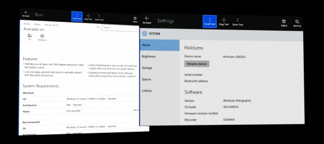
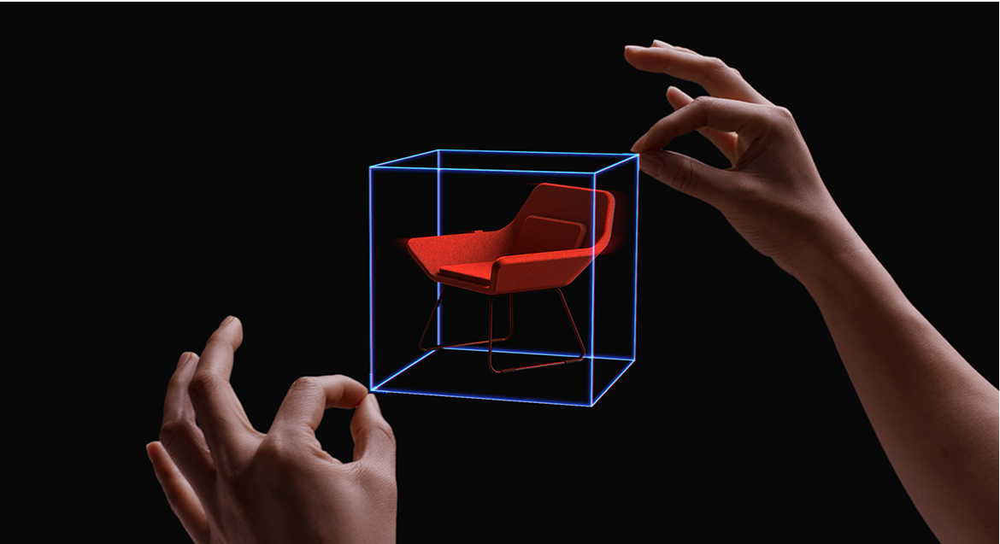
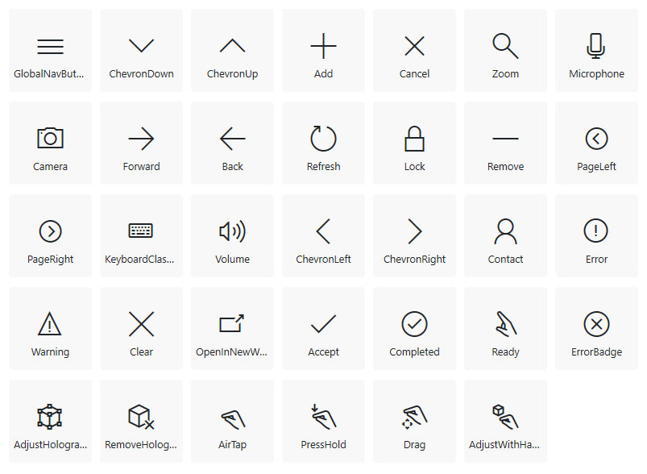

# Typography

 

Text is an important element for delivering information in your app experience. Just like typography on 2D screens, the goal is to be clear and readable. With the three-dimensional aspect of mixed reality, there is an opportunity to affect the text and the overall user experience in an even greater way.

When we talk about type in 3D, we tend to think extruded, volumetric 3D text. Except for some logotype designs and a few other limited applications, extruded text tends to degrade the readability of the text. Even though we are designing experiences for 3D, we use 2D for the type because it is more legible and easier to read.

In HoloLens, type is constructed with holograms using light based on the additive color system. Just like other holograms, type can be placed in the actual environment where it can be world locked and observed from any angle. The [parallax](https://en.wikipedia.org/wiki/Parallax) effect between the type and the environment also adds depth to the experience.

## Typography in mixed reality

Typographic rules in mixed reality are no different from anywhere else. Text in both the physical world and the virtual world needs to be legible and readable. Text could be on a wall or superimposed on a physical object. It could be floating along with a digital user interface. Regardless of the context, we apply the same typographic rules for reading and recognition.

### Create clear hierarchy

Build contrast and hierarchy by using different type sizes and weights. Defining a type ramp and following it throughout the app experience will provide a great user experience with consistent information hierarchy.

 
*Define your type ramp and follow it throughout the app experience*

### Limit your fonts

Avoid using more than two different font families in a single context. This will break the harmony and consistency of your experience and make it harder to consume information. In HoloLens, since the information is overlaid on top of the physical environment, using too many font styles will degrade the experience. Segoe UI is the font for all Microsoft digital designs. It is used consistently in the Windows Mixed Reality shell. You can download the Segoe UI font file from the [Windows design toolkit page](https://docs.microsoft.com/windows/uwp/design-downloads/).

[More information about the Segoe UI typeface](https://docs.microsoft.com/windows/uwp/design/style/typography)

### Avoid thin font weights

Avoid using light or semilight font weights for type sizes under 42pt since thin vertical strokes will vibrate and degrade legibility. Modern fonts with enough stroke thickness work well. For example, Helvetica and Arial are very legible in HoloLens using regular or bold weights.

### Color

In HoloLens, since the holograms are constructed with an additive light system, white text is highly legible. You can find examples of white text on the Start menu and the App bar. Even though white text works well without a back plate on HoloLens, a complex physical background could make the type difficult to read. To improve the user's focus and minimize the distraction from a physical background, we recommend using white text on a dark or colored back plate.

 

*Examples of white text on a dark or colored back plate.*
 

To use dark text, you should use a bright back plate to make it readable. In additive color systems, black is displayed as transparent. This means you will not be able to see the black text without a colored back plate.

:::row:::
    :::column:::
         
        *Examples of white on black and black on white text* 
    :::column-end:::
    :::column:::
         
        *Examples of black text in the system apps - Store and Settings* 
    :::column-end:::
:::row-end:::

 

---

## Recommended font size

As you can expect, type sizes that we use on a PC or a tablet device (typically between 12–32pt) look quite small at a distance of 2 meters. It depends on the characteristics of each font, but in general the recommended minimum viewing angle and the font height for legibility are around 0.35°-0.4°/12.21-13.97mm based on our user research studies. It is about 35-40pt with the scaling factor introduced in [Text in Unity](text-in-unity.md) page. 

For the near interaction at 0.45m(45cm), the minimum legible font's viewing angle and the height are 0.4°-0.5° / 3.14–3.9mm. It is about 9-12pt with the scaling factor introduced in [Text in Unity](text-in-unity.md).

*Content at near and far interaction range*

### The minimum legible font size
| Distance | Viewing angle | Text height | Font size** |
|---------|---------|---------|---------|
| 45cm (direct manipulation distance) | 0.4°-0.5° | 3.14–3.9mm | 8.9–11.13pt |
| 2m | 0.35°-0.4° | 12.21–13.97mm | 34.63-39.58pt |

### The comfortably legible font size
| Distance | Viewing angle | Text height | Font size** |
|---------|---------|---------|---------|
| 45cm (direct manipulation distance) | 0.65°-0.8° | 5.1-6.3mm | 14.47-17.8pt |
| 2m | 0.6°-0.75° | 20.9-26.2mm | 59.4-74.2pt |

Segoe UI (the default font for Windows) works well in most cases. However, avoid using light or semi light font families in small size since thin vertical strokes will vibrate and it will degrade the legibility. Modern fonts with enough stroke thickness work well. For example, Helvetica and Arial look gorgeous and are very legible in HoloLens with regular or bold weights.

**For more detailed information about text size calculation in Unity, please refer to the page [Text in Unity](text-in-unity.md)

*Viewing distance, angle, and text height*

 

---

## Resources

:::row:::
    :::column:::
    ### [Segoe fonts](https://download.microsoft.com/download/1/B/C/1BCF071A-78EE-4968-ACBE-15461C274B61/Segoe%20fonts%20v1705.zip) 
    (Zip file) 
    ### [HoloLens font](https://download.microsoft.com/download/3/8/D/38D659E2-4B9C-413A-B2E7-1956181DC427/Hololens%20font.zip) 
    (Zip file) 
     
    *Image: The HoloLens font gives you the symbol glyphs used in Windows Mixed Reality.*
    :::column-end:::
        :::column:::
         
    :::column-end:::
:::row-end:::

 

---

## See also
* [Text in Unity](text-in-unity.md)
* [Color, light and materials](color,-light-and-materials.md)
