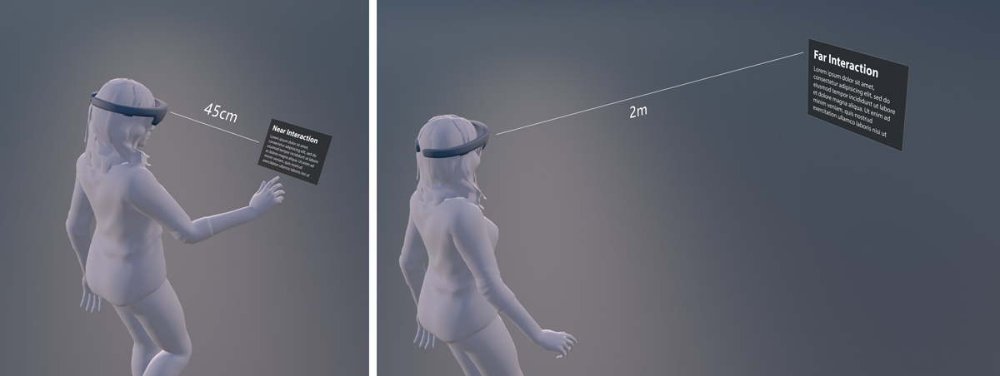

# Typography

Text is an important element for delivering information in your app experience. Just like typography on 2D screens, the goal is to be clear and readable. With the three-dimensional aspect of mixed reality, there is an opportunity to affect the text and the overall user experience in an even greater way.

When we talk about type in 3D, we tend to think extruded, volumetric 3D text. Except for some logotype designs and a few other limited applications, extruded text tends to degrade the readability of the text. Even though we are designing experiences for 3D, we use 2D for the type because it is more legible and easier to read.

In HoloLens, type is constructed with holograms using light based on the additive color system. Just like other holograms, type can be placed in the actual environment where it can be world locked and observed from any angle. The [parallax](https://en.wikipedia.org/wiki/Parallax) effect between the type and the environment also adds depth to the experience.

## Typography in mixed reality

Typographic rules in mixed reality are no different from anywhere else. Text in both the physical world and the virtual world needs to be legible and readable. Text could be on a wall or superimposed on a physical object. It could be floating along with a digital user interface. Regardless of the context, we apply the same typographic rules for reading and recognition.

### Create clear hierarchy

Build contrast and hierarchy by using different type sizes and weights. Defining a type ramp and following it throughout the app experience will provide a great user experience with consistent information hierarchy.

### Limit your fonts

Avoid using more than two different font families in a single context. This will break the harmony and consistency of your experience and make it harder to consume information. In HoloLens, since the information is overlaid on top of the physical environment, using too many font styles will degrade the experience. Segoe UI is the font for all Microsoft digital designs. It is used consistently in the Windows Mixed Reality shell. You can download the Segoe UI font file from the [Windows design toolkit page](https://docs.microsoft.com/en-us/windows/uwp/design-downloads/).

[More information about the Segoe UI typeface](https://docs.microsoft.com/en-us/windows/uwp/style/typography)

### Avoid thin font weights

Avoid using light or semilight font weights for type sizes under 42pt since thin vertical strokes will vibrate and degrade legibility. Modern fonts with enough stroke thickness work well. For example, Helvetica and Arial are very legible in HoloLens using regular or bold weights.

### Color

In HoloLens, since the holograms are constructed with an additive light system, white text is highly legible. You can find examples of white text on the Start menu and the App bar. Even though white text works well without a back plate on HoloLens, a complex physical background could make the type difficult to read. To improve the user's focus and minimize the distraction from a physical background, we recommend using white text on a dark or colored back plate.

 

We recommend using white text on a dark or colored back plate.

 

To use dark text, you should use a bright back plate to make it readable. In additive color systems, black is displayed as transparent. This means you will not be able to see the black text without a colored back plate.

 

You can find examples of black text in UWP apps such as the Store or Settings.

## Recommended font size

Two meters is the optimal distance for displaying text.

Since mixed reality involves three-dimensional depth, it is not always easy to communicate the size of the font. For the user's comfort, two meters is the optimal distance for placing holograms. We can use this distance as a basis to find the optimal font size.

As you can expect, type sizes that we use on a PC or a tablet device (typically between 12–32pt) look quite small at a distance of 2 meters. It depends on the characteristics of each font, but in general, the recommended minimum type size for legibility without stroke vibration is around 30pt. If your app is supposed to be used at a closer distance, smaller type sizes could be used. **The point size is based on the Unity's 3D Text Mesh and UI Text. For the detailed metrics and scaling factors, please refer to [Text in Unity](text-in-unity.md).**

## Resources
* [Segoe fonts](http://download.microsoft.com/download/1/B/C/1BCF071A-78EE-4968-ACBE-15461C274B61/Segoe%20fonts%20v1705.zip)
* [HoloLens font](http://download.microsoft.com/download/3/8/D/38D659E2-4B9C-413A-B2E7-1956181DC427/Hololens%20font.zip)

The HoloLens font gives you the symbol glyphs used in Windows Mixed Reality.

## See also
* [Text in Unity](http://holodocsfuture/index.php?title=Text_in_Unity&action=edit&redlink=1)
* [Color, light and materials](color,-light-and-materials.md)
