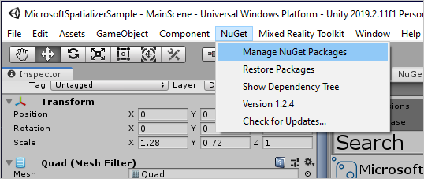

# Adding spatial audio to your project

This tutorial sequence shows:
* How to use HRTF offload on HoloLens 2 in Unity
* How to enable reverb when using HRTF offload

The [Microsoft Spatializer GitHub repository](https://microsoft.visualstudio.com/Analog/_git/mixedreality.spatialaudio.unity?path=%2F&version=GBdevelop) has a completed Unity project of this tutorial sequence. 

For our recommendations on when it can be helpful to spatialize sounds, see [spatial sound design](https://docs.microsoft.com/windows/mixed-reality/spatial-sound-design).

## Objectives
In this first chapter, you'll:
* Create a Unity project and import MRTK
* Import the Microsoft spatializer plugin
* Enable the Microsoft spatializer plugin
* Enable spatial audio on your developer workstation

## Create a project and add NuGet for Unity
Start with an empty Unity project, then add and configure NuGet for Unity:
1. Download the latest [NuGetForUnity .unitypackage](https://github.com/GlitchEnzo/NuGetForUnity/releases/latest)
2. In the Unity menu bar, click **Assets -> Import Package -> Custom Package...** and install the NuGetForUnity package:


3. In your Unity project folder, open **Assets/NuGet.config** in a text editor and add the following to the **packageSources** element: 
> [!NOTE]
> TODO: Change the link below to the public NuGet feed before publishing this page

```xml
<add key="Spatializer" value="https://microsoft.pkgs.visualstudio.com/Analog/_packaging/Microsoft-SpatialAudio-Unity/nuget/v2/" />
```

After editing, your NuGet.config will look like this:
> [!NOTE]
> TODO: Change the link below to the public NuGet feed before publishing this page

```xml
<?xml version="1.0" encoding="utf-8"?>
<configuration>
    <packageSources>
       <add key="NuGet" value="http://www.nuget.org/api/v2/" />
       <add key="Spatializer" value="https://microsoft.pkgs.visualstudio.com/Analog/_packaging/Microsoft-SpatialAudio-Unity/nuget/v2/" />
    </packageSources>
    <disabledPackageSources />
    <activePackageSource>
       <add key="All" value="(Aggregate source)" />
    </activePackageSource>
    <config>
       <add key="repositoryPath" value="./Packages" />
       <add key="DefaultPushSource" value="http://www.nuget.org/api/v2/" />
    </config>
</configuration>
```

## Install the MRTK and Microsoft Spatializer plugins
Using NuGet for Unity, install the MRTK and Microsoft Spatializer plugins:
1. In the Unity menu bar, click on **NuGet -> Manage NuGet Packages**.



2. In the **Search** box, enter "Microsoft.MixedReality.Toolkit"

3. Choose the MRTK core package: **Microsoft.MixedReality.Toolkit.Foundation**

4. In the **Search** box, enter "Microsoft.SpatialAudio"

5. Choose the Microsoft Spatializer package: **Microsoft.SpatialAudio.Spatializer.Unity**

[MRTK NuGet Package](https://microsoft.github.io/MixedRealityToolkit-Unity/Documentation/MRTKNuGetPackage.html) has additional context and details.

## Set up MRTK in your project

1. Open the Build Settings window by going to **File -> Build Settings**.

2. Select the _Universal Windows Platform_ and click **Switch Platform**.

3. Click **Player Settings** in the **Build Window** to open the **Player Settings** properties in the **Inspector** pane.
    * Under **XR Settings**, check the **Virtual Reality Supported** checkbox
    * Under **XR Settings**, change the **Stereo Rendering Mode** to **Single Pass Instanced**.
    * Under **Publishing Settings**, check the **Spatial Perception** checkbox in the **Capabilities** section

4. On the menu bar, click **Mixed Reality Toolkit -> Add to Scene and Configure..** to add MRTK to your scene.

[Chapter 1 of the MR Learning Base Module](https://docs.microsoft.com/en-us/windows/mixed-reality/mrlearning-base-ch1) has pictures and additional guidance.

## Enable the Microsoft Spatializer plugin
Enable the **Microsoft Spatializer** plugin. Open **Edit -> Project Settings -> Audio**, and change **Spatializer Plugin** to "Microsoft Spatializer". The **Audio** section of the **Project Settings** will now look like this:


## Enable spatial audio on your workstation
On desktop versions of Windows, spatial audio is disabled by default. Right-click on the volume icon in the task bar and choose **Spatial sound -> Windows Sonic for Headphones**.


## Next steps
Continue on to [Unity spatial audio chapter 2](unity-spatial-audio-ch2.md) to spatialize button interaction sounds.

