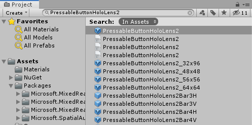
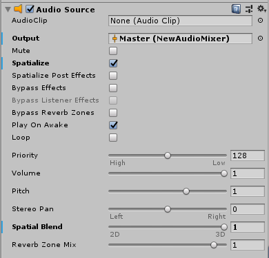
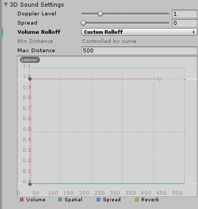
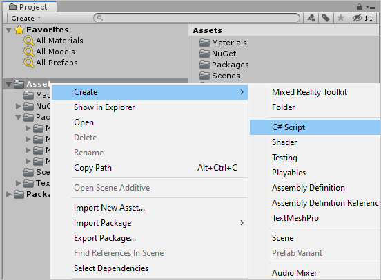

# Enabling and disabling spatial audio on a game object

## Objectives
In this third chapter of the spatial audio module of the HoloLens 2 tutorials, you'll:
* Add a button and spatialize the button click sounds
* Use the button to enable/disable spatialization on the video

## Add a button
In the **Project** pane, select **Assets** and type "PressableButtonHoloLens2" in the search bar:



The prefab is the entry represented by a blue box, rather than a white box. Drag the prefab named **PressableButtonHoloLens2** into your hierarchy. In the **Inspector** pane for your new button, set the **Position** property to (0,-0.4,2). This places the button just below the video quad. The **Transform** component of the button will look like this:


## Enable and spatialize audio feedback for button interactions
In this step, you'll spatialize the audio feedback for the button. For related design suggestions, see https://docs.microsoft.com/en-us/windows/mixed-reality/spatial-sound-design. 

To enable the button click sound, and spatialize it, open the **Inspector** pane for the **PressableButtonHoloLens2** in your **Hierarchy**. Then:
* Find the **Audio Source** component
* For the **Output** property, click the selector and choose your mixer
* Check the **Spatialize** checkbox
* Move the **Spatial Blend** slider to 3D (1).

After these changes, the **Audio Source** component of your **PressableButtonHoloLens2** will look like this:



Unity includes a **Volume** curve under the **3D Sound Settings** section of the **Audio Source** properties on the **Inspector** pane. This is used to make sounds quieter when the source is farther from the listener. We recommend disabling this for UI interaction sounds such as button clicks; see [spatial sound design](spatial-sound-design.md) for more details. Adjust these settings on the **Audio Source** of the **PressableButtonHoloLens2**:
* Set the **Volume Rolloff** property to Linear
* Drag the endpoint on the **Volume** curve (the red curve) from '0' on the y axis up to '1'
* Adjust the shape of the **Volume** curve to be flat across the entire X axis

After these changes, the **3D Sound Settings** section of the **Audio Source** properties of the **PressableButtonHoloLens2** will look like this:



## Use the button to enable/disable spatialization on the video
Right-click in the **Project** pane and create a new C# script by choosing **Create -> C# Script**. Name your script "SpatializeOnOff".



Double-click the script in the **Project** pane to open it in Visual Studio. Replace the default script contents with the following:

```c#
using System.Collections;
using System.Collections.Generic;
using UnityEngine;
using UnityEngine.Audio;

public class SpatializeOnOff : MonoBehaviour
{
    public AudioSource SourceObject;
    public GameObject Button;
    //public AudioMixerGroup RoomEffectGroup;
    //public AudioMixerGroup MasterGroup;

    private bool m_IsSpatialized;
    private TMPro.TextMeshPro m_TextMeshPro;

    public void Start()
    {
        m_TextMeshPro = Button.GetComponent<TMPro.TextMeshPro>();
        SetSpatialized();
    }

    public void SwapSpatialization()
    {
        if (m_IsSpatialized)
        {
            SetStereo();
        }
        else
        {
            SetSpatialized();
        }
    }

    private void SetSpatialized()
    {
        m_IsSpatialized = true;
        SourceObject.spatialBlend = 1;
        m_TextMeshPro.SetText("Set Stereo");
        //SourceObject.outputAudioMixerGroup = RoomEffectGroup;
    }

    private void SetStereo()
    {
        m_IsSpatialized = false;
        SourceObject.spatialBlend = 0;
        m_TextMeshPro.SetText("Set Spatialized");
        //SourceObject.outputAudioMixerGroup = MasterGroup;
    }

}
```
> [!NOTE]
> Several lines of the script are commented out. These lines will be uncommented in [Chapter 4](unity-spatial-audio-ch4.md).

> [!NOTE]
> To enable or disable spatialization, the script only adjusts the **spatialBlend** property, leaving the **spatialization** property enabled. In this mode, Unity still applies the **Volume** curve. Otherwise, if the user were to disable spatialization when far from the source, they would hear the volume increase abruptly.
> To fully disable spatialization, you can modify the script to also adjust the **spatialization** property of the **SourceObject** variable.

On the **Inspector** pane of the **Quad**, click **Add Component** and add the **Spatialize On Off** script:


On the **Spatialize On Off** component of the **Quad**:
1. Set the **Source Object** property to the **Quad**.
2. Find the **PressableButtonHoloLens2 -> IconAndText -> TextMeshPro** subobject in the **Hierarchy**, and drag it onto the **Button** field of the Spatialize On Off component.

After these changes, the **Spatialize On Off** component of the **Quad** will look like this:


Finally, you'll need to set the button to call the **Spatialize On Off** script when the button is released. In the **Inspector** pane of the **PressableButtonHoloLens2** object, find the **Pressable Button Holo Lens 2** component.
1. Click the + icon under the **Button Released** section to add an action.
2. Drag the **Quad** from the **Hierarchy** into the target object slot.
3. Select **SpatializeOnOff.SwapSpatialization** from the action drop-down box.

After these changes, the **Pressable Button Holo Lens 2** component will look like this:


## Next steps
Try out your app on a HoloLens2 or in the Unity editor. In the app, you can now touch the button to activate and deactivate spatialization on the video. If testing in the Unity editor, press the space bar and scroll with the scroll wheel to activate hand simulation. 

Continue on to [Chapter 4](unity-spatial-audio-ch4.md) to add perceived distance to sound sources using reverb.

