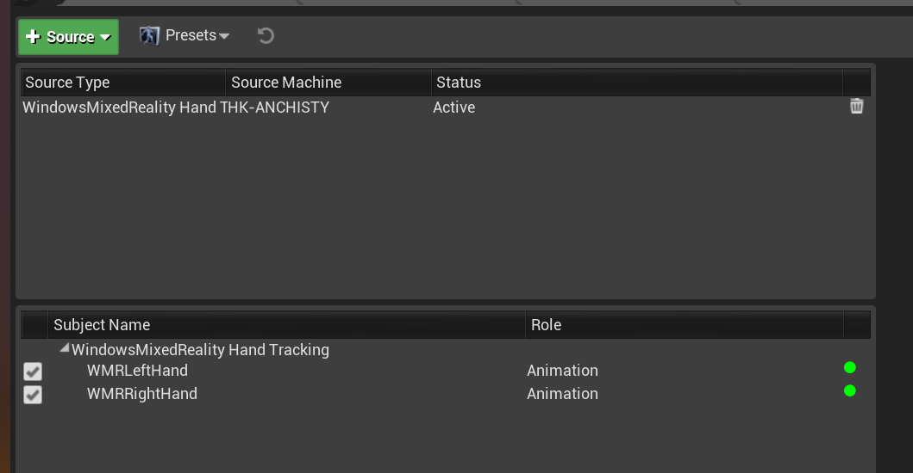
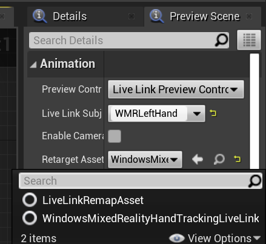
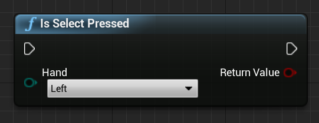
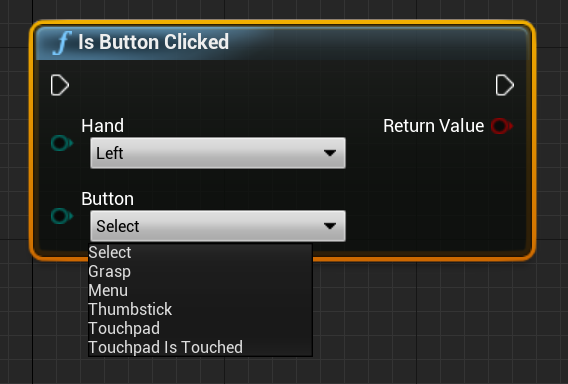
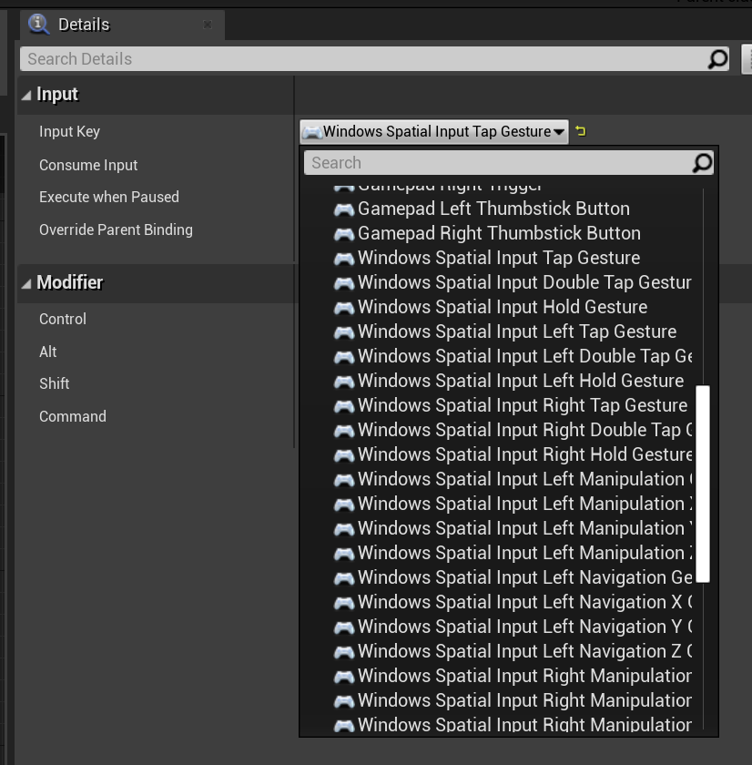

# Hand tracking in Unreal

The hand tracking system uses a person’s palms and fingers as input to Unreal. A developer can get every finger’s position and rotation, the entire palm, and even hand gestures to use in their own code. 

## Hand Pose

Using the hand pose, developers can track the hands and fingers of the active user as input. This system is exposed through both Blueprints and C++. Technical details are in the corresponding WinRT class [Windows.Perception.People.HandPose](https://docs.microsoft.com/uwp/api/windows.perception.people.handpose) This Unreal API provides the data in the format of Unreal’s coordinate system and ticks are synchronised with the Unreal Engine.

### Enum

EWMRHandKeypoint describes the Hand’s bone hierarchy. 

Blueprint:


 
C++:
```cpp
enum class EWMRHandKeypoint : uint8
{
	Palm,
	Wrist,
	ThumbMetacarpal,
	ThumbProximal,
	ThumbDistal,
	ThumbTip,
	IndexMetacarpal,
	IndexProximal,
	IndexIntermediate,
	IndexDistal,
	IndexTip,
	MiddleMetacarpal,
	MiddleProximal,
	MiddleIntermediate,
	MiddleDistal,
	MiddleTip,
	RingMetacarpal,
	RingProximal,
	RingIntermediate,
	RingDistal,
	RingTip,
	LittleMetacarpal,
	LittleProximal,
	LittleIntermediate,
	LittleDistal,
	LittleTip
};
```


The numerical values can be found in the table [Windows.Perception.People.HandJointKind](https://docs.microsoft.com/uwp/api/windows.perception.people.handjointkind)
 
### Functions

To use hand tracking functions in Blueprints, open "Hand Tracking/Windows Mixed Reality"


For C++ functions, include "WindowsMixedRealityHandTrackingFunctionLibrary.h"

BP:


 
C++:
```cpp
static bool UWindowsMixedRealityHandTrackingFunctionLibrary::SupportsHandTracking()
```

Returns true if hand tracking is supported on the device, false if hand tracking is not available.

BP:


 
C++:
```cpp
static bool UWindowsMixedRealityHandTrackingFunctionLibrary::GetHandJointTransform(EControllerHand Hand, EWMRHandKeypoint Keypoint, FTransform& OutTransform, float& OutRadius)
```

This function returns spatial data of the hand. The data updates every frame, inside a frame the returned values are cached. It is not recommended to have heavy logic on this function for performance reasons. 

* **Hand** – hand of the user, may be left or right
* **Keypoint** – the bone of the hand. 
* **Transform** – coordinates and orientation of bone’s base. To get the transform data for the end of a bone, the base of the next bone should be requested. A special Tip bone gives end of distal. 
* **Radius** — radius of the base of the bone.
* **Return Value** — true if the bone is tracked this frame, false if the bone is not tracked.

## Hand Live Link Animation
Hand poses are exposed to Animation using the Live Link plugin. The plugin documentation is [here](https://docs.unrealengine.com/en-US/Engine/Animation/LiveLinkPlugin/index.html)

If the Windows Mixed Reality and Live Link plugins are enabled, go to **Window > Live Link** to open the Live Link editor window. Click the **+ Source button** and enable Windows Mixed Reality Hand Tracking Source


 
After you enable the source and open any animation asset, the Preview Scene tab of Animation will have the following additional options (the details are in Unreal’s Live Link documentation- as the plugin is in beta, the process may change later)


 
The hand animation hierarchy is the same as in EWMRHandKeypoint. Animation can be retargeted using WindowsMixedRealityHandTrackingLiveLinkRemapAsset. 


 
It can be subclassed in the editor


 
## Hand Mesh
Mesh representing the user hands. 


 
### How to enable and configure

Developers can get direct access to hand meshes for their own purposes. This access must be enabled in ARSessionConfig: AR Settings -> World Mapping -> Generate Mesh Data from Tracked Geometry. 

Here are the default parameters for meshes:

1.	Use Mesh Data for Occlusion
2.	Generate Collision for Mesh Data
3.	Generate Nav Mesh for Mesh Data
4.	Render Mesh Data in Wireframe – debug parameter that shows generated mesh

For mixed reality projects, these parameter values will be used as the spatial mapping mesh and hand mesh defaults. Developers can change them in BP or code for any particular mesh.

### C++ API Reference 
```cpp
enum class EARObjectClassification : uint8
{
// other types 
	HandMesh,
};
```

This value is the hand mesh among all trackable objects.

```cpp
class FARSupportInterface 
{
public:
// other params 
	DECLARE_AR_SI_DELEGATE_FUNCS(OnTrackableAdded)
	DECLARE_AR_SI_DELEGATE_FUNCS(OnTrackableUpdated)
	DECLARE_AR_SI_DELEGATE_FUNCS(OnTrackableRemoved)
};
```

These delegates are called when the system detects any trackable object, including a hand mesh. 
```cpp
void UARHandMeshComponent::OnTrackableAdded(UARTrackedGeometry* Added)
```
Handlers to the delegates should have the following signature:
```cpp
UMRMeshComponent* UARTrackedGeometry::GetUnderlyingMesh()
```

Mesh data can be accessed by `UARTrackedGeometry::GetUnderlyingMesh`

### Blueprint API Reference

Developers should add an AR Trackable Notify Component to a Blueprint actor


 
Then go to the component’s details 


 
And overwrite On Add/Update/Remove Tracked Geometry with code like the below:


 
## Hand Rays

Developers can use a hand ray as a pointing device. The system is available in C++ and Blueprint. Technically it exposes [Windows.UI.Input.Spatial.SpatialPointerInteractionSourcePose](https://docs.microsoft.com/uwp/api/windows.ui.input.spatial.spatialpointerinteractionsourcepose)

It’s important to mention that since the results of all the functions changes every frame, they are all made callable. For more information about pure vs impure or callable functions, see [that](https://docs.unrealengine.com/en-US/Engine/Blueprints/UserGuide/Functions/index.html#purevs.impure)

For Blueprint open “Windows Mixed Reality HMD”


 
For C++ include "WindowsMixedRealityFunctionLibrary.h"

### Enum


```cpp
enum class EHMDInputControllerButtons : uint8
{
	Select,
	Grasp,
//......
};
```
* **Select** -– User triggered Select event, which can be triggered in HoloLens 2 by airtap or gaze and commit. Another way to trigger this event is to say “Select”. 
* **Grasp** -– User triggered Grasp event, which is triggered in HoloLens 2 by closing the user’s fingers on a hologram. 
```cpp
enum class EHMDTrackingStatus : uint8
{
	NotTracked,
	//......
	Tracked
};
```
* **NotTracked** –- the hand isn’t visible
* **Tracked** –- the hand is fully tracked

### Struct


```cpp
struct FPointerPoseInfo
{
	FVector Origin;
	FVector Direction;
	FVector Up;
	FQuat Orientation;
	EHMDTrackingStatus TrackingStatus;
};
```
* **Origin** – origin of the hand
* **Direction** – direction of the hand
* **Up** – up vector of the hand
* **Orientation** – orientation quaternion 
* **Tracking Status** – current tracking status

### Functions

All the functions should be callable on every frame for continuous monitoring. 


```cpp
static FPointerPoseInfo UWindowsMixedRealityFunctionLibrary::GetPointerPoseInfo(EControllerHand hand);
```
The function returns the full information about the hand ray direction in this frame. 


```cpp
static bool UWindowsMixedRealityFunctionLibrary::IsGrasped(EControllerHand hand);
```
Returns true if the hand is grasped in this frame. 


```cpp
static bool UWindowsMixedRealityFunctionLibrary::IsSelectPressed(EControllerHand hand);
```
Returns true if the user triggered Select in this frame.


```cpp
static bool UWindowsMixedRealityFunctionLibrary::IsButtonClicked(EControllerHand hand, EHMDInputControllerButtons button);
```
Returns true if the event/button is triggered in this frame.


```cpp
static EHMDTrackingStatus UWindowsMixedRealityFunctionLibrary::GetControllerTrackingStatus(EControllerHand hand);
```
Returns the tracking status in this frame.

## Gestures

The Hololens 2 can track spatial gestures. Details about these gestures are [here](https://docs.microsoft.com/hololens/hololens2-basic-usage) A developer can capture them as input to their mixed reality application. 

The C++ function is in "WindowsMixedRealitySpatialInputFunctionLibrary.h"

The Blueprint function is in Windows Mixed Reality Spatial Input


### Enum


```cpp
enum class ESpatialInputAxisGestureType : uint8
{
	None = 0,
	Manipulation = 1,
	Navigation = 2,
	NavigationRails = 3
};
```
This enum describes spatial axis gestures. You can read about them [here](holograms-211.md)

### Function


```cpp
static bool UWindowsMixedRealitySpatialInputFunctionLibrary::CaptureGestures(
	bool Tap = false, 
	bool Hold = false, 
	ESpatialInputAxisGestureType AxisGesture = ESpatialInputAxisGestureType::None, 
	bool NavigationAxisX = true, 
	bool NavigationAxisY = true, 
	bool NavigationAxisZ = true);
```
The function enables and disables capturing of gestures. The enabled gestures fire input events. It returns true if enabling gesture capture succeeded and false if there's an error.
Key Events



```cpp
const FKey FSpatialInputKeys::TapGesture(TapGestureName);
const FKey FSpatialInputKeys::DoubleTapGesture(DoubleTapGestureName);
const FKey FSpatialInputKeys::HoldGesture(HoldGestureName);

const FKey FSpatialInputKeys::LeftTapGesture(LeftTapGestureName);
const FKey FSpatialInputKeys::LeftDoubleTapGesture(LeftDoubleTapGestureName);
const FKey FSpatialInputKeys::LeftHoldGesture(LeftHoldGestureName);

const FKey FSpatialInputKeys::RightTapGesture(RightTapGestureName);
const FKey FSpatialInputKeys::RightDoubleTapGesture(RightDoubleTapGestureName);
const FKey FSpatialInputKeys::RightHoldGesture(RightHoldGestureName);

const FKey FSpatialInputKeys::LeftManipulationGesture(LeftManipulationGestureName);
const FKey FSpatialInputKeys::LeftManipulationXGesture(LeftManipulationXGestureName);
const FKey FSpatialInputKeys::LeftManipulationYGesture(LeftManipulationYGestureName);
const FKey FSpatialInputKeys::LeftManipulationZGesture(LeftManipulationZGestureName);

const FKey FSpatialInputKeys::LeftNavigationGesture(LeftNavigationGestureName);
const FKey FSpatialInputKeys::LeftNavigationXGesture(LeftNavigationXGestureName);
const FKey FSpatialInputKeys::LeftNavigationYGesture(LeftNavigationYGestureName);
const FKey FSpatialInputKeys::LeftNavigationZGesture(LeftNavigationZGestureName);


const FKey FSpatialInputKeys::RightManipulationGesture(RightManipulationGestureName);
const FKey FSpatialInputKeys::RightManipulationXGesture(RightManipulationXGestureName);
const FKey FSpatialInputKeys::RightManipulationYGesture(RightManipulationYGestureName);
const FKey FSpatialInputKeys::RightManipulationZGesture(RightManipulationZGestureName);

const FKey FSpatialInputKeys::RightNavigationGesture(RightNavigationGestureName);
const FKey FSpatialInputKeys::RightNavigationXGesture(RightNavigationXGestureName);
const FKey FSpatialInputKeys::RightNavigationYGesture(RightNavigationYGestureName);
const FKey FSpatialInputKeys::RightNavigationZGesture(RightNavigationZGestureName);
```
If the gesture is enabled, the events begin firing. 

