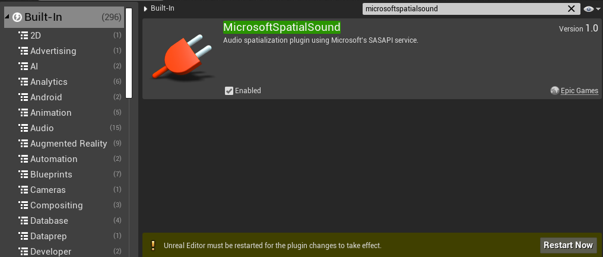
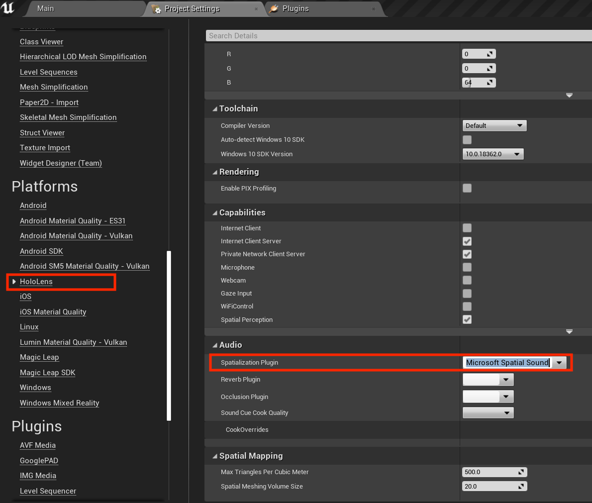
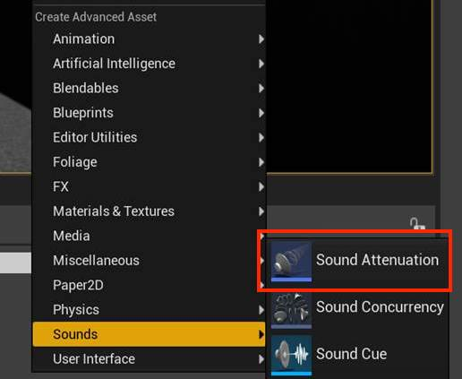
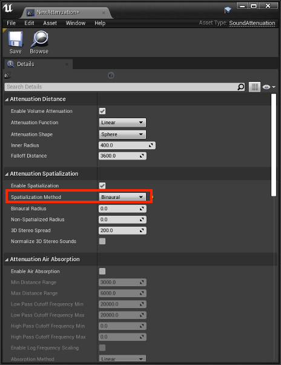

# Spatial Audio in Unreal

## Overview

Unlike vision, humans hear in 360 degree surround sound. Spatial sound emulates how human hearing works, providing the cues needed to identify sound locations in world-space. When you add spatial sound in your mixed reality applications, you're enhancing the level of immersion your users experience.  

High quality spatial sound processing is complex, but the HoloLens 2 comes with dedicated hardware for processing those sound objects.  Before you can access this hardware processing support, you'll need to install the **MicrosoftSpatialSound** plugin in your Unreal project. This article will walk you through the installation and configuration of that plugin and point you towards more in-depth resources for using spatial sound in the Unreal engine. 

## Installing Microsoft Spatial Sound plugin 

The first step to adding spatial sound to your project is installing the Microsoft Spatial Sound plugin, which you can find by: 

* Clicking **Edit > Plugins** and searching for **MicrosoftSpatialSound** in the search box. 
* Selecting the **Enabled** checkbox in the **MicrosoftSpatialSound** plugin. 
* Restarting the Unreal Editor by selecting **Restart Now** from the plugins page. 

> [!NOTE]
> * If you're working strictly on a desktop PC, you need to install the **Microsoft Windows Mixed Reality** plugin.
> * If you're testing or deploying to HoloLens 2, you need to install the **HoloLens** plugin.
>
> You can find detailed instructions on installing these plugins in the **[Initializing your project](unreal-uxt-ch2.md)** section of our Unreal tutorial series.

Once the editor restarts, your project is all set!

## Setting spatialization plugin for HoloLens 2 platform
Configuring the spatialization plugin is done on a per-platform basis.  You can enable the Microsoft Spatial Sound plugin for the HoloLens 2 by:
1. Selecting **Edit > Project Settings**, scrolling to **Platforms** and clicking **HoloLens**.
2. Expanding the **Audio** properties and setting the **Spatialization Plugin** field to **Microsoft Spatial Sound**.

If you're going to be previewing your application on a desktop PC, you'll need to repeat the above steps for the **Windows** platform:

## Enabling spatial audio on your workstation
Spatial audio is disabled by default on desktop versions of Windows. You can enable it by:
* Right-clicking on the **volume** icon in the task bar. 
    + Choose **Spatial sound -> Windows Sonic for Headphones** to get the best representation of what you'll hear on HoloLens 2.

> [!NOTE]
>This setting is only required if you plan to test your project in the Unreal editor.

## Creating Attenuation objects
After you've installed and configured the necessary plugins you can create a new Sound Attenuation asset by:
*  Right-clicking on the **Content Browser** and selecting **Create Advanced Asset -> Sounds -> Sound Attenuation**:

You're new sound asset will be created with a **Details** and all the spatial sound settings you could ask for:

## Configuring objects for spatialization
Working with spatial audio means you're in charge of managing how sound behaves in a virtual environment. Your main focus is creating sound objects that appear louder when the user is close, and quieter when the user is far away. This is referred to as sound attenuation, making sounds appear as if they are positioned in a fixed spot.

All attenuation objects come with modifiable settings for:
* Distance
* Spatialization
* Air Absorption
* Listener Focus
* Reverb Send
* Occlusion

[Sound attenuation in Unreal](https://docs.unrealengine.com/Engine/Audio/DistanceModelAttenuation/index.html) has details and implementation specifics on each of these topics.

## Resonance Audio plugin
If you're looking for a multi-platform spatial audio SDK that delivers high fidelity sound at scale, check out the [Resonance Audio plugin](https://resonance-audio.github.io/resonance-audio/develop/unreal/getting-started#spatialize-sounds-with-the-resonance-audio-plugin).

## See also
* [Spatial Sound](https://docs.microsoft.com/windows/mixed-reality/spatial-sound)
* [Spatial Sound Design](https://docs.microsoft.com/windows/mixed-reality/spatial-sound-design)
* [MR Spatial 220: Spatial sound](https://docs.microsoft.com/windows/mixed-reality/holograms-220)