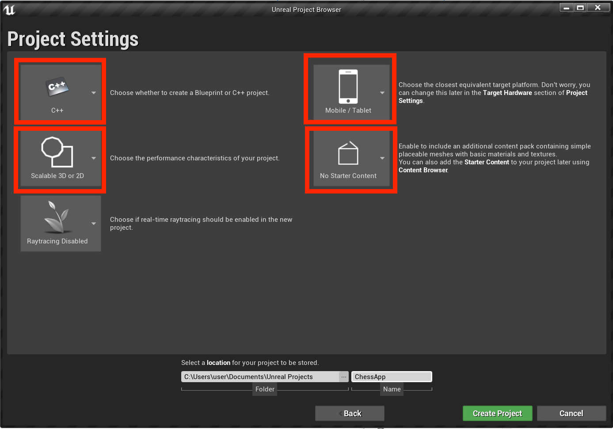
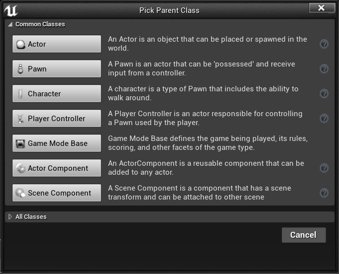
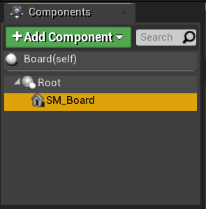
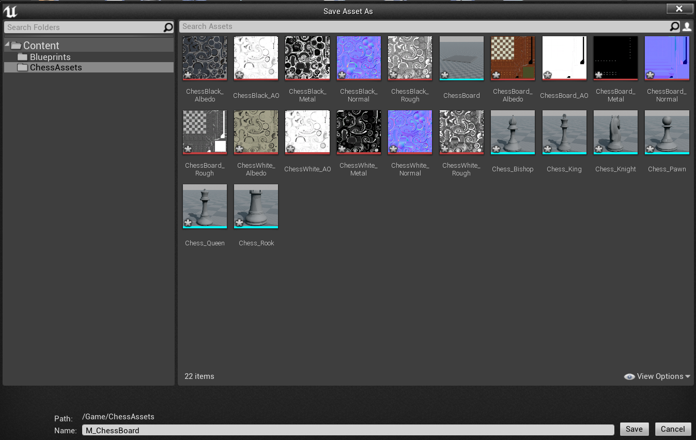
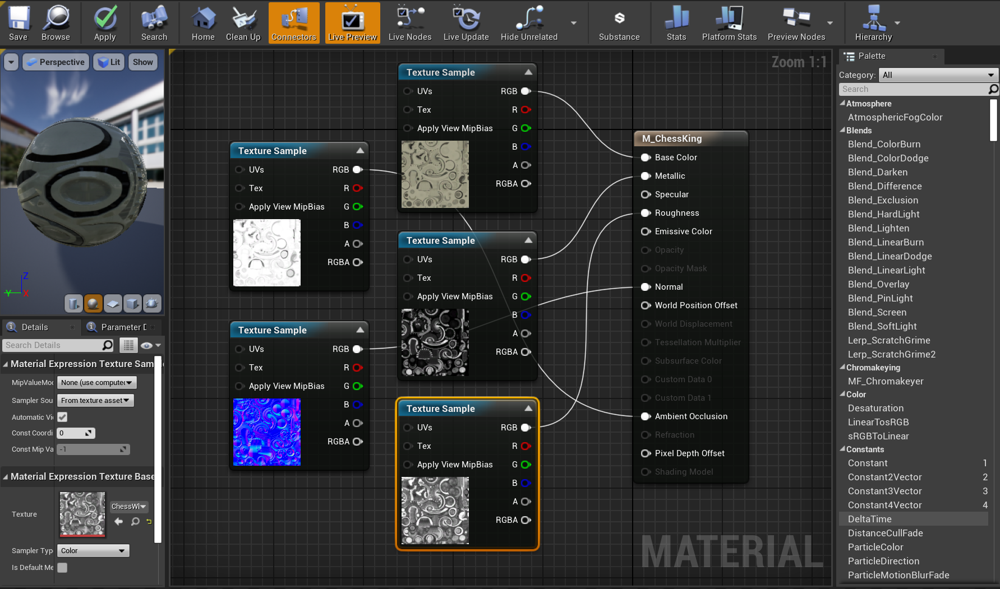

# 2. Initializing your project and first application

This section gets you started with creating a new Unreal application for HoloLens 2. 

## Objectives

* Configure Unreal for HoloLens development
* Import assets and set up the scene

## Create a new Unreal project

1. Launch Unreal Engine

2. Under **New Project Categories**, select **Games** and click Next. Select a **Blank** Template and click Next. 

3. In Project Settings, choose **C++, Scalable 3D or 2D, Mobile / Tablet**, and **No Starter Content**. Select a location for your project to be saved and click **Create Project**. This will open up your C++ files in a Visual Studio project and the Unreal editor. 

4. In the top left-hand corner, go to **Edit > Plugins**. Under Augmented Reality, check the box to enable the **HoloLens** plugin. Scroll down to the Virtual Reality section and check the box to enable the **Microsoft Windows Mixed Reality** plugin. Both plugins are required for HoloLens 2 development. Restart your editor. 

5. In the top left-hand corner, go to **File > New Level**. Select **Empty Level**. The default scene in the viewport should now be empty.

6. Drag PlayerStart and drop PlayerStart from the Modes panel on the left, located in the Basic tab. In the Details panel on the right, set the location to X = 0, Y = 0, Z = 0 in order to have the user start at the origin when the app stars.

7. Drag a **Cube** from the Basic tab of the Modes panel into the viewport. In the Details panel, set the location to X = 50, Y = 0, Z = 0 to set the cube to 50 cm away from the player at start time. Since the default cube is quite large, change the Scale of the cube to (0.2, 0.2, 0.2). 

8. You won’t be able to see the cube unless you add a light to your scene. Switch to the **Lights** tab on the Modes panel and drag a **Directional Light** into the scene, above the PlayerStart.

9.	Press the **Play** button on the toolbar to see your cube in the viewport! Press **Esc** to stop the level. 

10.	Let’s save your level. In the top left corner, click on **File > Save Current**. Name your level "Main" and click **Save**. 

## Set up a chess scene

1. In your Content Browser, click icon under Add New to show the sources panel. Then click on **Add New > New Folder** and name the folder “ChessAssets”. Double-click this folder to navigate in. This is where we’ll import the 3D assets for our chess set.

2. Download the zip file of assets from [GitHub](https://github.com/microsoft/MixedReality-Unreal-Samples/blob/master/ChessApp/ChessAssets.7z). This file contains the 3D models for a chess board and chess set. Unzip this file.

3. At the top of the Content Browser, click on **Import**. Navigate to the folder that you just unzipped and select all the items within. This folder contains FBX files which are the 3D object meshes for our chess board and pieces, as well as TGA files which are the texture maps we’ll use to create materials for our board and pieces. Click **Open**. 

4. An FBX Import Options window will pop up. In the **Material** section, change the **Material Import Method** to **Do Not Create Material**. Then, click **Import All**.

5. Back in your Content folder, create a new folder called **Blueprints**. This is where we will store all our blueprints, which are special assets that provide a node-based interface to create new types of Actors and script level events. 

6. Double click the **Blueprints** folder to navigate inside, then right click in your Content Browser and select **Blueprint Class**. Click on **Actor** and name the new blueprint “Board”. Double click Board to open it. 

7. In the Blueprint editor, navigate to the Components panel and click **Add Component > Scene**. Name the newly created scene “Root”, and then click and drag Root over the DefaultSceneRoot. This will replace the default scene root and get rid of the sphere in the viewport. 

8. Click **Add Component** again, and this time choose **Static Mesh**. Name the new static mesh “SM_Board”. 

9. In the **Details** panel, locate the **Static Mesh** section and click the dropdown. Select **ChessBoard**. 

10.	Still in the **Details** panel, locate the **Materials** section and click the dropdown. Under **Create New Asset**, select **Material**. Name this asset **M_ChessBoard** and save it in the **ChessAssets** folder. 

11.	Double click the square next to M_ChessBoard dropdown to open your newly created M_ChessBoard material. In the Material Editor, right click and search for the **Texture Sample** node. In the **Details** panel under the **Material Expression Texture Base** section, click the dropdown and select **ChessBoard_Albedo**. Finally, drag the **RGB** output pin to the Base Color pin of **M_ChessBoard**. 

12.	Do the same four more times, linking the **ChessBoard_AO** Texture Sample to the **Ambient Occlusion** pin, the **ChessBoard_Metal** Texture Sample to the **Metallic** pin, the **ChessBoard_Normal** Texture Sample to the **Normal** pin, and the **ChessBoard_Rough** Texture Sample to the **Roughness** pin. Click **Save**. 

13.	Return to your **Board** Blueprint. You should see that the material you just created has been applied to your Blueprint. To ensure the board is at a reasonable size and position once we place it in our scene, change the **Scale** of the board to (0.05, 0.05, 0.05) and the **Rotation** to Z = 90. In the toolbar at the top, click **Compile**, then **Save**. Return to your Main window. 

14.	Let’s now delete the cube and replace it with your newly created Board actor. In the **World Outliner**, right click your **Cube > Edit > Delete**. Drag Board from your Content Browser into the viewport. Set the location of the board to X = 80, Y = 0, Z = -20. 

15.	Click the **Play** button to view your new board in your level. Press **Esc** to return to the editor. 

16.	Now we’ll follow the same steps to create a chess piece as we did with the board, this time selecting the mesh and material for the chess piece:

    a) Navigate to the Blueprints folder in the Content Browser and create a new Blueprint class of type Actor. Name this actor “WhiteKing”.

    b) Double click WhiteKing to open it. Add a new Scene component named “Root” and use it to replace DefaultSceneRoot. 

    c) Add a new Static Mesh component named “SM_King”. In the Details panel, set the **Static Mesh** to **Chess_King** and the **Material** to a new Material called **M_ChessWhite**. 

    d) Open the new **M_ChessWhite** Material and hook up the relevant textures to their corresponding material inputs. 

    

    e) Back in your **WhiteKing** Blueprint, change the **Scale** to (0.05, 0.05, 0.05) and **Rotation** to Z = 90.

    f) Compile and save your blueprint, then navigate back to your main window. 

17.	Drag WhiteKing into your viewport. In the **World Outliner**, drag WhiteKing onto Board so that WhiteKing is now a child of Board. 

18.	In the **Details** panel under **Transform**, set the **Location** of WhiteKing to X = -26, Y = 4, Z = 0

19.	Click **Play** to see your level. Press **Esc** to exit. 

[Next Section: 3. Set up your project for mixed reality](unreal-uxt-ch3.md)