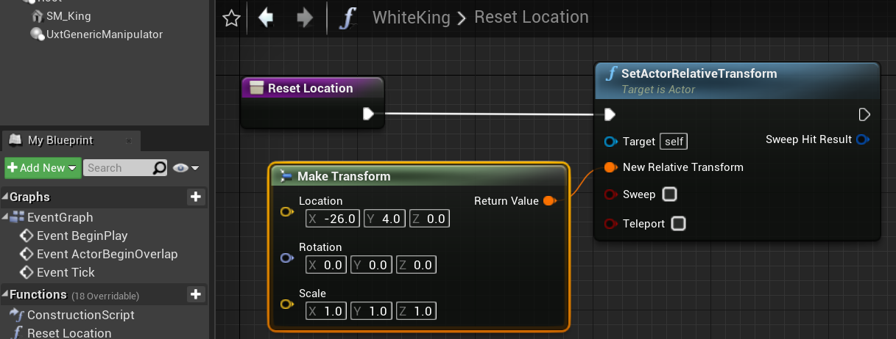
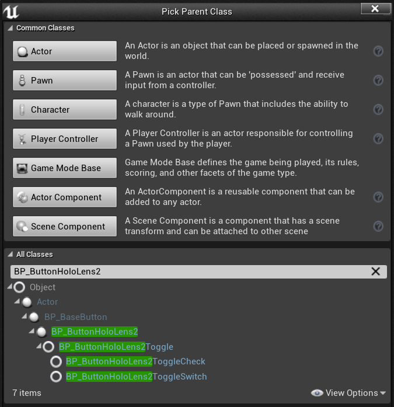
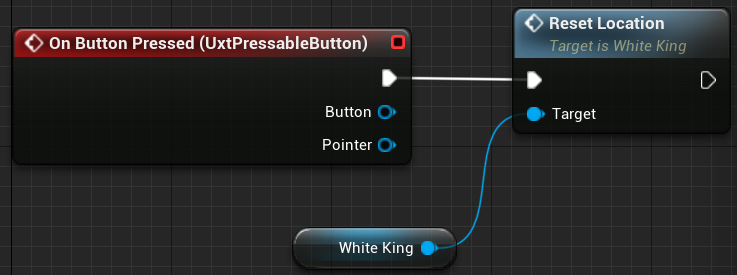

# 5. Adding a button & resetting piece locations

## Overview

In the previous tutorial, you added Hand Interaction Actors to the Pawn and Manipulator components to the chess board to make them both interactive. In this section, you'll continue working with the Mixed Reality Toolkit UX Tools plugin by building out the features of your chess app. This includes creating a new function and learning how to get references to Actors in a Blueprint. By the end of this section, you'll be ready to package and deploy the mixed reality app on a device or emulator.

## Objectives

* Adding an interactive button
* Creating a function to reset a pieces' location
* Hooking the button up to trigger the function when pressed

## Creating a reset function
Your first task is to create a function blueprint that resets a chess piece to its original position in the scene. 

1.	Open **WhiteKing**, click the **+** icon next to the **Functions** section in the **My Blueprint** and name it **Reset Location**. 

2.	Drag and release the execution from **Reset Location** on the Blueprint grid to create a **SetActorRelativeTransform** node. 
    * This function sets the transform (location, rotation, and scale) of an actor relative to its parent. You’ll use this function to reset the king’s position on the board, even if the board has been moved from its original position. 
    
3. Right-click inside the Event Graph, select **Make Transform**, and change its **Location** to **X = -26**, **Y = 4**, **Z = 0**.
    * Connect its **Return Value** to the **New Relative Transform** pin in **SetActorRelativeTransform**. 

**Compile** and **Save** the project before returning to the Main window. 

## Adding a button
Now that the function is setup correctly, your next task is to create a button that fires it off when touched. 

1.	Click **Add New > Blueprint Class**, expand the **All Classes** section, and search for **SimpleButton**. 
    * Name it **ResetButton** and double click to open the Blueprint

> [!NOTE]
> **SimpleButton** is a 3D button Blueprint Actor that's part of the UX Tools plugin. . 

2. Click **Pressable Button (Inherited)** from the **Components** panel and scroll down the **Details** panel to the **Events** section. 
    * Click the green **+** button next to **On Button Pressed** to add an event to the Event Graph, which will be called when the button is pressed. 
    
From here, you’ll want to call **WhiteKing**’s **Reset Location** function, which needs a reference to the **WhiteKing** Actor in the Level. 

1.	Scroll to the **Variables** section in the **Details** panel, click the **+** button and name the variable **WhiteKing**. 
    * Select the dropdown next to **Variable Type**, search for **WhiteKing**, and select the **Object Reference**. 
    * Check the box next to **Instance Editable**. This will allow the variable to be set from the Main Level. 

2.	Drag the WhiteKing variable from **My Blueprint > Variables** onto the Reset Button Event Graph and choose **Get WhiteKing**. 

## Firing the function
All that's left is to officially fire off the reset function when the button is pressed.

1.	Drag the WhiteKing output pin and release to place a new node. Select the **Reset Location** function. Finally, drag the outgoing execution pin from **On Button Pressed** to the incoming execution pin on **Reset Location**. **Compile** and **Save** the ResetButton Blueprint, then return to the Main window. 

2.	Drag **ResetButton** into the viewport and set its location to **X = 50**, **Y = -25**, and **Z = 10**. Under **Default**, set the value of the **WhiteKing** variable to **WhiteKing**.

Run the app, move the chess piece to a new location, and press the big pink button to see the reset logic in action!

You now have a mixed reality app with a chess piece and board that you can interact with, as well as a fully functioning button that will reset the piece’s location. You can find the completed app up to this point in its [GitHub](https://github.com/microsoft/MixedReality-Unreal-Samples/tree/master/ChessApp) repo. Feel free to go beyond this tutorial and set up the remainder of the chess pieces so that the entire board is reset when the button is pressed.

You're ready to move on to the final section of this tutorial where you'll learn how to correctly package and deploy the app to a device or emulator.

[Next Section: 6. Packaging & deploying to device or emulator](unreal-uxt-ch6.md)
