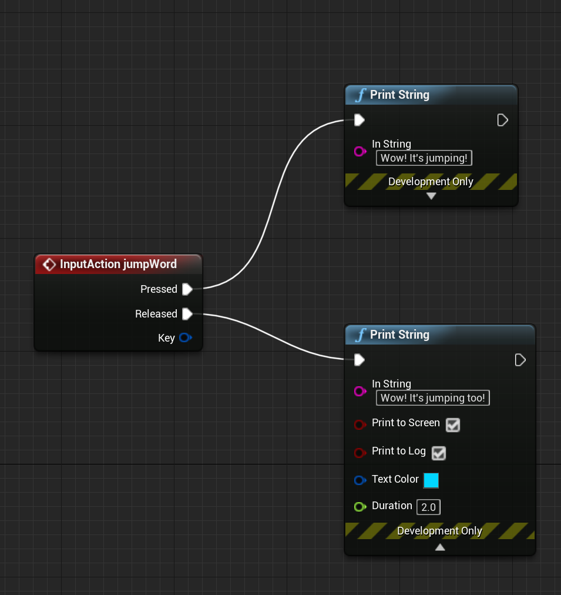

# Voice Input in Unreal

//TODO: Add introduction to topic

## Enabling Speech Recognition

To enable speech recognition on HoloLens:
1. Select **Project Settings > Platform > HoloLens > Capabilities** and enable **Microphone**. 
2. Enabled speech recogniztion in *Settings > Privacy > Speech* and select English.

It’s recommended to enable Online speech recognition too for the best possible quality of the service. Technical details for speech recognition on HoloLens can be found [here](voice-input.md)

Then user will see a dialog about enabling the microphone when the application first starts. If a user selects Yes, the application will begin getting voice input.

Speech input doesn’t require a special Windows Mixed Reality API and is instead built upon the existing Unreal Engine 4 Input mapping API. Details on how to use the Input API are [here](https://docs.unrealengine.com/en-US/Gameplay/Input/index.html)

## Working with Speech Mappings

Speech Mappings have been added to the Bindings section of Engine – Input below Action and Axis Mappings. 

 
Here is an example of added monitoring for the world “jump”. Any English word(s) or short sentences can be used. 

After a Speech Mapping is added via Project Settings, a developer can then use standard Unreal logic to handle the input, as in the following example: 
 

