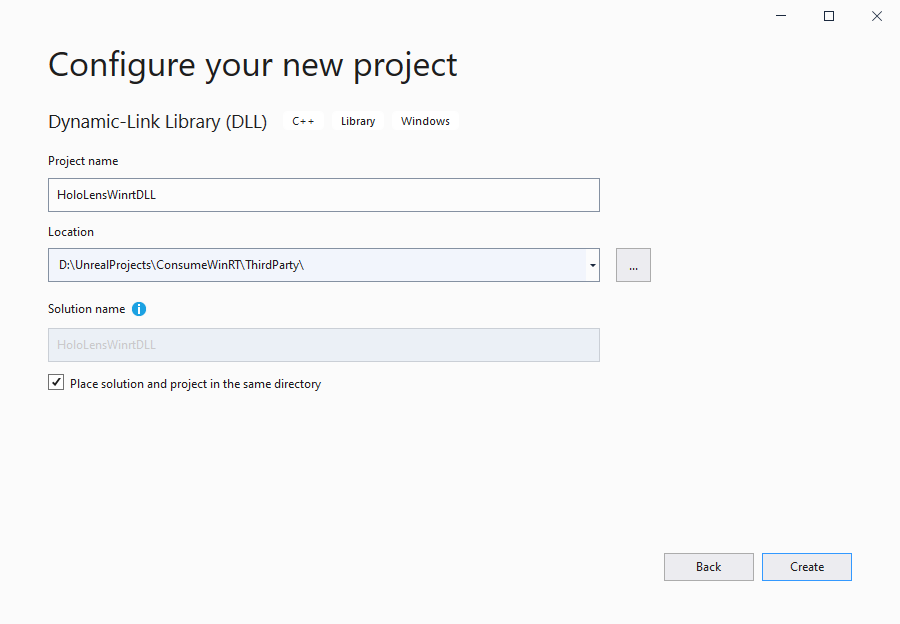
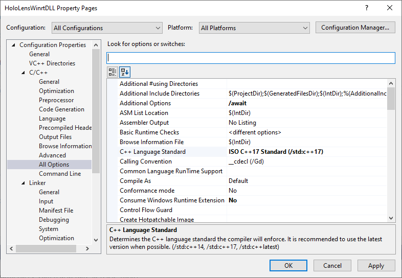
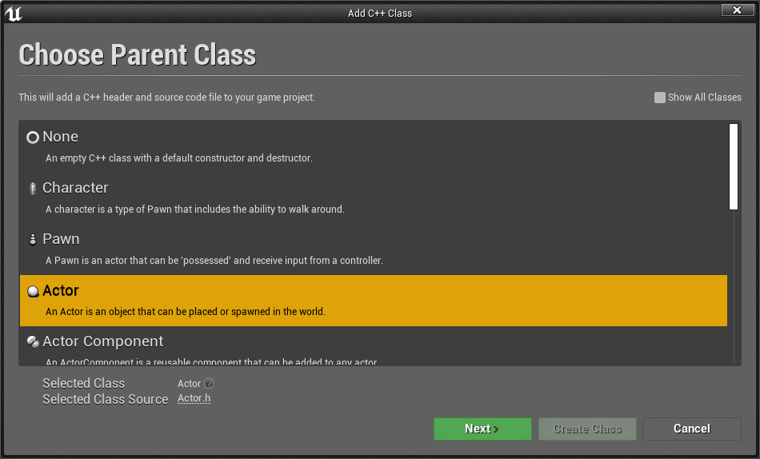
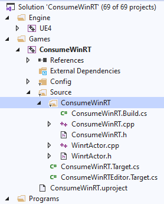
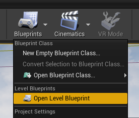
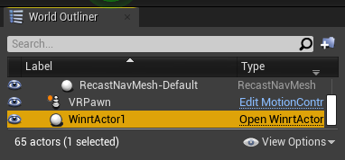

# WinRT in Unreal

## Overview

When writing HoloLens applications, you may need to use a feature that is written in the Windows SDK in winrt code.  For example, opening a file dialogue in a HoloLens application must use the FileSavePicker in winrt/Windows.Storage.Pickers.h.  Unreal does not natively compile winrt code, so it must be built in a separate binary and consumed through Unreal’s build system. 

## Objectives
- Create a Universal Windows DLL that opens a FileSaveDialogue
- Link that DLL to an Unreal game project
- Save a file on the HoloLens from an Unreal blueprint using the new DLL

## Getting started
1. Check that you have all [required tools](unreal-uxt-ch1.md) installed
2. [Create a new Unreal project](unreal-uxt-ch2#creating-a-new-unreal-project) and name it **Consumewinrt**
3. Enable the [required plugins](unreal-uxt-ch2#enabling-required-plugins) for HoloLens development
4. [Setup for deployment](unreal-uxt-ch6) to a device or emulator

## Creating a WinRT DLL 
Open a new Visual Studio project and create a **DLL (Universal Windows)** project adjacent to the Unreal game’s **uproject** file. 


Name the project **HoloLensWinrtDLL** and set the location as a **ThirdParty** subdirectory to the Unreal game’s uproject file. 
* Select **Place solution and project in the same directory** to simplify looking for paths later. 



You now have a project, but the files you want to pay special attention to are the blank cpp and header files named **HoloLensWinrtDLL.cpp** and **HoloLensWinrtDLL.h** respectively. The header will be the include file to use the DLL in Unreal, while the cpp will hold the body of any functions we export and will include any WinRT code that Unreal would not otherwise be able to compile. 

Before you add any code you need to update the project properties to ensure the WinRT code you'll need can compile: 
* Right click on the HoloLensWinrtDLL project and select **properties**  
* Change the **Configuration** dropdown to **All Configurations** and the **Platform** dropdown to **All Platforms**  
* Under **Configuration Properties> C/C++> All Options**, add **await** to **Additional Options** to ensure we can wait on async tasks.  Also change **C++ Language Standard** to **ISO C++17 Standard (/std:c++17)** to include any WinRT code. 



Update the DLL’s source with our winrt code to open a file dialogue and save a file to the HoloLens disk.  

## Adding the DLL code
Open **HoloLensWinrtDLL.h** and add a dll exported function for Unreal to consume: 

```cpp
#pragma once

class HoloLensWinrtDLL
{
public:
    _declspec(dllexport) static void OpenFileDialogue();
};
```

Open **HoloLensWinrtDLL.cpp** and add all the headers the class will use.  

> [!NOTE]
> All WinRT code is stored in **HoloLensWinrtDLL.cpp** so Unreal doesn't try to include any WinRT code when referencing the header. 

```cpp
#include "pch.h"
#include "HoloLensWinrtDLL.h"

#include <winrt/Windows.Storage.h>
#include <winrt/Windows.Storage.Streams.h>
#include <winrt/Windows.Storage.Pickers.h>
#include <winrt/Windows.Foundation.h>
#include <winrt/Windows.Foundation.Collections.h>

#include <string>
#include <vector>
#include <thread>
```

<!-- TODO: Is this in cpp or header file? -->
Then add the function body for OpenFileDialogue() and all supported code: 

```cpp
// sgm is declared outside of OpenFileDialogue so it doesn't
// get destroyed when OpenFileDialogue goes out of scope.
SaveGameManager sgm;

void HoloLensWinrtDLL::OpenFileDialogue()
{
    sgm.SaveGame();
}
```

Add a SaveGameManager class to the cpp to handle opening the file dialogue and saving the file: 

```cpp
class SaveGameManager
{
public:
    SaveGameManager()
    {
    }

    ~SaveGameManager()
    {
        // Wait for currently running thread to complete before terminating.
        if(m_thread.joinable())
        {
            m_thread.join();
        }
    }

    void SaveGame()
    {
        OpenFileDialogueAction();
    }

private:
    winrt::Windows::Storage::StorageFile m_file = winrt::Windows::Storage::StorageFile(nullprt);
    std::thread m_thread;

    winrt::Windows::Foundation::IAsyncAction OpenFileDialogueAction()
    {
        std::vector<winrt::hstring> extensions;
        // TODO: Is "L" a typo?
        extensions.push_back(L".txt");

        auto picker = winrt::Windows::Storage::Pickers::FileSavePicker();

        // FileSavePicker needs a file type to open without errors.
        picker.FileTypeChoices().Insert(L"Plain Text",
                                        winrt::single_threaded_vector<winrt::hstring>(
                                        std::move(extensions)));

        // Opening the FilePicker must be done on the Game UI thread.
        // Any other IAsyncOperations should be done on a background thread.
        m_file = co_await picker.PickSaveFileAsync();

        if(m_file)
        {
            // Unreal's game thread is an STA, async tasks need to run on
            // a background MTA thread, or waiting on them will deadlock.    
            std::thread thread([this]() { RunThread(); });
            m_thread = std::move(thread);
        }
    }

    void RunThread()
    {
        // Ensure this thread is an MTA
        winrt::init_apartment();
        Run().get();
    }

    winrt::Windows::Foundation::IAsyncAction Run()
    {
        co_await winrt::Windows::Storage::FileIO::WriteTextAsync(
                m_file, L"Hello WinRT");
    }
};
```

Build the solution for **Release > ARM64** to build the DLL to the child directory ARM64/Release/HoloLensWinrtDLL from the DLL solution. 

## Adding the WinRT binary to Unreal 
Linking and using a DLL in Unreal requires a C++ project. If you're using a Blueprint project, it can be converted to a C++ project by adding a C++ class:  

1. In the Unreal editor, open **File > New C++ Class…** 
2. Create a new **Actor** named **WinrtActor** to run the code in the DLL: 



> [!NOTE]
> A solution has now been created in the same directory as the uproject file along with a new build script: Source/ConsumeWinRT/ConsumerWinRT.Build.cs.

3. Open the solution and browse for **Games/ConsumeWinRT/Source/ConsumeWinRT**:



### Linking the DLL
Open **ConsumeWinRT.build.cs** and add a property to find the include path for the DLL (the directory containing HoloLensWinrtDLL.h). The DLL is in a child directory to this, so this property will be used as the binary root dir:

```cpp
public class ConsumeWinRT : ModuleRules
{
    private string WinrtIncPath
    {
        get 
        {
            string ModulePath = Path.GetDirectoryName(
                   RulesCompiler.GetFileNameFromType(this.GetType()));

            // Third party directory is at the project root,
            // which is two directories up from the game .exe (Binaries/HoloLens)
            return Path.GetFullPath(
                   Path.Combine(ModulePath,
                   "../../ThirddParty/HoloLensWinrtDLL"));
        }
    }
// TODO: Is there a semi-colon missing at the end of the class here?
}
```

In the constructor, add code to update the include path, link the new lib, and add the DLL to be delay-loaded and copied to the packaged appx location: 
```cpp
public ConsumeWinRT(ReadOnlyTargetRules target) : base(Target)
{
    // This is the directory the DLL's include header is in.
    PublicIncludePaths.Add(WinrtIncPath);

    // The code in HoloLensWinrtDLL will only work in a Windows Store app.
    // Only link these binaries for HoloLens.
    // Similar code can be written for desktop and similarly linked 
    // to use the same features when using Holographic Remoting.
    if(Target.Platform == UnrealTargetPlatform.HoloLens)
    {
        // Link the lib
        PublicAdditionalLibraries.Add(Path.Combine(
              WinrtIncPath, "ARM64", "Release",
              "HoloLensWinrtDLL","HoloLensWinrtDLL.lib"));

        string winrtDLL = "HoloLensWinrtDLL.dll";
        // Mark the dll to be DelayLoaded
        PublicDelayLoadDLLs.Add(winrtDLL);
        // RuntimeDependencies are included in packaged builds.
        RuntimeDependencies.Add(Path.Combine(WinrtIncPath,
                "ARM64", "Release", "HoloLensWinrtDLL", winrtDLL));
    }

    // Preserve the original code in build.cs below:
}
```

Open **WinrtActor.h** and add two function definitions, one a UFUNCTION that can be called from a blueprint, and another to use the DLL code: 
```cpp
public:
    UFUNCTION(BlueprintCallable)
    static void OpenFileDialogue;
```

Open **WinrtActor.cpp** and load the DLL in BeginPlay: 

>[!IMPORTANT]
> The DLL must be loaded before calling any of its functions.

```cpp
void AWinfrtActor::BeginPlay()
{
#if PLATFORM_HOLOLENS
    HoloLensWinrtDLL::OpenFileDialogue();
#endif
}
``` 

### Building the game
Build the game solution to launch the Unreal editor opened to the game project. 
* In the **Place Actors** tab, search for the new **WinrtActor** and drag it into the scene. 
* Open the level blueprint to execute the blueprint callable function in the **WinrtActor**. 



In the **World Outliner**, find the **WindrtActor** previously dropped into the scene and drag it into the level blueprint: 



In the level blueprint, drag the output node from WinrtActor and search for **Open File Dialogue**, then route this from any user input.  In this case, Open File Dialogue is being called from a speech event: 


[Package this game for HoloLens](unreal-uxt-ch6.md), deploy it, and run.  When OpenFileDialogue is called from Unreal, a File Dialogue will open on the HoloLens prompting for a .txt file name.  After saving, that file can be found from the **File explorer** tab in the device portal with the contents “Hello WinRT”. 

## Summary 

The code in this document can be used as a starting point for using any winrt code in Unreal.  It allows you to save files to the HoloLens disk when user interaction is necessary to select the file name and location, using the same file dialogue you would find on Windows.  More functions can be exported from the HoloLensWinrtDLL header and used in Unreal in the same way.  Furthermore, the code in the DLL shows how to wait on any async winrt code in a background MTA thread, which is often necessary to avoid deadlocking the Unreal game thread. 

## See also
* [C++/WinRT APIs](https://docs.microsoft.com/windows/uwp/cpp-and-winrt-apis/)
* [FileSavePicker class](https://docs.microsoft.com/uwp/api/Windows.Storage.Pickers.FileSavePicker) 
* [Unreal Third-Party Libraries](https://docs.unrealengine.com/Programming/BuildTools/UnrealBuildTool/ThirdPartyLibraries/index.html) 