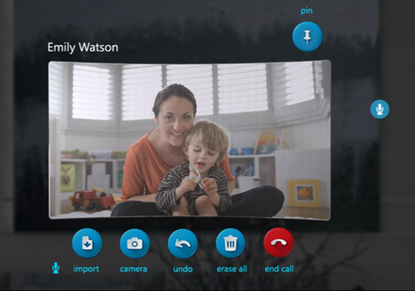
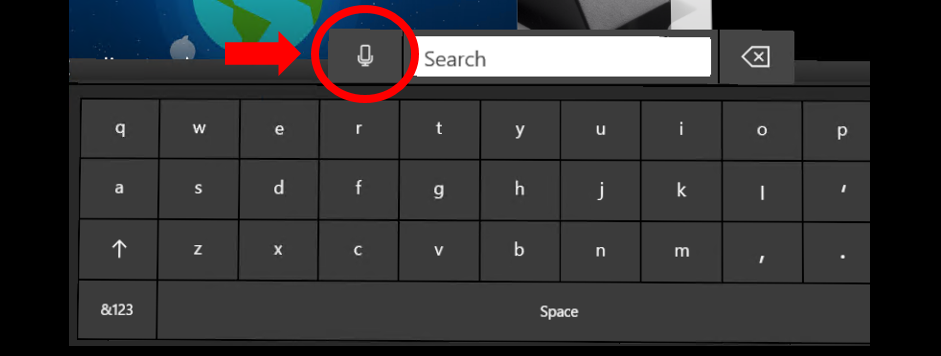

# Voice input

Voice is one of the three key forms of input on HoloLens. It allows you to directly command a hologram without having to use [gestures](gestures.md). You simply [gaze](gaze.md) at a hologram and speak your command. Voice input can be a natural way to communicate your intent. Voice is especially good at traversing complex interfaces because it lets users cut through nested menus with one command.

Voice input is powered by the [same engine](https://msdn.microsoft.com/en-us/library/windows/apps/mt185615.aspx) that supports speech in all other Universal Windows Apps.

>[!VIDEO https://www.youtube.com/embed/eHMkOpNUtR8]

## Device support

<table>
<tr>
<th>Feature</th><th style="width:150px"> <a href="hololens-hardware-details.md">HoloLens</a></th><th style="width:150px"> <a href="immersive-headset-hardware-details.md">Immersive headsets</a></th>
</tr><tr>
<td> Voice input</td><td style="text-align: center;"> ✔️</td><td style="text-align: center;"> ✔️ (with headset attached)</td>
</tr>
</table>

## The "select" command

Even without specifically adding voice support to your app, your users can activate holograms simply by saying "select". This behaves the same as an [air tap](gestures.md#air-tap) on HoloLens, pressing the select button on the [HoloLens clicker](hardware-accessories.md#hololens-clicker), or pressing the trigger on a [Windows Mixed Reality motion controller](motion-controllers.md). You will hear a sound and see a tooltip with "select" appear as confirmation. "Select" is enabled by a low power keyword detection algorithm so it is always available for you to say at any time with minimal battery life impact, even with your hands at your side.

 
*Say "select" to use the voice command for selection*

## Hey Cortana

You can also say "Hey Cortana" to bring up Cortana at anytime. You don't have to wait for her to appear to continue asking her your question or giving her an instruction - for example, try saying "Hey Cortana what's the weather?" as a single sentence. For more information about Cortana and what you can do, simply ask her! Say "Hey Cortana what can I say?" and she'll pull up a list of working and suggested commands. If you're already in the Cortana app you can also click the **?** icon on the sidebar to pull up this same menu.

**HoloLens-specific commands**
* What can I say?
* Go home | Go to Start - instead of [bloom](gestures.md#bloom) to get to [Start Menu](navigating-the-windows-mixed-reality-home.md#start-menu)
* Launch <app>
* Move <app> here
* Take a picture
* Start recording
* Stop recording
* Increase the brightness
* Decrease the brightness
* Increase the volume
* Decrease the volume
* Mute | Unmute
* Shut down the device
* Restart the device
* Go to sleep
* What time is it?
* How much battery do I have left?
* Call <contact> (requires HoloSkype)

## "See It, Say It"

HoloLens has a "see it, say it" model for voice input, where labels on buttons tell users what voice commands they can say as well. For example, when looking at a 2D app, a user can say the "Adjust" command which they see in the App bar to adjust the position of the app in the world.

When apps follow this rule, users can easily understand what to say to control the system. To reinforce this, while gazing at a button, you will see a "voice dwell" tooltip that comes up after a second if the button is voice-enabled and displays the command to speak to "press" it.

*"See it, say it" commands appear below the buttons*

## Voice commands for fast Hologram Manipulation

There are also a number of voice commands you can say while gazing at a hologram to quickly perform manipulation tasks. These voice commands work on 2D apps as well as 3D objects you have placed in the world.

**Hologram Manipulation Commands**
* Face me
* Bigger | Enhance
* Smaller

## Dictation

Rather than typing with [air taps](gestures.md#air-tap), voice dictation can be more efficient to enter text into an app. This can greatly accelerate input with less effort for the user.

*Voice dictation starts by selecting the microphone button on the keyboard*

Any time the holographic keyboard is active, you can switch to dictation mode instead of typing. Select the microphone on the side of the text input box to get started.

## Communication

For applications that want to take advantage of the customized audio input processing options provided by HoloLens, it is important to understand the various [audio stream categories](https://msdn.microsoft.com/en-us/library/windows/desktop/hh404178(v=vs.85).aspx) your app can consume. Windows 10 supports several different stream categories and HoloLens makes use of three of these to enable custom processing to optimize the microphone audio quality tailored for speech, communication and other which can be used for ambient environment audio capture (i.e. "camcorder") scenarios.
* The AudioCategory_Communications stream category is customized for call quality and narration scenarios and provides the client with a 16kHz 24bit mono audio stream of the user's voice
* The AudioCategory_Speech stream category is customized for the HoloLens (Windows) speech engine and provides it with a 16kHz 24bit mono stream of the user's voice. This category can be used by 3rd party speech engines if needed.
* The AudioCategory_Other stream category is customized for ambient environment audio recording and provides the client with a 48kHz 24 bit stereo audio stream.

All this audio processing is hardware accelerated which means the features drain a lot less power than if the same processing was done on the HoloLens CPU. Avoid running other audio input processing on the CPU to maximize system battery life and take advantage of the built in, offloaded audio input processing.

## Troubleshooting

If you're having any issues using "select" and "Hey Cortana", try moving to a quieter space, turning away from the source of noise, or by speaking louder. At this time, all speech recognition on HoloLens is tuned and optimized specifically to native speakers of United States English.

For the Windows Mixed Reality Developer Edition release 2017, the audio endpoint management logic will work fine (forever) after logging out and back in to the PC desktop after the initial HMD connection. Prior to that first sign out/in event after going through WMR OOBE, the user could experience various audio functionality issues ranging from no audio to no audio switching depending on how the system was set up prior to connecting the HMD for the first time.

## See also
* [Voice input in DirectX](voice-input-in-directx.md)
* [Voice input in Unity](voice-input-in-unity.md)
* [Holograms 212](holograms-212.md)
