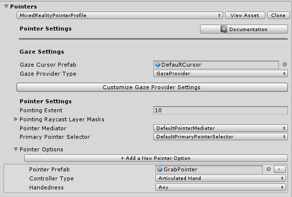
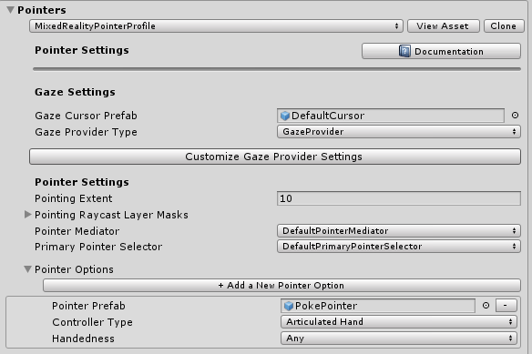
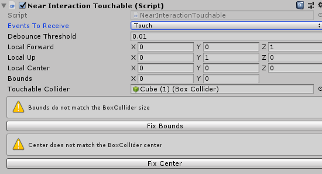
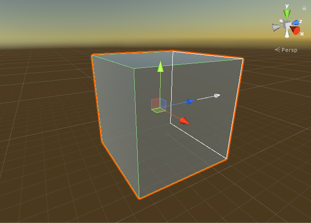

# How to add near interaction in MRTK

Near interactions come in the form of touches and grabs. Touch and grab events are raised as pointer events by the [PokePointer](Pointers.md#pokepointer) and [SpherePointer](Pointers.md#spherepointer), respectively.

Three key steps are required to listen for touch and/or grab input events on a particular GameObject.

1. Ensure the relevant pointer is registered in the main [MRTK Configuration Profile](../../out-of-scope/MixedRealityConfigurationGuide.md).
1. Ensure the desired GameObject has the appropriate [grab](#add-grab-interactions) or [touch](#add-touch-interactions) script component and [`Unity Collider`](https://docs.unity3d.com/ScriptReference/Collider.html).
1. Implement an input handler interface on an attached script to the desired GameObject to listen for the [grab](#grab-code-example) or [touch](#touch-code-example) events.

## Add grab interactions

1. Ensure a [SpherePointer](Pointers.md#spherepointer) is registered in the *MRTK Pointer profile*.

    The default MRTK profile and the default HoloLens 2 profile already contain a *SpherePointer*. One can confirm a SpherePointer will be created by selecting the MRTK Configuration Profile and navigating to **Input** > **Pointers** > **Pointer Options**. The default `GrabPointer` prefab (Assets/MRTK/SDK/Features/UX/Prefabs/Pointers) should be listed with a *Controller Type* of *Articulated Hand*. A custom prefab can be utilized as long as it implements the [`SpherePointer`](xref:Microsoft.MixedReality.Toolkit.Input.SpherePointer) class.

    

1. On the GameObject that should be grabbable, add a [`NearInteractionGrabbable`](xref:Microsoft.MixedReality.Toolkit.Input.NearInteractionGrabbable), as well as a collider.

    Make sure the layer of the GameObject is on a grabbable layer. By default, all layers except *Spatial Awareness* and *Ignore Raycasts* are grabbable. See which layers are grabbable by inspecting the *Grab Layer Masks* in your *GrabPointer* prefab.

1. On the GameObject or one of its ancestors, add a script component that implements the [`IMixedRealityPointerHandler`](xref:Microsoft.MixedReality.Toolkit.Input.IMixedRealityPointerHandler) interface. Any ancestor of the object with the [`NearInteractionGrabbable`](xref:Microsoft.MixedReality.Toolkit.Input.NearInteractionGrabbable) will be able to receive pointer events, as well.

### Grab code example

Below is a script that will print if an event is a touch or grab. In the relevant *IMixedRealityPointerHandler* interface function, one can look at the type of pointer that triggers that event via the [`MixedRealityPointerEventData`](xref:Microsoft.MixedReality.Toolkit.Input.MixedRealityPointerEventData). If the pointer is a *SpherePointer*, the interaction is a grab.

```c#
public class PrintPointerEvents : MonoBehaviour, IMixedRealityPointerHandler
{
    public void OnPointerDown(MixedRealityPointerEventData eventData)
    {
        if (eventData.Pointer is SpherePointer)
        {
            Debug.Log($"Grab start from {eventData.Pointer.PointerName}");
        }
        if (eventData.Pointer is PokePointer)
        {
            Debug.Log($"Touch start from {eventData.Pointer.PointerName}");
        }
    }

    public void OnPointerClicked(MixedRealityPointerEventData eventData) {}
    public void OnPointerDragged(MixedRealityPointerEventData eventData) {}
    public void OnPointerUp(MixedRealityPointerEventData eventData) {}
}
```

## Add touch interactions

The process for adding touch interactions on UnityUI elements is different than for vanilla 3D GameObjects. You can skip to the following section, *Unity UI*, for enabling Unity UI components.

For **both** types of UX elements though, ensure a [PokePointer](Pointers.md#pokepointer) is registered in the *MRTK Pointer profile*.

The default MRTK profile and the default HoloLens 2 profile already contain a *PokePointer*. One can confirm a PokePointer will be created by selecting the MRTK Configuration Profile and navigate to **Input** > **Pointers** > **Pointer Options**. The default `PokePointer` (Assets/MRTK/SDK/Features/UX/Prefabs/Pointers) prefab should be listed with a *Controller Type* of *Articulated Hand*. A custom prefab can be utilized as long as it implements the [`PokePointer`](xref:Microsoft.MixedReality.Toolkit.Input.PokePointer) class.



### 3D GameObjects

There are two different ways of adding touch interactions to 3D GameObjects, depending on if your 3d object
should only have a single touchable plane, or of if it should be touchable based on its entire collider.
The first way is typically on objects with BoxColliders, where it is desired to only have a single face
of the collider react to touch events. The other is for objects that need to be touchable from any direction
based on their collider.

### Single face touch

This is useful to enable situations where only a single face needs to be touchable. This option assumes
that the game object has a BoxCollider. it's possible to use this with non-BoxCollider objects, in which
case the 'Bounds' and 'Local Center' properties much be manually set to configure the touchable plane (i.e.
Bounds should be set to a non-zero-zero value).

1. On the GameObject that should be touchable, add a BoxCollider and a [`NearInteractionTouchable`]
   (xref:Microsoft.MixedReality.Toolkit.Input.NearInteractionTouchable) component.

    1. Set **Events to Receive** to *Touch* if using the [`IMixedRealityTouchHandler`]
       (xref:Microsoft.MixedReality.Toolkit.Input.IMixedRealityTouchHandler) interface in your
       component script below.

    1. Click **Fix bounds** and **Fix center**

    

1. On that object or one of its ancestors, add a script component that implements the
   [`IMixedRealityTouchHandler`](xref:Microsoft.MixedReality.Toolkit.Input.IMixedRealityTouchHandler)
   interface. Any ancestor of the object with the [`NearInteractionTouchable`]
   (xref:Microsoft.MixedReality.Toolkit.Input.NearInteractionTouchable) will be able to receive
   pointer events, as well.

> [!NOTE]
> In the editor scene view with the *NearInteractionTouchable* GameObject selected, notice a white outline square and arrow. The arrow points to the "front" of the touchable. The collidable will only be touchable from that direction. To make a collider touchable from all directions, see the section on [arbitrary collider touch](#arbitrary-collider-touch).
> 

### Arbitrary collider touch

This is useful to enable situations where the game object needs to be touchable along its entire collider
face. For example, this can be used to enable touch interactions for an object with a SphereCollider, where
the entire collider needs to be touchable.

1. On the GameObject that should be touchable, add a collider and a [`NearInteractionTouchableVolume`]
   (xref:Microsoft.MixedReality.Toolkit.Input.NearInteractionTouchableVolume) component.

    1. Set **Events to Receive** to *Touch* if using the [`IMixedRealityTouchHandler`]
       (xref:Microsoft.MixedReality.Toolkit.Input.IMixedRealityTouchHandler) interface in your component
       script below.

1. On that object or one of its ancestors, add a script component that implements the
   [`IMixedRealityTouchHandler`](xref:Microsoft.MixedReality.Toolkit.Input.IMixedRealityTouchHandler)
   interface. Any ancestor of the object with the [`NearInteractionTouchable`]
   (xref:Microsoft.MixedReality.Toolkit.Input.NearInteractionTouchable) will be able to receive
   pointer events, as well.

### Unity UI

1. Add/ensure there is a [UnityUI canvas](https://docs.unity3d.com/Manual/UICanvas.html) in the scene.

1. On the GameObject that should be touchable, add a [`NearInteractionTouchableUnityUI`](xref:Microsoft.MixedReality.Toolkit.Input.NearInteractionTouchableUnityUI) component.  

    1. Set **Events to Receive** to *Touch* if using the [`IMixedRealityTouchHandler`](xref:Microsoft.MixedReality.Toolkit.Input.IMixedRealityTouchHandler) interface in your component script below.

1. On that object or one of its ancestors, add a script component that implements the [`IMixedRealityTouchHandler`](xref:Microsoft.MixedReality.Toolkit.Input.IMixedRealityTouchHandler) interface. Any ancestor of the object with the [`NearInteractionTouchableUnityUI`](xref:Microsoft.MixedReality.Toolkit.Input.NearInteractionTouchableUnityUI) will be able to receive pointer events as well.

> [!IMPORTANT]
> On the `NearInteractionTouchable` script component, for the property *Events to Receive* there are two options: *Pointer* and *Touch*. Set *Events to Receive* to *Pointer* if using the [`IMixedRealityPointerHandler`](xref:Microsoft.MixedReality.Toolkit.Input.IMixedRealityPointerHandler) interface and set to *Touch* if using the [`IMixedRealityTouchHandler`](xref:Microsoft.MixedReality.Toolkit.Input.IMixedRealityTouchHandler) interface in your component script that responds/handles the input events.

#### Touch code example

The code below demonstrates a MonoBehaviour that can be attached to a GameObject with a [`NearInteractionTouchable`](xref:Microsoft.MixedReality.Toolkit.Input.NearInteractionTouchable) variant component and respond to touch input events.

```c#
public class TouchEventsExample : MonoBehaviour, IMixedRealityTouchHandler
{
    public void OnTouchStarted(HandTrackingInputEventData eventData)
    {
        string ptrName = eventData.Pointer.PointerName;
        Debug.Log($"Touch started from {ptrName}");
    }
    public void OnTouchCompleted(HandTrackingInputEventData eventData) {}
    public void OnTouchUpdated(HandTrackingInputEventData eventData) { }
}
```

## Near interaction script examples

### Touch events

This example creates a cube, makes it touchable, and changes color on touch.

```c#
public static void MakeChangeColorOnTouch(GameObject target)
{
    // Add and configure the touchable
    var touchable = target.AddComponent<NearInteractionTouchableVolume>();
    touchable.EventsToReceive = TouchableEventType.Pointer;

    var material = target.GetComponent<Renderer>().material;
    // Change color on pointer down and up
    var pointerHandler = target.AddComponent<PointerHandler>();
    pointerHandler.OnPointerDown.AddListener((e) => material.color = Color.green);
    pointerHandler.OnPointerUp.AddListener((e) => material.color = Color.magenta);
}
```

### Grab events

The below example shows how to make a GameObject draggable. Assumes that the game object has a collider on it.

```c#
public static void MakeNearDraggable(GameObject target)
{
    // Instantiate and add grabbable
    target.AddComponent<NearInteractionGrabbable>();

    // Add ability to drag by re-parenting to pointer object on pointer down
    var pointerHandler = target.AddComponent<PointerHandler>();
    pointerHandler.OnPointerDown.AddListener((e) =>
    {
        if (e.Pointer is SpherePointer)
        {
            target.transform.parent = ((SpherePointer)(e.Pointer)).transform;
        }
    });
    pointerHandler.OnPointerUp.AddListener((e) =>
    {
        if (e.Pointer is SpherePointer)
        {
            target.transform.parent = null;
        }
    });
}
```

## Useful APIs

* [`NearInteractionGrabbable`](xref:Microsoft.MixedReality.Toolkit.Input.NearInteractionGrabbable)
* [`NearInteractionTouchable`](xref:Microsoft.MixedReality.Toolkit.Input.NearInteractionTouchable)
* [`NearInteractionTouchableUnityUI`](xref:Microsoft.MixedReality.Toolkit.Input.NearInteractionTouchableUnityUI)
* [`NearInteractionTouchableVolume`](xref:Microsoft.MixedReality.Toolkit.Input.NearInteractionTouchableVolume)
* [`IMixedRealityTouchHandler`](xref:Microsoft.MixedReality.Toolkit.Input.IMixedRealityTouchHandler)
* [`IMixedRealityPointerHandler`](xref:Microsoft.MixedReality.Toolkit.Input.IMixedRealityPointerHandler)

## See also

* [Input Overview](Overview.md)
* [Pointers](Pointers.md)
* [Input Events](InputEvents.md)
