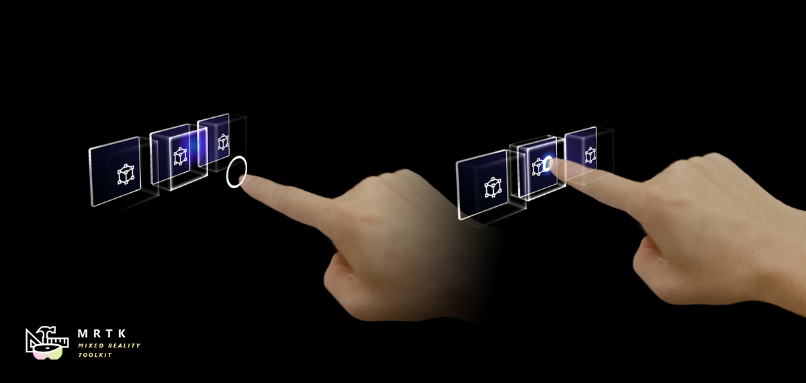

# Fingertip visualization

The fingertip affordance helps the user recognize the distance from the target object. The ring shape visual adjusts its size based on the distance from the fingertip to the object. The fingertip visualization is primarily controlled by the `FingerCursor` (Assets/MRTK/SDK/Features/UX/Prefabs/Cursors/FingerCursor.prefab) (and script) which is spawned as the cursor prefab of the *PokePointer*. Other components of the visualization include the *ProximityLight* script, and *MixedRealityStandard* shader.

## How to use the fingertip visualization

By default the fingertip visualization will work in any Unity scene that is configured to spawn a FingerCursor. Spawning of the FingerCursor occurs in the *DefaultMixedRealityToolkitConfigurationProfile* under:

*DefaultMixedRealityInputSystemProfile > DefaultMixedRealityInputPointerProfile > PokePointer > FingerCursor*

At a high level the fingertip visualization works by using a proximity light to project a colored gradient on any nearby surfaces that accept proximity lights. The finger cursor then looks for any nearby interactable surfaces, which are determined by parent `IMixedRealityNearPointer(s)`, to align the finger ring with a surface as the finger moves towards a surface. As a finger approaches a surface the finger ring is also dynamically animated using the round corner properties of the MixedRealityStandard shader.

## Example scene

You can find fingertip visualization examples in almost any scene that works with articulated hands, but is prominent in the [HandInteractionExample scene](README_HandInteractionExamples.md).

## Inspector properties

**FingerCursor**
Many of the finger cursor properties are inherited from the base cursor class. Important properties include the far / near surface margins and widths which drive the finger ring animation in the MixedRealityStandard shader. For other properties please hover over the inspector tool tips.

**ProximityLight**
The proximity light settings control how the light looks when near and far from a surface. The center, middle, and outer colors control the gradient look of the light and can be custom tailored for the color palette of your application. Note, the colors are HDR (High Dynamic Range) to allow users to brighten the proximity light to values above one. For other properties please hover over the inspector tool tips.

**MixedRealityStandard Shader**
The MixedRealityStandard shader is used for many effects in the MRTK. The two settings important for fingertip visualization are "Near Fade" and "Proximity Light." Near Fade allows objects to fade in / out as a camera or light nears them. Make sure to check "Light" to allow proximity lights to drive the fade (rather than the camera). You can reverse the values of "Fade Begin" and "Fade Complete" to reverse a fade. Check "Proximity Light" for any surface you would like the proximity light to brighten. For other properties please hover over the inspector tool tips.

