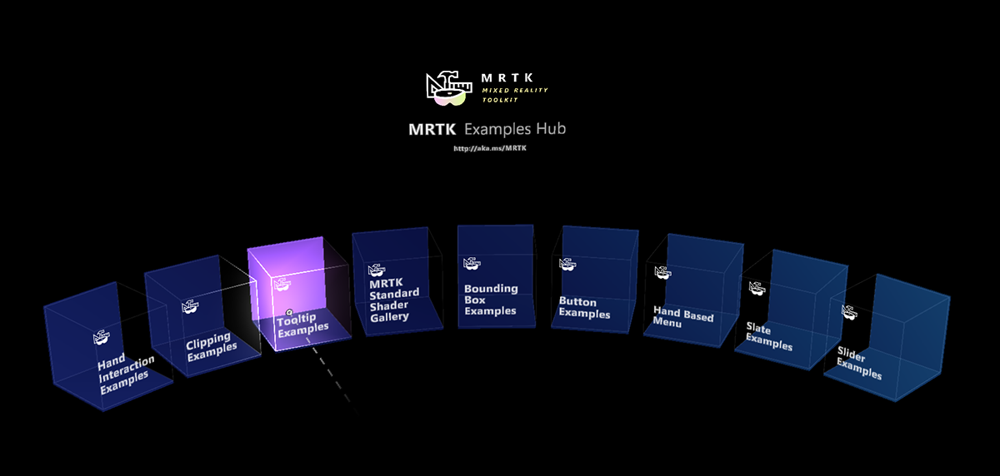

# MRTK Examples Hub



MRTK Examples Hub is a Unity scene that makes it easy to experience multiple scenes. It uses MRTK's Scene System to load & unload the scenes.

**MRTKExamplesHub.unity** is the container scene that has shared components including ``MixedRealityToolkit`` and ``MixedRealityPlayspace``. **MRTKExamplesHubMainMenu.unity** scene has the cube buttons.

## Prerequisite

MRTK Examples Hub uses [Scene Transition Service](Extensions/SceneTransitionService/SceneTransitionServiceOverview.md) and related scripts. If you are using MRTK through Unity packages, please import **Microsoft.MixedReality.Toolkit.Unity.Extensions.x.x.x.unitypackage** which is part of the [release packages](https://github.com/microsoft/MixedRealityToolkit-Unity/releases). If you are using MRTK through the repository clone, you should already have the **MRTK/Extensions** folder in your project.

## MRTKExamplesHub scene and the scene system

Open **MRTKExamplesHub.unity** which is located at `MRTK/Examples/Experimental/Demos/ExamplesHub/Scenes/` It is an empty scene with MixedRealityToolkit, MixedRealityPlayspace and LoadHubOnStartup. This scene is configured to use MRTK's Scene System. Click `MixedRealitySceneSystem` under MixedRealityToolkit. It will display the Scene System's information in the Inspector panel.

<br/><br/>
<br/><br/>

On the bottom of the Inspector, it displays the list of the scenes defined in the Scene System Profile. You can click the scene names to load/unload them.

<br/><br/>
<br/><br/>Example of loading _MRTKExamplesHub_ scene by clicking the scene name in the list.
<br/><br/>Example of loading _HandInteractionExamples_ scene.
<br/><br/>
Example of loading multiple scenes.

## Running the scene

The scene works in both Unity's game mode and on device. Run the **MRTKExamplesHub** scene in the Unity editor and use MRTK's input simulation to interact with the scene contents. To build and deploy, simply build **MRTKExamplesHub** scene with other scenes that are included in the Scene System's list. The inspector also makes it easy to add scenes to the Build Settings. In the Building Settings, make sure **MRTKExamplesHub** scene is on the top of the list at index 0.


## How MRTKExamplesHub loads a scene

In the **MRTKExamplesHub** scene, you can find the ``ExamplesHubButton`` prefab.
There is a **FrontPlate** object in the prefab which contains ``Interactable``.
Using the Interactable's ``OnClick()`` and ``OnTouch()`` event, it triggers the **LoadContentScene** script's **LoadContent()** function.
In the **LoadContentScene** script's Inspector, you can define the scene name to load.

<br/><br/>
<br/><br/>
<br/><br/>

The script uses the Scene System's LoadContent() function to load the scene.
Please refer to the [Scene System](SceneSystem/SceneSystemGettingStarted.md) page for more details.

```c#
MixedRealityToolkit.SceneSystem.LoadContent(contentName, loadSceneMode);
```

## Returning to the main menu scene

To return to the main menu scene (MRTKExamplesHubMainMenu scene), you can use the same Scene System `LoadContent()` method. The **ToggleFeaturesPanelExamplesHub.prefab** provides the 'Home' button which contains the **LoadContentScene** script. Use this prefab or provide a custom home button in each scene to allow the user to return to the main scene. One can put the **ToggleFeaturesPanelExamplesHub.prefab** in the **MRTKExamplesHub** scene to make it always visible since **MRTKExamplesHub** is a shared container scene. Make sure to hide/deactivate **ToggleFeaturesPanel.prefab** in each example scene.


## Adding additional buttons

In the **CubeCollection** object, duplicate (or add) _ExampleHubButton_ prefabs and click **Update Collection** in the `GridObjectCollection`.
This will update the cylinder layout based on the new total number of buttons.
Please refer to the [Object Collection](README_ObjectCollection.md) page for more details.

<br/><br/>
<br/><br/>

After adding the buttons, update the scene name in the **LoadContentScene** script(explained above).
Add additional scenes to the Scene System's profile.
