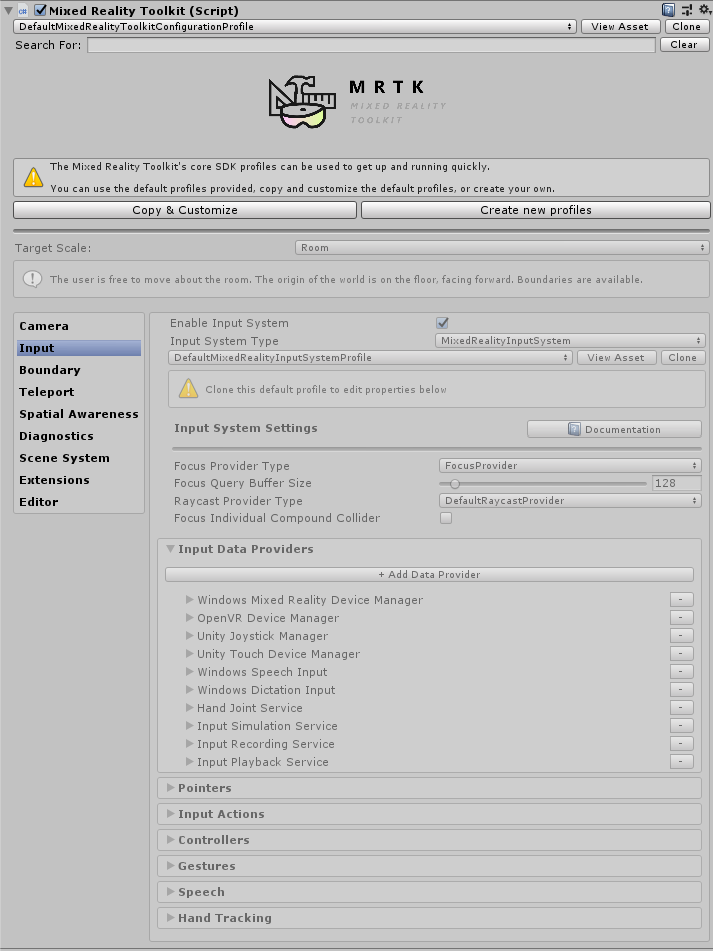

# Configuration and profiles

Not every single consumer of the MRTK will want it to behave the same way - some will want to have the spatial
mesh running when on AR devices that support it. Some may want the diagnostic visualization on all the time,
and some may only want it on when the user says a voice command.

The MRTK needs to be configurable in order to support a wide range of those requirements, and it uses a concept
called 'profiles' to accomplish this.

## What is a profile?

Profiles store configuration settings for services. You use them to control which services are run and
how those services behave while running. They're stored as [ScriptableObject](https://docs.unity3d.com/Manual/class-ScriptableObject.html)
assets in your project. You can view and edit a profile by selecting it in your project window.

For example, the MRTK has a camera service, which will apply different properties to the main camera,
depending on whether or not the display is transparent (like in the case of a HoloLens) or opaque
(like in the case of a VR headset). The camera service is given
a [camera profile](https://github.com/microsoft/MixedRealityToolkit-Unity/blob/mrtk_development/Assets/MRTK/Core/Definitions/CameraSystem/MixedRealityCameraProfile.cs),
which contains those different transparent vs. opaque settings.

An example of a more complex profile is the the [InputSystem](https://github.com/microsoft/MixedRealityToolkit-Unity/blob/mrtk_development/Assets/MRTK/Core/Definitions/InputSystem/MixedRealityInputSystemProfile.cs).
Some of the properties on that profile (such as the MixedRealityInputDataProviderConfiguration entities)
control the objects that will be instantiated at runtime - this is how the input system knows how to create
OpenVR, WMR and Unity input subsystems. This profile is not just a set of properties that configures if
a particular input sub-feature is enabled or disabled - it's also an injection mechanism that the MRTK
will use to "new" other classes at runtime (for example, the input system profile contains a list of
'Input Data Providers' which has serialized type information - these objects are instantiated by the
input system at runtime)

Profile configurations are initially greyed out because they're set up with MRTK's default profiles.
They can only be modified after cloning to ensure that customized profiles won't be lost after a
MRTK version update.

## Modifying profiles

While profiles can be individually modified (by going to the serialized asset of the ScriptableObject),
they are generally accessed through the MRTK inspector of the root MixedRealityToolkit scene object.

The picture above shows the sheer volume of settings - note that each option on the left will show
the configuration for its corresponding service.

### Camera

Contains per-display type settings. Used to apply different levels of quality, clip, and rendering
settings based on the type of display that the application is run on (i.e. AR vs VR).

### Input

The largest profile for the most complex subsystem of the MRTK. The various subsystems of input will
be covered in the [Input System](../architecture/Terminology.md) documentation itself.

### Teleport

This profile controls how the teleportation system works, which is primarily a VR concept.

### Spatial mapping

This profile controls how the spatial mesh system works (i.e. this system is responsible for starting
the system that will render the spatial meshes on an AR device). Primarily an AR concept.

### Diagnostics

This controls the visual performance tool that shows a framerate counter, along with basic
memory utilization.

### Scene system

This controls a currently not-enabled-by-default system that is designed to make multi-scene
scenarios easier to work with.

### Extensions

This empty-by-default profile is the extension point where consumers can write and then plug in their
own objects that will be instantiated and run by the MRTK runtime.

### Editor

Contains general settings for editor-only behaviors of the MRTK.
