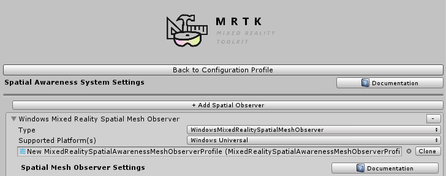

# Systems, extension services and data providers

In the Mixed Reality Toolkit, many of the features are delivered in the form of services. Services are grouped into three
primary categories: systems, extension services and data providers.

## Systems

Systems are services that provide the core functionality of the Mixed Reality Toolkit. All systems are implementations of the
[`IMixedRealityService`](xref:Microsoft.MixedReality.Toolkit.IMixedRealityService) interface.

- [BoundarySystem](../features/boundary/boundary-system-getting-started.md)
- [CameraSystem](../features/camera-system/camera-system-overview.md)
- [DiagnosticsSystem](../features/diagnostics/diagnostics-system-getting-started.md)
- [InputSystem](../features/input/overview.md)
- [SceneSystem](../features/scene-system/scene-system-getting-started.md)
- [SpatialAwarenessSystem](../features/spatial-awareness/spatial-awareness-getting-started.md)
- [TeleportSystem](../features/teleport-system/overview.md)

Each of the listed systems are surfaced in the MixedRealityToolkit component's configuration [profile](../features/profiles/profiles.md).

## Extensions

Extension services are components that extend the functionality of the Mixed Reality Toolkit. All extension services must specify
that they implement the [`IMixedRealityExtensionService`](xref:Microsoft.MixedReality.Toolkit.IMixedRealityExtensionService) interface.

For information on creating extension services, please reference the [Extension services](../features/extensions/extension-services.md) article.

To be accessible to the MRTK, extension services are registered and configured using the Extensions section of the MixedRealityToolkit
component's configuration profile.


## Data providers

Data providers are components that, per their name, provide data to a Mixed Reality Toolkit service. All data providers must specify that
they implement the [`IMixedRealityDataProvider`](xref:Microsoft.MixedReality.Toolkit.IMixedRealityDataProvider) interface.

> [!NOTE]
> Not all services will require data providers. Of the Mixed Reality Toolkit's systems, the Input and Spatial Awareness systems are the
only services to utilize data providers.

To be accessible to the specific MRTK service, data providers are registered in the service's configuration profile.

Application code accesses data providers via the [`IMixedRealityDataProviderAccess`](xref:Microsoft.MixedReality.Toolkit.IMixedRealityDataProviderAccess) interface. To simplify access, data providers can also be retrieved via the `CoreServices` helper class.

```c#
var inputSimulationService = CoreServices.GetDataProvider<IInputSimulationService>(CoreServices.InputSystem);
```

> [!IMPORTANT]
> Although `IMixedRealityDataProvider` inherits from `IMixedRealityService`, data providers are not
registered with the `MixedRealityServiceRegistry`. To access data providers, application code must
query the service instance for which they were registered (ex: input system).

### Input

The MRTK input system utilizes only data providers that implement the [`IMixedRealityInputDeviceManager`](xref:Microsoft.MixedReality.Toolkit.Input.IMixedRealityInputDeviceManager).


The following example demonstrates accessing the input simulation provider and toggle the SmoothEyeTracking property.

```c#
IMixedRealityDataProviderAccess dataProviderAccess = CoreServices.InputSystem as IMixedRealityDataProviderAccess;

if (dataProviderAccess != null)
{
    IInputSimulationService inputSimulation =
        dataProviderAccess.GetDataProvider<IInputSimulationService>();

    if (inputSimulation != null)
    {
        inputSimulation.SmoothEyeTracking = !inputSimulation.SmoothEyeTracking;
    }
}
```

Accessing a data provider for the core input system can also be simplified via use of the `CoreServices` helper class.

```c#
var inputSimulationService = CoreServices.GetInputSystemDataProvider<IInputSimulationService>();
if (inputSimulationService != null)
{
    // do something here
}
```

> [!NOTE]
> The input system returns only data providers that are supported for the platform on which the
application is running.

For information on writing a data provider for the MRTK input system, please see [creating an input system data provider](../features/input/create-data-provider.md).

### Spatial awareness

The MRTK spatial awareness system utilizes only data providers that implement the [`IMixedRealitySpatialAwarenessObserver`](xref:Microsoft.MixedReality.Toolkit.SpatialAwareness.IMixedRealitySpatialAwarenessObserver) interface.



The following example demonstrates accessing the registered spatial mesh data providers and changing the visibility of the meshes.

```c#
IMixedRealityDataProviderAccess dataProviderAccess =
    CoreServices.SpatialAwarenessSystem as IMixedRealityDataProviderAccess;

if (dataProviderAccess != null)
{
    IReadOnlyList<IMixedRealitySpatialAwarenessMeshObserver> observers =
        dataProviderAccess.GetDataProviders<IMixedRealitySpatialAwarenessMeshObserver>();

    foreach (IMixedRealitySpatialAwarenessMeshObserver observer in observers)
    {
        // Set the mesh to use the occlusion material
        observer.DisplayOption = SpatialMeshDisplayOptions.Occlusion;
    }
}
```

Accessing a data provider for the core spatial awareness system can also be simplified via use of the `CoreServices` helper class.

```c#
var dataProvider = CoreServices.GetSpatialAwarenessSystemDataProvider<IMixedRealitySpatialAwarenessMeshObserver>();
if (dataProvider != null)
{
    // do something here
}
```

> [!NOTE]
> The spatial awareness system returns only data providers that are supported for the platform on which the application is running.

For information on writing a data provider for the MRTK spatial awareness system, please see [creating a spatial awareness system data provider](../features/spatial-awareness/create-data-provider.md).

## See also

- [What makes a mixed reality feature](mixed-reality-services.md)
- [Extension services](../features/extensions/extension-services.md)
- [Creating an input system data provider](../features/input/create-data-provider.md)
- [Creating a spatial awareness system system data provider](../features/spatial-awareness/create-data-provider.md)
- [IMixedRealityService interface](xref:Microsoft.MixedReality.Toolkit.IMixedRealityService)
- [IMixedRealityDataProvider interface](xref:Microsoft.MixedReality.Toolkit.IMixedRealityDataProvider)
- [IMixedRealityExtensionService interface](xref:Microsoft.MixedReality.Toolkit.IMixedRealityExtensionService)
